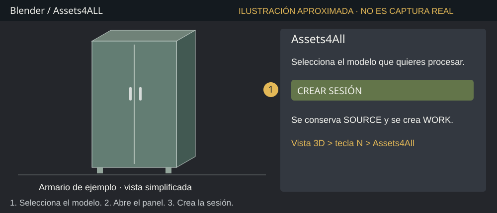
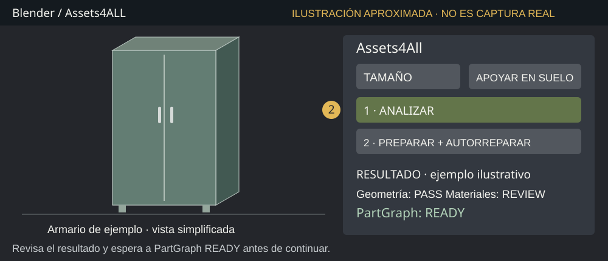
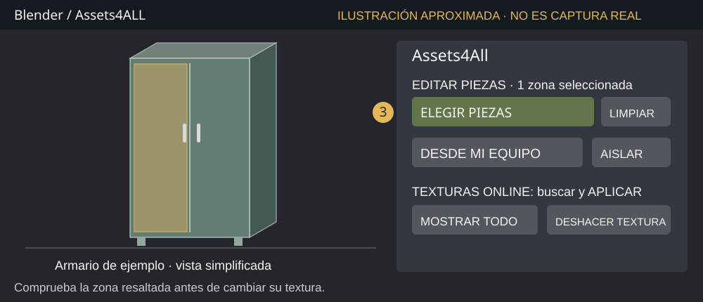
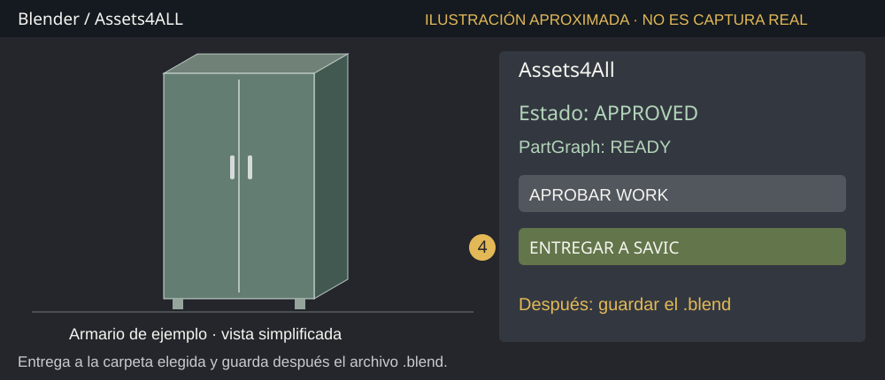
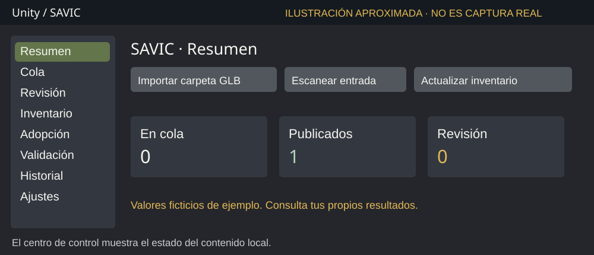
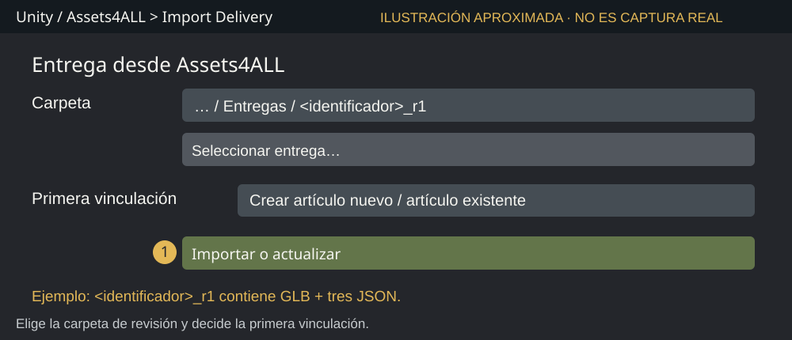
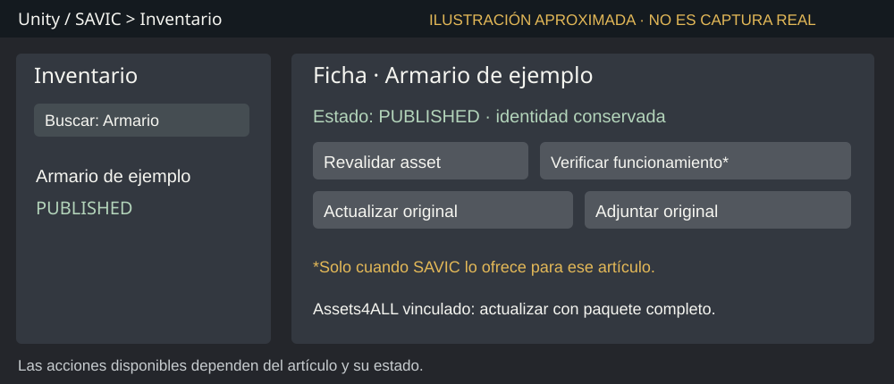
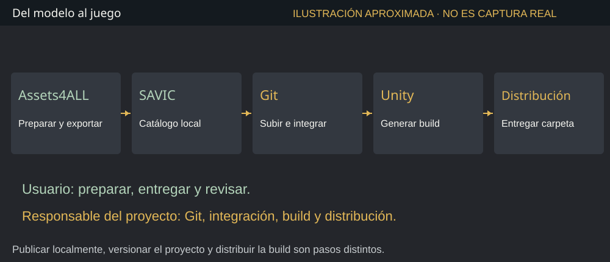

# Guía de usuario: Assets4ALL y SAVIC

**Para usuarios básicos · Edición del 05/10/2026**

Esta guía explica cómo preparar un modelo 3D en Blender, entregarlo a SAVIC y encontrarlo en el catálogo de Bistro Builder. No necesitas programar para seguir el recorrido habitual. Los cambios de código, Git y la distribución del juego corresponden al responsable del proyecto.

**Sobre las imágenes:** todas las pantallas de esta guía son ilustraciones aproximadas. No son capturas reales ni resultados de una prueba. Simplifican la interfaz y muestran un armario de ejemplo. La posición, el idioma y el aspecto pueden variar según la instalación; los nombres de los controles se han contrastado con el código actual.

**Instalación de referencia:** Assets4ALL 0.1.29, Blender 5.1.1 y proyecto Bistro Builder con el puente Assets4ALL-SAVIC instalado. Si faltan las herramientas, pide al responsable del proyecto que prepare esta instalación antes de empezar.

## Assets4ALL: preparar y entregar un modelo

### 1. Abrir el modelo y crear una sesión

Assets4ALL funciona dentro de **Blender**. Su trabajo es ayudarte a revisar tamaño, apoyo, piezas y apariencia antes de entregar el modelo al juego.

1. Abre Blender. Si retomas un trabajo, abre su archivo `.blend` guardado y continúa con esa sesión.
2. Para un trabajo nuevo, importa el modelo desde **Archivo > Importar**, eligiendo el formato correspondiente. Un archivo `.glb` se importa con la opción **glTF 2.0**; un `.fbx`, con la opción FBX.
3. Selecciona todos los objetos de malla que pertenecen a ese modelo. Evita incluir luces, cámaras u otros modelos de la escena.
4. Sitúa el ratón sobre la vista 3D y pulsa **N**. En el panel lateral, abre la pestaña **Assets4All**.
5. Pulsa **CREAR SESIÓN**, comprueba el nombre en el cuadro que aparece y confirma.

**Resultado esperado:** aparecen los controles de Assets4ALL y una copia de trabajo del modelo. **SOURCE** es el original conservado; **WORK** es la copia que preparas. Realiza los cambios sobre WORK.

Guarda el trabajo con **Archivo > Guardar como** y un nombre fácil de reconocer, por ejemplo `Armario.blend`. El `.blend` permite retomar la sesión y conservar la identidad de las futuras entregas.



### 2. Ajustar el modelo y analizarlo

1. Si el tamaño es incorrecto, pulsa **TAMAÑO**. Mueve el ratón a izquierda o derecha; confirma con clic o **Enter**. **Esc** cancela ese ajuste. **Shift** permite un ajuste más fino.
2. Para un objeto que debe descansar en el suelo, pulsa **APOYAR EN SUELO**. No lo uses como criterio de instalación para una lámpara de techo o un objeto de pared.
3. En **Interpretación (opcional)** puedes usar **Automático / Universal** si no tienes una indicación específica del proyecto.
4. Pulsa **1 · ANALIZAR** y espera a que termine. En modelos grandes puede tardar; evita lanzar varias operaciones seguidas.
5. Si necesitas la preparación automática, pulsa **2 · PREPARAR + AUTORREPARAR** y revisa de nuevo el resultado y el aspecto del modelo.

**Resultado esperado:** el bloque **RESULTADO** muestra las comprobaciones y **PartGraph: READY**. PartGraph es la información que identifica las piezas del modelo; READY significa que está disponible para las operaciones por pieza.

| Mensaje | Qué significa y qué hacer |
|---|---|
| PASS | Esa comprobación ha pasado. |
| REVIEW | Hay algo que revisar; lee la explicación antes de aprobar. |
| FAIL | Hay un fallo; resuélvelo antes de seguir. |
| N/A | Esa comprobación no se aplica o aún no está disponible; revisa el contexto. |

El análisis no garantiza por sí solo que una silla permita sentarse o que un equipo funcione en el juego. SAVIC comprueba después los requisitos de uso jugable.



### 3. Cambiar la apariencia de una pieza, si lo necesitas

Este paso es opcional. Puedes entregar el modelo con sus materiales originales si son adecuados.

1. Espera a **PartGraph: READY** y pulsa **ELEGIR PIEZAS**.
2. Haz clic sobre una o varias piezas. Cada clic añade o quita una selección. Comprueba la zona resaltada antes de aplicar una textura.
3. Pulsa **Enter** o **Esc** para salir del modo de elección. La selección se conserva; **LIMPIAR** la elimina.
4. Pulsa **DESDE MI EQUIPO** y selecciona una imagen de textura, si ya tienes una.
5. Como alternativa, escribe una búsqueda en **TEXTURAS ONLINE**, pulsa **BUSCAR** y después **APLICAR** en el resultado elegido. Esta opción necesita conexión y acceso a Internet habilitado en Blender.

**AISLAR** facilita ver las piezas elegidas. **MOSTRAR TODO** recupera la vista completa. **DESHACER TEXTURA** revierte el último cambio de textura compatible.

**Resultado esperado:** cambia la apariencia de las zonas seleccionadas. Comprueba el modelo desde varios ángulos. La textura online modifica el color base; no presupongas que sustituye todos los canales de un material completo.

Después de cambiar la apariencia, vuelve a **ANALIZAR**, revisa el resultado y aprueba de nuevo antes de entregar. **COMPARAR SOURCE** permite consultar el original; después vuelve a ocultarlo para evitar confundirlo con WORK.



### 4. Aprobar y entregar a SAVIC

1. Revisa el tamaño, el apoyo y los materiales. Comprueba **PartGraph: READY** y resuelve los fallos indicados.
2. Pulsa **APROBAR WORK**. Si aparece un error, lee el motivo; la aprobación no debe forzarse.
3. Comprueba que el estado cambia a **APPROVED**. Pulsa **ENTREGAR A SAVIC**.
4. En el selector de carpeta, elige la carpeta de entregas del proyecto Unity. En esta instalación es:

```text
C:\Users\mruperez\ProyectoBB\BB_SavicPresentation\ContentInbox\Deliveries
```

5. Confirma la exportación y espera el mensaje **Entrega guardada**.
6. **Guarda otra vez el `.blend` después de exportar.** Así conservas la identidad y el historial de revisiones.

**Resultado esperado:** dentro de `Deliveries` se crea una subcarpeta con un identificador y una revisión, por ejemplo `<identificador>_r1`. Contiene `model.glb`, `asset4all.json`, `partgraph.json` y `delivery.json`. Son los archivos de una misma entrega; mantenlos juntos y sin editar.

La carpeta que eliges en Blender es **Deliveries**. La que elegirás en la importación manual de SAVIC es su **subcarpeta de revisión**.

**Si actualizas un artículo que ya existe en SAVIC:** en su primera vinculación, exporta a una carpeta temporal fuera de `ContentInbox/Deliveries` y sigue el paso 2 del manual SAVIC. Así puedes elegir el artículo existente antes de que el detector automático lo trate como nuevo.



### 5. Retomar un trabajo y corregir problemas

Para actualizar el mismo artículo, abre su **mismo `.blend`**, modifica WORK, analiza y revisa, aprueba, exporta y guarda otra vez. Una entrega con cambios genera una nueva revisión; una entrega idéntica puede reutilizar la anterior. Importar el GLB como un trabajo independiente no recupera automáticamente la identidad del artículo existente.

| Si ocurre esto | Qué hacer |
|---|---|
| No aparece Assets4All | Coloca el ratón en la vista 3D, pulsa N y busca su pestaña. Si sigue faltando, consulta si el complemento está instalado y activado. |
| No se puede crear la sesión | Selecciona los objetos de malla del modelo y vuelve a intentarlo. |
| No aparece PartGraph READY | Espera al análisis. Si continúa igual, vuelve a analizar y consulta el diagnóstico; no entregues con información de piezas desactualizada. |
| La textura afecta una zona inesperada | Usa DESHACER TEXTURA, limpia la selección y elige de nuevo comprobando el resaltado. |
| ENTREGAR A SAVIC está desactivado | Revisa los errores y pulsa APROBAR WORK. Para exportar, usa Modo Objeto. |
| La entrega se rechaza | Conserva el mensaje de error y el `.blend`; no edites los JSON para intentar aprobarla. |

**Para pedir ayuda:** indica qué intentabas hacer, el nombre del modelo y el mensaje exacto. **COPIAR INFORME PARA CHATGPT** permite obtener un diagnóstico. Pásalo al responsable del proyecto si necesita investigar el problema.

### 6. Lista de comprobación antes de cerrar Blender

- [ ] Trabajo con el `.blend` correcto y la sesión del artículo que quiero actualizar.
- [ ] El tamaño y el tipo de apoyo son adecuados.
- [ ] He revisado los avisos y no quedan fallos que impidan aprobar o exportar.
- [ ] PartGraph indica READY.
- [ ] He aprobado WORK y la exportación ha terminado con Entrega guardada.
- [ ] He guardado el `.blend` después de exportar.
- [ ] Sé qué carpeta de revisión recibirá SAVIC.

**Cuatro palabras útiles:** SOURCE = original conservado; WORK = copia preparada; READY = piezas listas; APPROVED = trabajo aprobado en Assets4ALL.

**El siguiente paso:** abre el proyecto Unity y sigue el manual SAVIC. Entregar desde Blender crea el paquete local. La incorporación al catálogo la realiza SAVIC; Git y la build se gestionan después.

Si vas a cerrar una sesión y crear otra, conserva primero el `.blend` y las entregas que necesites. Crear una sesión nueva para una simple corrección puede hacer que se trate como un artículo nuevo.

## SAVIC: recibir, revisar y publicar un modelo

### 1. Abrir el proyecto y el centro de control

SAVIC funciona dentro del **editor Unity**. Recibe modelos, comprueba sus requisitos, prepara sus artefactos y registra los artículos que pueden publicarse en el catálogo del juego.

1. Abre **Unity Hub** y el proyecto correcto. En esta instalación la carpeta es:

```text
C:\Users\mruperez\ProyectoBB\BB_SavicPresentation
```

2. Espera a que Unity termine de importar y compilar. Guarda las escenas abiertas antes de actualizar modelos o verificar su funcionamiento.
3. Si Unity está ejecutando el juego, detén **Play** para trabajar con la importación.
4. Abre **Tools > Bistro Builder > SAVIC > Open Control Center**.

**Resultado esperado:** aparece la ventana **SAVIC**. Usa estas secciones:

- **Resumen:** estado general del contenido.
- **Cola:** trabajos pendientes y control de pausa.
- **Revisión:** incidencias que necesitan atención.
- **Inventario:** artículos y sus fichas.
- **Validación / Historial:** resultados y operaciones anteriores.

**Recargar** actualiza la vista. **Actualizar inventario** vuelve a examinar el contenido del proyecto; no equivale a subirlo a Git ni a generar el ejecutable.

Las entregas automáticas se procesan con Unity abierto, fuera de Play, sin compilación en curso y con SAVIC sin pausar. Si la cola está pausada, abre **Cola** y pulsa **Reanudar cola**.



### 2. Recibir una entrega de Assets4ALL

Para un **artículo nuevo**, puedes exportar desde Blender a `ContentInbox/Deliveries` y esperar la detección automática. Para decidir explícitamente la primera vinculación, utiliza la importación manual.

1. Si es la primera actualización de un artículo ya existente, exporta desde Blender a una carpeta temporal fuera de `ContentInbox/Deliveries`.
2. En Unity abre **Tools > Bistro Builder > SAVIC > Assets4ALL > Import Delivery**.
3. Pulsa **Seleccionar entrega…** y elige la **subcarpeta de revisión**, por ejemplo `<identificador>_r1`, que contiene los cuatro archivos. No elijas solo el GLB ni la carpeta padre.
4. En **Primera vinculación**, elige **Crear artículo nuevo** para añadir uno. Para corregir uno existente, selecciona su nombre en la lista.
5. Pulsa **Importar o actualizar** y espera el resultado.

**Resultado esperado:** la ventana muestra el estado y el motivo de la operación. Las próximas entregas del mismo `.blend` usan esa identidad y pueden exportarse a la carpeta de detección automática.

La vinculación correcta evita crear un segundo artículo al corregir el primero. Comprueba el nombre elegido antes de importar. Si no lo encuentras en la lista, revisa su publicación en Inventario o consulta al responsable.

**Si recibes un GLB independiente:** el centro de control ofrece **Importar carpeta GLB**, y existe `ContentInbox/DropHere`. Ese recorrido no conserva por sí solo la identidad ni la información de piezas de un paquete Assets4ALL. Para trabajos vinculados a Assets4ALL, usa siempre la entrega completa.



### 3. Entender el resultado y los avisos

La validación en Blender y la publicación jugable son pasos diferentes. SAVIC puede necesitar más información sobre el uso del objeto, sus dimensiones o sus requisitos funcionales.

| Estado o mensaje | Qué significa y qué hacer |
|---|---|
| PUBLISHED | Publicado en el proyecto local. Busca el artículo en Inventario y comprueba el catálogo. |
| UNCHANGED | La misma revisión ya está incorporada; no se ha creado una actualización nueva. |
| NEEDS_REVIEW | Necesita revisión. Lee el motivo y quién debe resolverlo. |
| Ingested / Processing, o En cola / Procesando | El trabajo está pendiente o en curso. Espera sin repetir la importación. |
| DuplicateExact | SAVIC reconoce esos mismos bytes; no representa un artículo nuevo. |
| FAILED o mensaje de error | La operación no se ha completado. Conserva el mensaje y revisa la causa. |

En una entrega Assets4ALL, **MODEL** señala una revisión del modelo o del paquete; normalmente se corrige en Blender. **GAME** señala un requisito del proyecto o de su publicación jugable; puede necesitar al responsable de SAVIC.

Si corriges el modelo, vuelve a exportar desde el mismo `.blend` y entrega la revisión nueva. Importar repetidamente el paquete pendiente no garantiza que se vuelva a procesar: SAVIC guarda el resultado de cada entrega.

Puedes consultar ese resultado en la ventana de importación o en `SAVIC/Receipts/Assets4All` dentro del proyecto. Los archivos de esa carpeta son recibos; no necesitan edición manual.

**Ejemplo:** un modelo puede verse bien y aun necesitar una comprobación para que un personaje se siente. Cuando SAVIC ofrezca **Verificar funcionamiento**, sigue el procedimiento de la ficha.

### 4. Consultar la ficha y actualizar un artículo

1. En SAVIC abre **Inventario** y busca el artículo por su nombre. Usa los filtros si aparecen muchos resultados.
2. Selecciona el artículo y revisa su ficha, estado, validaciones y artefactos.
3. **Revalidar asset** vuelve a poner un artículo publicado en procesamiento. Para uno pendiente puede aparecer **Reintentar procesamiento**. Úsalos cuando hayas resuelto la causa o debas aplicar un cambio de SAVIC.
4. Si aparece **Verificar funcionamiento**, guarda las escenas y deja terminar la prueba. Unity puede entrar en Play para comprobar uso, colocación y guardado/carga. Lee el resultado al terminar.

**Si el artículo está vinculado a Assets4ALL:** actualízalo desde su `.blend` y entrega la revisión completa mediante **Import Delivery**. La primera vinculación solo se establece una vez.

**Si procede de un modelo independiente:** **Actualizar original** permite elegir una nueva versión GLB/FBX compatible. Esta acción conserva la identidad del artículo cuando la revisión supera sus comprobaciones. No sustituye al recorrido de paquetes de Assets4ALL.

**Adjuntar original** sirve para recuperar el archivo exacto que falta; no es el botón para enviar una versión modificada.

**Resultado esperado:** una revisión aceptada conserva la identidad del artículo y los ajustes manuales protegidos. Si desaparece una pieza con un material protegido, la actualización puede quedar en revisión. Comprueba la ficha y la apariencia después de cada cambio.



### 5. Encontrar el artículo en el juego y distribuirlo

**Para comprobarlo dentro de Unity:**

1. Comprueba que SAVIC ha dejado el artículo en **PUBLISHED**.
2. Abre la escena de juego o playtest indicada por el proyecto y entra en **Play**.
3. Fuera del servicio, entra en **Modo Edición** y abre el catálogo.
4. Busca el artículo e intenta colocarlo en una ubicación adecuada. El juego puede rechazarla si no cumple sus reglas de espacio o instalación.
5. Revisa su apariencia y, si corresponde, su uso. Guarda y carga una partida de prueba para comprobar que se conserva correctamente.

**Para que llegue a otra copia del proyecto o a los jugadores:** el responsable del proyecto revisa los archivos generados, hace **commit y push** al repositorio [twinslopment/BistroBuilder](https://github.com/twinslopment/BistroBuilder), integra el cambio en la rama del juego y genera una build nueva. Los GLB configurados para ello utilizan **Git LFS**, el sistema de Git para archivos grandes.

La build de playtest se genera con **Tools > Bistro Builder > Build > Windows Playtest** y queda en:

```text
Builds\Windows\BistroBuilder_Playtest\BistroBuilder.exe
```

La ruta es relativa al proyecto desde el que se genera. Se distribuye **toda la carpeta de la build**, con el `.exe` y sus datos. Un ejecutable anterior no se actualiza al publicar un artículo en SAVIC.

**PUBLISHED no significa subido a GitHub ni distribuido a jugadores.** El puente automatiza la entrega y publicación local; no hace automáticamente Git, integración de ramas o distribución.



### 6. Problemas frecuentes y comprobación final

| Si ocurre esto | Qué hacer |
|---|---|
| No aparece SAVIC en Tools | Comprueba que abriste el proyecto correcto y que terminó de compilar. Consulta al responsable si falta la instalación. |
| Una entrega no se procesa | Sal de Play, espera la compilación, reanuda la cola y comprueba que la subcarpeta contiene los cuatro archivos de entrega. |
| La ficha muestra NEEDS_REVIEW | Lee el motivo: corrige en Blender si afecta al modelo o consulta al responsable si requiere autoría del juego. |
| No aparece en el catálogo | Comprueba PUBLISHED, el nombre, los filtros del catálogo y que estás ejecutando el proyecto o build adecuados. |
| Actualizo el código y el artículo sigue igual | Revalidar el artículo afectado puede ser necesario. Reimportar un paquete idéntico puede devolver UNCHANGED. |
| Aparece un artículo duplicado | Comprueba si creaste una sesión independiente o elegiste Crear artículo nuevo al actualizar. Consulta antes de borrar o cambiar identidades. |
| Tras un fallo aparecen problemas de recuperación | Conserva archivos y mensaje. No borres los diarios o fuentes archivadas para ocultar el fallo; pide ayuda al responsable. |

**Antes de dar una entrega por terminada:**

- [ ] He elegido el artículo correcto en su primera vinculación.
- [ ] He leído el estado final y resuelto los avisos pendientes.
- [ ] El artículo publicado aparece en el catálogo y puede colocarse donde corresponde.
- [ ] He comprobado su apariencia y los requisitos de uso que le correspondan.
- [ ] Sé si la entrega es local o si ya se ha integrado y distribuido una nueva build.

**Para pedir ayuda:** facilita el nombre del artículo, la carpeta/revisión, el estado y el mensaje exacto. Para cambios de código, formatos y mantenimiento del puente, el responsable debe consultar `docs/10_ARCHITECTURE/ASSETS4ALL_SAVIC_DELIVERY.md` del proyecto Unity.

## Fuentes y mantenimiento de esta guía

Los nombres de controles se han contrastado con `ui_experience_v016.py`, `operators.py`, `asset_scale_ui.py`, `quick_edit_v023.py` y `savic_delivery.py` de Assets4ALL, y con `SavicEditorWindow.cs`, `SavicAssets4AllWindow.cs`, `SavicEditorActionService.cs` y el contrato de entrega del proyecto Unity. La guía describe el recorrido disponible; no certifica todas las familias de modelos ni una nueva sesión de pruebas.

Los dos PDF se generan a partir de las secciones de esta guía. Al cambiar un botón o un procedimiento, actualizar el Markdown, las ilustraciones aproximadas y ambos PDF. En Bistro Builder, regenerar también el índice y el bundle de documentación.
