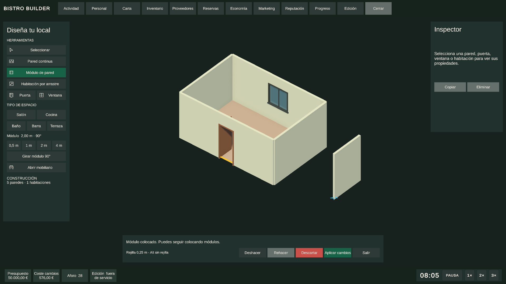

# Modo edición · construcción y assets

Implementación en Unity 6000.3.19f1 basada en las decisiones de «Diseñar UI UX definitiva» y la petición de construir habitaciones con el ratón.

## Diseño aplicado

- Se conserva la cámara isométrica del juego, sin vistas predefinidas ni nuevos atajos sobre WASD, Q/E, R/F, Shift o rueda.
- Catálogo compacto a la izquierda, inspector a la derecha, restaurante en el centro y acciones de construcción abajo.
- El HUD existente muestra presupuesto, coste del borrador calculado por Finance y aforo del registro de asientos.
- Sin tutorial inicial. La barra de estado explica la herramienta y los motivos de rechazo.
- Los cambios pendientes se aplican, descartan o conservan al intentar salir.
- El tema usa los tokens visuales existentes; la fuente de títulos sigue siendo inyectable mediante el tema del proyecto.

## Uso

1. Fuera del servicio, pulsa **Edición** en la barra superior.
2. **Habitación por arrastre**: elige Salón, Cocina, Baño, Barra o Terraza; mantén pulsado, arrastra y suelta. También acepta dos clics en esquinas opuestas.
3. **Pared continua**: arrastra un tramo o marca sus extremos con dos clics. Con dos clics puedes continuar desde el extremo anterior. Escape cancela el gesto.
4. **Módulo de pared**: selecciona 0,5 / 1 / 2 / 4 m, gira con el botón y coloca módulos con clics sucesivos.
5. **Puerta / Ventana**: acerca el cursor a una pared y pulsa. Se crea un hueco geométrico alojado en esa pared y su asset visual.
6. **Seleccionar**: arrastra el centro de la pared para desplazarla o sus extremos para editar uniones. El inspector permite copiar, eliminar y desplazar huecos a lo largo de la pared.
7. **Deshacer / Rehacer**: cada habitación completa es una sola operación. Ctrl+Z / Ctrl+Y actúan sobre arquitectura cuando su herramienta está activa.
8. **Aplicar cambios** confirma a través del coordinador y la autoridad económica. **Descartar** recupera el documento confirmado. **Abrir mobiliario** devuelve el control al sistema existente.

Los recintos contiguos reutilizan paredes coincidentes, también cuando comparten sólo parte de una pared larga. Las aberturas deben caber en su pared, no solaparse y respetar sus límites verticales.

## Assets incluidos

Carpeta: `Assets/Resources/BistroBuilder/Construction/`.

| Tipo | Contenido |
|---|---|
| Kit | `ConstructionAssetKit.asset`, referencias usadas en runtime |
| Paredes | Prefabs de 0,5 / 1 / 2 / 4 m, altura 2,8 m, grosor 0,12 m; meshes propios |
| Puerta | Marco de roble, hoja abierta y tirador; paso libre de colliders |
| Ventana | Marco grafito, montante, alféizar y cristal transparente |
| Materiales URP | Enlucido cálido, caliza, roble, grafito y vidrio azulado |
| Iconos | Selección, pared, módulo, habitación, puerta, ventana y mobiliario; sprites transparentes |

Se pueden regenerar desde **Tools → Bistro Builder → Edit Mode → Create Construction Assets**. El generador conserva los GUID de los assets existentes. Las paredes arbitrarias usan el generador geométrico; los prefabs son las piezas reutilizables del kit.

## Integración

- Se recupera la base Construction Authoring de `feature/18n-construction-authoring-v1` y el HUD V2 de `feature/21a-ui-ux-definitive` en esta carpeta, ampliándolos con arrastre, módulos, assets e interfaz jugable.
- `BistroBuilderArchitecturePlayerTool` queda como adaptador para escenas y llamadas antiguas; no procesa un segundo juego de entradas.
- El bootstrap instala la herramienta y el panel sobre la escena existente, sin serializar un HUD duplicado en `Prototype_Restaurant`.
- La previsualización sólo genera representación visual. Finance, BBSIS, Navigation y el documento persistente cambian a través del commit canónico.
- El flujo inicial utiliza la misma herramienta, reconoce los IDs canónicos `zone.*` y conserva compatibilidad con los IDs de zona antiguos.
- Guardar y cargar usan el documento arquitectónico existente; no se introduce otro formato de partida.
- Un local vacío puede guardarse y cargarse durante el diseño inicial. La demanda utiliza los registros activos de mesas y barra, y no impide persistir un diseño sin aforo. La apertura sigue exigiendo un restaurante operativo.

## Validación reproducible

- `BistroBuilderConstructionAssetInstaller.InstallAndTestBatch`: generación de assets, suite de 32 escenarios y regresión de habitaciones compartidas, historial, aberturas y kit.
- `BistroBuilderConstructionMousePlayTest.RunBatch`: eventos reales de Mouse en Play Mode; arrastre, previsualización, deshacer/rehacer, huecos, módulo, salida protegida y vuelta al mobiliario.
- `BistroBuilderEditBlock18QueenTest.RunFromCommandLine`: regresión del commit financiero, materialización, BBSIS, navegación y guardado/carga.

Los resultados de ejecución se registran en `Logs/Construction*.log` y `Logs/ConstructionMousePlayTest.txt`. El test gráfico guarda `Logs/ConstructionWorkspace.png` cuando hay dispositivo gráfico disponible.

## Resultado verificado · 12 septiembre 2026

- Construction Authoring: **32/32 escenarios, 341 assertions, 0 fallos**.
- Regresión adicional: **PASS** (pared compartida parcial, identidad e historial, huecos solapados, normales del suelo, prefabs, materiales URP e iconos).
- Ratón en Play Mode: **PASS** (arrastre real, una operación de deshacer por habitación, puertas pulsando en la cara del muro, ventanas, módulos, salida protegida, vuelta a mobiliario y vaciado real del local).
- Prueba final ampliada: **PASS**, nueva partida vacía con guardado inicial, carga completa, conservación del local vacío y bloqueo de apertura. Usa un slot libre de diagnóstico y lo elimina al terminar. Registro: `Logs/ConstructionMousePlayFinal.log`.
- Queen Test Block 18: **PASS** (commit financiero, BBSIS, Navigation, Save/Load, bloqueo durante servicio y rollback exacto).
- Queen Test repetido después de la corrección de demanda: **PASS**, `Logs/ConstructionQueenFinal.log`.
- Revisión visual de la interfaz y el kit completada; se corrigieron el sentido de las caras del suelo, la importación de sprites y la altura de los botones.
- Windows Player: **Build PASS**, Unity 6000.3.19f1, 110.876.361 bytes, generado el 12/09/2026 a las 08:25:26 UTC. Las ocho advertencias son campos/eventos sin uso de sistemas existentes.
- Ejecutable: `Builds/Windows/BistroBuilder_Playtest/BistroBuilder.exe`. Prueba de arranque del Player: **PASS**, sin excepciones detectadas; detalle en `Logs/ConstructionPlayerSmokeResult.txt`.
- Build final corregida: **PASS**, `Builds/Windows/BistroBuilder_Edicion/BistroBuilder.exe`, 110.876.873 bytes, 12/09/2026 a las 13:34:25 UTC. Ocho advertencias preexistentes de campos/eventos sin uso; cero errores. Registro: `Logs/ConstructionWindowsFinalBuild.log`.
- Lanzador de pantalla completa sin bordes verificado en una pantalla física de **1920 × 1080**.
- Arranque de la build final sin ventana: **PASS**, sin excepciones detectadas; `Logs/ConstructionFinalPlayerSmokeResult.txt`. La comprobación se cierra sin interrumpir la partida visible.

## Ejecutar a pantalla completa

Haz doble clic en `Jugar_Pantalla_Completa.cmd`, en la raíz del proyecto. Abre la build Windows en pantalla completa sin bordes y anula el modo ventana que pudiera recordar una prueba anterior. No necesita tener Unity abierto. Las siguientes builds también incluyen este lanzador junto al ejecutable.

La versión final está en `Builds/Windows/BistroBuilder_Edicion`. Para distribuir el juego, copia esa carpeta completa; conserva `BistroBuilder_Data` y las DLL junto al ejecutable. Puedes salir con Alt+F4. Se conserva la build de playtest anterior para no interrumpir una sesión abierta mientras se genera la versión final.

