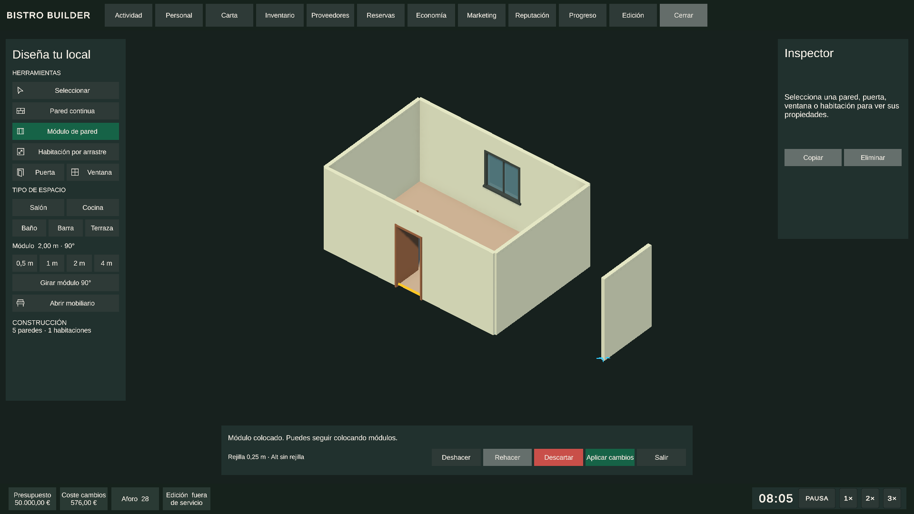

# Bistro Builder - Project Knowledge Bundle

Generated from every tracked source .md in the repository.
This is a single ingestion point for agents; original files remain authoritative.

## Mandatory precedence
1. ENTRYPOINT and CANONICAL.
2. Integrated code and public contracts when they describe verified behavior.
3. SUPPORTING and TECHNICAL_EVIDENCE.
4. HISTORICAL and THIRD_PARTY only for context and traceability.

Historical material never overrides a later canonical decision.

---

## SOURCE: AGENTS.md

Category: ENTRYPOINT

# Bistro Builder — instrucciones para agentes

Esta raíz contiene la fuente de verdad técnica y de producto del proyecto.

## Ingesta Markdown obligatoria
Antes de modificar código en una sesión nueva:
1. Leer **completo** `docs/PROJECT_KNOWLEDGE_BUNDLE.md`.
2. Consultar `docs/ALL_MARKDOWN_INDEX.md` para localizar la fuente original de cada decisión.
3. Si el bundle/índice no existe o algún `.md` fuente ha cambiado, ejecutar `Tools/BistroBuilder/RefreshMarkdownKnowledge.ps1` y volver a leer el bundle.
4. Si no se puede ejecutar el script, enumerar todos los `.md` versionados con Git y leerlos respetando la precedencia siguiente.

Los dos archivos generados (`ALL_MARKDOWN_INDEX.md` y `PROJECT_KNOWLEDGE_BUNDLE.md`) no son fuentes independientes: derivan del resto del corpus Markdown.

## Precedencia documental
1. `ENTRYPOINT`: este `AGENTS.md` y `docs/README.md`.
2. `CANONICAL`: decisiones vigentes y documentos de `00_PRODUCT`, `10_ARCHITECTURE`, `20_GAME_SYSTEMS`, `30_UI_UX`, `40_TESTING` y `90_DECISIONS`.
3. Contratos públicos y comportamiento comprobable del código integrado.
4. `SUPPORTING` y `TECHNICAL_EVIDENCE`.
5. `HISTORICAL` y `THIRD_PARTY`, solo para contexto/trazabilidad.

Una fuente histórica nunca prevalece sobre una decisión canónica posterior.
## Reglas obligatorias
- No reabrir sistemas cerrados salvo regresión demostrable o nueva decisión explícita.
- No duplicar autoridades entre sistemas. Respetar `docs/10_ARCHITECTURE/AUTHORITY_MATRIX.md`.
- Mantener arquitectura modular, data-driven y sin hardcode específico por asset.
- BBSIS decide viabilidad espacial; Interaction & Reservation derechos lógicos; Navigation rutas/tráfico; Animation representación; Gameplay/IA intención y resultado.
- Modo Edición funciona fuera de servicio y no simula obreros construyendo.
- No introducir agua, extracción, gas o ventilación como simulaciones jugables salvo decisión posterior explícita.
- Los cambios deben ser no destructivos, idempotentes cuando corresponda y acompañados de validadores/autotests.
- Ningún PASS se declara solo por compilar: aplicar `docs/40_TESTING/ACCEPTANCE_AND_VALIDATION.md`.
- Al encontrar contradicciones, conservar evidencia y actualizar la fuente canónica; no borrar historia.
- Si una decisión de producto/arquitectura cambia, actualizar los `.md` afectados y regenerar índice + bundle en el mismo commit.

## Estado vivo
`docs/00_PRODUCT/ROADMAP.md` es el índice operativo de bloques y sistemas transversales. Si cambia el estado real de una rama o integración, actualizarlo en el mismo cambio.

---

## SOURCE: docs/README.md

Category: ENTRYPOINT

# Bistro Builder — documentación canónica

Consolidación iniciada el **12/09/2026** a partir de documentación del repositorio, DOCX históricos y decisiones de chats desde abril de 2026. Los originales no se eliminan.

## Leer en este orden
1. [`00_PRODUCT/PRD.md`](00_PRODUCT/PRD.md) — producto y alcance.
2. [`00_PRODUCT/ROADMAP.md`](00_PRODUCT/ROADMAP.md) — estado vivo.
3. [`10_ARCHITECTURE/SYSTEM_MAP.md`](10_ARCHITECTURE/SYSTEM_MAP.md) — mapa de sistemas.
4. [`10_ARCHITECTURE/AUTHORITY_MATRIX.md`](10_ARCHITECTURE/AUTHORITY_MATRIX.md) — fronteras de autoridad.
5. [`90_DECISIONS/DECISION_REGISTER.md`](90_DECISIONS/DECISION_REGISTER.md) — decisiones vinculantes/superadas.
6. [`30_UI_UX/UI_UX_DEFINITIVE.md`](30_UI_UX/UI_UX_DEFINITIVE.md) y [`30_UI_UX/CAMERA_369.md`](30_UI_UX/CAMERA_369.md).
7. [`20_GAME_SYSTEMS/CONSTRUCTION_AUTHORING.md`](20_GAME_SYSTEMS/CONSTRUCTION_AUTHORING.md) para Modo Edición player-ready.
8. [`40_TESTING/ACCEPTANCE_AND_VALIDATION.md`](40_TESTING/ACCEPTANCE_AND_VALIDATION.md) — definición de PASS.
9. [`30_UI_UX/STAFF_PERSONAL_V1_APPROVED.md`](30_UI_UX/STAFF_PERSONAL_V1_APPROVED.md) — diseño aprobado, alcance V1, profesiones, mercado y confirmaciones de Personal (01/10/2026).
10. [`20_GAME_SYSTEMS/STAFF_OPERATIONAL_PRESENCE_V1.md`](20_GAME_SYSTEMS/STAFF_OPERATIONAL_PRESENCE_V1.md) — presencia real de camareros/cocineros, turnos y carga de partida (pendiente Play Mode).

## Fuente de verdad
Una decisión posterior y explícita prevalece sobre una propuesta antigua. Los documentos legacy permanecen como trazabilidad, no como autoridad cuando contradicen el Decision Register o un documento canónico más reciente.

## Chats sin artefacto
Las decisiones que solo vivían en conversaciones están registradas en [`99_HISTORY/CHAT_SOURCE_REGISTER.md`](99_HISTORY/CHAT_SOURCE_REGISTER.md). No se transcriben chats completos: se conserva la decisión, su estado y su impacto técnico.

## Ideas no canónicas
[`90_DECISIONS/OPEN_QUESTIONS_AND_LEGACY_IDEAS.md`](90_DECISIONS/OPEN_QUESTIONS_AND_LEGACY_IDEAS.md) separa brainstorming histórico de requisitos vigentes.

## Historia y auditoría
Ver [`99_HISTORY/LEGACY_SOURCE_REGISTER.md`](99_HISTORY/LEGACY_SOURCE_REGISTER.md) y [`40_TESTING/DOCUMENTATION_MIGRATION_AUDIT_20260912.md`](40_TESTING/DOCUMENTATION_MIGRATION_AUDIT_20260912.md).
## Ingesta global para agentes
`PROJECT_KNOWLEDGE_BUNDLE.md` concatena todos los `.md` fuente versionados del proyecto en orden de precedencia y es el punto único de ingestión para Astra/Codex/agentes compatibles.

`ALL_MARKDOWN_INDEX.md` mantiene el inventario y trazabilidad hacia cada archivo original, incluidos Markdown situados en la raíz o dentro de `Assets/`.

Regenerar ambos con:

`Tools/BistroBuilder/RefreshMarkdownKnowledge.ps1`

Los archivos originales siguen siendo la fuente editable; el bundle es un artefacto derivado para contexto.

---

## SOURCE: docs/00_PRODUCT/BRANCH_AUDIT_20260918.md

Category: CANONICAL

# Bistro Builder — Auditoría de ramas e integración
**Fecha:** 2026-09-18
**Base auditada:** `integration/production-all-current-20260918`
**Rama maestra creada:** `integration/master-current-20260918`
**Objetivo:** mantener una única base acumulativa y decidir qué trabajo puede integrarse sin reintroducir código antiguo.

## Criterios usados
- Ancestro Git: si la rama ya está contenida en producción, no se vuelve a mezclar.
- Equivalencia de parche: se usa `git cherry` para detectar trabajo ya integrado con otro hash.
- Merge-tree: simulación de merge sin tocar el working tree para detectar conflictos.
- Estado real del worktree: se revisan cambios sin commit, además de los commits.
- Evidencia de validación: build, autotest o validadores existentes.
- Regla conservadora: una rama antigua no se integra entera solo porque contenga una mejora útil.

## Rama maestra
Se creó `integration/master-current-20260918` desde la producción vigente.
Punto inicial: `bc1543b feat(furniture): harden authoring workflow`.
La rama fue publicada en origin y se usa desde ahora como base acumulativa.

## Integrado durante esta auditoría
### Catalog UI V1
Rama: `feature/catalog-ui-v1`.
Estado previo: limpia, 7 commits exclusivos, 12 archivos de contribución y merge simulado limpio.
Validación: build Windows correcta, `Build Finished, Result: Success`.
Resultado: integrada en la maestra con `e4796e22 merge(catalog): integrate validated catalog UI v1`.
## Ya contenido en producción — no volver a mezclar
- `feature/dish-images-catalog`: su historial comprometido ya es ancestro de producción.
- `feature/18n-construction-authoring-v1`: contenido comprometido ya absorbido.
- `feature/bbplfs-v1`: ya absorbido.
- `integration/ui-combined-final-20260917-v2`: ya absorbido.
- `integration/astra-chat-live-20260914`: ya absorbido.
- Economía V1, horarios/personal, reservas, marketing/reputación/progresión, clientes avanzados y comandas avanzadas: ramas canónicas ya absorbidas.

## Sistemas cuyo nombre de rama engaña
### Clima
El worktree `BistroBuilder_ClimateV1` mostraba 24 archivos staged como nuevos porque su base es antigua.
Comparación de blobs: los 24 archivos son idénticos byte a byte a producción.
Producción además contiene el commit integrado `5f9d64ce playtest: integrate climate weather v1`.
Decisión: no merge; Clima ya está dentro.

### Animación
La rama original conserva commits no equivalentes, pero producción contiene una reconstrucción posterior:
- `0191ab50 animation: rebuild character interaction animation v1`
- `7278c19f animation: harden runtime bootstrap and final V1 validation`
- `04f3de98 animation: finalize integrated V1 scene and legacy gate compatibility`
Decisión: no reintroducir los commits antiguos `1887d66` / `6441c31`.

### Interaction & Reservation
Los seis commits exclusivos de la rama tienen parches equivalentes en producción.
Producción contiene además `f23e6378 interaction: restore logical reservation system v1`.
Decisión: no merge.

### Navigation & Crowd Flow
Todos los parches específicos de la rama auditada tienen equivalentes en producción.
Producción incluye `49df2207`, `90b13e62`, `76199b61` y el hardening posterior.
Decisión: no merge.
## UI / iconografía
### UI visual polish
Los commits de HUD, selección de mesa y corrección del parpadeo están ya integrados en producción con otros hashes:
`195d74d3`, `4b27c92c`, `ce0072c6`, `cf962809`, `4067376f`, `4d6095d6`.
Solo aparece una diferencia de patch-id en un test, no en la funcionalidad.
Decisión: no merge de la rama completa.

### 21A UI/UX definitiva
La rama es una base vieja y produce conflictos add/add contra los mismos sistemas ya existentes.
Los commits finales de cierre/navegación tienen equivalentes en producción.
Decisión: conservar como referencia histórica; no merge.

### 21B Iconography
Producción ya contiene 169 assets bajo Iconography, catálogo runtime y `BBIconographyRuntime`.
El merge de la rama antigua genera numerosos conflictos add/add en metas y recursos.
Decisión: no merge de rama completa; cualquier icono nuevo se compara individualmente.

## Bloques 12–17 y BBSIS
- Cocina avanzada: el core está en producción; la rama antigua contiene principalmente hardening de harness/batch y entra con conflicto de escena.
- Camareros avanzados: producción contiene las restauraciones y rutas profesionales; la rama antigua entra con múltiples add/add.
- Front of House: core restaurado en producción; el único commit de metadata no justifica mezclar toda la rama y el archivo ya existe.
- Fin de servicio: todos sus commits auditados tienen equivalentes en producción.
- Nueva partida: producción ya contiene V2 (`a4304711`) y el arreglo de startup/local vacío (`6b99e907`); no traer V1/V2 antiguas otra vez.
- BBSIS: producción contiene rebuild e incremental hardening (`765167dd`, `c9e52556`, `423b3bfc`).
Decisión: no merge masivo de ninguna de estas ramas antiguas.
## Playtest/all-current y fixes agregados
`playtest/all-current-20260912` y `fix/empty-premises-boundary-scroll-access` son agregados sobre bases antiguas.
Contienen UI 21A/21B, scroll, BBSIS y new-game que producción ya posee en implementaciones posteriores.
El merge simulado produce muchos conflictos add/add.
Producción ya contiene:
- `50022910 21C: implement scoped internal scrolling`
- `ffa3e23f 21C: make menu scrolling universal and clean UI artifacts`
- `62201886 18N: fix empty premises boundaries and scroll access`
- `e8b1f21b fix(edit-mode): restore premises floor and remove select mode`
Decisión: no merge de estos agregados.

## Worktrees con cambios locales sin commit
### BistroBuilder raíz
Rama: `feature/dish-images-catalog`.
Estado observado: 52 archivos tracked modificados + 115 untracked.
Mezcla UI/UX, construcción, documentación, settings y herramientas.
Decisión: NO integrar en bloque. Debe separarse por sistema y validar cada bloque.

### CatalogUIV1
Después de la build validada aparecieron cambios locales nuevos en:
- `RestaurantPlaceableCatalogPanel.cs`
- `RestaurantEditInteractionController.cs`
- `BistroBuilderUiShell.cs`
- nuevo `BistroBuilderUiShell.EditModeChrome.cs`
Ese WIP no forma parte del merge estable `e4796e22`.
Decisión: mantener fuera hasta compilar, revisar encoding/UI y validar visualmente.

### ConstructionAuthoringV1
Los cambios locales actuales son principalmente ProjectSettings, URP/TMP, metadatos ThirdParty y solución IDE.
No hay nuevo bloque funcional de código pendiente en ese worktree.
Decisión: no subir automáticamente.

### OpeningV2 / UIUXDefinitive
Los cambios locales restantes son probes, settings, scripts auxiliares y reportes.
No representan una versión canónica superior al contenido integrado.
Decisión: no subir automáticamente.
## Política de integración desde hoy
1. Todo sistema nuevo parte de `integration/master-current-20260918`.
2. Se desarrolla en una rama propia.
3. Se exige worktree limpio o cambios claramente acotados.
4. Se valida compilación y, cuando exista, autotest/build funcional.
5. Se simula merge contra la maestra.
6. Si está estable, se integra y se hace push automáticamente.
7. Una rama vieja no se mergea completa para rescatar una sola corrección.
8. Los cambios locales mezclados se separan primero por sistema.
9. La build global se genera siempre desde la rama maestra.
10. Producción histórica queda como referencia; la maestra pasa a ser el punto de acumulación actual.

## Estado tras la auditoría
- Maestra creada y publicada.
- BBFFVAS ya incluido por la base de producción.
- Catalog UI V1 validado e integrado.
- Clima confirmado presente.
- Animation V1 confirmado integrado mediante reconstrucción posterior.
- Interaction/Reservation confirmado presente.
- Navigation/BBSIS y bloques canónicos principales confirmados presentes.
- Ramas agregadas/antiguas marcadas para no merge masivo.
- WIP local identificado y aislado de la maestra.

## Cierre de consolidación — 2026-09-19
Durante la separación del WIP se detectaron dos mejoras válidas que habían quedado fuera de la rama acumulativa por integraciones posteriores.

### Recuperación de Construcción
- Recuperada la reutilización de paredes compartidas al crear habitaciones mediante `ConstructionWallCoverage.AppendUncovered`.
- Recuperado el alta runtime de `BistroBuilderConstructionPlayerPanel`.
- Añadida/restaurada cobertura de regresión para habitaciones que reutilizan límites existentes.
- Commit de recuperación: `e14fc4d7`.
- Merge en maestra: `7ca5ed7c`.
- Validación Unity 6000.3.19f1: **32/32 escenarios, 341 assertions, 0 fallos**.

### Recuperación de Navegación
- Los rebuilds de topología disparados por edición quedan diferidos mientras un `Load` está restaurando el restaurante.
- El rebuild pendiente se ejecuta al terminar la carga, evitando topologías intermedias.
- Se conserva el hardening moderno de navegación; no se recuperó la versión antigua completa.
- Commit de recuperación: `a295d578`.
- Merge en maestra: `6999e779`.
- Save/Load real de Navigation 17: **PASS, exit code 0**.

### Build final de la maestra
- Rama validada: `integration/master-current-20260918`.
- Unity: `6000.3.19f1`.
- Resultado: **Build Successful / Build Finished, Result: Success**.
- Player total: **163038680 bytes**.
- Warnings: **13**.
- Pantalla: `FullScreenWindow`, resolución nativa activa.
- Salida: `Builds/Windows/BistroBuilder_Playtest/BistroBuilder.exe`.

La rama `integration/master-current-20260918` queda como base acumulativa canónica para el siguiente trabajo estable.

---

## SOURCE: docs/00_PRODUCT/PRD.md

Category: CANONICAL

# Bistro Builder — PRD canónico

**Producto:** videojuego/gestor de restaurantes 3D para PC instalable.
**Experiencia base:** vista superior oblicua/isométrica, comedor y cocina en la misma escena, gestión durante servicio y construcción/edición fuera de servicio.

## Objetivo
Permitir al jugador crear, operar y hacer crecer restaurantes creíbles mediante decisiones de layout, carta, personal, compras, servicio, economía y reputación, con sistemas conectados y legibles en lugar de micromanagement físico innecesario.

## Pilares
- **Construir y adaptar:** habitaciones, paredes, puertas, mobiliario/equipamiento y decoración mediante Modo Edición profesional.
- **Operar:** clientes, comandas, cocina, camareros, entrada/sala/barra y resolución de incidencias durante el servicio.
- **Gestionar:** carta, inventario FEFO, proveedores, personal, horarios, reservas, marketing, finanzas y progresión.
- **Decidir bajo presión:** capacidad de cocina, esperas, prioridades, satisfacción, caja y reputación deben producir trade-offs claros.
- **Escalar sin fragilidad:** arquitectura modular, data-driven, persistible, validable y extensible sin hardcode por asset.

## Requisitos de producto vinculantes
- La construcción estructural debe ser comprensible y jugable; no basta con poder mover mesas y sillas.
- El Modo Edición solo está disponible fuera de servicio; construcción instantánea, sin obreros simulados.
- Espera general mediante lista virtual; espera física solo en barra cuando corresponda.
- Cocina comunica Fluida/Cargada/Saturada/Bloqueada y permite reducir entrada, pausar nuevas comandas por plato y priorizar hasta 3 comandas.
- Gestión de camareros por zonas con asignación automática por cercanía, carga y prioridad; jefe de sala opcional.
- `Caja` significa dinero del servicio y `Satisfacción` la satisfacción del servicio.
- No se simulan como gameplay agua, extracción, gas ni ventilación; tampoco zonas de personal jugables.
- La presentación visual base es común a todos los locales salvo excepciones explícitas.

## Requisitos de calidad
- Guardado/carga coherente entre sistemas y servicios activos.
- Operaciones frecuentes de edición deben responder sin pausas perceptibles injustificadas.
- Sistemas cerrados deben disponer de validadores/autotests y pruebas funcionales, no solo compilación.
- UI clara, sobria y operativa; información accionable antes que decoración.

## Fuera de alcance por defecto
Ideas históricas no ratificadas posteriormente —por ejemplo avatar detallado, simulaciones técnicas de instalaciones o complejidad física ornamental— no son requisitos hasta decisión explícita.

---

## SOURCE: docs/00_PRODUCT/ROADMAP.md

Category: CANONICAL

# Bistro Builder — roadmap vivo

**Corte documental:** 12/09/2026. `CERRADO` significa cierre dentro del alcance declarado; una regresión posterior puede abrir hardening sin invalidar todo el diseño.

| Área | Estado canónico | Nota |
|---|---|---|
| 365B/C/D Seating, snapping e indicadores | CERRADO | PASS |
| 366/366B Save/Load estructura + `game.general` | CERRADO | PASS |
| 367A–F Carta, comandas, preparación, consumo, compartidos/pases | CERRADO | PASS en su alcance |
| 2.2 Inventario/Almacén V1 | CERRADO | FEFO, lotes, recepciones, mínimos/previsión, UI |
| 2.3 Proveedores V1 | CERRADO | mercado, formatos/ofertas, pedidos, storage, compra Inteligente |
| 3 Economía y Finanzas | CERRADO | cierre formal 28/08/2026 |
| 4 Personal | CERRADO | arquitectura laboral separada de agentes operativos |
| 5 Horarios y Turnos | CERRADO | cierre posterior prevalece sobre auditorías antiguas pendientes |
| 6 Reservas | CERRADO | capacidad, disponibilidad, servicio, persistencia, UI, Queen |
| 7 Marketing / 8 Reputación / 9 Progresión | CERRADO V1 | rama consolidada 7–9 |
| 10 Clientes / 11 Comandas / 12 Cocina / 13 Camareros avanzados | CERRADO V1 | ramas específicas integradas/hardened |
| 14 Entrada, Sala y Barra | CERRADO V1 | espera virtual general; barra con espera física |
| 15 Fin de servicio/día | CERRADO V1 | rama específica |
| 16 Nueva partida/apertura | CERRADO V1 + hardening | existe V2 de apertura |
| 17 Navegación V1 | CERRADO V1 + hardening | Crowd Flow transversal continúa integración/regresiones |
| 18 Modo Edición/Construcción | CORE V1 CERRADO; UX/HARDENING ACTIVO | 84/84 reportados en núcleo; Construction Authoring/18N sigue hasta player-ready |
| 21A UI/UX definitiva | EN DESARROLLO | diseño vinculante y rama propia; cierre aún no ratificado |

## Sistemas transversales
- **BBSIS v1:** COMPLETO, VALIDADO Y CERRADO; hardening solo ante regresión real.
- **Interaction & Reservation v1:** IMPLEMENTADO, VALIDADO Y CERRADO; auditoría destructiva futura antes de vertical slice/beta.
- **Character & Interaction Animation v1:** INTEGRADO, VALIDADO Y SUBIDO; futuras ampliaciones son V2/hardening.
- **Navigation & Crowd Flow:** contratos de autoridad fijados; implementación/hardening activo sin duplicar BBSIS ni Animation.
- **BBPLFS:** desarrollo activo en `feature/bbplfs-v1`.
- **Climate & Weather:** implementación V1 existente; cierre final pendiente de validación/ratificación.
- **BB Furniture Finishes & Variants Authoring System (BBFFVAS):** IMPLEMENTACIÓN TÉCNICA V1 ACTIVA; núcleo, autoría, Acabado Automático, miniaturas, publicación, runtime binding e importación Smart Assets/Asset Studio BB validados en Unity 6000.3.19f1. Integración en producción pendiente.
- **SAVIC:** lote solicitado cerrado en `feature/savic-v1`. Auditoría 03/10/2026 05:57:01 UTC: **27 únicos, 18 publicados, 17 catálogo placeables, 0 revisiones, 0 fallidos, 0 inbox y 9 históricos sin original** conservados fuera del lote; selected14 = **14 publicados, 0 revisiones**. Armario, lámpara, barra, tres BarStool y campana integrados por contratos canónicos. Campana pasiva elevada con perfil explícito, cuerpo/colocación/BBSIS/Navigation compartidos y lifecycle transaccional; sin extracción D-003 ni techo inferido. Aceptación estricta MainCatalog/SaveDefinitionCatalog 05:53:31 UTC: área Kitchen real, paso humano inferior, claims, dos cargas SaveGame con IDs estables/objetos nuevos, slot eliminado y Console limpia hasta Editor. Barra y taburetes conservan proofs actuales; taburetes con clientes Humanoid sentados y seis cargas reales verificadas 05:10:21 UTC. Regresión final **gate 26/26, core 84/84, Navigation 22/22, barra 59/59 y BBSIS 2B 18/18 PASS**, UnityActualExitCode=0. Evidencia: `docs/SAVIC.md` 84–85, `overhead-final-canonical-verified-regression.log`, `overhead-main-catalog-strict-runtime-verified.log`, `canonical-content-inventory.json`. Este cierre certifica el lote; no afirma clasificación universal futura, recuperación de servicio ocupado ni jornada IA completa.

## Integración actual
`playtest/all-current-20260912` contiene trabajo posterior a `integration/chat-final-20260911` y, al crear esta documentación, tenía conflictos de merge sin resolver. Esta rama documental se aisló deliberadamente para no tocar esa integración.

## Actualización 24/09/2026 — Nueva partida
Diseño marfil clásico de tres opciones aprobado y maqueta interactiva incorporada en integration/master-current-20260918. Pantalla nativa integrada con tres preparaciones, creación/carga y menú de retorno; no cambia el cierre funcional del servicio de apertura. Fuente: [Nueva partida](../30_UI_UX/NEW_GAME_APPROVED.md).

## Actualización UI — 25/09/2026
Barra superior del modo normal adaptada a la preview V3 en la rama codex/topbar-responsive-approved: composición nativa compacta, iconos originales independientes y hover. 66 comprobaciones PASS en siete resoluciones (800×600 a 3840×2160, incluido ultrawide). Candidata a revisión visual del usuario antes de integrar.

## Revisión visual UI — 26/09/2026
La revisión del usuario detectó nitidez insuficiente en la build por preferencias antiguas de resolución (1280×720 ampliado a pantalla completa). Corregido el arranque y la transición a pantalla completa para solicitar píxeles nativos; retirado también el dock antiguo superpuesto. Regresión responsive: 67 comprobaciones PASS. La revisión visual final sigue pendiente antes de integrar.

## Revisión UI — 28/09/2026
Ampliado el área útil de los iconos sin aumentar la barra, mejorado el filtrado al reducirlos y reforzado el texto. Hover y pulsación responden desde su evento, con asentamiento de 90 ms. 77 comprobaciones PASS; pendiente de conformidad visual del usuario e integración.

## Revisión UI — 29/09/2026
La candidata `codex/topbar-responsive-approved` incorpora `f86f97da` de `integration/master-current-20260918` para conservar las secciones actuales de edición, las miniaturas y las correcciones de paredes. Se corrigen solapamientos, selectores sin texto, contraste de Reputación y duplicación de acciones iniciales. La integración de esta candidata continúa pendiente de conformidad visual; no se declara cerrado 21A. [Evidencia y alcance](../40_TESTING/UI_VIDEO_AUDIT_2026-09-29.md).

## Integración SAVIC + presentación — 03/10/2026

Combinación funcional verificada sobre `feature/bb-presentation-interaction-quality-v1` desde `b595fd99`, fuente SAVIC `ef1fcbb7`. Copia nueva `BB_SavicPresentation`: auditoría 16:33:56 UTC, 18 publicados/17 placeables, cero revisiones/fallidos; gate26/core84/Navigation22/barra59/BBSIS2B18 PASS y aceptaciones estrictas reales con SaveGame de barra/taburetes/campana. Empaquetado LFS y evidencia Meshy íntegros en checkout. Sigue pendiente el gate visual: prueba responsive falla por alturas distintas de barras, código heredado de la base de presentación. No se declara cerrado 21A. [Informe](../40_TESTING/SAVIC_PRESENTATION_INTEGRATION_2026-10-03.md).

La integración conserva también el avance remoto `0172c0fb` (iconos de encabezado Carta), con su gate uGUI **26/26 PASS**. Regresión funcional repetida después: gate26/core84/Navigation22/barra59/BBSIS2B18 PASS, auditoría final 16:39:39 UTC mantiene cero revisiones y fallidos. La igualdad responsive de altura continúa pendiente; no afecta al alcance del cierre funcional SAVIC ni certifica cierre visual.


## Regresiones de presentación — 04/10/2026

Cinco incidencias del vídeo corregidas y verificadas: miniaturas/ghost de mesas básicas, cuatro acabados existentes de silla accesibles, inspector de arrastre, cierre de Carta y editor con ratón, y retirada permanente de la barra provisional/taburetes antiguos. Play Mode 72 comprobaciones y Console limpia; regresión SAVIC26/core84/Navigation22+44/barra59/BBSIS2B18 PASS. La barra publicada de SAVIC vuelve a pasar colocación, leases, rutas y SaveGame real. Auditoría 04/10/2026 09:32:07 UTC: 18 publicados/17 placeables, cero revisiones/fallidos/inbox/orphans. Se conserva Carta V3 del remoto y se integra en `feature/bb-presentation-interaction-quality-v1`. Clientes sentados fuera de sillas de comedor y alturas desiguales del HUD continúan pendientes; 21A sigue abierto. [Evidencia y límites](../40_TESTING/UI_PRESENTATION_REVIEW_2026-10-04.md).

## Comedor/HUD — 04/10/2026

Resueltos los dos pendientes de la revisión del vídeo: alineación de clientes Humanoid con sillas reales del comedor y altura física común entre barras del HUD. Play Mode de comedor 50 comprobaciones (llegada, asiento, salida y reconstrucción del cliente sin inventar la bandera de Navigation); HUD 159 comprobaciones en siete resoluciones. Tres BarStool publicados reaceptados desde catálogo principal con seis cargas SaveGame, identidad/asociación estables, clientes sentados y Console limpia. No cambia Gameplay, reservas, capacidad ni raíz lógica. No se declara jornada IA completa ni ratificación comercial de 21A. [Causas y evidencia](../40_TESTING/DINING_SEATING_HUD_REVIEW_2026-10-04.md).

## SAVIC: operaciones de Editor — 05/10/2026

Flujo operativo comprobado desde Control Center: importar carpeta GLB, reintentar/revalidar por identidad, verificar una familia funcional seleccionada y actualizar un original conservando identidad/GUID/autoría manual. Revisión de fuente con historial y rollback persistente, escena de autoría aislada y recuperación en un proceso nuevo del Editor. Verificaciones reales seleccionadas de barra, taburete y campana, y revisión funcional completa de barra con segunda aceptación MainCatalog: exit 0. Gate **27/27 PASS**; auditoría aislada 11:54:49 UTC: **18 publicados, 17 catálogo placeables, 0 revisiones/fallidos/inbox/huérfanos**, cola vacía y proofs actuales. Fuentes: SAVIC §87 y [pruebas de operaciones](../40_TESTING/SAVIC_EDITOR_OPERATIONS_2026-10-05.md). La conexión Assets4ALL se trata en un chat separado; no está implementada en este cierre.
### Cierre de entrega SAVIC Editor — 05/10/2026

Operaciones de ventana implementadas y verificadas: importar, reintentar, verificar una identidad y actualizar el original conservando identidad/valores manuales mediante transacción recuperable. Revalidación de dependencias de cliente/Animation con candidato y MainCatalog estrictos, historial de revisión por SHA entrante y rollback de archivos mapeados corregidos. Gate27/27 y auditoría 12:33:14UTC:18 publicados,17 placeables,0 revisión/FAILED/inbox/huérfanos;94 archivos previos preservados. [Evidencia y límites](../40_TESTING/SAVIC_EDITOR_OPERATIONS_2026-10-05.md). El trabajo de conexión de otro chat permanece independiente.

### SAVIC · miniaturas — 05/10/2026

Cuadrícula compacta en Inventario, alternancia Lista/Miniaturas, selección/ficha y filtros, fallback y virtualización. 16 solicitudes curl PASS con layout nativo 1/2/3/5 columnas; gate 27/27 y auditoría15:47:36 UTC conservan 18 publicados y 0 revisión/FAILED. [Pruebas](../40_TESTING/SAVIC_THUMBNAIL_GRID_2026-10-05.md).

---

## SOURCE: docs/10_ARCHITECTURE/AUTHORITY_MATRIX.md

Category: CANONICAL

# Bistro Builder — matriz de autoridad

| Decisión / estado | Autoridad | No debe decidirlo |
|---|---|---|
| Intención y prioridad de tarea | Gameplay / IA | Animation, Navigation, BBSIS |
| Derecho lógico a usar/asignar/poseer | Interaction & Reservation | BBSIS, Navigation, Animation |
| Viabilidad y reserva espacial | BBSIS | Interaction, Navigation, Animation |
| Ruta, velocidad, heading y llegada | Navigation & Crowd Flow | BBSIS, Animation |
| Pose visual, blending, IK, gaze, recovery | Character Animation | Gameplay, BBSIS, Navigation |
| Estado de comanda y líneas | Order domain | Cocina, UI, Animation |
| Estado/preparación de cocina | Kitchen domain | UI, Animation |
| Empleado, salario, experiencia | Staff | Waiter runtime, Finance |
| Tarea operativa de camarero | WaiterTaskCoordinator | Staff, UI |
| Turno planificado | Staff Schedule | Staff roster, Waiter runtime |
| Caja y ledger | Finance | Staff, Suppliers, UI |
| Stock/lotes/FEFO | Inventory | Suppliers, Kitchen UI |
| Mercado/ofertas/pedidos proveedor | Suppliers | Inventory, Finance |
| Reserva de cliente/capacidad | Reservations | Seating visual, UI |
| Estructura colocada del restaurante | Edit/Structure domain | UI, BBPLFS |
| Condición meteorológica global | Climate | mesa individual, zona exterior individual |

## Reglas de frontera
- `EmployeeId` y `WaiterId` son identidades distintas; el binding de sesión las conecta.
- Wait Ticket se reserva a colas semánticas reales; no sustituye reservas espaciales.
- Claims/Spatial Leases pertenecen solo a BBSIS.
- UI emite comandos y presenta snapshots; no muta estado canónico directamente.
- BBPLFS propone/genera layout, pero la estructura final debe pasar por las mismas reglas de edición y validación.
- La persistencia conserva estados de cada autoridad; no crea un dominio alternativo.

---

## SOURCE: docs/10_ARCHITECTURE/BBPLFS.md

Category: CANONICAL

# BB Procedural Layout & Furnishing System (BBPLFS)

**Estado canónico:** sistema transversal en desarrollo activo, rama `feature/bbplfs-v1`.

## Objetivo
Generar y distribuir layouts/furnishing de restaurante de forma procedural sin convertirse en un editor paralelo ni saltarse las autoridades canónicas del proyecto.

## Reglas vinculantes
- El resultado debe terminar integrado en el proyecto y subido a su rama correspondiente.
- BBPLFS propone/genera; la estructura final se valida mediante los mismos contratos de Modo Edición/BBSIS que una edición manual.
- No duplica pathfinding, reservas espaciales, economía, persistencia ni Presentation.
- Debe producir resultados editables posteriormente por el jugador.
- El pipeline debe ser modular, determinista cuando se requiera reproducibilidad y compatible con assets data-driven.

## Integraciones
- BBSIS: viabilidad espacial y contratos.
- Navigation/Crowd: circulación y rutas resultantes.
- Edit Mode: materialización/edición del layout final.
- Economía: costes cuando el flujo de juego los aplique.
- Persistence: estructura y furnishing mediante formatos canónicos.

## Cierre
No declarar cerrado hasta demostrar generación, validación, edición manual posterior, persistencia y ausencia de autoridad duplicada en un escenario de restaurante representativo.

---

## SOURCE: docs/10_ARCHITECTURE/BBSIS.md

Category: CANONICAL

# BB Spatial Interaction System (BBSIS)

**Estado canónico:** V1 COMPLETO, VALIDADO Y CERRADO. No reabrir diseño salvo regresión demostrable.

## Autoridad
BBSIS es la única autoridad de **viabilidad y reserva espacial** para interacciones. No decide intención de gameplay, derechos lógicos, navegación ni animación.

## Conceptos vinculantes
- separación estricta `Render ≠ Spatial`;
- `Adaptive Spatial Proxy` para representación espacial robusta;
- `Spatial Contracts` como requisitos de interacción;
- traits y matriz de compatibilidad;
- `Claims / Spatial Leases` para exclusividad espacial temporal;
- `Spatial Episodes` como ciclo de una interacción espacial;
- `Work Edges`, `Ports` y `Seat Bays` como interfaces de uso;
- `Dynamic Sweep` para volumen requerido durante movimiento/interacción;
- `Mobility Envelope` y `Carry Envelope`;
- `Spatial Gates`, `Critical Routes` y `Flow Quality`;
- LOD lógico y perfiles de tuning data-driven.

## Reglas
- Interaction & Reservation no replica Claims/Leases.
- Navigation puede consultar viabilidad pero conserva autoridad de trayectoria.
- Animation representa la resolución espacial sin modificarla.
- Modo Edición y BBPLFS deben validar contra contratos espaciales comunes.
- Puertas y sillas pueden cambiar su ocupación espacial durante episodios relevantes; no se simulan mediante física por bisagra como autoridad de gameplay.

## Evolución

Ampliación SAVIC 03/10/2026: BarStool se publica como Seating funcional con asociación automática a una plaza persistible existente, sin aumentar capacidad. Su aceptación vincula source/plan/prefab/cliente/Animation/informe actuales y demuestra ocupación, lease, llegada, representación sentada y cargas SaveGame repetidas desde el catálogo. La animación no escribe reservas ni desplaza el root de Navigation. La geometría elevada de la campana continúa pendiente; el contador no se reduce convirtiéndola en decoración. Detalle: SAVIC 77–78.
Cambios futuros deben tratarse como hardening/V2 y demostrar que respetan contratos públicos y compatibilidad con sistemas ya integrados.

## Colocables compuestos de SAVIC

La ampliación funcional autorizada de SAVIC conserva un único registro BBSIS. Un sujeto puede declarar un propietario de ciclo de vida espacial mediante `IBistroBuilderSpatialLifecycleOwner`; si opta a esta política, solo es elegible para alta/rebuild mientras el propietario confirme su activación. La barra colocable consulta `RestaurantPlaceableRegistry`, cuya identidad persistida deriva las identidades de cuerpo y plazas. La ausencia de propietario requerido rechaza el alta; los sujetos anteriores conservan su comportamiento.

`BistroBuilderBarBodySpatialAdapter` ofrece los puertos de las plazas hijas durante el preflight de la raíz provisional, pero la recopilación global solo incluye instancias confirmadas. El cuerpo raíz contiene las piezas estáticas medidas y sus plazas conservan el contrato/leases nativos de `work.bar`, sin una caja adicional entre cliente y camarero ni duplicar semánticas globales. Alta/baja del cuerpo y plazas es transaccional; ocupación o lease activo impiden retirada. Navigation usa esta misma elegibilidad para excluir propuestas provisionales de su topología.

Regresión integrada de 02/10/2026: provisional/rebuild, preflight y cuerpos/puertos reales, asignación/lease, conflicto durante registro con rollback, reintento y limpieza; core 84/84, Navigation 22/22 y servicio de barra 59/59 PASS. Evidencia: `bar-body-spatial-native-verified.log`; límites y continuidad en `docs/SAVIC.md`, sección 65. Esta integración no demuestra por sí sola publicación ni SaveGame del mostrador Meshy.

La barra Meshy ya dispone de familia/publicación canónicas con aceptación vinculada a fuente, plan y prefab. La prueba posterior desde el catálogo principal real comprobó colocación, plazas/leases y rutas nativas antes/después de SaveGame con identidad de instancia estable, nueva instancia Unity y slot eliminado; Console limpia hasta regresar al Editor. Se reorganiza únicamente el mobiliario del layout temporal por el ciclo de vida existente, conservando límites, obstáculos y validadores. Evidencia `bar-counter-runtime-strict-acceptance.log`, 02/10/2026 20:49 UTC; no representa todavía una jornada completa de IA. Los taburetes siguen pendientes de su contrato de asiento/plaza, sin convertirlos en asientos de mesa.

Regresión posterior demostrada y corregida: el coordinador operacional debe incorporar las altas/bajas dinámicas de BarServiceRegistry y liberar el lease del cliente cuando la plaza queda libre. El registro nativo sigue siendo la fuente de plazas; BBSIS concede y libera derechos espaciales. La prueba previa falló por alta tardía ignorada (`bar-dynamic-coordinator-before-fix.log`, exit 1). La reprueba real de barra publicada usa ahora concesión/liberación automáticas del coordinador antes/después de SaveGame y conserva Console limpia (`bar-counter-dynamic-coordinator-runtime-acceptance.log`, 02/10/2026 22:24 UTC, exit 0). Gate 21/21, core 84/84, Navigation 22/22, servicio barra 59/59 y fase 2B 18/18 PASS; continuidad en SAVIC 70–72.

La ampliación de asiento de barra permite relacionar un cuerpo de taburete confirmado con una plaza nativa de capacidad 1. El lease de cliente solo excluye el cuerpo asociado mediante `relatedSubjectId`; sigue rechazando cuerpos y reservas ajenos. Occupancy/capacidad pertenecen a la plaza, la aproximación queda en suelo y el SeatFrame es visual. Una fuente sin counter surface autorado, un provisional o una asociación no validada no concede esa excepción. La API y autoría física están probadas; familia, colocación automática, representación y persistencia de taburetes aún pendientes, sin publicación anticipada.

Ampliación posterior verificada (02/10/2026 23:49 UTC): asociación automática desde pose propuesta sin mutación ni reserva durante preflight, con activación opcional transaccional en PlaceableRegistry y rollback de índices/cuerpo/enlace si falla. `seating.bar` forma parte del catálogo espacial. El proveedor semántico candidato relaciona exclusivamente el ID del puerto de cliente de la plaza compatible; no exceptúa los puertos de trabajo/transferencia ni obstáculos ajenos. Occupant/capacidad siguen en el registro nativo y el lease espacial en BBSIS. CounterSurfacePoint es un datum propio del plan de barra, no un marker inferido desde un log.

Regresión demostrada: después de `ResetTransientRuntimeStateAfterLoad`, un ID de lease cacheado no implica lease activo. `BarSpatialAdapter` consulta el lease real BBSIS y el coordinador puede reconciliar/reconcederlo; la prueba negativa previa termina en exit 1 y la posterior en exit 0. Gate 23/23, core 84/84, Navigation 22/22, barra 59/59, fase 2B 18/18 PASS. Los tres sources de taburete pasan asociación y reconstrucción nativa JSON, pero Animation sentada, SaveGame jugable de taburetes y publicación aún están pendientes. Continuidad en SAVIC 73–76.

## Intervalo vertical opcional de cuerpos y claims

La ampliación autorizada de SAVIC conserva BBSIS como autoridad geométrica. `SpatialHeightRange` permite declarar mínimo/máximo Y mundiales de un volumen. Ausencia o datos inválidos nunca prueban separación: siguen representando una columna conservadora. `SpatialProxyPart.hasVerticalExtent/height` autoran espesor local con escala positiva y base horizontal; el puente físico proyecta el mismo intervalo a colocación/Navigation. No se deducen alturas de mallas, de leases legacy ni de objetos ajenos. Un candidato con intervalo autorado inválido se rechaza; el existente conserva el bloqueo de respaldo.

Overlaps exige intersección horizontal y vertical cuando ambos intervalos son conocidos. Un claim sin altura conserva su comportamiento anterior; una consulta humana que declare 0–2 m puede demostrar separación de un cuerpo cuya cara inferior está a 2,2 m. Esto no certifica alturas de cargas/carritos desconocidos ni convierte un lease anterior en acotado. La pose candidata transforma el intervalo sin cambiar el Transform real. Prueba nativa: cuerpo, concesión/liberación de lease inferior y rechazo de intersección de cabeza; detalles y evidencia en SAVIC 81–82. La campana permanece en revisión hasta su propia familia, lifecycle, publicación y SaveGame reales; no hay simulación de extracción D-003.

## Cuerpo pasivo elevado confirmado por PlaceableRegistry

Ampliación verificada **03/10/2026 05:57 UTC**: `BistroBuilderPassiveBodySpatialBinding` participa en la activación canónica y ofrece `IBistroBuilderSpatialLifecycleOwner`. La raíz solo es elegible con registro de colocable y activación funcional confirmados; un provisional no se introduce por Configure, rebuild o Navigation. El cuerpo usa `spatial.passive.placeable.<InstanceId>.body`, conserva referencias runtime a servicios y revierte registro/identidad en rollback o baja. La consulta de leases activos pertenece a BBSIS y permite impedir alta/retirada que intersecten un derecho vigente. Los intervalos desconocidos siguen bloqueando conservadoramente; no se inventan alturas para claims antiguos.

La campana real ya está publicada como caso pasivo de KitchenEquipment. Comparte cuerpo acotado entre collider, colocación, BBSIS y Navigation y conserva el anclaje de suelo/área. La aceptación estricta MainCatalog/SaveDefinitionCatalog prueba paso humano inferior, claims permitidos/rechazados, dos cargas SaveGame con identidad estable y objetos nuevos, rebuild/baja/cleanup y Console limpia. Gate 26/26, core 84/84, Navigation 22/22, barra 59/59 y BBSIS 2B 18/18 PASS; evidencia y límites en SAVIC 84–85. No añade autoridad de servicio ni extracción/ventilación D-003.

---

## SOURCE: docs/10_ARCHITECTURE/CHARACTER_ANIMATION.md

Category: CANONICAL

# BB Character & Interaction Animation System

**Estado canónico:** V1 INTEGRADO, VALIDADO Y SUBIDO. Cualquier ampliación futura se trata como V2/hardening.

## Arquitectura vinculante
`Gameplay decide → BBSIS valida → Navigation llega → Animation representa`.

## Autoridad
Animation controla únicamente representación visual del personaje: selección de Motion Recipe equivalente, blending, layers/masks, IK/constraints visuales, gaze, progreso visual, interruptibilidad, recovery y LOD.

## Modelo de datos
- `Motion Recipes` como recetas de representación;
- `Interaction Family Profile` para familias de interacción;
- `Asset Interaction Descriptor` para capacidades visuales del asset;
- `Runtime Resolved Plan` como plan visual resuelto en ejecución.

## Reglas
- No decide navegación, reservas espaciales, derechos lógicos ni ownership de props.
- No cambia el resultado de gameplay.
- No almacena una segunda verdad sobre seating, workstation o custody.
- Debe tolerar interrupciones, cancelaciones y rehidratación de estado sin romper las autoridades externas.
- El pipeline de authoring/validación debe ser no destructivo y disponer de validadores.

## Integraciones
Navigation proporciona movimiento lógico y llegada; BBSIS anchors/puertos válidos; Interaction puede exponer el derecho lógico; sistemas de objetos exponen su estado. Animation traduce esos hechos a una representación creíble sin apropiarse de ellos.

## Ampliación autorizada SAVIC: clientes en taburetes de barra

El prefab canónico de clientes puede referenciar un perfil Humanoid certificado. Cada miembro visual registra su propio actor en Animation V1; el bootstrap evita registrar también la raíz lógica sobre su Animator. El presentador de barra observa plaza/ocupación/asiento nativos, llegada real de Navigation y lease activo BBSIS, y representa sit/idle/stand mediante Motion Recipes existentes. Alinea solo el visual y la pelvis al SeatFrame con offset común autorado; el root lógico, reservas y resultados permanecen en sus autoridades. Cancelación, baja y rehidratación limpian la sesión visual propia.

Los tres taburetes reales pasan ocupación/llegada/lease, postura Humanoid sentada, root intacto, stand y cleanup; repetidos tras dos cargas SaveGame por asset. Capturas inspeccionadas sin materiales de error. No se certifica un nuevo ciclo walk, asiento de mesa ni jornada completa de IA. Pruebas aíslan otros flujos del cliente y usan ocupación del registro nativo; el checkpoint está desocupado. Evidencia y límites: SAVIC 77–78 y `bar-stool-main-catalog-runtime-acceptance.log` (03/10/2026 01:08 UTC, exit 0).

Reprueba estricta 01:14:31 UTC: MainCatalog/SaveDefinitionCatalog exactos, bindings activados sin reconfiguración diagnóstica y seis cargas reales en total, tres capturas inspeccionadas. `bar-stool-main-catalog-strict-native-acceptance.log`, exit 0. Animation V1 13/13 y clientes 10G PASS en la regresión final; SAVIC 79–80.

---

## SOURCE: docs/10_ARCHITECTURE/INTERACTION_RESERVATION.md

Category: CANONICAL

# BB Interaction & Reservation System

**Estado canónico:** V1.0 IMPLEMENTADO, VALIDADO Y CERRADO. Existe una auditoría destructiva futura obligatoria antes de vertical slice/beta.

## Autoridad
Coordina derechos **lógicos**, no espaciales. Gameplay/IA solicita; Interaction concede/revoca; BBSIS conserva toda autoridad espacial.

## Primitivas públicas V1
- `Logical Assignment`: relación lógica actor/recurso/función.
- `Task Claim`: derecho lógico temporal sobre una tarea.
- `Use Permit`: permiso de uso de un recurso.
- `Custody`: posesión/transferencia lógica de objetos o resultados.
- `Wait Ticket`: solo para colas semánticas reales.

Todas utilizan el `Logical Grant Kernel`, con handles generacionales, holder, resource/scope, generation/epoch, reason codes, dependencias, invalidación y liberación idempotente.

## Reglas vinculantes
- No almacenar posiciones, volúmenes, rutas, Claims ni Spatial Leases de BBSIS.
- No decidir pathfinding ni circulación.
- No decidir resultado de gameplay ni representación visual.
- Seating lógico, workstations y recursos compartidos usan grants; su accesibilidad física se valida por BBSIS.
- Cancelación, destrucción, fin de turno o pérdida de acceso deben liberar/inutilizar grants sin derechos fantasma.
- Exclusividad real implica un único owner lógico cuando el recurso lo exige.

## Auditoría futura
Antes de vertical slice/beta ejecutar carga prolongada, Save/Load en transferencias, cancelaciones encadenadas, edición con recursos activos, replay determinista, búsqueda de locks legacy y perfil CPU/GC. El objetivo es 0 grants huérfanos y 0 duplicidades exclusivas.

---

## SOURCE: docs/10_ARCHITECTURE/NAVIGATION_CROWD.md

Category: CANONICAL

# BB Navigation & Crowd Flow System

**Estado canónico:** diseño especializado cerrado en sus fronteras; implementación/hardening transversal activo. El Bloque 17 Navegación V1 figura cerrado, pero Crowd Flow continúa integración y regresiones.

## Autoridad
Responsable de rutas, circulación y tráfico humano. Prioridad de diseño: **robustez → gameplay → rendimiento → naturalidad → simulación**.

## Familias contempladas
Clientes, camareros, cocineros, resto de personal, grupos, repartidores y carritos.

## Responsabilidades
- calcular y actualizar trayectoria;
- velocidad lógica y heading;
- llegada y replanificación;
- separación/circulación y resolución de bloqueos;
- coste de rutas y gestión de tráfico;
- tratamiento coherente de grupos y agentes con distintos envelopes.

## Fronteras vinculantes
- BBSIS decide si el espacio/episodio es físicamente válido y sus Claims/Leases.
- Interaction & Reservation decide derechos lógicos sobre destino/recurso.
- Animation representa locomoción; no decide trayectoria.
- Gameplay/IA decide qué destino/acción persigue el actor.

## Casos espaciales obligatorios
Las puertas ocupan espacio durante apertura y las sillas cambian ocupación al sentarse/levantarse. Navigation debe consumir esa realidad espacial sin convertirse en autoridad de bisagras, asientos o contratos BBSIS.

Los colocables con cuerpo cóncavo pueden optar a proyectar las cajas estáticas de su proxy BBSIS mediante `BistroBuilderSpatialPhysicalFootprintAdapter`. Navigation y colocación consumen la misma geometría; la envolvente exterior sigue controlando límites de área y bloquea conservadoramente cuando la adaptación es inválida. No debe rellenarse un hueco navegable con el bounding box del render ni desactivarse su bloqueo físico para forzar una ruta.

Una propuesta provisional con propietario espacial explícito no entra en la topología global. Navigation consulta `SpatialSubject.IsRegistrationEligible`, cuya política de barra deriva del registro canónico de colocables; no mantiene otra autoridad de activación. El preflight conserva acceso a su geometría y puertos propios.

La aproximación por anillo de docking requiere validar también el enlace final al destino original con la consulta estructural existente. Encontrar ruta hacia un punto cercano no demuestra que el segmento posterior sea transitable. Regresión de SAVIC del 02/10/2026: U sintética con ruta real de 5 m, ninguna pieza física atravesada y destino rechazado al bloquear su interior; Navigation 17 **22/22 PASS**, Edit Mode core **84/84 PASS**. Evidencia y limitaciones en `docs/SAVIC.md`, sección 64.

## Cierre/hardening

La geometría elevada opta al intervalo vertical del mismo proxy BBSIS consumido por colocación. Navigation conserva esas piezas en su topología y compara cada muestra contra una envolvente humana de altura configurada (`defaultAgentHeight`, 2 m por defecto), además del radio/separación existentes. Planner, validación de ruta NavMesh y solver local comparten esta consulta. El dato es autoría explícita del envelope, no una altura inferida del modelo. Altura desconocida conserva el obstáculo planar anterior.

Una pieza con altura autorada requiere clearance completo incluso cerca del destino; no hereda la excepción de aproximación a un endpoint legacy. Una adaptación física inválida también exige clearance completo sobre su envolvente conservadora. Una negativa nativa demostró que un rectángulo inválido pequeño se podía atravesar por estar entero dentro de la tolerancia de docking; se corrigió el caso en la autoridad Navigation, manteniendo las excepciones antiguas de objetos sin opt-in. Ruta humana inferior de 8 m muestreada cada 5 cm, baja altura con endpoint dentro rechazada y datos inválidos bloqueados; SAVIC 81–82. No equivale todavía a la aceptación runtime del GLB de campana.

No declarar cierre transversal definitivo mientras existan fixes activos de deadlocks/separación o integración. Las regresiones deben resolverse en esta autoridad, sin parches de movimiento dentro de Animation, Staff o sistemas de servicio.

---

## SOURCE: docs/10_ARCHITECTURE/PERSISTENCE.md

Category: CANONICAL

# Bistro Builder — persistencia y Save/Load

## Estado
La base 366/366B y los hitos funcionales 367 asociados están validados dentro de su alcance. La persistencia continúa siendo una preocupación transversal: cada nuevo sistema debe integrarse en el SaveGame universal, no crear guardados paralelos.

## Principios vinculantes
- Cada dominio conserva su snapshot versionado y una identidad estable.
- Los proveedores definen fases coherentes de Prepare / Apply / Finalize cuando existen dependencias.
- La prevalidación debe poder rechazar datos inválidos antes de mutar estado vivo.
- Guardar durante servicio activo debe permitir reconstruir bindings y estado operativo sin duplicados.
- Las referencias de escena no sustituyen IDs persistentes.
- Un Load debe ser determinista respecto al snapshot cargado y no depender de búsquedas tardías o temporizadores arbitrarios.

## Secciones conocidas
- `game.general`: base general 366B.
- estructura del restaurante y seating.
- `service.runtime`: servicio activo y agentes/órdenes operativos.
- `staff.state`: empleados persistentes.
- `staff.schedule`: planificación de turnos.
- `finance.runtime`: autoridad financiera.
- estados de inventario, proveedores, reservas, progresión y demás dominios integrados.
- `climate.runtime`: estado climático V1 cuando su rama se integre/cierre.

## Regla de integración
Si un sistema necesita restaurar una relación entre dos autoridades, debe persistir identificadores/estado mínimo y reconstruir el binding en el orden correcto. No serializar GameObjects como sustituto del dominio.

## Gate
Todo sistema nuevo o ampliado debe demostrar round-trip, carga cruzada cuando aplique, Save/Load en estados no triviales y ausencia de duplicación o corrupción tras repetición.

## Asientos dinámicos de barra — SAVIC

`restaurant.structure` v2 añade enlaces mínimos de taburete: InstanceId del asiento, InstanceId de la barra e índice estable de plaza nativa. No duplica ocupación, capacidad ni reservas. Su proveedor migra v1 de forma pura, conservando registros anteriores y una lista vacía cuando no existía el campo. La prevalidación comprueba IDs/roles/índices/duplicados y los frames de prefab en las poses guardadas antes de retirar instancias vivas; rechaza enlaces ausentes o incompatibles. Carga barras antes de taburetes y verifica la asociación resultante; prepara la retirada en orden inverso de dependencia.

Al limpiar estado transitorio, BBSIS sigue siendo autoridad del lease: un ID cacheado en el adaptador no prueba una reserva activa. La consulta y reconciliación de barra comprueban el lease real, incluyendo expiración, antes de declarar readiness o conceder uno nuevo.

Verificado 02/10/2026: migración/negativos y dos reconstrucciones JSON nativas de barra+taburete con cada uno de los tres GLB reales, IDs estables/nuevas instancias/ocupación y leases/cleanup. La barra publicada sí pasó SaveGame real en Play Mode con v2 y Console limpia (`bar-counter-native-seat-foundation-runtime-final.log`, 23:44 UTC). El SaveGame real de taburetes y su representación sentada permanecen pendientes; las pruebas aisladas no autorizan publicación. Detalle y evidencia en SAVIC 73–76.

Actualización 03/10/2026: los tres taburetes ya pasaron dos cargas SaveGame reales por asset, primero como candidatos y luego publicados en catálogo principal. Se reconstruyen ambos muebles con mismos ItemId/InstanceId y plaza/enlace nativos, nuevas instancias Unity y sin residuos; un cliente nuevo ocupa y se sienta mediante Animation antes y después de cada carga. El slot diagnóstico se elimina y Console permanece limpia hasta Editor. Las instantáneas guardadas no tienen ocupante: no se afirma restauración de sesión de servicio activa. Evidencia `bar-stool-main-catalog-runtime-acceptance.log`, exit 0, 01:08 UTC; SAVIC 77–78.

La reprueba estricta posterior resuelve cada ItemDefinition exacto desde MainCatalog y SaveDefinitionCatalog, sin catálogo candidato ni reconfiguración del binding en el fixture. Seis cargas, mismo resultado y Console limpia: `bar-stool-main-catalog-strict-native-acceptance.log`, exit 0, 03/10/2026 01:14:31 UTC; SAVIC 79–80.

---

## SOURCE: docs/10_ARCHITECTURE/SYSTEM_MAP.md

Category: CANONICAL

# Bistro Builder — mapa canónico de sistemas

## Principio central
Cada sistema tiene una autoridad explícita. Integrar significa consumir contratos públicos, no copiar estado ni crear una segunda fuente de verdad.

## Cadena runtime
`Gameplay/IA → Interaction & Reservation → BBSIS → Navigation → Animation → sistema de dominio`.

## Capas principales
| Capa | Responsabilidad |
|---|---|
| Gameplay / IA | intención, prioridades y resultado de gameplay |
| Interaction & Reservation | asignaciones, permisos lógicos, custody y colas semánticas reales |
| BBSIS | viabilidad espacial, contratos, claims/leases, puertos, sweeps y gates |
| Navigation & Crowd Flow | rutas, velocidad lógica, heading, llegada, circulación y tráfico humano |
| Character Animation | representación visual, motion recipes, blending, IK, gaze y recovery |
| Sistemas de dominio | clientes, comandas, cocina, personal, inventario, economía, reservas, etc. |
| Presentation/UI | lectura y comandos; nunca autoridad del estado de dominio |
| Persistence | snapshots versionados y orden de rehidratación entre autoridades |

## Sistemas transversales adicionales
- **BBPLFS:** generación y distribución procedural de layouts y furnishing; consume contratos canónicos.
- **Modo Edición/Construcción:** edición estructural del restaurante fuera de servicio.
- **Climate & Weather:** condiciones globales simplificadas; interior confortable.
- **UI Design System:** lenguaje visual común sin redefinir reglas de negocio.
- **BBFFVAS — Acabados y Variantes de Mobiliario:** herramienta interna de autoría para definir, completar, validar y publicar acabados/variantes visuales sin duplicar geometría; no es UI de jugador.

## Regla de integración
Un sistema puede proyectar datos derivados de otro, pero no poseer la fuente original. Finanzas recibe nómina calculada por Personal; Horarios filtra elegibilidad pero no crea empleados; Animation representa custody pero no la decide.

## Persistencia
Los proveedores de Save/Load deben conservar identidad estable, ser versionados y respetar dependencias de Apply/Finalize. No se permiten serializadores paralelos para el mismo estado canónico.

---

## SOURCE: docs/20_GAME_SYSTEMS/CLIMATE.md

Category: CANONICAL

# BB Climate & Weather System

**Estado:** implementación V1 existente en rama propia; cierre final pendiente de validación/ratificación.

## Decisiones vinculantes
- Lluvia, nieve y viento son fenómenos simples: no existen subtipos jugables.
- No se simula dirección de lluvia, nieve ni viento.
- Todas las mesas exteriores reciben la misma condición meteorológica base, sin diferencia por norte/sur/este/oeste.
- La temperatura exterior es uniforme para todas las zonas exteriores.
- Pérgola y parasol usan una lógica de cobertura equivalente dentro del alcance actual.
- El interior se considera confortable; no se simulan extremos térmicos interiores.
- Clima estándar pseudoaleatorio; evitar meteorología extrema o microclimas innecesarios.

## Arquitectura V1 existente
Núcleo determinista, estados globales, forecast de 5 días, integración con GameClock/calendario, persistencia `climate.runtime`, controlador visual, BB Climate Studio, instalador, validador y autotests.

## Regla de integración
Climate publica una condición global y sus efectos de gameplay. Terraza/FOH/cliente consumen esa condición; ninguna mesa genera su propio clima ni calcula dirección local.

En el HUD de modo normal/servicio, **Climatología se muestra en la barra horizontal inferior**, junto a **Velocidad** y `Caja`. Esta ubicación es parte de la composición UI vinculante y no debe duplicarse en la barra superior.

## Gate de cierre
Compilación limpia, instalación idempotente, validación/autotests, prueba visual y funcional de cambio climático, round-trip de persistencia y ausencia de regresiones en terraza/servicio.

---

## SOURCE: docs/20_GAME_SYSTEMS/CONSTRUCTION_AUTHORING.md

Category: CANONICAL

# Bistro Builder — Construction Authoring / hardening de Bloque 18

## Estado reconciliado
El núcleo lógico de Bloque 18 llegó a cerrar una batería reportada de 84/84 autotests y se declaró V1 cerrado en un punto del desarrollo. Playtests posteriores demostraron que **la experiencia de construcción todavía no estaba lista para jugador**, por lo que Construction Authoring/18N continúa como hardening y UX activa.

## Núcleo ya cubierto
- paredes con IDs estables y uniones T/X;
- habitaciones automáticas, split/merge y `RoomId`;
- openings/puertas sobre segmentos;
- geometría y casos cóncavos;
- Undo/Redo y modelo Draft/Baseline;
- persistencia y restauración;
- integración con Economía, BBSIS y Navigation.

## Problemas reales detectados en playtest
- mover o eliminar mesas/sillas podía dejar la aplicación pensando;
- `Confirmar`, `Validar` y `Guardar` no daban feedback perceptible suficiente;
- la pantalla inicial de diseño podía permanecer visible/bloqueando;
- no era evidente cómo crear una pared o una habitación desde la UI;
- tener infraestructura correcta no bastaba para explicar al jugador qué podía hacer.

## Decisiones de hardening
- preservar núcleo autoritativo existente; no reconstruir BBACS/BBSIS/Nav/SaveGame desde cero;
- previews son no autoritativos y nunca hacen commit por sí solos;
- selección directa, snapping visible, recálculo/recentrado topológico y Undo por gesto;
- puertas/ventanas usan `Openings` + segmentos, no CSG como autoridad;
- V1 no incluye múltiples pisos, tejados, paredes curvas ni CAD avanzado;
- auditar cambios locales y ramas antes de integrar; nunca descartar trabajo ajeno automáticamente.

## Gate player-ready
Un usuario debe poder abrir Modo Edición y, sin conocer el código, crear una habitación/pared, añadir una puerta, colocar/mover/eliminar mobiliario, entender validez/coste, confirmar, guardar, cargar y continuar editando con respuesta fluida y feedback inequívoco.

---

## SOURCE: docs/20_GAME_SYSTEMS/EDIT_MODE.md

Category: CANONICAL

# Bistro Builder — Modo Edición / Construcción

**Estado reconciliado:** arquitectura/core V1 cerrados en su alcance; **Construction Authoring/UX hardening activo** hasta que el flujo completo sea player-ready.

## Objetivo de producto
El jugador debe poder partir de un local y comprender cómo **crear habitaciones/paredes**, modificar estructura, colocar puertas y mobiliario, reorganizar elementos y confirmar cambios sin conocer herramientas técnicas internas.

## Reglas vinculantes
- Solo fuera de servicio.
- Construcción instantánea: no hay obreros construyendo ni tiempos artificiales.
- Barra superior y panel inferior cambian a contexto de edición con coste/presupuesto/aforo y acciones confirmar/cancelar.
- Edición consume contratos de BBSIS, Navigation, Interaction/Reservation, Economía y persistencia; no duplica sus autoridades.
- Habitaciones, paredes, puertas, mobiliario y equipamiento comparten un pipeline de validación/guardado coherente.
- Preview no hace commit; Draft/Baseline, snapping y Undo por gesto son no destructivos.

## Catálogo de artículos — UX vinculante
- El catálogo de mobiliario y equipamiento es un **panel vertical compacto en el lateral izquierdo** durante Modo Edición; sustituye temporalmente a `Actividad`.
- El viewport del restaurante permanece en el centro, el inspector contextual a la derecha y la franja inferior se reserva para herramientas/acciones de edición. No usar una barra horizontal inferior como catálogo principal.
- Estados del panel: abierto, compacto (solo categorías/iconos) y oculto temporalmente. V1 no requiere redimensionado libre.
- Cabecera con título **Catálogo de artículos**, búsqueda en tiempo real y filtros. La búsqueda opera sobre nombre legible, categoría, subtipo y etiquetas; nunca muestra IDs técnicos.
- Categorías base: Todos, Mesas, Asientos, Barra, Cocina, Almacenamiento, Iluminación, Decoración y Exterior. Puertas, ventanas, paredes y habitaciones pertenecen a Construcción, no al catálogo de artículos.
- Filtros V1: precio, desbloqueado/todos, interior/exterior y estilo cuando exista masa crítica de assets. Ordenación: relevancia, precio ascendente/descendente y nombre.
- Tarjetas en dos columnas cuando el ancho lo permita. Cada tarjeta muestra miniatura coherente, nombre legible, precio y estado especial. Variantes de color/material se agrupan bajo un mismo artículo.
- Artículos bloqueados: miniatura desaturada + etiqueta **No disponible** y explicación del requisito. Fondos insuficientes se muestran como estado económico distinto, no como bloqueo de progresión.
- Un clic en la tarjeta activa colocación mediante ghost/preview en el restaurante. Clic en viewport coloca; Esc cancela. La colocación se mantiene activa para repetición hasta cancelar.
- Favoritos y Recientes forman parte del comportamiento objetivo del catálogo para acelerar reutilización de assets.
- El scroll del catálogo es vertical y debe virtualizar/reutilizar tarjetas cuando el volumen lo requiera; no instanciar todo el catálogo simultáneamente.
- Cuando el puntero está sobre el catálogo, la UI tiene prioridad: no edge-pan, zoom accidental, colocación ni selección del mundo detrás del panel.
- El ghost comunica validez y motivo de rechazo, y muestra coste. Los cambios permanecen en Draft hasta Aplicar; seleccionar/preview no descuenta dinero ni hace commit.
- Al salir de Modo Edición, el catálogo desaparece y el lateral izquierdo vuelve a `Actividad`.
- Responsive: en 1920×1080 se priorizan dos columnas; en resoluciones más bajas puede reducirse a una columna o compactarse sin comprometer el viewport.

## Dirección gráfica aprobada — Propuesta C revisada
La referencia visual vinculante para el Catálogo de artículos y su inspector es la **Propuesta C revisada**. Sustituye las propuestas A, B y D como dirección principal.

- Mantener una estética clara, cálida y premium coherente con Bistro Builder: superficies marfil/crema, texto carbón, acentos verde oliva y sombras suaves. Evitar apariencia de herramienta CAD fría, interfaz arcade o paneles excesivamente oscuros.
- El catálogo izquierdo se presenta como panel claro de esquinas redondeadas, jerarquía limpia y respiración visual. Cabecera con título, cierre, búsqueda; debajo categorías con icono + texto, filtros secundarios y cuadrícula de dos columnas.
- Las tarjetas usan miniatura grande y homogénea, nombre y precio. Selección activa: contorno verde oliva y confirmación/check discreto. Favorito: estrella/acento cálido. Bloqueado: desaturado, candado y motivo legible.
- El viewport central sigue siendo el protagonista. La cuadrícula debe leerse integrada con el suelo. El ghost usa transparencia y contorno/huella verde de validez sin ocultar el asset ni el pavimento.
- El inspector derecho es un panel claro y vertical. Orden visual: nombre del artículo → preview grande → descripción breve → precio/ámbito → variantes de color → dimensiones → **Reglas de colocación** → estado final de colocación.
- **Reglas de colocación** se muestran como checklist con iconos verdes y, para una silla estándar de suelo, incluye como mínimo: `Se puede colocar en suelos`, `Requiere espacio libre` y `Apto para interior y exterior`. Las reglas reales dependen de los metadatos del artículo; la UI no inventa capacidades.
- El estado final del inspector usa una caja verde suave, por ejemplo `Listo para colocar`, acompañada por una explicación breve (`No hay obstrucciones en este espacio`). Un estado inválido debe conservar la misma jerarquía y explicar el motivo.
- La barra inferior mantiene fondo claro y separa **contextos/herramientas de edición** de **acciones sobre el objeto**. Puede exponer Construir/Superficies/Paredes/Decoración/Iluminación/Servicios/Otro según contexto y acciones como Eliminar/Rotar/Duplicar; no debe convertirse en un segundo catálogo de artículos.
- La barra superior conserva la identidad global de Bistro Builder, el estado `Modo Edición`, controles de cámara/edición compatibles, fecha/hora, caja y acceso a continuar/salir sin competir con el viewport.
- Recoleta se reserva para identidad/títulos cuando corresponda e Inter/sans equivalente para controles, datos y microcopy.
- Espaciado, iconografía y estados deben reutilizar el Design System del juego; no crear un lenguaje visual paralelo exclusivo del editor.

## Feedback universal aprobado
Preview/ghost, snapping suave y visible, medidas útiles, materialización breve, pulsos/reveal discretos, estados de validez y Undo/Redo. El feedback es abstracto: no simula obra física.

## Requisitos de interacción
- mover, rotar, colocar y retirar elementos sin pausas perceptibles injustificadas;
- `Confirmar`, `Validar` y `Guardar` producen feedback visible y resultado inequívoco;
- overlays/pantallas iniciales no permanecen bloqueando tras confirmar;
- crear pared/habitación es descubrible desde la UI;
- cancelar restaura estado anterior de forma segura;
- puertas/ventanas usan openings/segmentos; V1 excluye pisos múltiples, tejados, curvas y CAD avanzado.

## Gate player-ready
Local vacío → crear estancia → paredes/puerta → mobiliario → mover/eliminar → validar → confirmar → guardar → cargar → volver a editar. Debe conservar geometría/IDs, no dejar residuos y responder con fluidez.

---

## SOURCE: docs/20_GAME_SYSTEMS/FURNITURE_FINISHES_VARIANTS_AUTHORING.md

Category: CANONICAL

# Bistro Builder — Sistema de Acabados y Variantes de Mobiliario

**Nombre técnico:** BB Furniture Finishes & Variants Authoring System (BBFFVAS)

**Estado:** IMPLEMENTACIÓN TÉCNICA V1 — núcleo validado en Unity 6000.3.19f1; integración en producción pendiente

**Ámbito:** herramienta interna de autoría para el creador; no es una mecánica ni una interfaz destinada al jugador.

## 1. Objetivo

BBFFVAS permite crear, completar, previsualizar, validar, organizar y publicar acabados y variantes visuales de mobiliario ya integrado en Bistro Builder sin duplicar prefabs manualmente, sin tocar código y sin editar materiales uno a uno en el Inspector estándar de Unity.

El caso base es un único mueble maestro —por ejemplo `BB_Chair_Master_001`— del que pueden publicarse múltiples acabados comerciales manteniendo geometría, pivote, footprint, colliders, contratos BBSIS y comportamiento.

## 2. Principios vinculantes

1. **Editor-only.** La herramienta existe para producción de contenido. El jugador no accede a ella.
2. **Geometría única.** Un cambio exclusivamente visual no crea otro modelo, collider ni contrato espacial.
3. **Variantes data-driven.** Una variante es una combinación estable de acabados asignados a zonas semánticas.
4. **Biblioteca reutilizable.** Maderas, telas, metales, piedra, vidrio, pintura, cuero y otros acabados se registran una vez y pueden reutilizarse en muchos muebles.
5. **No sobrescritura automática.** Ninguna automatización modifica trabajo visual válido salvo orden explícita del creador.
6. **Preview antes de aplicar.** Toda propuesta automática se previsualiza y requiere aprobación.
7. **IDs estables.** Renombrar un acabado o una variante no rompe referencias ni contenido publicado.
8. **Undo/Redo real.** Las operaciones de autoría deben ser reversibles mediante el sistema de edición del Editor.

## 3. Qué es y qué no es una variante

Una **variante de acabado** cambia apariencia: madera, color, tapizado, metal, piedra, vidrio, mapas PBR o parámetros compatibles.

No es una variante de acabado si cambia geometría, dimensiones, patas, brazos, respaldo, número de plazas, footprint, collider, puertos de interacción, animaciones o comportamiento. Ese caso pertenece a otro asset o a una variante estructural fuera de este sistema.

## 4. Modelo conceptual

```text
FurnitureDefinition
├─ furnitureId
├─ prefab/model reference
├─ finishProfile
│  ├─ semantic zones
│  └─ compatible finish families
├─ defaultVariantId
└─ variants[]
   └─ FurnitureFinishVariant
      ├─ variantId
      ├─ displayName
      ├─ swatch/thumbnail
      └─ bindings[]
         ├─ zoneId
         └─ finishId
```

Cada instancia de `FurnitureFinishVariant` referencia acabados canónicos; no almacena copias innecesarias de texturas o materiales.

## 5. Zonas semánticas de acabado

Cada asset define una sola vez sus zonas de acabado con nombres comprensibles. Ejemplos:

- Silla: `Structure`, `Seat`, `Back`, `Metal`.
- Mesa: `Top`, `Structure`, `Metal`.
- Sofá: `Frame`, `Fabric`, `Legs`.
- Lámpara: `Shade`, `Structure`, `Cable`, `BulbHousing`.

Una zona puede mapear uno o varios Material Slots y, cuando proceda, máscaras internas de un material.

La UI de autoría nunca debe obligar a trabajar con nombres opacos como `Element 0` o `Material.003` una vez exista clasificación semántica.

## 6. Familias de acabado

La biblioteca central clasifica los acabados al menos en:

- Wood
- Fabric
- Leather
- Metal
- Stone
- Glass
- Paint
- Plastic
- Ceramic
- Other

Cada zona declara las familias compatibles. La herramienta filtra automáticamente opciones incompatibles para evitar asignaciones absurdas.

## 7. Definición de un acabado

Un acabado no es únicamente un color. Puede contener:

```text
FinishDefinition
├─ finishId
├─ displayName
├─ family
├─ material/shader profile
├─ baseColor / albedo
├─ normal
├─ roughness or smoothness
├─ metallic
├─ height (optional)
├─ ambient occlusion (optional)
├─ emission (optional)
├─ texture scale
├─ physical scale metadata
└─ tags
```

Los campos concretos dependen del pipeline de render de Bistro Builder; el contrato semántico permanece estable.

## 8. Ventana de autoría

Ruta propuesta: **Bistro Builder → Mobiliario → Acabados y Variantes**.

La ventana se divide en tres áreas:

1. **Variantes / biblioteca**, a la izquierda.
2. **Preview 3D**, en el centro.
3. **Propiedades y zonas**, a la derecha.

Debe permitir seleccionar un FurnitureDefinition, inspeccionar sus zonas, crear variantes, duplicarlas, asignar acabados, validar y publicar.

## 9. Flujo de creación manual

1. Seleccionar el mueble maestro.
2. Ver las zonas semánticas detectadas.
3. Pulsar **+ Nueva variante** o **Duplicar variante**.
4. Elegir acabados compatibles por zona.
5. Previsualizar el resultado en tiempo real.
6. Guardar la variante como borrador.
7. Validar.
8. Publicar cuando esté aprobada.

Duplicar una variante debe copiar únicamente sus bindings; después puede modificarse una o varias zonas sin alterar la variante original.

## 10. Vinculación de zonas

La herramienta permite vincular temporalmente varias zonas para aplicarles el mismo acabado en una sola acción.

Ejemplo: `Seat + Back` → `Fabric_Olive`.

Esta vinculación es una ayuda de autoría y no obliga a que ambas zonas permanezcan ligadas para siempre.

## 11. Preview 3D

El visor debe ofrecer como mínimo:

- orbit;
- zoom;
- pan;
- reset de cámara;
- iluminación neutra reproducible;
- fondo neutro;
- vista del asset completo;
- resaltado de la zona seleccionada;
- comparación **Original / Propuesta / Aplicado**.

La preview no modifica el asset publicado hasta ejecutar una acción de aplicación o publicación.

## 12. Miniaturas

El sistema puede generar miniaturas automáticamente con cámara, encuadre, iluminación y fondo estandarizados.

Las miniaturas son derivados regenerables; nunca son la fuente de verdad del acabado.

## 13. Acabado Automático

Cuando el sistema detecta una o más zonas sin acabado válido, muestra:

**Acabado Automático · N zonas**

Regla principal:

> **Acabado Automático solo completa zonas o canales que falten. Nunca sustituye una zona ya resuelta salvo orden explícita del creador.**

El flujo es:

`Analizar → Proponer → Previsualizar → Aplicar/Descartar`.

No existe guardado ni publicación automática tras generar una propuesta.

## 14. Qué se considera missing

El análisis distingue al menos:

- Material inexistente / `None`.
- Referencia de material perdida.
- Shader roto o no soportado.
- Material placeholder marcado como temporal.
- Slot obligatorio sin asignar.
- Base Color faltante.
- Normal faltante.
- Roughness/Smoothness faltante.
- Metallic faltante cuando sea necesario.
- Otros canales obligatorios según el perfil del material.

Una ausencia completa se presenta como **Sin acabado**. Una ausencia de mapas/canales se presenta como **Acabado incompleto**.

## 15. Completar frente a sustituir

Si una zona no tiene material, **Acabado Automático** propone un acabado completo.

Si ya existe un material válido pero faltan canales, **Completar acabado** conserva lo válido y completa únicamente los canales ausentes.

La sustitución total de un acabado existente requiere una acción explícita distinta.

## 16. Orden de resolución automática

El sistema intenta resolver un missing en este orden:

1. Identificar la semántica de la zona.
2. Consultar el resto del mismo asset.
3. Consultar la familia del mueble y sus reglas.
4. Buscar un acabado compatible en la biblioteca canónica.
5. Buscar una coincidencia visual/semántica suficientemente fiable.
6. Solo si no existe una solución reutilizable adecuada, ofrecer generar un acabado nuevo.

**Reutilizar antes que generar** es una regla vinculante.

## 17. Señales para la propuesta automática

El motor puede considerar:

- nombre semántico de la pieza;
- clasificación procedente de Assets4All;
- Material Slots;
- materiales ya presentes en zonas relacionadas;
- nombres y metadatos de materiales importados;
- textura/base color existente;
- familia de mobiliario;
- tags estilísticos;
- acabados usados por variantes hermanas;
- referencia visual disponible;
- compatibilidad técnica con el shader de Bistro Builder.

Estas señales producen una propuesta; no convierten a la automatización en autoridad.

## 18. Incertidumbre semántica

Si una zona se llama, por ejemplo, `Part_017` y no existe evidencia suficiente para saber si es madera, metal, tela u otra superficie, el sistema no asigna un acabado a ciegas.

Debe mostrar **Tipo de superficie incierto** y solicitar una clasificación breve:

`Madera | Metal | Tela | Cuero | Piedra | Vidrio | Plástico | Otro`.

La clasificación confirmada se guarda como metadato del asset para futuras operaciones.

## 19. Generación de acabado nuevo

Si no existe un acabado suficientemente apropiado en la biblioteca, la herramienta puede ofrecer **Generar acabado nuevo**.

El generador debe producir, según el perfil requerido, mapas PBR y parámetros necesarios, preferentemente tileables y técnicamente compatibles con el pipeline del juego.

La generación puede usar texto, referencia visual u otros datos de entrada, pero siempre produce un borrador revisable.

El proveedor o tecnología concreta de IA no forma parte del contrato V1 y puede cambiar sin afectar a los datos canónicos.

## 20. Protección del original

Antes de aplicar una propuesta automática se conservan:

- referencia al estado original;
- propuesta temporal;
- diff de zonas/canales afectados.

Las acciones mínimas son **Original**, **Propuesta automática**, **Aplicar** y **Descartar**.

Después de aplicar, Undo debe poder recuperar el estado anterior.

## 21. Resolver todo automáticamente

Cuando existen varias incidencias puede mostrarse **Resolver todo automáticamente**.

Esta acción sigue exactamente las mismas restricciones: solo toca missing/incompletos, prioriza reutilización, no publica y genera una única propuesta revisable con el conjunto de cambios.

## 22. Validación previa a publicación

Una variante no puede publicarse si incumple requisitos obligatorios. La validación incluye al menos:

- zonas obligatorias resueltas;
- referencias existentes;
- shader compatible;
- ausencia de materiales Missing;
- IDs únicos y estables;
- finish families compatibles;
- bindings válidos;
- preview renderizable;
- miniatura disponible o regenerable;
- ausencia de cambios espaciales no declarados.

Los errores bloquean publicación. Los avisos no bloqueantes deben quedar diferenciados.

## 23. Guardar y publicar

**Guardar** conserva un borrador de autoría.

**Publicar** registra la variante como contenido canónico consumible por el resto de Bistro Builder.

La publicación no decide cómo la variante se presenta al jugador. Agrupar variantes en una sola tarjeta, mostrarlas como artículos separados o determinar su precio pertenece a los sistemas con autoridad sobre catálogo/UI/economía.

## 24. Integración con Assets4All

Assets4All puede proporcionar:

- zonas/piezas semánticas;
- Material Slots;
- materiales detectados;
- confianza de clasificación;
- metadatos de pieza;
- referencias visuales;
- VariantSet existente.

BBFFVAS consume esos datos, pero puede corregir o completar la clasificación de acabado sin redefinir la segmentación geométrica que pertenezca a Assets4All.

## 25. Integración con BBSIS y Modo Edición

Cambiar un acabado no altera:

- Spatial Contracts;
- footprint;
- collider;
- Work Edges;
- Ports;
- Seat Bays;
- claims;
- navegación;
- reglas de colocación.

Si una modificación exige cambiar alguno de esos contratos, deja de ser una simple variante de acabado.

## 26. Integración con BBPLFS

BBPLFS puede consumir IDs de FurnitureDefinition y Variant/Finish ya publicados para producir propuestas estilísticamente coherentes.

BBFFVAS no decide layouts, distribución ni lógica procedural del local.

## 27. Integración con catálogo, economía y persistencia

BBFFVAS publica identidad y apariencia; no decide experiencia de compra.

- Catálogo/UI decide presentación al jugador.
- Economía decide precios, cobros y devoluciones.
- Persistence conserva IDs estables según los contratos canónicos.
- Un cambio de nombre visible nunca sustituye al ID persistente.

## 28. Estrategia Unity

Para simples diferencias visuales se prioriza compartir geometría y datos de mueble.

Los **Material Variants**, materiales maestros/derivados y parámetros compatibles pueden utilizarse como implementación técnica cuando aporten herencia útil.

Los **Prefab Variants** no son la solución primaria para simples cambios de acabado; se reservan para variaciones que realmente necesiten overrides estructurales de prefab.

Nunca se modifica accidentalmente un material compartido de forma que cambien assets no seleccionados.

## 29. Patrones de industria adoptados

El diseño sigue patrones consolidados:

- **Cities: Skylines II:** mesh único con zonas/máscaras y combinaciones de color para multiplicar variedad sin duplicar geometría.
- **Unity:** herencia de Prefab Variants y Material Variants para evitar copias desconectadas.
- **Unreal Engine:** Material Instances parametrizadas derivadas de materiales maestros.
- **House Flipper 2:** objetos con múltiples materiales/acabados reutilizables.
- **Substance / Unity AI Material Generator:** generación o reconstrucción asistida de materiales PBR.

BBFFVAS añade una capa propia: detección de missing + reutilización prioritaria + generación opcional + preview + aprobación humana.

## 30. Criterios de aceptación V1

V1 se considera funcional cuando:

1. Puede abrir un mueble existente y leer sus zonas/materiales.
2. Puede crear y duplicar variantes sin duplicar geometría.
3. Puede reutilizar acabados desde una biblioteca central.
4. Filtra acabados incompatibles por tipo de superficie.
5. Detecta zonas y canales missing/incompletos.
6. **Acabado Automático** modifica exclusivamente lo que falta.
7. Puede completar canales sin destruir mapas válidos existentes.
8. Ante semántica incierta solicita clasificación en lugar de adivinar.
9. Prioriza acabados existentes antes de generar nuevos.
10. Permite preview Original/Propuesta/Aplicado.
11. Aplicar/Descartar y Undo/Redo funcionan.
12. Valida y bloquea publicación ante errores críticos.
13. Publica IDs estables consumibles por los sistemas canónicos.
14. No altera BBSIS, navegación, colliders ni reglas espaciales.
15. No expone esta herramienta al jugador.

## 31. Frontera de autoridad

Este sistema posee la **autoría y definición visual de acabados/variantes de mobiliario**.

No posee geometría base, segmentación 3D primaria, gameplay, BBSIS, navegación, catálogo de jugador, economía, layouts BBPLFS ni persistencia global.

Si durante la implementación aparece una decisión perteneciente a otro sistema, se documenta la dependencia y se consume su contrato público; no se redefine desde BBFFVAS.

---

## SOURCE: docs/20_GAME_SYSTEMS/MANAGEMENT_SYSTEMS.md

Category: CANONICAL

# Bistro Builder — sistemas de gestión

## Inventario / Almacén (2.2)
Un único almacén jugable. Lotes internos no se gestionan manualmente; FEFO, caducidad/deterioro lento y realista, recepciones, mínimos, alertas y previsión. Desperdicio/mermas profundas quedan descartados del alcance actual.

## Proveedores (2.3)
Datos maestros separados de mercado dinámico y estado de partida. Pedidos con ciclo `Draft → Confirmed → PendingDelivery → InDelivery → Delivered / Cancelled`. Formatos comerciales y ofertas desde V1. Editores de Proveedores e Ingredientes mantienen logos/imágenes, Undo/Redo, Dirty y validación. La recomendación automática se denomina **Inteligente**.

## Economía (3)
`BistroBuilderFinanceService` / `finance.runtime` es la única autoridad monetaria. Caja, ledger, ventas, costes, gastos, nóminas, resultados, históricos y financiación convergen en esa autoridad; otros dominios proyectan hechos económicos sin wallets paralelos.

## Personal (4)
`EmployeeId` persistente no es `WaiterId`. Personal posee identidad laboral, salario, experiencia, habilidades y estado del empleado; el binding de sesión conecta empleados con agentes operativos. `WaiterTaskCoordinator` conserva autoridad de tareas.

## Horarios (5)
`staff.schedule` planifica por día/servicio, cobertura y coste proyectado. Filtra quién es elegible para el binding de sesión; no crea empleados ni Waiters. Las ediciones de planificación se realizan con restaurante cerrado.

## Reservas (6)
Gestiona capacidad y disponibilidad temporal/lógica de reservas de clientes, integrada con seating y servicio sin apropiarse de las reservas espaciales BBSIS.

## Marketing, Reputación y Progresión (7–9)
Marketing modifica demanda mediante acciones/costes definidos; Reputación refleja experiencia acumulada; Progresión gobierna avance/desbloqueos. Deben integrarse con Finanzas y servicio mediante contratos, no mediante estado monetario o satisfacción duplicado.

## Regla transversal
Presentation ofrece consulta y comandos. Ninguna pantalla escribe directamente en snapshots de estos dominios.

---

## SOURCE: docs/20_GAME_SYSTEMS/SERVICE_SYSTEMS.md

Category: CANONICAL

# Bistro Builder — servicio, clientes, comandas, cocina y sala

## Clientes y mesas
El servicio debe mantener grupos/clientes, seating, consumo individual y compartido, cuenta y limpieza. La ficha contextual del cliente/mesa expone información básica y acciones operativas como `Disculpa`, `Explicar demora` o `Agilizar cuenta` cuando proceda.

Las condiciones de aparición, estados semánticos de espera y contrato de UI de estas acciones se centralizan en `docs/30_UI_UX/CONTEXTUAL_ACTION_CATALOG.md`. Los tiempos no se hardcodean en Presentation ni se duplican por acción. Mesa/Cliente reutiliza los contadores canónicos existentes para `WaitingForWaiter`, `WaitingForFood` y `WaitingForBill`. `TakeOrder` usa un perfil configurable; `FoodDelivery` deriva sus umbrales del tiempo esperado real de la comanda, calculado a partir de los tiempos de preparación efectivos de la carta de la partida y con fallback al catálogo canónico; `BillDelivery` conserva su perfil configurable. `Explicar demora` se habilita desde Demora y `Disculpa` desde Incidencia/Crítico o por fallos explícitos recuperables; ninguna de las dos acelera físicamente la tarea. `Agilizar cuenta` sigue siendo exclusiva de la cuenta y eleva únicamente la tarea real `DeliverBill` a través de `WaiterTaskCoordinator`. Recuperaciones, incidencias y priorización sobreviven a Save/Load sin crear autoridades paralelas.

## Comandas
La comanda canónica soporta líneas, consumidores múltiples y pases. En compartidos, una línea puede permanecer `Served` hasta que todos los consumidores hayan reclamado/consumido; los pases se liberan según política. La autoridad de estados de línea no pertenece a Kitchen ni a UI.

## Cocina
Estados operativos visibles: **Fluida / Cargada / Saturada / Bloqueada**. Acciones de gestión aprobadas: **Reducir entrada**, **Pausar nuevas comandas** por plato y **Priorizar comanda** con máximo 3 prioridades simultáneas.

## Camareros
Gestión por zonas: comedor interior, terraza, barra y apoyo. Asignación automática considera cercanía, carga y prioridad; jefe de sala opcional. No existen descansos manuales como minijuego. Personal laboral y agentes runtime siguen siendo dominios separados.

## Entrada, sala y barra
La espera general se representa mediante lista virtual, evitando masas físicas innecesarias. Solo la barra mantiene espera física cuando corresponde. El HUD puede mostrar `Espera: X clientes`.

## Asignación de mesa
Algoritmos de política previstos/aprobados: **Equilibrado**, **Priorizar satisfacción**, **Rotación**, **Proteger reservas** y **Equilibrar zonas**. La política selecciona; BBSIS/Navigation resuelven viabilidad y desplazamiento.

## Fin de servicio/día
El cierre debe agotar o resolver trabajo operativo, consolidar resultados económicos/experiencia y dejar un estado persistible coherente para el siguiente ciclo. El Bloque 15 V1 está cerrado; extensiones deben integrarse sin crear un segundo cierre de día.

## Regla de experiencia
`Caja` y `Satisfacción` en HUD se refieren al servicio actual. Las métricas históricas pertenecen a sus sistemas de gestión/reputación correspondientes.

---

## SOURCE: docs/20_GAME_SYSTEMS/STAFF_OPERATIONAL_PRESENCE_V1.md

Category: CANONICAL

# Bistro Builder — Personal · Presencia operativa V1 (01/10/2026)

**Estado a 01/10/2026:** implementación en `feature/bb-presentation-interaction-quality-v1`. Unity 6000.3.19f1 ha compilado sin errores y `BistroBuilderStaffPresenceV1SelfTest.Run` ha terminado **STATIC 10 PASS / 0 FAIL**, con advertencia `cook art PENDING`. La prueba de pantalla 4F/5E ha terminado **PLAY-MODE 11 PASS / 0 FAIL**, pero NO prueba el ciclo operativo multiagente. **PENDIENTES: Play Mode de presencia real, prefab visual de chef aprobado y Save/Load de servicio.** No fusionar a master sin esos gates.

## Problema corregido
`staff.state` persistía contratos, pero 4D solo ligaba camareros contra el número fijo de componentes `Waiter` existentes en la escena. Contratar tres empleados nuevos no creaba tres agentes. Cocina seleccionaba cocineros disponibles lógicamente, incluso cuando no tenían turno; además no había un avatar físico reutilizable verificado.

## Solución sin autoridad duplicada
- `BistroBuilderStaffWaiterPopulation` es una **fábrica/gestor de agentes de escena**, nunca un gestor de empleados, turnos, tareas o Save paralelo. Se obtiene en `BistroBuilderStaffSessionService.CacheDependencies` y se aprovisiona antes de que 4D construya los bindings. Número solicitado: camareros activos/disponibles **programados explícitamente para el servicio**; con ausencia de planificación, se conserva el fallback legacy de 4D.
- Clona únicamente un arquetipo `Waiter` authored (no otro clon) que contenga el paquete completo `WaiterMovementView`, `WaiterTableServiceFlow`, `FoodDeliveryServiceFlow`, `BillServiceFlow`, `TableCleaningServiceFlow`; el nuevo clon se configura inactivo con un `WaiterId` único, `BistroBuilderStaffGeneratedWaiter`, `BistroBuilderAnimationActorBinding` con actorId único, y después se registra con el `WaiterTaskCoordinator` autoritativo. Fallo de configuración o registro revierte clones, nunca añade Employee.
- `BistroBuilderStaffWaiterVisualPresence` controla exclusivamente renderers, movimiento y colliders según el binding activo: sin turno/asignación no hay personaje ni obstáculo invisible. Se conserva el GameObject de `Waiter` para que el índice de 4D y `service.runtime` puedan resolver el ID. Restauración del baseline del arquetipo al clonar un source oculto.
- `BistroBuilderActiveServiceSaveSectionProvider.ApplyState` restaura primero todas las identidades de `BistroBuilderWaiterRuntimeSaveRecord`, antes de `BuildWaiterIndexAndRestoreTransforms`, pedidos y de `staff.session.runtime` (ApplyOrder 550). Desactiva y retira los agentes gestionados sobrantes; no destruye arquetipos authored. Las posiciones/órdenes son autoridad de `service.runtime`, **no se asignan por índice de empleado**.
- `BistroBuilderStaffScheduleSessionBridge` filtra solamente `operationalAdapterId=waiter.agent` al vincular EmployeeId ↔ WaiterId. Los cocineros del mismo turno permanecen asignados lógicamente a Cocina, nunca se convierten en `Waiter`.
- `BistroBuilderAdvancedKitchenService.AssignCook` usa los EmployeeId realmente programados para día/servicio actual. La primera partida programa al cocinero inicial junto al camarero inicial.
- `BistroBuilderStaffCookPresence` es una vista efímera por EmployeeId, derivada de Personal/Horarios/servicio. Solo aparece dentro de `RestaurantArea` activa, de tipo `kitchen`, y solo sobre posiciones validadas con `ContainsPosition`. No crea tareas/colas/Staff alternativo; la cocina avanzada mantiene la atribución real `WorkItem.CookEmployeeId`. Retira avatar al cerrar o perder elegibilidad y reconstruye tras Load con los datos canónicos.

## Requisito artístico real, no ocultar al usuario técnico
`CookPresence` **NO crea un primitivo ni reutiliza un camarero como cocinero**. Para ver al chef debe existir un prefab de personaje aprobado en:
`Assets/Resources/BistroBuilder/Characters/CookPresence.prefab`
(`Resources.Load<GameObject>("BistroBuilder/Characters/CookPresence")`), o asignarlo mediante inspector al componente. Debe ser **solo visual**, no contener `Waiter`, `CustomerGroup` ni `KitchenSystem`. Actualmente no se ha verificado un prefab canónico de cocinero reutilizable en GitHub; si falta, el componente registra una advertencia y NO finge visuales. Esto sigue PENDIENTE.

## Gates obligatorios (sin sustituir el Queen Test 4G/5F)
1. `Tools/Bistro Builder/Personal/V1 - Verificar agentes de sala y cocina` — preflight estático / identidad de agente inactivo; no cambia escena guardada.
2. Compilación Unity 6000.3.19f1: 0 errores.
3. Con restaurante cerrado contratar y programar, por ejemplo, 3 camareros; abrir y comprobar 3 WaiterId distintos y 3 agentes reales registrados (o la cantidad programada). Desprogramados fuera de vista y navegación.
4. Cocineros activos/programados: selección para tareas exclusivamente desde el turno de cocina; prefab aprobado SOLO dentro del área `kitchen`; sin cartel para el jugador.
5. Save activo A, trabajo real y posiciones B, Load A: mismos WaiterIds únicos, mismos bindings, órdenes y puestos, sin duplicados ni objeto extraño. Repetir con guardado cerrado y servicio nuevo.
6. Testar contratación/despido entre servicios, ausencia de turno, perfil Legacy sin plan y configuración sin chef prefab (error visible en Console y nunca un chef improvisado).
7. Inspección de navegación/colliders y colisiones de spawn en la escena final. El espaciado inicial es 1,15 m, pero **solo Unity puede validar la geometría y obstáculos reales**.
8. Probar 1920, 1280 y 800, FPS integrado Intel, sin búsquedas por frame para poblar plantilla.

## Fronteras
`Staff` conserva contrato, `Schedule` planificación, `4D` binding, `WaiterTaskCoordinator` colas, `AdvancedKitchenService` preparación y `service.runtime` checkpoints. Ningún componente nuevo escribe una sección de Save ni crea falsos empleados.

---

## SOURCE: docs/20_GAME_SYSTEMS/SYSTEM_CATALOG.md

Category: CANONICAL

# Bistro Builder — catálogo canónico de sistemas de juego

| Bloque | Sistema | Estado V1 | Fuente/nota |
|---|---|---|---|
| 2.2 | Inventario / Almacén | CERRADO | lotes, caducidad diaria, FEFO, recepciones, mínimos, previsión, UI |
| 2.3 | Proveedores | CERRADO | catálogo/mercado/pedidos, ofertas, storage, editor, compra `Inteligente` |
| 3 | Economía y Finanzas | CERRADO | `finance.runtime` / ledger como autoridad monetaria |
| 4 | Personal | CERRADO | Employee persistente separado de agentes runtime |
| 5 | Horarios y Turnos | CERRADO | planificación, cobertura, binding, persistencia, UI |
| 6 | Reservas | CERRADO | capacidad, disponibilidad, servicio, persistencia, UI |
| 7 | Marketing | CERRADO V1 | integrado con demanda/economía |
| 8 | Reputación | CERRADO V1 | consecuencias de experiencia y servicio |
| 9 | Progresión | CERRADO V1 | progreso/desbloqueos en alcance actual |
| 10 | Clientes avanzados | CERRADO V1 | comportamiento/tipos avanzados |
| 11 | Comandas avanzadas | CERRADO V1 | extensión sobre flujo canónico 367 |
| 12 | Cocina avanzada | CERRADO V1 | estaciones, colas, preparación e integración |
| 13 | Camareros avanzados | CERRADO V1 | coordinación operativa, zonas/carga |
| 14 | Entrada / Sala / Barra | CERRADO V1 | entrada, asignación, espera y barra |
| 15 | Fin de servicio/día | CERRADO V1 | cierre operativo del ciclo |
| 16 | Nueva partida / apertura | CERRADO V1 | existe hardening/V2 posterior |
| 17 | Navegación V1 | CERRADO V1 | transversal Crowd Flow sigue hardening |
| 18 | Modo Edición / Construcción | ACTIVO | 18M/18N + Construction Authoring |
| 21A | UI/UX definitiva | ACTIVO | rama específica; cierre aún no ratificado |
| Autoría | Acabados y Variantes de Mobiliario (BBFFVAS) | IMPLEMENTACIÓN TÉCNICA V1 VALIDADA | herramienta interna; variantes visuales, biblioteca, Acabado Automático, miniaturas, publicación e importación de pipelines existentes |

## Regla
El estado V1 no autoriza a reescribir un bloque desde otro sistema. Correcciones posteriores deben preservar su autoridad pública y documentarse como hardening, integración o V2.

---

## SOURCE: docs/30_UI_UX/CAMERA_369.md

Category: CANONICAL

# Bistro Builder — cámara profesional 369

**Estado:** 369A validada; 369B implementada históricamente; 369C3 contextual/no destructiva aceptada. La UX final actual **no expone vistas predefinidas**.

## Controles reservados
- `WASD` / flechas: mover.
- `Q / E`: rotación horizontal.
- `R / F`: subir / bajar.
- `Shift`: desplazamiento rápido.
- Rueda: zoom.
- Botón central: pan con ratón.
- Botón derecho: rotación/pitch.
- Bordes de pantalla: desplazamiento cuando no estén protegidos por UI.

Estos controles quedan reservados a cámara: la UI no debe asignar atajos que entren en conflicto.

## Comportamiento contextual
Seleccionar elementos puede recentrar suavemente la vista sin aplicar zoom automático. Actividad y elementos operativos pueden centrar/seleccionar su objetivo. La transición de cámara debe ser suave y funcional, no cinematográfica en detrimento del control.

## 369B — decisión sustituida
General/Isométrica llegaron a validarse y Cenital fue retirada. Posteriormente se decidió **no ofrecer vistas predefinidas por ahora**. El código 369B puede mantenerse como infraestructura histórica, pero no deben reaparecer botones/atajos de General, Isométrica, Cenital u otras vistas sin una nueva decisión explícita.

## 369C — regla no destructiva
La cámara contextual/inspección nunca redistribuye mobiliario ni modifica el layout. Una versión temprana produjo una regresión destructiva sobre `Prototype_Restaurant.unity`; 369C3 fijó que la cámara solo observa/transiciona y que el layout pertenece al Modo Edición canónico.

## Protección de UI
El input de cámara solo debe actuar cuando procede del Game View y respetar UI bajo puntero/bordes. Scroll o movimiento sobre herramientas/paneles no debe disparar zoom o edge-pan accidental.

---

## SOURCE: docs/30_UI_UX/CARTA_GESTOR_CSSJS_PERSONAL_V8_V3_20261003.md

Category: CANONICAL

# Carta · Gestor V3 · propuesta CSS/JS igualada a Personal V8 (03/10/2026)

## Alcance exacto
Se reutiliza la preview HTML interactiva V2.1 del Gestor. Esta versión **únicamente cambia CSS, JavaScript de presentación y las referencias a las fuentes oficiales**. No cambia la estructura funcional, las tres columnas, los campos, los datos ilustrativos ni los handlers; no toca ninguna clase C# o asset de Unity.

## Referencia visual
Imagen de Personal V8 aprobada por el usuario (lado derecho de la comparación del 03/10): patrón de tipografía, jerarquía, paleta marfil/latón, filas color miel, relieves, botones y separación.

- Títulos y nombres de cartas/reglas, botones y datos destacados: Recoleta del proyecto.
- Ayudas, contadores, descripciones, valores editables y notas explicativas: Inter oficial.
- Recoleta DEMO: los segmentos ASCII seguros se dibujan con Recoleta; los caracteres que pueden producir marcas DEMO (acentos/€) se dibujan con Inter dentro de un wrapper que no introduce huecos. Las aclaraciones «(vacío = cualquiera)» van enteramente en Inter.
- La preview usa rutas relativas al proyecto: los archivos de fuentes **no se copian ni empaquetan**.
- Se conserva el tick centrado V2.1 y la interactividad original.

## Entregables
- `docs/30_UI_UX/previews/Carta_Gestor_PersonalV8_V3.html`: preview autocontenida en HTML/CSS/JS salvo referencias a los OTF/TTF instalados.
- `docs/30_UI_UX/previews/Carta_Gestor_PersonalV8_V3_1440x814.png` y `Carta_Gestor_PersonalV8_V3_1280x720.png`: capturas reales en Chrome Windows con las fuentes oficiales.
- `C:\Users\mruperez\Downloads\Carta_Gestor_PersonalV8_V3.html`: versión lista para abrir desde Descargas con las rutas adaptadas al directorio.

## Verificación
Pruebas de JavaScript/DOM de la preview a 1440x814, 1313x740, 1280x720, 900x600 y 1920x1080: 3 columnas y listas correctas, viewport sin scroll horizontal, confirmaciones, nuevo/guardar/eliminar regla, casillas y navegación sin errores de JS; formulario y botones visibles. Captura con fuentes reales inspeccionada en 1440 y 1280.

**Estado: preview visual propuesta.** Pendiente de aceptación del usuario antes de trasladar esta equivalencia a la pantalla nativa de Unity. No declarar Unity implementado por el mero hecho de tener esta preview.

---

## SOURCE: docs/30_UI_UX/CARTA_GESTOR_ICONOGRAFIA_V4_20261003.md

Category: CANONICAL

# Carta Gestor V4 — iconografía de encabezados (03/10/2026)

## Especificación acordada
Cambiar **solo cuatro posiciones de encabezado** en Carta:
- CARTA: libro marrón «MENÚ» recuperado de la imagen aportada por el usuario, sin reinterpretar su motivo
- Mis cartas: colección de cartas/libros apilados
- Reglas de activación: libro de menú con reloj
- Detalle de la regla: nueva tablilla/portapapeles con tres comprobaciones (sustituye expresamente el anterior icono rechazado)

**Prohibido reutilizar estos iconos decorativos en las filas de las listas, los botones o las demás pestañas.** Conservar los iconos de filas BBIconCatalog / SVG ya programados. Sin alteraciones en dominio, reglas, cartas, persistencia ni Save/Load.

## Fuentes de recursos
Cuatro PNG transparentes optimizados, almacenados como:
`Assets/Resources/BistroBuilder/UI/MenuHeaderIcons/{carta_main,mis_cartas,reglas_activacion,detalle_regla}.png`.
Los recursos se importan sin alterar los archivos tipográficos del proyecto. Los cuatro PNG transferidos a Windows se verificaron individualmente por SHA256.

## Presentación web
`docs/30_UI_UX/previews/Carta_Gestor_Iconografia_V4.html` deriva directamente de la V3 aprobada con cuatro sustituciones estáticas de encabezado y seis reglas CSS específicas de tamaño/sombra. Se mantienen JS, interactividad, filas, formularios, casillas centradas, Recoleta e Inter. Previews de Chrome Windows con recursos reales en `Carta_Gestor_Iconografia_V4_1440x814.png` y `Carta_Gestor_Iconografia_V4_1280x720.png`.
Copia para abrir en la máquina del usuario: `C:\Users\mruperez\Downloads\Carta_Gestor_Iconografia_V4.html`, con URLs de recursos ajustadas a esa carpeta.

## Unity
`BistroBuilderMenuEditorUiFactory` reutiliza un único cargador/caché de sprites `Resources/BistroBuilder/UI/MenuHeaderIcons`. `AddMenuHeaderIcon` aplica el libro original; `AddPortfolioSectionIcon` selecciona una de las tres imágenes por título. Cuando faltan recursos se mantiene la iconografía anterior como fallback seguro. Los botones/filas se crean por vías independientes y no están modificados.

## Validación
- Unity 6000.3.19f1, escena real Prototype_Restaurant, `BistroBuilderMenuVisualV1RuntimeProbe.RunBatch`: **26 PASS / 0 FAIL, EXIT 0**.
- Gates nuevos: cuatro imágenes distintas presentes en los encabezados, sin raycast y manteniendo aspecto; icono de fila deliberadamente diferente al decorativo del encabezado.
- Verificaciones anteriores de Carta: navegación de Gestor/Editor/Recetas, confirmación destructiva, toggles centrados, listas reales, escandallo y scrolls; siguen pasando.
- Capturas Chrome revisadas: la V4 conserva las tres columnas y solo cambia los cuatro iconos del encabezado.
- Esta aceptación de iconos NO implica fusión a master. La rama de presentación sigue aislada.

---

## SOURCE: docs/30_UI_UX/CARTA_GESTOR_REFERENCIA_V3_IMPLEMENTACION_UNITY_20261004.md

Category: CANONICAL

# CARTA — Gestor: especificación visual vinculante (04/10/2026)

## Fuente de verdad

Captura aprobada por el usuario: **Carta_Gestor_PersonalV8_V3_1280.png** (1280 × 720). Coincide con el gestor `docs/30_UI_UX/previews/Carta_Gestor_PersonalV8_V3.html`. Se programa la **vista nativa Unity del Gestor**, no una sustitución por una imagen plana ni un webview.

Si la iconografía decorativa V4 difiere de esta captura, el Gestor adopta la V3: libro abierto plano en CARTA y Mis cartas, reloj sólido en Reglas de activación, documento plano en Detalle de la regla. La barra de navegación superior conserva sus propios iconos oficiales y el menú CARTA de cuero; no cambiar globalmente `BistroBuilderMenuEditorUiFactory` para el resto de pantallas.

## Implementación

- `BistroBuilderCartaReferenceV3Style.cs`: estilos específicos de la vista Gestor aplicados al árbol uGUI real: gradientes marfil y crema, borde latón redondeado, remaches discretos, fondos con nine-slice, selección miel, acciones destructivas rojas, inputs marfil, botonera en latón y status verde/gris
- Recursos SVG exactos exportados de los `<symbol>` de la preview V3 (no similares), almacenados en `Assets/Resources/BistroBuilder/UI/CartaReferenceV3Icons`; incluye variantes blancas para destructivas
- `BistroBuilderMenuPortfolioRuntimeView`: tres columnas con la anchura V3, formulario de regla con etiquetas visibles encima de sus campos; los siete días conservan sus Toggle reales y check centrado; scroll en listas, metadatos y nombres en textos diferentes (Recoleta/Inter)
- Recoleta oficial en títulos, nombres y botones; Inter para descripciones, cifras/inputs y caracteres incompatibles con la Recoleta DEMO. Los nombres y encabezados con acentos usan runs tipográficos mixtos tal como hace la preview HTML
- No se modifican `BistroBuilderMenuPortfolioService`, horarios/evaluación, Save/Load, datos de cartas ni acciones de usuario: únicamente la presentación y el texto resumen visible de las filas. Se conserva el cierre vía botón discreto y Escape
- El marco respeta el espacio de las barras del juego y mantiene anclas responsivas. 1280×720 y 1920×1080 son targets de verificación

## Verificación y límites

Se han compilado **Assembly-CSharp** y **Assembly-CSharp-Editor** con el SDK local y referencias reales de Unity: **0 errores**. Las advertencias de otros módulos preexistentes no implican fallo de esta implementación. El segundo proceso Unity batch no pudo inicializar su Package Manager mientras una instancia de Editor estaba abierta; el resultado de una compilación C# independiente no debe anunciarse como un Play Mode PASS ni como una certificación visual pixel-perfect.

La preview HTML V3 y sus capturas son la referencia visual; una captura real de Game View a ambas resoluciones queda como control final de similitud al abrir Unity, antes de declarar paridad absoluta.

## Verificación gráfica con Unity Hub — 04/10/2026

La copia de integración se abrió desde Unity Hub 3.22.1 con Unity 6000.3.19f1.
UPM se conectó y resolvió los 59 paquetes. Un lanzador de QA temporal ejecutó
la regresión reversible del Gestor, Editor y Receta sin guardar partidas.

- **30 PASS / 0 FAIL en Play Mode** sobre la copia de integración aislada, con un
  gate adicional de raster real de los cuatro iconos de encabezado.
- Los SVG originales de la preview V3 habían sido importados como sprites, pero
  no se dibujaban en uGUI. Se añadieron **13 PNG RGBA 128x128**, rasterizados a
  partir de esos mismos SVG, en `CartaReferenceV3IconsRaster`. El cargador usa
  sus texturas, crea sprites FullRect y conserva el SVG de origen como fallback.
- La pantalla «Nueva partida» usa un Canvas con sortingOrder 30000 y ocultaba las
  tres capturas anteriores; durante esta prueba se ocultó **solo en Play Mode**.
  También se esperó al final de cada frame antes de cerrar cada vista, porque
  `ScreenCapture.CaptureScreenshot` es asíncrono.
- Capturas **reales de Game View 1920x1080**, distintas y revisadas:
  `Carta_Gestor_Unity_1920x1080_20261004.png`,
  `Carta_Editor_Unity_1920x1080_20261004.png` y
  `Carta_Receta_Unity_1920x1080_20261004.png`.
  Contienen los datos presentes en la sesión real (una carta y ninguna regla),
  no las cuatro cartas/tres reglas ilustrativas de la preview HTML.
- Esta evidencia valida ejecución y renderizado a 1920x1080; no debe presentarse
  como prueba independiente de paridad píxel a píxel ni de Game View a 1280x720.
- El lanzador temporal no forma parte de la entrega de la rama. Se preservan
  los tests/cambios de interacción del botón de cierre incorporados en paralelo.

## Navegación unificada de Carta — 05/10/2026

- El botón `Carta` de la barra superior abre siempre el Gestor de Carta como entrada canónica; ya no salta directamente al editor de platos como fallback.
- El Gestor y `CARTA Y PLATOS` comparten dos pestañas persistentes: `Cartas y reglas` y `Platos`. Cambiar de pestaña conserva la misma sección de gestión y abre la vista runtime real correspondiente.
- `CARTA Y PLATOS` adopta el contrato visual V3 del Gestor: marco marfil/latón, superficies crema, tipografía Recoleta/Inter, botones con las mismas nine-slice y estados hover/pressed, rojo exclusivo para acciones destructivas y selectores miel.
- Los cambios de platos pendientes nunca se descartan al cambiar de pestaña: se exige aplicar o descartar antes de volver a `Cartas y reglas`.
- Validación C# local con referencias reales de Unity 6000.3.19f1: `Assembly-CSharp` y `Assembly-CSharp-Editor` compilan con **0 errores**. El Play Mode final sigue siendo una validación separada.

---

## SOURCE: docs/30_UI_UX/CARTA_GESTOR_V2_1_20261002.md

Category: CANONICAL

# CARTA — Gestor V2.1 (corrección de casillas) · 02/10/2026

## Alcance
Revisión de la pantalla **Mis cartas / Reglas de activación / Detalle de la regla** bajo la identidad de Personal V8. No se modifican las entidades ni los servicios del dominio.

## Corrección solicitada
- En la preview CSS, se elimina el carácter de texto inline utilizado como marca de checkbox. El tick se dibuja con un pseudoelemento geométrico absolutamente centrado, independiente de la línea base tipográfica.
- Casillas de **18 x 18 px** en la preview; misma alineación para regla activa, desayuno, comida, cena y días D–S. La semana usa 7 columnas regulares.
- El estilo mantiene foco de teclado visible y el estado verificado del input HTML real.
- Se desactivan las ligaduras problemáticas de la Recoleta DEMO de los títulos, sin importar/copiar fuentes.
- En la interfaz nativa Unity, `BistroBuilderMenuEditorUiFactory.CreateToggle` conserva un área de 20 x 20, con un Text `✓` Inter Regular centrado como `Toggle.graphic`. El fondo alterna marfil/miel y no usa ColorTint automático.
- Confirmación de eliminación de carta o regla: no actúa sobre el servicio sin aprobación expresa del jugador.

## Otras condiciones visuales mantenidas
Marco marfil/latón, paneles crema, Recoleta para encabezados ASCII seguros, Inter para copy secundario y glifos defectuosos de DEMO, filas seleccionadas miel, botones destructivos rojos, iconografía oficial BBIconCatalog en Unity. El modal nativo conserva `BistroBuilderManagementSafeArea` con HUD inferior 76 unidades y top inset dinámico de la barra principal; overlays se superponen a Actividad/Contexto. Se conservan los scrolls de listas y formulario.

## Previews (no conectadas a datos de partida)
- `docs/30_UI_UX/previews/Carta_Gestor_Interactivo_V2_1.html` con fuentes originales del propio proyecto mediante referencias locales (ningún binario de fuente empaquetado).
- Capturas reales de Chrome en 1440x814, 1280x720 y 1920x1080. No son capturas de la Game View de Unity.
- Copia local para abrir desde Downloads: `C:\Users\mruperez\Downloads\Carta_Gestor_Interactivo_V2_1.html`.

## Gates
- Unity 6000.3.19f1, prueba reversible `BistroBuilderMenuVisualV1RuntimeProbe.RunBatch` en la escena `Prototype_Restaurant`: **24 PASS / 0 FAIL**.
- Test añadido para tick centrado en el toggle de servicio y el de día, cambio de fondo marfil/miel, confirmación/cancelación destructiva y conservación de los tres módulos de Carta.
- Captura visual de Chrome inspeccionada en 1440 y 1280; 1920 generada para revisión. **No equivale a aprobación visual del usuario ni a una ejecución interactiva de Game View.**
- Antes de fusionar a master siguen pendientes la aceptación visual final de Carta y los gates generales de integración.

---

## SOURCE: docs/30_UI_UX/CARTA_PRESENTACION_VISUAL_V1_20261002.md

Category: CANONICAL

# CARTA — reconstrucción de presentación V1 · 02/10/2026

**ESTADO: PROPUESTA VISUAL / IMPLEMENTADA EN RAMA / PENDIENTE DE APROBACIÓN DEL USUARIO.**
No equivale todavía a la aprobación de Personal V8. Mantener `feature/bb-presentation-interaction-quality-v1` hasta revisión comparativa; no integrar automáticamente en master.

## Referencia
Personal V8 es el lenguaje gráfico canónico: marfil, papel crema, latón, contornos discretos, relieve fino, jerarquía Recoleta + Inter, botones miel y rojo exclusivamente para acciones destructivas. La captura anterior `docs/Images/UIAudit20260929/Carta-1280.png` describe el estado oscuro que se sustituye.

## Tres pantallas reales (no tres implementaciones web)
1. `BistroBuilderMenuPortfolioRuntimeView`: MIS CARTAS / REGLAS DE ACTIVACIÓN / DETALLE DE LA REGLA. Mantiene duplicar, renombrar, eliminar, activar manual, fijar base, reglas automáticas y acceso al editor activo.
2. `BistroBuilderMenuEditorRuntimeView`: lateral de categorías/filtros; tabla central de platos; detalle del plato con precio, disponibilidad, modalidad, servicios, preparación, posición y economía. Mantiene los tres scrolls correctos y los mismos callbacks de dominio.
3. `BistroBuilderDishRecipeAuthoringRuntimeView`: datos/servicios/modalidades a la izquierda; receta, rendimiento, merma, ingredientes, cantidades y notas a la derecha. Conserva sus controles de creación, edición y guardado en el borrador.

## Cambios implementados
- `BistroBuilderMenuEditorUiFactory.cs` es la autoridad de la paleta, tipografía legacy uGUI y creación de controles para las tres vistas. No se introduce un WebView ni una segunda autoridad funcional.
- Marcos principales con `StylePlate` idempotente (Outline + Shadow), paneles marfil y fondos de scroll claros. En `CreateButton` la tintura se aplica una sola vez, sin oscurecerla multiplicando dos colores.
- Imágenes originales del catálogo `BBIconCatalog` para cabeceras y los tres apartados del gestor. No se descargan iconos o fuentes externos.
- Títulos limpios ASCII con el Recoleta importado del propio proyecto. El OTF es **DEMO**: los textos con tildes, eñe/euro y metadatos dinámicos usan la familia oficial Inter para evitar glifos de marca, no Georgia. El título del editor permanece en `CARTA Y PLATOS`; `En carta: X/Y · Restaurante: ...` queda en Inter. `SetButtonDisplay()` también actualiza la fuente al modificar textos dinámicos de botones. Los datos y el contenido de la partida no se modifican.
- `BistroBuilderUiDesignSystem.IsCartaModalChild` evita que el rescan gráfico global sobrescriba fuentes y colores únicamente dentro de `MenuPortfolioModal`, `MenuEditorModal` y `DishRecipeAuthoringModal`. El HUD, lanzadores, Personal y los otros módulos mantienen el tratamiento global habitual.
- Se reemplazaron los controles que mantenían colores oscuros de la antigua UI, incluso los de confirmación, service mode y filas de ingredientes.

## Validación real
- Unity **6000.3.19f1**, escena `Assets/Scenes/Prototype_Restaurant.unity`.
- Nuevo gate reversible: `BistroBuilderMenuVisualV1RuntimeProbe.RunBatch` en `Assets/Editor/BistroBuilder/Menu/`. Abre secuencialmente portfolio, editor y autoría de nueva receta sin aplicar commits al estado de partida; inspecciona controles, iconos, fondos, marco y servicios.
- **17 PASS / 0 FAIL** en la regresión final con iconografía, Recoleta segura y contador dinámico en Inter. Se pasó también `BistroBuilderMenuEditorRuntimeView.TryValidateVisibleContent`.
- `ScreenCapture.CaptureScreenshot` no está garantizado en batchmode y está deshabilitado expresamente ahí; **no se presentan imágenes como capturas de Game View Unity**.
- Regresión cruzada ejecutada: `BistroBuilderStaffApprovedRuntimeProbe.RunBatch` **23 PASS / 0 FAIL**, con compilación correcta. El cambio acotado del diseño global no altera Personal V8.

## Previsualización para aprobar
Artefacto autocontenido de esta conversación: `Carta_BistroBuilder_PREVIEW_V1.html` con capturas PNG independientes de las tres vistas y montaje conjunto, programado con HTML/CSS/JavaScript.
- Es una maqueta de comparación, no autoridad del dominio ni integración HTML dentro de Unity.
- Los datos de plato ilustrados incluyen únicamente nombres/precios visibles del catálogo para dar contexto; márgenes y otros estados de partida no se inventan como hechos.
- La vista 2 muestra seis columnas alineadas; la edición de precio, las categorías, los filtros y las opciones del plato siguen siendo controles del runtime real.
- El archivo de preview incorpora el gráfico de la barra superior de referencia y el emblema de Bistro Builder, pero **no incluye fuentes tipográficas**; el ajuste definitivo de glifos depende de los recursos locales.

## Fuera de alcance deliberado
No se cambian reglas de negocio, Save/Load, precios persistidos, recetas canónicas, ofertas, inventario, empleados, spawns ni la barra operativa del restaurante. La coincidencia visual final se decide comparando una captura interactiva normal de Game View con la preview aprobada, no por un PASS automático.

---

## SOURCE: docs/30_UI_UX/CONTEXTUAL_ACTION_CATALOG.md

Category: CANONICAL

# Bistro Builder — Catálogo canónico de acciones contextuales

**Estado:** diseño vinculante en construcción. Este documento fija el contrato de UI y gameplay de las acciones contextuales del modo normal/servicio. Las acciones concretas se ampliarán por contexto sin duplicar lógica de dominio.

## Principio de la barra inferior

En modo normal/servicio, la barra horizontal inferior contiene de forma permanente **Velocidad**, `Caja` y **Climatología**. A continuación dispone de una zona de **acciones contextuales**.

La zona contextual no es un menú fijo ni debe llenarse por defecto. Solo muestra acciones que tengan sentido para el elemento seleccionado y para su estado actual. Como regla de diseño, se priorizan aproximadamente **3–4 acciones visibles simultáneamente**. Si no existe una intervención útil, la zona puede permanecer vacía.

Las acciones contextuales no saltan por encima de los sistemas de gameplay. La UI emite intención/comandos; camareros, cocina, comandas, satisfacción, finanzas u otras autoridades siguen resolviendo el resultado.

## Estados canónicos de espera/servicio

Las esperas se interpretan mediante estados semánticos comunes:

| Estado | Significado | Consecuencia de UI |
|---|---|---|
| **Normal** | La fase está dentro del tiempo razonable esperado. | No se ofrece una intervención por demora. |
| **Atención** | La fase se acerca al límite razonable. | Puede ofrecerse una acción preventiva si existe una decisión útil. |
| **Demora** | Se ha superado el tiempo esperado de la fase. | Se habilitan acciones de gestión de la demora. |
| **Incidencia** | La demora ya es grave o se ha producido un fallo explícito. | Se habilitan acciones de recuperación y consecuencias de satisfacción. |
| **Crítico** | Problema grave, repetido o muy deteriorado. | Alta prioridad visual/operativa y recuperación urgente. |
| **Resolución** | La causa ha sido resuelta y el sistema está cerrando la incidencia. | Las acciones dejan de ofrecerse cuando ya no tienen objeto. |

Una **incidencia** puede originarse de dos formas:

1. **Por tiempo:** una tarea supera de forma suficiente su margen razonable.
2. **Por evento:** ocurre un fallo real aunque no haya transcurrido un tiempo largo, por ejemplo un plato incorrecto o una atención fallida.

Los contadores empiezan cuando existe realmente la necesidad: una mesa está lista para pedir, una petición de camarero ha sido emitida, una cuenta ha sido solicitada, etc. No se cronometra una fase antes de que exista su obligación operativa.

## Fuente única de tiempos

No se deben hardcodear umbrales independientes en cada pantalla, acción o sistema. La intención es disponer de una fuente canónica configurable, conceptualmente **ServiceTimingCatalog**, consultada por UI y gameplay.

Para fases generales del servicio puede definir:

- atención/recepción inicial;
- toma de comanda;
- entrega de bebida;
- petición de camarero;
- retirada/atención posterior;
- entrega de cuenta;
- cobro;
- otras fases equivalentes que se ratifiquen.

Cada entrada podrá expresar al menos un objetivo y umbrales para **Atención**, **Demora** e **Incidencia**. Los valores concretos son datos de balance y no se consideran cerrados hasta probarlos en juego.

## Cocina y carta incompleta

No es requisito disponer ahora de un tiempo definitivo para cada plato. El sistema debe separar infraestructura de contenido de balance.

La resolución de tiempo esperado de un plato seguirá esta jerarquía:

`tiempo específico del plato -> perfil de preparación -> valor global por defecto`

Se prevé un concepto **DishPreparationProfile** para agrupar platos por comportamiento de preparación. Ejemplos de categorías como Rápido/Estándar/Lento son perfiles de diseño, no valores definitivos todavía.

Reglas:

- No inventar tiempos individuales para platos que aún no están diseñados.
- Todo plato debe poder funcionar aunque solo herede el perfil/default.
- Más adelante un plato puede sobrescribir su tiempo cuando exista una razón de diseño.
- Los umbrales de Atención/Demora/Incidencia se derivan del tiempo esperado; no se duplican manualmente dentro de cada plato.
- La estimación puede incorporar la carga/cola real de Cocina cuando exista una previsión fiable.
- El balance final se valida jugando; no se cierra únicamente sobre números teóricos.

## Contexto Mesa / Cliente

### Acciones ya ratificadas

| Acción | Condición semántica de aparición | Efecto de diseño |
|---|---|---|
| **Disculpa** | Existe una **Incidencia** o un evento negativo concreto que admite recuperación. | Intervención de recuperación de satisfacción. No elimina la causa del problema. |
| **Explicar demora** | Existe una **Demora** activa sobre una necesidad relevante de la mesa. | Gestiona la expectativa/impacto de la espera mientras la causa persiste. No acelera físicamente el servicio. |
| **Agilizar cuenta** | La mesa ha solicitado la cuenta, existe una tarea real de cuenta/cobro pendiente y la espera ha alcanzado al menos el estado **Atención**. | Eleva la prioridad operativa de las tareas relacionadas con preparar/entregar/cobrar la cuenta. |

Comportamiento esperado:

- Una mesa recién sentada y atendida dentro de tiempos normales no muestra estas acciones.
- **Explicar demora** puede aparecer antes que **Disculpa**: es una intervención preventiva cuando ya existe demora pero todavía no una incidencia grave.
- **Disculpa** aparece cuando el problema ya ha producido una incidencia o existe un fallo explícito.
- **Agilizar cuenta** no aparece en estado **Normal**. Se ofrece a partir de **Atención**, para evitar convertirla en una acción rutinaria que el jugador pulse en todas las mesas.
- En **Atención** se presenta como opción preventiva sin tratamiento de alarma; en **Demora** se destaca visualmente; en **Incidencia** puede coexistir con **Disculpa**.
- Una vez aplicada la priorización, no se permiten pulsaciones repetidas sobre la misma necesidad de cuenta.
- Cuando un camarero ya ha asumido efectivamente la tarea de cuenta, la acción deja de estar disponible y la UI puede mostrar un estado informativo como `Cuenta en camino`.
- **Agilizar cuenta** desaparece cuando ya no existe una tarea de cuenta/cobro pendiente.
- Cuando la causa desaparece, la acción asociada deja de ofrecerse; la UI no conserva botones obsoletos.

#### Vertical runtime: esperas de mesa

La integración runtime de Mesa/Cliente cubre ya **toma de comanda**, **espera de comida** y **espera de cuenta**, reutilizando los mismos estados semánticos y las acciones ratificadas `Explicar demora`, `Disculpa` y, exclusivamente para la cuenta, `Agilizar cuenta`. No crea cronómetros paralelos ni modifica la autoridad del sistema avanzado de camareros.

Tuning provisional de prueba para `BillDelivery`:

| Referencia | Tiempo |
|---|---:|
| Objetivo | 90 s |
| **Atención** | 120 s |
| **Demora** | 210 s |
| **Incidencia** | 300 s |
| **Crítico** | 420 s |

Estos valores son **datos provisionales de balance**, no cifras definitivas de diseño. Deben permanecer configurables en `ServiceTimingCatalog` y ajustarse mediante playtests.

Tuning provisional de prueba para `TakeOrder`, usando el contador canónico existente mientras la mesa/grupo permanecen en `WaitingForWaiter`:

| Referencia | Tiempo |
|---|---:|
| Objetivo | 10 s |
| **Atención** | 20 s |
| **Demora** | 35 s |
| **Incidencia** | 50 s |
| **Crítico** | 70 s |

Para `FoodDelivery` no se usa un tiempo fijo universal. La referencia es el **tiempo esperado real de la comanda**, resolviendo para cada plato el tiempo de preparación efectivo de la carta de esa partida (`BistroBuilderRestaurantMenuService`) y usando la definición canónica del plato solo como fallback cuando corresponda. La comanda toma como referencia el mayor tiempo efectivo entre sus líneas activas. Los umbrales provisionales se derivan dinámicamente:

- Objetivo = tiempo esperado.
- **Atención** = 1,15 × tiempo esperado.
- **Demora** = 1,35 × tiempo esperado + 4 s.
- **Incidencia** = 2 × tiempo esperado.
- **Crítico** = 3 × tiempo esperado + 30 s.
- Los umbrales se fuerzan a ser monotónicos para que nunca retrocedan aunque el tiempo esperado sea muy corto.

`Explicar demora` queda disponible desde **Demora** tanto en `TakeOrder` como en `FoodDelivery`; `Disculpa` desde **Incidencia/Crítico**. Ambas son de una sola aplicación por necesidad activa, no aceleran la tarea física y su estado se conserva en `reputation.runtime`. El tuning provisional de recuperación se mantiene en **1500 pb** para explicación y **2500 pb** para disculpa. `Priorizar atención` continúa **sin implementar y pendiente de ratificación**.

La espera canónica de cuenta se lee del seguimiento de experiencia ya existente mientras el grupo permanece en `WaitingForBill`; no se crea un segundo cronómetro. La acción eleva la tarea real `DeliverBill` de la cola autoritativa de camareros a prioridad urgente únicamente mientras sigue pendiente. Si un camarero ya la ha asumido, la acción desaparece y la UI puede indicar `Cuenta en camino`.

Si el jugador ha aplicado `Agilizar cuenta` y realiza un guardado de servicio activo mientras la necesidad sigue vigente, el estado de priorización debe conservarse y rehidratarse al cargar; no puede perderse ni duplicar tareas.

`Explicar demora` aparece **desde Demora**, no en Atención. No acelera la tarea física de cuenta. Es de una sola aplicación por necesidad activa y puede coexistir con `Agilizar cuenta`. Su efecto es mitigar parte del impacto de la espera en satisfacción mientras la causa sigue existiendo. La mitigación inicial de prueba queda en **1500 pb (15 % de la penalización de espera de cuenta recuperable)**, configurada en `ServiceTimingCatalog`; es un valor **provisional de balance**, no una cifra definitiva. El estado explicado se persiste dentro de `reputation.runtime` para sobrevivir a Save/Load.

`Disculpa` aparece cuando la espera de cuenta alcanza **Incidencia/Crítico** o cuando la visita tiene una incidencia explícita recuperable procedente de la comanda canónica. En esta primera integración se consideran fallos del restaurante: `WrongDish`, `DuplicateOrder`, `KitchenError`, `QualityIssue`, `AllergyRisk`, `MissingItem` y `ServiceError`. `CustomerChange` no se considera fallo del restaurante y no habilita `Disculpa` por sí solo.

`Disculpa` **no resuelve la causa** ni acelera físicamente ninguna tarea: recupera solo parte del impacto de satisfacción. Para la incidencia temporal de cuenta, la recuperación inicial de prueba es **2500 pb (25 % de la penalización restante recuperable)**. Para incidencias explícitas, el tuning inicial de prueba es **1000 pb de penalización por incidencia** y **500 pb recuperados por cada incidencia cubierta por una disculpa**. Todos estos valores son **provisionales y configurables** en `ServiceTimingCatalog`.

Una misma incidencia temporal de cuenta no admite disculpas repetidas. Las incidencias explícitas se contabilizan en la visita y la disculpa cubre las pendientes; si aparece una incidencia explícita adicional después, `Disculpa` puede volver a estar disponible. El estado de recuperación e incidencias se persiste en `reputation.runtime`.

La UI de esta vertical admite hasta **tres acciones simultáneas** sin solaparse con fecha/hora ni controles de velocidad. Tras priorizar, `Agilizar cuenta` desaparece; tras explicar, `Explicar demora` desaparece; tras cubrir las incidencias disponibles, `Disculpa` desaparece. El panel contextual conserva feedback informativo (`Cuenta priorizada`, `Demora explicada`, `Disculpa realizada`, `Cuenta en camino`) sin mantener botones obsoletos.

### Acciones pendientes de ratificación

Estas acciones son propuestas y **no se consideran todavía cerradas**:

- **Ver comanda**: navegación directa al detalle de la comanda activa de la mesa.
- **Priorizar atención**: elevar temporalmente la prioridad de una tarea de camarero pendiente sin asignar ni teletransportar manualmente a un camarero.

No incorporar todavía como acciones canónicas sin diseño adicional:

- Cobrar ahora.
- Servir ahora.
- Limpiar mesa.
- Cambiar de mesa.
- Llamar refuerzos.
- Ofrecer compensación económica.

Estas opciones podrían saltarse autoridades existentes o requieren reglas económicas/espaciales adicionales.

## Contexto Cocina

Acciones ya aprobadas por el sistema de servicio:

- **Reducir entrada**.
- **Pausar nuevas comandas** por plato.
- **Priorizar comanda**, con un máximo de 3 prioridades simultáneas.

Su aparición exacta en la barra contextual deberá derivarse del estado y selección de Cocina/Comanda, sin duplicar las reglas de la autoridad de cocina.

## Regla de implementación incremental

No implementar de una vez carta completa, incidentes, satisfacción, tiempos, prioridades y UI. El orden acordado es:

1. Cerrar el catálogo de acciones y sus **condiciones semánticas**.
2. Implementar el contrato/configuración de tiempos generales de servicio.
3. Preparar **DishPreparationProfile** y el fallback global, sin completar todavía toda la carta.
4. Asignar perfiles/tiempos a los platos a medida que la carta se diseña.
5. Ajustar umbrales y tiempos mediante pruebas de juego.
6. Integrar las acciones con sus sistemas reales, sin crear lógica paralela en Presentation.

La ausencia temporal de tiempos específicos por plato no debe bloquear el desarrollo ni obligar a introducir datos ficticios.

---

## SOURCE: docs/30_UI_UX/NEW_GAME_APPROVED.md

Category: CANONICAL

# Nueva partida — marfil clásico aprobado

Aprobado por el usuario el 24/09/2026: la primera de las tres últimas imágenes, en versión interactiva. La referencia queda en [approved-reference.png](../UI/NewGame/approved-reference.png); la [maqueta ejecutable](../UI/NewGame/index.html) se abre en un navegador.

## Diseño vinculante
- Marco marfil opaco con borde latón y logo centrado en una franja propia.
- Título y subtítulo a la izquierda; nombre editable del restaurante a la derecha, con separación suficiente.
- Desde cero y Lo esencial en la primera fila, separadas; Últimos retoques centrada debajo. Las tres tarjetas tienen exactamente el mismo ancho y alto en cada resolución. En pantallas estrechas se apilan.
- Desde cero: local vacío, diseño libre. Lo esencial: distribución y equipo básicos. Últimos retoques: restaurante casi terminado para personalizar antes de abrir. Son grados de preparación, no tamaños del local.
- Botones Al pase: Atrás con flecha grande de latón; Crear restaurante con campana. Texto e iconos centrados. Respuesta al pasar, pulsar y usar teclado; movimiento reducido cuando se solicita.
- Tipografía de producción: Recoleta en títulos e Inter en controles. La maqueta usa alternativas del sistema sin distribuir fuentes comerciales.

## Integración en el juego — 24/09/2026
Pantalla nativa uGUI/TMP conectada al servicio de apertura existente. No se ejecuta un navegador dentro de Unity. Nombre editable, selección única, validación de nombre vacío y bloqueo de doble creación. Atrás conduce a un menú con Nueva partida, Continuar partida y Salir. Crear abre el modo edición; allí se conservan Guardar recuperación y Validar y continuar.

Desde cero usa el perfil Empty existente. Lo esencial añade Essentials (valor 4), que conserva dos mesas y sus asientos asociados, cocina y equipamiento funcional de la escena base y retira decoración. Últimos retoques añade FinishingTouches (valor 5), que conserva la escena equipada. Ambos perfiles se guardan y cargan; los valores anteriores 0–3 permanecen compatibles. No se cambia el tamaño del terreno. El número de mesas básicas es un parámetro de autoría del servicio.

Las miniaturas ilustradas son orientativas de preparación; el mobiliario real procede del contenido ya integrado. El recurso aprobado se reutiliza como atlas visual para logo y miniaturas, con coordenadas normalizadas sobre la referencia original. Textos, controles y paneles son nativos y escalan con la resolución. Se usan Recoleta e Inter del proyecto. La preferencia existente de movimiento reducido desactiva los movimientos de los iconos.

La maqueta web se conserva como referencia de diseño; sus botones siguen siendo demostraciones, mientras que la versión Unity sí crea y recupera partidas.
## Archivos y comprobación
- `docs/UI/NewGame/index.html`: versión autónoma; recursos visuales incluidos.
- `docs/UI/NewGame/new-game.fragment.html`: fuente editable de la maqueta.
- `docs/UI/NewGame/approved-reference.png`: imagen elegida.
- `docs/UI/NewGame/verify.cjs`: verificación con Playwright y Edge. Ejecutar `node docs/UI/NewGame/verify.cjs`; requiere el módulo `playwright` o su ruta en `PLAYWRIGHT_MODULE`.

Verificado sin red a 1920, 1280, 1024, 736 y 320 px: tarjetas iguales, sin desbordamiento horizontal, selección única, nombre obligatorio, respuesta de botones, teclado y movimiento reducido. No constituye una prueba del juego ni una build Windows.

## Validación nativa
BistroBuilderOpeningIvorySelfTest.Run: PASS en creación por botón, Atrás/reapertura, nombre vacío, selección única, tres tarjetas iguales y guardar/cargar los tres perfiles. Resultado: 0 artículos/0 mesas, 6 artículos/2 mesas y 38 artículos/10 mesas respectivamente en la escena canónica. Panel completo y texto sin desbordamiento a 1920×1080, 1280×720 y 3440×1440, con capturas renderizadas e inspección visual. Pruebas usan ranuras libres 901–999 y eliminan únicamente los guardados que generan.

## Correcciones de apertura — 25/09/2026
La barra de construcción y sus atajos se ocultan durante Nueva partida y el menú al que conduce Atrás. Se recupera el comportamiento de edición al crear el restaurante. La flecha y la campana se dibujan como siluetas nativas de latón, sin fondos rectangulares; conservan el movimiento al pasar el ratón, pulsar y usar teclado.

Regresión de estas correcciones: 84 comprobaciones PASS en BistroBuilderOpeningIvorySelfTest.Run, incluyendo ocultación de la barra en Nueva partida y Atrás, recuperación de entrada al crear, iconos nativos y los tres perfiles. Capturas revisadas a 1280 y 1920 px; comprobación de encaje también a 3440 px.

Build Windows de la corrección: PASS, 0 errores; 13 advertencias existentes del proyecto.

---

## SOURCE: docs/30_UI_UX/PRESENTATION_INTERACTION_QUALITY.md

Category: CANONICAL

# Bistro Builder — Presentation & Interaction Quality

**Estado:** IMPLEMENTACIÓN EN VALIDACIÓN
**Rama activa:** `feature/bb-presentation-interaction-quality-v1`
**Base funcional:** Universal Preview V2 validado e integrado.
**Objetivo:** elevar la lectura visual del Modo Edición y del restaurante desde whitebox funcional hasta una presentación coherente, legible y comercial, sin duplicar autoridades de gameplay.

## 1. Principio rector

La mejora de calidad pertenece a **Presentation**.

No cambia:
- BBSIS ni sus contratos espaciales;
- Interaction & Reservation;
- Navigation & Crowd Flow;
- reglas de placement;
- footprints/colliders como autoridad;
- economía;
- Save/Load;
- cámara profesional ni sus controles.

La Presentation puede suavizar, ocultar o sustituir visualmente una geometría provisional, pero nunca convertir esa representación visual en autoridad funcional.

## 2. Jerarquía visual

Durante Modo Edición:
1. el restaurante/viewport es el protagonista;
2. el objeto manipulado debe leerse antes que los paneles;
3. catálogo e inspector explican, pero no sustituyen el feedback in-world;
4. la cuadrícula apoya y nunca domina;
5. controles transitorios o legacy no pueden competir con el chrome canónico.

Fuera de Modo Edición:
- desaparecen guías, cuadrícula y feedback provisional;
- el restaurante recupera el protagonismo;
- los actores operativos vuelven a mostrarse normalmente.

## 3. Manipulación de mobiliario

Secuencia canónica:

`intención → pickup → seguimiento continuo → snap semántico → validación → confirmación → settle`

### Pickup
- elevación corta y perceptible;
- altura adaptativa al tamaño del asset;
- easing de salida;
- sombra de contacto de Presentation, suave y sin collider, para hacer perceptible la elevación y el settle;
- el objeto original deja de dibujarse y Presentation usa un proxy visual.

### Movimiento libre
- la pose lógica puede continuar cuantizada para placement;
- la pose visual sigue la intención del puntero de forma continua;
- SmoothDamp tiene límite de retraso para evitar efecto gomoso;
- rotación visual interpola hacia la pose lógica.

### Snap
- snap funcional conserva autoridad en `RestaurantPlacementSnapService`;
- Presentation muestra:
  - ancla/diamante;
  - halo expansivo corto;
  - línea de intención hacia el objeto relacionado cuando existe `RelatedObject`;
- la entrada al snap reduce inercia visual para transmitir magnetismo.

### Conflicto
- no se tinta el objeto completo por defecto;
- se destaca la geometría conflictiva cuando la autoridad la expone;
- pulso breve localizado;
- el inspector explica el motivo, pero el mundo debe señalar primero dónde está el problema.

### Confirmación
- descenso corto con sensación de peso;
- la representación converge exactamente a la pose funcional antes de liberar el proxy.

## 4. Universal Preview

Una única gramática visual para:
- mobiliario/equipamiento;
- paredes;
- habitaciones;
- openings;
- superficies;
- módulos;
- zonas futuras.

Reglas:
- sin hologramas opacos;
- sin verde/rojo de debug sobre todo el asset;
- footprint y contact fill suaves;
- conflicto más visible que validez normal;
- snap más perceptible que movimiento libre;
- cuando el snap expone `RelatedObject`, una línea de intención breve hace legible la relación semántica (por ejemplo silla → mesa);
- grosor adaptativo a distancia de cámara;
- construcción y mobiliario deben parecer partes del mismo sistema.

## 5. Escenario y whitebox

Mientras existan primitivas funcionales:
- sus colliders y componentes permanecen;
- Presentation puede sustituir solo su renderer.

### Política runtime
`BistroBuilderPrototypePresentationService`:
- aplica materiales canónicos a primitivas de mobiliario/equipamiento;
- aplica acabado cálido/arquitectónico a obstáculos whitebox;
- instala proxies visuales de mesa cuando una mesa funcional sigue siendo un cubo;
- durante Modo Edición oculta primitivas visuales de clientes/camareros para que un banco técnico no contamine la evaluación del editor;
- añade un plinto visual oscuro bajo `Floor_Test` para que el local no se lea como una lámina flotante sobre el vacío;
- al salir de edición restaura exactamente sus renderers.

### Mesa provisional
Proxy interno de mesa del `BistroBuilderPrototypePresentationService`:
- conserva la mesa funcional original;
- no crea colliders;
- dibuja tablero, cuatro patas y faldón con la malla cúbica funcional como fuente, sin crear primitivas/colliders nuevos;
- usa material canónico de madera;
- proyecta/recibe sombras;
- no altera plazas, TableId, seat bays, footprint ni persistencia;
- replica el `MaterialPropertyBlock` de la mesa funcional para conservar acentos de estado.

Esta política es temporal: cuando un asset real sustituya al whitebox, el proxy deja de ser necesario.

## 6. Materiales e imagen PC

Base actual:
- suelo: `Suelo_caliza`;
- madera provisional: `Roble_marcos`;
- arquitectura provisional: `Enlucido_calido`;
- equipamiento provisional: `Metal_grafito`.

Render PC:
- SMAA High por cámara;
- post-processing URP activo;
- ACES;
- AO moderado para contacto;
- contraste/saturación leves;
- bloom y viñeta mínimos;
- sombras de calidad alta;
- no usar TAA mientras pueda introducir ghosting en manipulación rápida y no exista una necesidad visual demostrada.

## 7. Cuadrícula

- líneas menores finas y de baja opacidad;
- líneas mayores más legibles;
- atenuación con distancia/zoom;
- visible únicamente cuando aporta información;
- nunca debe hacer que el viewport parezca Scene View.

## 8. UI de Modo Edición

### Chrome
- una sola barra superior canónica por contexto y una sola barra inferior de herramientas/acciones;
- la navegación normal y la barra superior de Modo Edición comparten la misma geometría responsive, placa marfil/latón, identidad visual y artwork aprobado de Bistro Builder;
- cambiar Normal ↔ Edición no debe producir saltos de altura, margen o identidad de marca;
- la barra inferior normal reutiliza la misma geometría física y el mismo marco marfil/latón que la barra superior; no introduce una segunda piel visual;
- el dock 368B conserva la autoridad de pausa, reloj y velocidades, pero su fondo propio desaparece para integrarse dentro del marco inferior canónico;
- el centro de la barra inferior muestra identidad del restaurante y climatología consumiendo exclusivamente `BistroBuilderGeneralGameStateService` y `BistroBuilderClimateService`; no mantiene estado paralelo ni datos simulados;
- en anchuras estrechas la información secundaria cede por prioridad: espera, cocina, satisfacción y finalmente climatología; caja y controles temporales permanecen accesibles;
- Actividad y Contexto comparten superficie marfil, tinta oscura, borde de latón y el mismo safe-area calculado respecto a la barra superior activa;
- en edición, las herramientas rápidas se reducen por prioridad en anchuras estrechas antes de comprimir texto/iconos hasta volverlos ilegibles;
- si se abre una pantalla de gestión desde Modo Edición, el chrome de herramientas cede temporalmente a la navegación global; al cerrar la gestión vuelve el chrome de edición sin duplicar barras;
- `ContentTopInset` se calcula sobre la barra superior realmente activa, normal o edición;
- una selección de mobiliario usa el inspector derecho como autoridad de acciones; la barra inferior no duplica sus acciones;
- el antiguo selector flotante Normal/Edición queda retirado.

### Diseño inicial
- acciones de guardado/validación se muestran en ribbon claro y compacto;
- no se usa panel negro permanente sobre el viewport.

### Inspector de artículo
- ancho contenido;
- altura calculada por contenido;
- preview se oculta si el artículo no dispone de imagen;
- durante una colocación activa el inspector entra en modo compacto (título + estado) para devolver espacio al viewport;
- no reservar grandes zonas vacías;
- reglas y estado de placement permanecen visibles;
- catálogo e inspector no deben reducir innecesariamente el viewport.

## 9. Persistencia de assets

Invariante:
> Todo `RestaurantPlaceableItemDefinition` que el catálogo jugable considera colocable debe ser resoluble por `BistroBuilderSaveDefinitionCatalog` con el mismo ItemId.

No se permiten listas paralelas divergentes por asset.

El catálogo Save adopta las definiciones jugables canónicas en runtime y conserva las referencias legacy necesarias para partidas antiguas.

## 10. Audio de interacción

Contrato previsto:
- pickup;
- snap;
- rotate;
- confirm;
- reject.

No se generan beeps/procedural placeholders para una evaluación de calidad comercial. La implementación sonora se activará con assets de audio autorados/licenciados adecuados. Actualmente el repositorio no contiene archivos de audio utilizables para esta capa.

## 11. Gate de aceptación visual

No se considera cerrado por compilar.

Debe verificarse en Game View:
- mover una silla se percibe continuo;
- pickup y settle se distinguen;
- un Seat Bay/snap se reconoce sin leer el inspector;
- un conflicto se localiza visualmente;
- mesa provisional ya no parece un cubo de Unity;
- el entorno de edición no muestra cápsulas/esferas de actores whitebox;
- cuadrícula ayuda sin dominar;
- inspector no contiene grandes vacíos;
- no reaparecen selector flotante ni panel negro de diseño inicial;
- salir de edición restaura presentación operativa;
- colocar una definición jugable y guardar no falla por ItemId no resoluble;
- a 800×600, 1280×720, 1920×1080, 2560×1440, 3440×1440 y 3840×2160 las barras superior/inferior permanecen dentro de pantalla, conservan la misma altura física y el dock temporal no desborda;
- el HUD normal no muestra dos relojes ni fondos de dock superpuestos;
- Actividad y Contexto mantienen la misma familia visual sin invadir el viewport ni las barras.

Solo después de estas comprobaciones y aprobación visual del usuario se integrará esta pasada en `integration/master-current-20260918`.

## Integración SAVIC — 03/10/2026

Combinación solicitada con SAVIC desde `b595fd99`, en copia aislada `BB_SavicPresentation`. Se preservan las autoridades existentes, paleta del cliente y geometría/aperturas/acabados; se integran catálogo canónico de persistencia, perfil Humanoid, módulos publicados y los 18 GLB LFS. Aceptación funcional: catálogo real/SaveGame de barra, tres taburetes y campana; gate26/core84/Navigation22/barra59/BBSIS2B18 sin fallos. La prueba responsive de igualdad de altura entre barras falla a 1920×1080 con las implementaciones de la base de presentación intactas; no se declara aceptación visual ni cierre de 21A. [Evidencia](../40_TESTING/SAVIC_PRESENTATION_INTEGRATION_2026-10-03.md).


## Revisión de vídeo — 04/10/2026 (cinco incidencias verificadas)

Correcciones verificadas en Unity 6000.3.19f1, conservando el avance remoto de Carta V3. [Causas, pruebas y límites](../40_TESTING/UI_PRESENTATION_REVIEW_2026-10-04.md).

- Las dos mesas básicas usan tablero y patas tanto en la miniatura como en el ghost provisional. El renderer compartido respeta la escala y geometría local; no añade colliders. La captura de miniaturas usa el render completo antes de reducirlo a 256 px: a DPI 125 %, leer solo 256 de un target de 320 recortaba el producto. El inspector de la mesa de cuatro plazas referencia su propia miniatura.
- Los cuatro acabados existentes de silla contemporánea (rojo, oliva, blanco y amarillo) son accesibles mediante scroll vertical. La causa era un HorizontalLayoutGroup heredado con todas las tarjetas en una fila; ahora el skin convierte ese layout en una cuadrícula de dos columnas. No se fabrican colores ni variantes.
- El inspector refresca artículo, reglas y motivo de validación en cada cambio de arrastre, calcula alturas reales de texto y vuelve al preview completo al cancelar. Las dos creaciones provisionales se cancelan por lifecycle sin dejar ghosts.
- Carta y su editor de platos cierran mediante ratón real sin abrir otra sección. El Canvas elevado de la cabecera sticky carecía de GraphicRaycaster; también se corrigen el orden acumulativo, el área de cierre de 44 unidades y el safe-area/viewport del editor para que la navegación superior no capture ese cierre. Se conserva el cierre canónico y la confirmación de cambios sin guardar.
- La fixture `fixture_367h_bar` y sus taburetes se retiran de la escena por autoría nativa; instalador y presentación dejan de crearlos. La compatibilidad desactiva y destruye esa identidad antes de renderizar en escenas antiguas. La barra placeable de SAVIC conserva sus autoridades. Un layout sin barras mantiene el servicio habilitado con capacidad cero, permitiendo futuras altas reales sin crear plazas artificiales.

Aceptación: 72 comprobaciones en Play Mode, incluida entrada/salida de edición, cuatro colores alcanzables, dos ghosts con seis piezas visuales, razón de colocación inválida visible y tres cierres con eventos nativos de ratón. Console limpia hasta regresar al Editor. Regresión: SAVIC 26/26, núcleo de edición 84/84, Navigation 17 22/22, Navigation V1 44/44, barra 59/59 y BBSIS 2B 18/18. La barra publicada pasó además colocación, leases, rutas y SaveGame con instancia nueva y slot diagnóstico eliminado. Auditoría: 18 publicados, 17 placeables, cero revisiones/fallidos/inbox/orphans.

Este cierre cubre esas cinco incidencias. El asiento visual de clientes de comedor y la desigualdad responsive de altura entre barras siguen abiertos; no se declara cierre comercial de 21A ni certificación visual de todas las resoluciones.

## Comedor y geometría compartida del HUD — 04/10/2026

Corregidos los dos pendientes anteriores: los miembros Humanoid de un grupo de comedor se alinean ahora con los SeatPoint de las sillas reales de su mesa, y el HUD inferior consume la misma métrica de altura/margen físico que la navegación superior y el chrome de edición. [Evidencia](../40_TESTING/DINING_SEATING_HUD_REVIEW_2026-10-04.md).

La representación de comedor observa exclusivamente la asignación bidireccional grupo↔mesa, los estados posteriores a la llegada, la topología registrada y el facing funcional de cada silla. Distribuye miembros por índice de plaza existente; no concede reservas, modifica capacidad ni mueve la raíz lógica de Navigation. Durante restauración parcial no alinea; al terminar, acepta el estado autoritativo reconstruido, porque HasReachedDestination es transitorio y no se guarda. Las recetas canónicas sit/idle/stand colocan la pelvis sobre el SeatPoint con el offset del perfil. Una silla ausente/ambigua/con reserva activa no produce un asiento ficticio.

Play Mode: 50 comprobaciones de dos miembros, llegada real por Navigation/CustomerSeatingFlow, asientos distintos, pelvis/error/facing/pose de piernas, liberación y reconstrucción mediante las APIs usadas por service.runtime con IDs estables y nuevo objeto Unity. HUD: 159 comprobaciones en siete resoluciones (800×600–3840×2160), incluida igualdad física de las barras, límites de secciones, controles e iconos sin deformación. Capturas nativas del comedor y HUD inspeccionadas. Los tres taburetes conservan su aceptación estricta MainCatalog tras seis cargas reales de SaveGame y Console limpia.

Este avance resuelve las dos incidencias concretas; la reconstrucción del comedor prueba el contrato de identidad/estado del cliente, no una jornada completa ni todo service.runtime ocupado de extremo a extremo. La ratificación visual comercial de 21A sigue pendiente.

---

## SOURCE: docs/30_UI_UX/STAFF_PERSONAL_REFERENCE_V5_20261002.md

Category: CANONICAL

# PERSONAL V5 — implementación de la referencia izquierda (02/10/2026)

> HISTÓRICO: las decisiones tipográficas y de rejilla han sido sustituidas por `STAFF_PERSONAL_REFERENCE_V6_20261002.md` (Recoleta + Inter). Mantener de V5 únicamente la referencia compositiva que no contradiga V6.

## Referencia visual vinculante
- Captura aportada por el usuario: panel PERSONAL a la izquierda de la comparación `image(20261002-093222).png`, equivalente al diseño original `Captura de pantalla 2026-10-01 093447.png`.
- Una sola cabecera PERSONAL + texto descriptivo; no se reserva una fila permanente para Plantilla, Candidatos y Horarios.
- Selector contextual sobre el título PERSONAL: muestra las tres acciones reales al pulsarlo y vuelve a ocultarse después de escoger un destino.
- Composición principal expandida directamente bajo la cabecera. Plantilla mantiene 56% de tabla Sala/Cocina + 43% de ficha derecha, sin scroll global decorativo.
- Alturas compactas de cabecera de departamento (69 unidades), fila real (40), puesto libre (52); icono/contador y separadores alineados.
- Ficha derecha: retrato, profesión, XP, datos con iconos dedicados, cuatro habilidades y acciones operativas. Salarios reales por servicio (no se copian los importes ficticios mensuales de la imagen).
- Selección con miel suave, no naranja saturado. Georgia Regular/Bold solo para Personal; sin cambiar la topbar global.

## Assets ya instalados
- SVG con importación `svgType: 0`: `Assets/Resources/BistroBuilder/UI/StaffIcons/{role,salary,assignment,state}.svg`.
- Cinco retratos con logo bordado, extraídos sin intervención del usuario de la preview V4 autocontenida que ya existía en su carpeta Downloads y convertidos de WebP a PNG.
- Destinos: `Assets/Resources/BistroBuilder/UI/StaffPortraits/waiter/waiter_f_01.png`, `waiter_f_02.png`, `waiter_m_01.png`, `cook/cook_f_01.png` y `cook_m_01.png`.
- El importador dedicado prepara los PNG como Sprite; `Portrait()` conserva selección determinista, separada por rol/colección.

## Validación y límites
- Preview web separada, programada en HTML/CSS/JS, `Personal_BistroBuilder_REFERENCIA_V5.html`; topbar y retratos son assets de usuario, el resto es UI dinámica. Selector de título y cambios de turno funcionales en la demo.
- Navegación web comprobada en 1313/900/800/600 píxeles, sin error JavaScript ni desplazamiento horizontal.
- Test Play Mode sobre `Prototype_Restaurant.unity`: 15 PASS / 0 FAIL incluyendo selector contextual, iconos Sprite, los cinco retratos, Georgia, navegación y cálculo canónico de planificación.
- El resultado anterior no certifica identidad visual píxel a píxel de la ejecución interactiva en Game View. Requiere captura real comparativa antes de declarar diseño final aprobado.
- No se han cambiado salarios del dominio, contratación, generadores de agentes ni lógica del servicio. No fusionar a master sin aceptación visual y gates operativos independientes.

---

## SOURCE: docs/30_UI_UX/STAFF_PERSONAL_REFERENCE_V6_20261002.md

Category: CANONICAL

# PERSONAL V6 — fidelidad de tablas y tipografía canónica (02/10/2026)

> **HISTÓRICO.** La especificación integral vigente es `STAFF_PERSONAL_REFERENCE_V7_20261002.md`. V7 completa los pesos, tamaños y normalización de *todos* los elementos regenerados de Plantilla, Candidatos y Horarios.

## Referencia visual vinculante
Imagen original `Captura de pantalla 2026-10-01 093447(1).png`: pantalla izquierda de la comparativa `image(20261002-093222).png`. NO utilizar la pantalla derecha ni las V3/V4 como guía final. La V5 conserva la composición general; la V6 ajusta fuentes y tablas.

## Fuentes oficiales (sin nuevas fuentes)
- Título `PERSONAL`, `SALA`, `COCINA`, HABILIDADES, nombre principal de la ficha y título de Horarios: Recoleta-SDF del recurso canónico `Assets/Resources/BistroBuilder/UI/Typography/Recoleta-SDF.asset`.
- Datos, columnas, estado y textos auxiliares: Inter-Regular-SDF, mediante `BistroBuilderTypography.Body`.
- Nombres tabulares, columnas destacadas, contadores y botones: Inter-SemiBold-SDF mediante `BistroBuilderTypography.Emphasis`.
- En Personal, la instancia runtime de Recoleta recibe Inter como fallback exclusivo de glifos no presentes; no usa OS Georgia, no toca ni redistribuye los archivos originales y no modifica otros módulos.
- La maqueta web V6 referencia los TTF/OTF *ya existentes* en el proyecto del usuario mediante URL local relativa a `C:/Users/mruperez/Downloads`. No incluye/copía archivos de fuentes.

## Tabla aprobada Sala / Cocina
- Dos tarjetas de tabla continua, sin coloreado alterno ni marcos individuales en cada empleado.
- Columnas: NOMBRE 30%, ROL 13.5%, NIVEL 10.5%, ASIGNACIÓN 17%, SALARIO 13%, ESTADO 16%, con separadores finos alineados en encabezados y filas.
- Solo el empleado seleccionado obtiene fondo miel suave y contorno fino; estados muestran punto de color independiente visualmente del texto oscuro.
- Cabecera de sección crema con icono y contador, filas compactas de 40 unidades, plaza disponible de 52, intersección entre Sala y Cocina separada 7 unidades; el color tint no multiplica dos veces la base de la fila.
- Apertura de Plantilla sin barra de pestañas permanente: selector contextual en el título PERSONAL. Horarios y Candidatos conservan sus servicios y botones reales.
- Márgenes según referencia: la tabla comienza directamente tras el marco interior (se elimina sangrado lateral añadido por V5); título/icono y tagline alineados con la captura.
- En Unity los importes siguen siendo los *reales por servicio*, no los salarios de ejemplo mensuales de la imagen.

## Assets gráficos y preview
Los cinco retratos y cuatro iconos importados en V5 se conservan sin duplicaciones. La V6 solo modifica fuentes, separación, jerarquía y rejilla. Preview HTML/CSS/JS `Personal_BistroBuilder_PREVIEW_V6.html` con las 3 vistas; abrir desde Windows Downloads para que lea Recoleta/Inter de `../ProyectoBB/BistroBuilder_UniversalPreview/Assets/Resources/BistroBuilder/UI/Typography/`. La captura local de prueba exacta está en `C:/Users/mruperez/Downloads/Personal_V6_OfficialFonts_FINAL.png`.

## Calidad y límites
- Compilación + `BistroBuilderStaffApprovedRuntimeProbe.RunBatch` sobre Unity 6000.3.19f1. El probe comprueba familias oficiales, titular / filas / Horarios, rejilla de columnas, selector, retratos, costes y navegación; resultado de esta ejecución en su log.
- La preview web muestra datos ficticios para comparar con la referencia; no modifica estado de partida.
- Pendiente aceptación visual de captura Game View en 1920/1280/800 (una compilación no certifica identidad píxel a píxel).
- No alterar en este bloque horarios operativos, spawn de camareros ni Save/Load.

---

## SOURCE: docs/30_UI_UX/STAFF_PERSONAL_REFERENCE_V7_20261002.md

Category: CANONICAL

# PERSONAL V7 — cierre integral de tipografía · 02/10/2026

> **HISTÓRICO:** sustituido por `STAFF_PERSONAL_REFERENCE_V8_20261002.md`. La captura marcada posteriormente exige Recoleta en todas las celdas, nombres, habilidades, ficha y botones. V7 con Inter en esas áreas ya no es la autoridad visual.

## Fuente de verdad visual
Captura original aportada por el usuario, **lado izquierdo** de la comparación. V5/V6 quedan históricas: V7 conserva su composición compacta y elimina toda excepción a la tipografía oficial de Bistro Builder.

## Sistema tipográfico único
| Elemento visible | Recurso del juego | Tamaño nominal Unity |
|---|---|---:|
| PERSONAL, SALA, COCINA, título de ficha, HABILIDADES y títulos de Horarios / diálogos | Recoleta-SDF | por jerarquía visual |
| Frases aclaratorias y pie informativo | Inter-Regular-SDF | 14 |
| Encabezados de columnas | Inter-SemiBold-SDF | 12,5 |
| Nombres de empleados de las tablas | Inter-SemiBold-SDF | 15 |
| Rol, nivel, asignación, salario, estados | Inter-Regular-SDF | 14 |
| Etiquetas y valores de la ficha | Inter-Regular-SDF | 14 |
| Barras de habilidades y sus valores | Inter-Regular-SDF | 14 |
| Contratar, Despedir, Formación, Horarios y demás controles | Inter-SemiBold-SDF | 14 |

- `BistroBuilderStaffVisuals` concentra los tokens tipográficos y la resolución de las fuentes canónicas desde `BistroBuilderTypography`; nunca crea Georgia ni copia fuentes del sistema operativo.
- `NormalizeHierarchy(panelRoot)` se ejecuta tras cada reconstrucción de Plantilla/Candidatos y de Horarios. Incluye *todos* los textos, también los prefabs y los modales inactivos.
- El estilo no se hereda de un `Button` contenedor de fila: solamente el nombre utiliza SemiBold; el resto de las celdas conserva Regular.
- Autoajuste limitado a un máximo de 1 unidad de reducción; no se aceptan textos mezclados artificialmente de tamaño 10 por el ancho del componente.
- Inter actúa como fallback de los caracteres ausentes en la copia runtime de Recoleta sin alterar el asset original.

## Preview programada
`docs/30_UI_UX/previews/Personal_BistroBuilder_PREVIEW_V7.html`: HTML/CSS/JavaScript navegable, con datos de demostración; importa las tres fuentes **mediante referencia relativa a `Assets/Resources/BistroBuilder/UI/Typography` del propio proyecto**. No añade ni redistribuye fuentes. La misma preview se deja disponible en `C:/Users/mruperez/Downloads/Personal_BistroBuilder_PREVIEW_V7.html`, con rutas adaptadas a Downloads.
`docs/30_UI_UX/previews/Personal_V7_OfficialTypography_1313.png`: captura real obtenida con Chrome en Windows leyendo los recursos tipográficos locales (no es una imagen generada).

## Gate real Unity
- Proyecto: Unity 6000.3.19f1, escena `Prototype_Restaurant`.
- Método reversible: `BistroBuilderStaffApprovedRuntimeProbe.RunBatch`.
- **20 PASS / 0 FAIL, EXIT 0**, sin errores CS.
- Auditoría integral: **137 textos** de Personal/Candidatos/modales y **45 textos** de Horarios, todos con Recoleta o Inter.
- Comprobaciones específicas: frase aclaratoria de SALA (Inter Regular), encabezado NOMBRE (Inter SemiBold), SALARIO en la fila (Inter Regular), ficha (Inter Regular), Skill_0 (Inter Regular), Contratar (Inter SemiBold), además de retratos/iconos, navegación, límites de panel y costes de turnos.
- Preview responsive evaluada a 1600, 1313, 1280, 900, 800 y 600 px: sin errores de JavaScript ni desbordamiento horizontal (transformación uniforme de la maqueta en anchuras pequeñas).

## Límites
La preview no es la pantalla Unity ni contiene datos de partida. La equivalencia visual píxel a píxel con la captura de Game View todavía necesita revisión humana; el test garantiza las fuentes/jerarquía/estructura y que el flujo navega, no automatiza ese juicio. La lógica de spawn de agentes, horarios operativos y Save/Load queda fuera del alcance de esta intervención.

---

## SOURCE: docs/30_UI_UX/STAFF_PERSONAL_REFERENCE_V8_20261002.md

Category: CANONICAL

# PERSONAL V8 — tipografía serif en las zonas señaladas · 02/10/2026

**ESTADO: APROBADA POR EL USUARIO — REFERENCIA VISUAL CANÓNICA DE PERSONAL.**

Implementación real: `BistroBuilderStaffPlayerScreen.ApprovedV1.cs`,
`BistroBuilderStaffVisuals.cs`, `BistroBuilderStaffPlayerScreen.cs` y
`Scheduling/BistroBuilderStaffSchedulePlayerScreen.ApprovedV1.cs`.
La preview HTML es una herramienta de comparación, no una pantalla alternativa
ni una dependencia del juego. No regresar a V5/V6/V7 ni sustituir Recoleta por Georgia.
Integrada en `feature/bb-presentation-interaction-quality-v1`; no fusionar a
master sin los gates generales del proyecto.

## Encargo y referencia
La captura marcada en rojo por el usuario es vinculante: **títulos de columnas, nombres y todos los datos de Sala/Cocina, bloque de habilidades y botones inferiores** deben mostrar el carácter editorial serif, no Inter. La composición aprobada de dos columnas y la lógica real de Personal se conservan.

## Regla definitiva aplicada en Unity
- Recoleta del propio proyecto (nunca Georgia ni una fuente descargada) en títulos, encabezados de columnas, filas y vacantes de Sala/Cocina, ficha principal, datos contractuales, nivel, cuatro habilidades y valores, botones inferiores; también en las zonas equivalentes de Candidatos.
- Recoleta Bold visual mediante el estilo TMP Bold solo en títulos, nombres, columnas, valores destacados y botones; Recoleta Regular para datos ordinarios. La normalización es semántica e idempotente: una segunda llamada no convierte todas las filas en negrita.
- Inter Regular/SemiBold se conserva en frases aclaratorias, notas, ayuda y navegación secundaria; Horarios mantiene su propia distribución tipográfica oficial ya aprobada.
- La lógica de negocio no se modifica: no hay cambios en contrataciones, turnos, nóminas, presencia ni Save/Load.

## Limitación REAL de la Recoleta actual
El `Recoleta-SDF.asset` importado figura como `Regular DEMO` y su tabla de caracteres contiene exactamente los 95 caracteres ASCII (U+0020–U+007E). El `Recoleta.otf` incluye asignaciones para acentos y euro, pero su representación visual DEMO genera marcas en esos caracteres. Una primera prueba de atlas dinámico se descartó al detectar el defecto en la captura real.
- En Unity, `BistroBuilderStaffVisuals.StaffTitle` instancia el SDF oficial conservando sus 95 glifos limpios y registra Inter Regular-SDF como fallback para signos y acentos que realmente faltan. No modifica el asset original.
- Si se instala legalmente una Recoleta completa en el mismo recurso, el código permite crear su variante dinámica (sin la restricción DEMO).
- La preview HTML usa Recoleta local únicamente para segmentos ASCII y agrupa los glifos de Inter dentro de la misma palabra, evitando cortes/espaciados artificiales en `Iván`, `Sofía`, `Formación`, `Asignación` y valores `€`.
- No se han exportado, empaquetado ni redistribuido fuentes.

## Archivos de preview
- `docs/30_UI_UX/previews/Personal_BistroBuilder_PREVIEW_V8.html`: pantalla interactiva con el arte y los retratos incorporados; enlaces relativos a los recursos tipográficos ya presentes en el proyecto. Plantilla, Candidatos y Horarios siguen navegables.
- `docs/30_UI_UX/previews/Personal_V8_Reference_1313.png`: captura real de Chrome con tipografías del ordenador (no generada por IA).
- Copia local en `C:\Users\mruperez\Downloads\Personal_BistroBuilder_PREVIEW_V8.html` (rutas de font-face adaptadas a Downloads) y `Personal_V8_FINAL_1313.png`.

## Verificaciones ejecutadas
- Compilación Unity 6000.3.19f1 correcta, escena `Assets/Scenes/Prototype_Restaurant.unity`.
- `BistroBuilderStaffApprovedRuntimeProbe.RunBatch`: **23 PASS / 0 FAIL**, exit 0; verifica fila/cabeceras/ficha/habilidades/botones en Recoleta, copy secundaria en Inter, que Recoleta DEMO no aporta acentos/euro al atlas estático, presencia de fallback Inter y estabilidad tras normalización repetida.
- Auditoría integral: **137** textos Personal/Candidatos/modal y **45** textos Horarios utilizan únicamente las dos familias oficiales.
- Captura V8 revisada en 1313px: sin los glifos de marca DEMO, sin separación artificial en palabras con acentos.

## Pendiente ajeno a esta tipografía
La similitud tipográfica perfecta para todos los glifos requiere sustituir el `Recoleta.otf` DEMO por la variante completa con licencia. La validación visual de una sesión normal de Game View por el usuario sigue siendo independiente de la regresión en batch.

---

## SOURCE: docs/30_UI_UX/STAFF_PERSONAL_V1_APPROVED.md

Category: CANONICAL

# Bistro Builder — PERSONAL V1 · Contrato aprobado (01/10/2026)

## Referencia visual vinculante
Pantalla PERSONAL aprobada por usuario el 01/10/2026 (composición tabla/lista izquierda y ficha derecha). Misma familia **marfil, crema, tinta marrón, latón, tipografía y marco** que TopBar modo normal (`BistroBuilderTopBarPlate`). Seria, elegante, sin iconos arcade adicionales. PC responsive 1920×1080 / 1280×720 / 800×600; el contenido puede hacer scroll, nunca los botones críticos fuera de viewport.

## Fuente de verdad
- `BistroBuilderStaffService`: empleado persistente (`EmployeeId`), salario por **servicio**, estado, XP, habilidades.
- `BistroBuilderStaffRecruitmentService`: mercado y CandidateId efímero; 5 ofertas V1; actualización hasta una vez por día de juego; después de contratar desaparece la oferta; confirmar antes de mutar.
- `BistroBuilderStaffDevelopmentService`: progreso de nivel XP y cuatro formaciones del perfil 4C; **no ascenso manual de categoría ni rol en V1**.
- `BistroBuilderStaffScheduleService`: planificación; la pantalla Personal no la sustituye.
- Binding de sesión: liga empleado con agente operativo real; nunca deducir que contratar equivale a estar trabajando; Save/Load sin duplicados.
- Finanzas es autoridad monetaria, Personal solo muestra/proyecta salario en céntimos/servicio.

## Profesiones
V1 jugables: `waiter` (Camarero/a, SALA) y `cook` (Cocinero/a, COCINA). No mostrar puestos históricos/futuros (limpieza, reparto, etc.) hasta que tengan definición activa y adaptador operativo válido. La UI construye grupos/filtros desde el catálogo, sin arrays de profesiones hardcodeadas. Extender metadatos de departamento al catálogo sin cambiar EmployeeId ni la autoridad. Invariante interna: **cocineros contratados solo aparecen físicamente en la cocina**; no escribir avisos de esta restricción al jugador y nunca asignar agentes cook a sala.

## Pestaña Plantilla
Grupos por departamento; fila: identidad/rol, estado, nivel, salario por servicio. Ficha: nombre, rol, estado real, antigüedad, salario/servicio, nivel/XP, habilidades reales Velocidad / Atención / Organización / Trato, asignación si existe y rendimiento real o estado vacío. Acciones: Disponibilidad, Formación y Despedir, respetando precondiciones. Acceso a horarios desde navegación canónica; nunca añadir controles falsos. **Ascender se elimina**. No ofrecer ajuste de salario hasta existir comando aprobado.

## Pestaña Candidatos
Mostrar ofertas reales, filtro Todos / roles activos derivados de las ofertas, consulta de perfil / XP / habilidades / salario/servicio, Contratar con confirmación y Renovar mercado según cooldown canónico. En el mercado V1 con dos roles y 5 plazas deberá existir al menos un candidato de cada rol; sin negociación, entrevistas, coste de alta ni rerolls ilimitados. Separar candidatos de plantilla real (CandidateId != EmployeeId).

## Capacidad de contratación
No inventar cap global `3 camareros` / `2 cocineros`. Plantilla contratada no equivale a plantilla asignada: servicio y horarios determinan elegibilidad/capacidad real. Mostrar empleados activos, candidatos y asignados, no contadores ficticios X/Y. Cuando futuras reglas de infraestructura/progresión definan plazas, mostrar sólo límites derivados de esas autoridades.

## Modales de confirmación
Contratar: «¿Estás seguro de que quieres contratar a {nombre} como {profesión}? Salario: {importe} por servicio.» Botones Cancelar / Sí, contratar.
Despedir: «¿Estás seguro de que quieres despedir a {nombre}? Dejará de pertenecer a la plantilla activa.» Cancelar / Sí, despedir. Despedir con binding activo se rechaza mediante dominio. Oscurecer/bloquear el fondo, capturar identidad seleccionada al abrir, evitar doble envío y no mutar al cancelar/cerrar. Cerrar modal con Escape; foco visible.

## Microinteracciones
ColorTint / glow fino de latón (120–180 ms) para pestañas, filas, botones, filtros; estado seleccionado persistente, sin hover en deshabilitados; leve presión al click. Botón Despedir solo intensifica su rojo muy sutilmente. Uso de animación por Selectable sin recorrido global por frame. Un solo estilo reutilizable.

## Gates de cierre
Compilación Unity 0 errores; mercado waiter+cook, contratación y desaparición CandidateId, modal doble click/cancelar, despido seguro, Plantilla por grupos del catálogo, Formación, Save/Load y binding sin duplicar, cooks solo cocina, 1920×1080 / 1280×720 / 800×600 sin desbordes, control de FPS de equipo PC Intel sin degradar PC final. No declarar PASS runtime ni visual sin ejecutarlo.

## Referencias
`docs/STAFF_BLOCK_4_ARCHITECTURE.md`, `docs/STAFF_4B_DESIGN.md`, `docs/STAFF_4C_DESIGN.md`, `docs/STAFF_BLOCK_5_SCHEDULING.md`, `docs/10_ARCHITECTURE/AUTHORITY_MATRIX.md`.

## Estado de implementación al 01/10/2026
- Contrato aprobado integrado en la rama `feature/bb-presentation-interaction-quality-v1`; añadido al índice canónico `docs/README.md`.
- Presentación PC marfil/latón sobre la pantalla 4F **ya existente** (`BistroBuilderStaffPlayerScreen.ApprovedV1.cs`), agrupación y orden por metadatos del catálogo, iconos canónicos y filtros de candidatos; sin duplicar StaffService ni escenas.
- Mercado configurado con waiter+cook y generación determinista que garantiza al menos una propuesta de cada rol si hay suficientes plazas; refresco diario/5 candidatos permanecen en 4B.
- Confirmaciones con identidad fijada, capa modal bloqueante, doble click desarmado y Cancel/Escape a través de EventSystem; hover por ColorTint 0,16 s; sin botón Ascender.
- Autotest puro de contrato añadido en `Tools/Bistro Builder/Personal/V1 - Verificar contrato visual y mercado`.
- **Pendiente obligatorio:** compilación/Play Mode real, inspección visual en 1920/1280/800 y regresión Save/Load. La presencia operativa ya tiene implementación estática separada en `docs/20_GAME_SYSTEMS/STAFF_OPERATIONAL_PRESENCE_V1.md` (provisionamiento real de camareros, turnos de cocina y reconciliación Save); sigue pendiente Play Mode/Save real y un prefab 3D de cocinero aprobado. No considerar esa parte PASS por añadir la nueva pantalla.

## Corrección de acceso a Horarios (01/10/2026)
- La barra normal 21A oculta los antiguos botones de servicios auxiliares, incluido `OpenScheduleButton`; por tanto, PERSONAL debe mostrar una tercera pestaña `Horarios` al lado de Plantilla/Candidatos. Esa pestaña invoca la pantalla **canónica 5E** (no un segundo planificador) y respeta su validación.
- El panel 5E mostrará camareros y cocineros activos con rol visible, estado `EN TURNO`/`Libre`, y selección de Día + Comida/Cena. La cobertura mínima mostrada se refiere específicamente a **Sala**; `Cobertura mínima` autocompleta solo camareros (sin contratar ni programar cocineros artificialmente).
- Solo se puede editar con servicio `Closed`. Para comprobar los agentes físicos recién contratados, seleccionar sus filas hasta `EN TURNO`, cerrar el panel y comenzar un **nuevo servicio**. No se agregan personajes a mitad de un servicio ya abierto.

## Auditoría visual 01/10/2026 · vídeo 02:04 y referencia aprobada
El vídeo mostró la antigua presentación incompleta (espacios vacíos, sin ficha visible, Horarios negro, coste de cocina omitido). La rama ya dispone de los archivos de reconstrucción `BistroBuilderStaffPlayerScreen.ApprovedV1.cs`, `BistroBuilderStaffSchedulePlayerScreen.ApprovedV1.cs` y `BistroBuilderStaffVisuals.cs`: tablas SALA/COCINA, filas con retratos/rol/nivel/asignación/salario/estado, ficha lateral con retrato/XP/cuatro barras y pestañas/estilo marfil-latón compartidos. Su existencia en GitHub NO es una inspección visual PASS: debe verse en Unity después de actualizar la copia local.

Corrección adicional: `BistroBuilderStaffSchedulePlanner.TryBuildMinimumWaiterPlan` **solo agrega turnos de camareros que falten** mediante `TrySetShift` al plan clonado; conserva íntegros los turnos de cocina, los camareros extras y sus ventanas ya configuradas; si Sala ya tiene cobertura, devuelve el plan sin mutación. Gate estático: `Tools/Bistro Builder/Personal/V1 - Verificar conservación turnos`. Repetir prueba funcional y persistencia.

**Pendientes que impiden cierre definitivo:** inspección de pantalla comparada 1:1 a 1920×1080, 1280×720 y 800×600; confirmaciones, selector de turnos y retorno; dos/tres camareros físicos con WaiterId únicos y Save/Load; control de área de cocineros con prefab 3D definitivo; revisar panel contextual recortado observado aprox. 01:27–01:44 del vídeo. No declarar PASS por análisis del fuente o por 10/10 static.

## Verificación real posterior (01/10/2026)
- Verificación posterior (01/10/2026): Unity 6000.3.19f1 compiló correctamente. La prueba reversible `BistroBuilderStaffApprovedRuntimeProbe.RunBatch`, corrigiendo el probe para pulsar `ApprovedScheduleTab` en lugar de saltarse el cierre de 4F, terminó con **11 PASS / 0 FAIL** y proceso EXIT 0. Quedaron verificados la transición real Personal → Horarios, la estructura 56%/43%, los grupos Sala/Cocina, el retrato/XP/habilidades y los recuentos/coste conjunto de turnos.
- Límite de ese resultado: `Logs/PersonalApproved` quedó sin PNG materializados por el batch; no certifica fidelidad visual píxel a píxel ni 1920/1280/800. `BistroBuilderStaffPresenceV1SelfTest.Run` arrojó **STATIC 10 PASS / 0 FAIL**; prefab visual de cocinero aún **PENDING**. Save/Load operativo y presencia física multiagente continúan como gates independientes no declarados PASS.
- Tras integrar las correcciones paralelas de `TryBuildMinimumWaiterPlan`, la versión conjunta se recompiló y repitió `BistroBuilderStaffApprovedRuntimeProbe.RunBatch` con **11 PASS / 0 FAIL y EXIT 0**. `BistroBuilderStaffScheduleAutofillPreservationSelfTest.Run` se ajustó a la implementación vigente (`scheduled.Add` + `TrySetShift`), descartando una búsqueda textual antigua (`planned.Add`): **STATIC 6 PASS / 0 FAIL**, no equivale todavía a la regresión funcional 5F.

---

## SOURCE: docs/30_UI_UX/STAFF_PERSONAL_VISUAL_REBUILD_20261002.md

Category: CANONICAL

# Personal — reconstrucción visual · 02/10/2026

> DOCUMENTO HISTÓRICO V4, **SUPERADO**. La autoridad visual vigente es `STAFF_PERSONAL_REFERENCE_V6_20261002.md`; Personal debe utilizar Recoleta + Inter oficiales. Las referencias antiguas a Georgia que figuran más abajo describen un prototipo descartado y no son especificaciones activas.

## Referencia y alcance
- Referencia obligatoria: captura aportada `Captura de pantalla 2026-10-01 093447(1).png` (marco marfil/latón, tabla Sala/Cocina, retrato y ficha derecha).
- Mantener los servicios existentes de Personal, contratación, formación, Horarios y confirmaciones; sin autoridad duplicada ni navegador integrado en Unity.
- Previsualización independiente y navegable HTML/CSS/JS: `Personal_BistroBuilder_PREVIEW.html` (entregada como artefacto de la conversación, no archivo del repositorio).
- Cinco retratos originales con bordado conceptual del emblema Bistro Builder en el paquete separado `Personal_Portraits_Unity6.zip`.

## Cambios implementados en Unity
- `BistroBuilderStaffPlayerScreen.ApprovedV1.cs`: mayor presencia del marco, raíles de latón, cabecera descriptiva con fondo, tabla compacta, secciones de 77 unidades, filas de 52, huecos de contratación de 51, columnas alineadas y botón Contratar en la columna Estado.
- Pie informativo independiente en Plantilla para evitar que la última fila quede parcialmente oculta.
- Ficha: marco con relieve, insignia de nivel, acceso `Ver horarios`, conserva datos reales, XP y cuatro habilidades.
- `BistroBuilderStaffVisuals.cs`: paleta de marfil/latón revisada, sombras sutiles de controles y misma identidad visual para Candidatos/Horarios.
- Corrección importante: las filas de empleados no pasan por el estilo de botón genérico, que centraba indebidamente la primera etiqueta.
- `BistroBuilderStaffPortraitImporter.cs`: importa como Sprite únicamente las imágenes ubicadas en `Assets/Resources/BistroBuilder/UI/StaffPortraits/{waiter,cook}/`.
- La selección de Sprite se ordena explícitamente por nombre y usa colecciones de avatar coherentes con los nombres simulados del catálogo de contratación (variantes `waiter_f_`, `waiter_m_`, `cook_f_`, `cook_m_`); conserva la misma imagen entre candidatura y plantilla.

## Validación obtenida
- Unity 6000.3.19f1: compilación correcta, `BistroBuilderStaffApprovedRuntimeProbe.RunBatch` **11 PASS / 0 FAIL**, proceso EXIT 0.
- Previsualización HTML: navegación/selección/horarios sin errores JavaScript en 1920, 1313 y 800 px.
- La prueba Unity verifica estructura e interacción, NO una coincidencia visual píxel a píxel con la captura.
- Los JPEG de los retratos siguen en el paquete de entrega; deben incorporarse físicamente al proyecto para que el juego los cargue. No declarar los retratos instalados.
- Pendiente aceptación visual de la previsualización y captura comparativa de Unity en 1920 × 1080, 1280 × 720 y 800 × 600.
- Horarios/principio de servicio/agentes físicos son otro bloque: **no modificados en esta reconstrucción visual**.

## Tipografía V4, implementada (02/10/2026)
- Los dos recortes enviados por el usuario son la referencia concreta para el título PERSONAL y la tipografía tabular. Se elimina la mezcla Inter/Cambria/Recoleta dentro de Personal.
- `BistroBuilderStaffVisuals.StaffRegular` y `StaffBold` resuelven Georgia Regular/Bold mediante TextMesh Pro en Windows, solo para Personal/Candidatos/Horarios, sin modificar `BistroBuilderTypography` ni otras pantallas. El recurso serif existente es fallback cuando el sistema no tenga Georgia.
- `Label` y `TextStyle` usan esa misma familia; `ApprovedRowCells` fuerza el nombre del empleado en negrita; título a 41 unidades con sombra discreta. Las estrellas y marcas tipográficas no compatibles se sustituyen por sprites del catálogo (`CustomerVip`, `EconomyReport`).
- Preview HTML autocontenida `Personal_BistroBuilder_PREVIEW_V4.html`: Georgia regular/negrita coherente en las tres pestañas y en los paneles laterales; accesible como artefacto del chat.
- Validación Unity 6000.3.19f1 sobre escena real: `BistroBuilderStaffApprovedRuntimeProbe.RunBatch` **12 PASS / 0 FAIL, EXIT 0**, incluyendo comprobación explícita de `faceInfo.familyName == Georgia` y fuente Georgia Bold aplicada realmente al título y al nombre. Sin warnings de caracteres decorativos ausentes.
- V4 sigue pendiente de aceptación visual subjetiva del usuario; no declarar igualdad píxel a píxel con el original.

---

## SOURCE: docs/30_UI_UX/UI_UX_DEFINITIVE.md

Category: CANONICAL

# Bistro Builder — UI/UX definitiva

**Estado:** diseño vinculante; implementación/hardening en `feature/21a-ui-ux-definitive`.

## Composición base
- Restaurante como protagonista visual; HUD ligero y contextual.
- Navegación de secciones **horizontal en la parte superior**: Actividad, Economía, Personal y demás secciones globales.
- `Actividad` funciona como feed compacto a la izquierda.
- Panel contextual a la derecha, compacto y expandible según selección.
- Barra horizontal inferior operativa para el modo normal/servicio: integra de forma permanente **Velocidad**, `Caja` y **Climatología**, además de las acciones del contexto actual cuando procedan. El catálogo canónico de estas acciones vive en `CONTEXTUAL_ACTION_CATALOG.md`.
- La zona superior queda reservada a la navegación global y a los elementos superiores ya definidos; **Velocidad, `Caja` y Climatología no se ubican en la barra superior** ni en un menú lateral permanente.

## Interacción
- Seleccionar una mesa recentra suavemente la cámara **sin zoom automático**.
- Doble clic en mesa abre detalle/comanda cuando corresponda.
- Clic en evento de Actividad centra y selecciona su objetivo.
- Clic en camarero, cocina o barra centra y abre su panel contextual.
- `Esc` o clic en vacío limpia la selección/cierra contexto apropiado.
- Cambiar selección debe transicionar el contexto sin reconstruir visualmente toda la interfaz.

## Estados visuales
HUD operativo por estados **Normal / Atención / Demora / Incidencia / Crítico / Resolución**. Verde = correcto; ámbar = atención/demora; rojo se reserva para incidencia/crítico; azul/gris = neutro. Las condiciones semánticas y las acciones asociadas se detallan en `CONTEXTUAL_ACTION_CATALOG.md`. Notificaciones agrupadas, sin spam ni modales rutinarios. `Actividad` muestra aproximadamente 5–8 eventos útiles.

## Tipografía y tono
Recoleta para títulos/encabezados cuando encaje con la identidad visual; sans limpia tipo Inter para interfaz. Estética elegante, sobria y legible; evitar barroquismo y ornamentación que compita con el restaurante.

Los clones de font TMP usados en runtime poseen copias propias de su atlas y material; no comparten esos recursos destruibles con subassets persistentes. El fallback de acentos conserva la tipografía original. Hardening demostrado al verificar SAVIC: el clon superficial de Recoleta emitía errores al salir de Play Mode, porque el destructor TMP intentaba destruir material/atlas del asset. La corrección preserva los recursos fuente; evidencia y aceptación runtime estricta en `docs/SAVIC.md`, sección 69.

## Modo Edición — composición visual
Durante Modo Edición, `Actividad` deja temporalmente su lateral al **Catálogo de artículos**. La dirección visual aprobada es la **Propuesta C revisada**:

- catálogo claro y vertical a la izquierda;
- restaurante/viewport como área dominante;
- inspector contextual claro a la derecha;
- herramientas y acciones en una franja inferior;
- superficies marfil/crema, tipografía carbón, acentos verde oliva y sombras suaves;
- tarjetas de artículo en dos columnas cuando haya ancho suficiente;
- ghost y validez en verde sin tapar la lectura del suelo;
- inspector con preview, variantes, dimensiones, **Reglas de colocación** y estado final explicado;
- la barra inferior no duplica el catálogo y separa navegación de edición de operaciones sobre el objeto.

La propuesta B no define el estilo general; solo se incorpora de ella el patrón de checklist de `Reglas de colocación` dentro del inspector claro de la propuesta C.

## Principios
UI contextual y progresiva, PC como referencia. Presentation lee snapshots y emite comandos: no duplica lógica ni se convierte en autoridad de dominio. La cámara ayuda a comprender el restaurante y nunca se convierte en protagonista de la experiencia.

## Nueva partida — decisión 24/09/2026
La composición aprobada es marfil clásico panorámico, con tres opciones de preparación del restaurante y botones Al pase. Véase [diseño aprobado y alcance](NEW_GAME_APPROVED.md). Pantalla nativa integrada en Unity: tres preparaciones, creación de partida, menú Atrás/Continuar y acciones de diseño inicial.

## Barra superior aprobada — adaptación responsive 25/09/2026
La referencia visual es `BistroBuilder_BarraSuperior_Preview_v3.html` aportada por el usuario: marfil, latón, logo e iconos ilustrados originales. La barra del modo normal se compone con geometría y texto nativos; no se estira el PNG completo. Ocupa el ancho disponible con margen lateral y mantiene una altura física acotada (76–144 px, 8,9 % del alto de la pantalla: aproximadamente 96 px a 1080p). Logo e iconos conservan su proporción; las diez secciones permanecen accesibles al cambiar resolución.

Los PNG de `Resources/BistroBuilder/UI/TopBar/Parts` son los recursos originales extraídos de la preview, sin repintado. `catalog.json` define las siluetas de recorte UI, proporciones y movimiento de cada icono. Las etiquetas usan Recoleta, con contraste oscuro sobre marfil. El tema genérico no aplica superficies oscuras ni efectos duplicados a esta barra. Hover inmediato con ajuste de 90 ms con iluminación cálida localizada, microanimación individual, pulsación y foco de teclado. Se respeta movimiento reducido. La navegación reutiliza los destinos de juego existentes y Opciones mantiene su panel propio.

## Nitidez del player — 26/09/2026
Pantalla completa sin bordes utiliza la resolución real del monitor. Una preferencia antigua de ventana no debe reducir y estirar el framebuffer. El ajuste se aplica al arrancar y desde Opciones; se conserva la resolución explícita de línea de comandos para pruebas y el modo ventana. El dock de Construcción IMGUI de playtest no se muestra si existe el shell definitivo.

## Revisión de paneles — 29/09/2026
Los paneles de gestión respetan la altura renderizada de la navegación normal y el espacio del HUD inferior. Actividad y las acciones de diseño inicial no se superponen a gestión. El reloj del modo normal no se muestra durante edición ni Nueva partida. Las capas transparentes que captan clics en selectores conservan su transparencia frente al tema genérico. Evidencia y alcance: [revisión del vídeo](../40_TESTING/UI_VIDEO_AUDIT_2026-09-29.md).

---

## SOURCE: docs/40_TESTING/ACCEPTANCE_AND_VALIDATION.md

Category: CANONICAL

# Bistro Builder — aceptación y validación

## Definición de PASS
Un sistema no queda cerrado solo porque compile. El cierre exige evidencia proporcional al riesgo y al alcance real.

## Gates mínimos
- compilación Unity limpia;
- instalación idempotente o no destructiva;
- validador estructural sin errores;
- autotest/self-test sin fallos;
- prueba funcional sobre la escena o flujo real;
- Save/Load cuando el sistema persista estado;
- Console final sin Error, Exception ni Assert inesperados;
- auditoría de autoridad: ninguna segunda fuente de verdad;
- regresiones relevantes de sistemas dependientes.

## Sistemas visuales/espaciales
Además de métricas, requieren evidencia visual o prueba jugable. No se acepta PASS basado únicamente en contadores automáticos cuando el defecto puede ser perceptivo o de interacción.

## Rendimiento
Las operaciones frecuentes del jugador deben evitar bloqueos perceptibles. Edición, selección, mover/eliminar y confirmaciones deben probarse en condiciones representativas, no solo en escenas mínimas.

## Persistencia
Round-trip, carga cruzada cuando corresponda, repetición y estados incómodos. No duplicar IDs, agentes, grants, estructura ni dinero tras Load.

## Queen / pruebas destructivas
Los bloques críticos deben incluir escenarios integrados que intenten romper invariantes, con rollback seguro cuando la prueba muta datos/escena.

## Cierre documental
Al declarar un bloque COMPLETO/VALIDADO/CERRADO, actualizar `00_PRODUCT/ROADMAP.md`, la documentación del sistema y la evidencia de validación en el mismo cambio.

---

## SOURCE: docs/40_TESTING/DINING_SEATING_HUD_REVIEW_2026-10-04.md

Category: CANONICAL

# Comedor y HUD — revisión 04/10/2026

## Causas y solución

El presenter del miembro Humanoid resolvía únicamente plazas de barra; el comedor no conectaba la pose con las sillas registradas. Se amplía el presenter existente, conservando su API y actor de Animation V1. Gameplay sigue concediendo la mesa y CustomerSeatingFlow confirma la llegada. La representación observa esa concesión, estados sentados, topología de RestaurantSeatRegistry y plazas ordenadas por AssociatedSlotIndex. Cada miembro usa un SeatPoint distinto y el eje funcional de su silla; solo cambia su visual, no el CustomerGroup lógico, capacidad, reservas, rutas ni leases. Se rechazan topologías insuficientes/ambiguas y sillas con reserva activa, sin fabricar asientos. Al liberar la mesa se reproduce stand y vuelve el visual a su baseline.

La comprobación de carga encontró que HasReachedDestination no es persistente: service.runtime recrea identidad/pose y restaura el estado del grupo sin esa bandera. El presenter espera a terminar IsRestoring y observa los estados autoritativos posteriores a sentarse. El caso de reconstrucción usa las APIs TryRestoreRuntimeIdentity/TryRestoreRuntimeState con la identidad, estado y pose capturados después de la llegada real; no marca Navigation como llegado ni mueve su raíz como prueba.

La barra inferior recalculaba altura con 8,5 % y límites 78–108 unidades, sobrescribiendo la métrica compartida de la superior. Ahora RefreshNormalBottomBarLayout consume ResolveApprovedTopBarMetrics, también para margen lateral y separación física al borde. Se mantienen las autoridades y diseño de pausa/velocidades/relojes; no se cambia el assert de igualdad de altura para aceptar el defecto.

## Evidencia nativa

Unity 6000.3.19f1 en la copia aislada `C:\Users\mruperez\ProyectoBB\BB_Review`. Entrega en `C:\Users\mruperez\ProyectoBB\BB_SavicPresentation`, rama remota `feature/bb-presentation-interaction-quality-v1`. Se preservan todos los cambios locales ajenos.

| Prueba | Resultado | Evidencia local |
|---|---|---|
| Comedor inicial | 25 PASS: dos clientes del prefab real, asignación de mesa y llegada por Navigation/CustomerSeatingFlow, asiento y liberación | `Logs/dining-seat-first.log` |
| Comedor con reconstrucción | **50 PASS**, Console limpia hasta Editor; dos miembros en sillas distintas, pelvis a SeatPoint+offset con error <0,025 m, facing correcto, muslos sentados; misma identidad y nueva instancia Unity sin bandera de llegada fabricada | `Logs/dining-seat-restoration-final.log`, `Logs/dining-seat-presentation.txt` |
| HUD nativo | **159 PASS**, siete resoluciones y siete asserts de igualdad física de barras; marcos/secciones/controles dentro de pantalla, iconos no estirados y etiquetas superiores sin recortes | `Logs/hud-shared-height.log`, `Logs/TopBarResponsive/result.txt` |
| Taburetes publicados, representación compartida | Revalidación y aceptación estricta de MainCatalog, tres assets y seis cargas SaveGame, IDs/enlaces estables y objetos nuevos, clientes sentados, limpieza/slot eliminado/Console=0 | `Logs/dining-change-stool-revalidation.log`, `Logs/dining-change-stool-main-strict.log`, proof 10:02:38 UTC |

Todos estos procesos terminaron con código real **0**. Las capturas inspeccionadas son `Logs/dining-seated-actual-customers.png`, `Logs/dining-seated-restored-customers.png` y `Logs/TopBarResponsive/bar-1920.png`; el HUD se renderizó también a 800×600, 1024×768, 1280×720, 2560×1440, 3440×1440 y 3840×2160. No se sustituyó el render nativo por una maqueta.

Reproducción: `BistroBuilderDiningSeatPresentationPlaytest.Run()` y `BistroBuilderTopBarResponsiveTest.RunChromeOnly()`. La prueba original completa del HUD sigue disponible; este gate se limita a geometría, controles y contenido del chrome, sin afirmar aceptación de todas las pantallas de gestión. Las pruebas de barra/taburetes conservan el gate estricto de fuente/plan/prefab/cliente/Animation/informe vigente.

## Límites

La reconstrucción del comedor certifica las APIs de identidad/estado/visual del cliente y su asignación; no se presenta como prueba completa de SaveGame de un servicio ocupado. Las seis cargas completas de SaveGame sí se ejecutan para los taburetes publicados en su alcance anterior. No se añade walking, interacción de manos, extracción de campana ni capacidad nueva. La aprobación visual comercial global y jornada IA completa permanecen fuera de este cierre.

## Cierre canónico

Regresión posterior al caso de reconstrucción: `Logs/dining-hud-restoration-canonical-final.log`, código real 0, **SAVIC26/26, edición84/84, Navigation17 22/22, NavigationV1 44/44, barra59/59 y BBSIS2B18/18 PASS**. Inventario nativo 04/10/2026 10:10:54 UTC: **18 únicos, 18 publicados, 17 placeables, 0 NEEDS_REVIEW, 0 FAILED, 0 inbox y 0 orphaned**. Los proofs publicados siguen vigentes; no se cambian estados para cerrar el lote.

---

## SOURCE: docs/40_TESTING/DOCUMENTATION_MIGRATION_AUDIT_20260912.md

Category: CANONICAL

# Auditoría — migración documental canónica 12/09/2026

## Resultado
**PASS documental** para la consolidación realizada en `docs/canonical-knowledge-20260912`.

## Fuentes incorporadas
- documentación Markdown/TXT técnica ya existente en el repositorio;
- 7 DOCX fundacionales convertidos a Markdown histórico sin modificar los originales;
- decisiones recuperadas de chats de producto/sistemas que no tenían artefacto documental propio;
- estado de ramas y código actual para distinguir infraestructura existente de UX vigente.

## Contradicciones reconciliadas
- **Horarios:** documentos intermedios `pendiente` quedan históricos frente al cierre posterior.
- **Cámara 369B:** vistas predefinidas implementadas históricamente, pero retiradas de la UX final actual.
- **Bloque 18:** core/arquitectura V1 cerrados; playtests posteriores abren hardening de Construction Authoring/UX sin rehacer el núcleo.
- **Clima:** implementación V1 existente, pero cierre global no se declara hasta validación final.
- **BBSIS/Interaction/Animation:** diseño/autoridad cerrados; fixes posteriores se clasifican como hardening, no rediseño.

## Comprobaciones
- `git diff --check`: PASS.
- Markdown auditado: **43 archivos** bajo `docs/`.
- Enlaces relativos rotos: **0**.
- Código/escenas modificados por esta migración: **0**.
- Fuentes DOCX originales eliminadas/modificadas: **0**.
- Integración conflictiva `playtest/all-current-20260912` modificada: **0**.

## Criterio de uso
A partir de esta migración, agentes y desarrolladores deben arrancar por `AGENTS.md` + `docs/README.md`. Los documentos históricos sirven para trazabilidad, no para contradecir el Decision Register o los documentos canónicos.

---

## SOURCE: docs/40_TESTING/SAVIC_EDITOR_OPERATIONS_2026-10-05.md

Category: CANONICAL

# SAVIC: operaciones de Editor — 05/10/2026

## Alcance comprobado

Base ba77d32a, rama de revisión `codex/presentation-review-fixes`. Destino autorizado: `feature/bb-presentation-interaction-quality-v1`. Las fuentes y autorías existentes se preservan; las fixtures se eliminan por sus identidades y hashes de prueba. Ninguna recuperación Git/stash ni nuevo registro de catálogo, reservas o navegación.

| Prueba | Evidencia local en `BB_Review/Logs` | Resultado |
|---|---|---|
| Importar GLB real desde ventana y cerrar con job Processing persistido | `savic-verified-BeginColdRestartFromCommandLine.log` | exit 0 |
| Reanudar desde pestaña Cola, publicar, reintentar y actualizar; GUID/precio/catalog singleton; duplicado antiguo y rechazo de GLB malformado | `savic-verified-PrepareRevisionColdRollbackFromCommandLine.log` | exit 0 |
| Abrir un proceso nuevo y restaurar revisión cuyo marcador final se interrumpió | `savic-verified-RecoverRevisionAfterColdRestartFromCommandLine.log` | exit 0 |
| Botón de verificación individual de barra, MainCatalog y SaveGame reales | `savic-functional-ui-RunBarFromCommandLine.log` | exit 0 |
| Botón de verificación de un taburete, cliente sentado y dos cargas reales | `savic-functional-ui-RunStoolFromCommandLine.log` | exit 0 |
| Botón de verificación de campana, cocina/paso inferior/claims y dos cargas | `savic-functional-ui-RunHoodFromCommandLine.log` | exit 0 |
| Actualizar fuente de barra; candidato → publicación → segunda prueba desde MainCatalog; identidad y GUID conservados | `savic-functional-revision-final-RunBarRevisionFromCommandLine.log` | exit 0 |
| Gate, inventario real, cola vacía y proofs actuales | `savic-verified-RunFinalVerificationFromCommandLine.log` | exit 0, gate 27/27 |

La activación de botones es mediante `NavigationSubmitEvent` nativo de UI Toolkit; no se presenta como una prueba con ratón humano ni como revisión visual del usuario. Las pruebas funcionales conservan los gates de los runners existentes y registran Console limpia hasta Editor. No se ha jugado una jornada ni se necesita para este alcance de SAVIC.

## Causa y solución

El UI carecía de acciones operativas por asset. La deduplicación normal conocía la fuente actual, pero no una revisión anterior. Actualizar bytes sin un contrato explícito creaba otra identidad o entraba en conflicto con la inmutabilidad SourceHash/SavicId del repositorio.

Las acciones nuevas delegan en las autoridades existentes. Una revisión explícita conserva la identidad y su historial, archiva los nuevos bytes por SHA y procesa normalmente. Antes de cambiar el manifiesto se guarda una transacción con copias íntegramente verificadas de la publicación anterior. Las revisiones funcionales quedan sin aceptar hasta pasar runtime real; un error o reinicio incompleto restaura la versión válida anterior. No se cambia un estado para reducir cifras.

La primera prueba funcional de revisión falló de forma segura: `savic-functional-ui-real-revision-second.log`, exit 1. La fuente nueva aún heredaba PUBLISHED, así que SourceProcessing preservaba el snapshot anterior al encontrar `BAR_RUNTIME_ACCEPTANCE_PENDING`; no quedaba un candidato continuable. La revisión empieza ahora INGESTED y la transacción explícita conserva la restauración anterior. La reprueba completa de candidato, publicación y MainCatalog pasa, sin quitar Matches.

Los jobs fallidos anteriores permanecen en Historial. Solo un trabajo posterior de la misma identidad puede superarlos en la vista activa; los fallos huérfanos y las validaciones del manifiesto/inventario conservan su visibilidad. El autotest previo de UX contaba tres revisiones aunque la fixture tenía cuatro incidencias distintas; se corrigió la expectativa y se incorporó el test al gate.

## Auditoría final aislada

`Library/BistroBuilder/SAVIC/Logs/canonical-content-inventory.json`, 05/10/2026 11:54:49 UTC:

- 18 únicos, 18 publicados y 17 placeables en catálogo.
- 0 NEEDS_REVIEW, 0 FAILED, 0 inbox, 0 huérfanos.
- Cola sin pendientes y proofs de todos los publicados funcionales actuales.
- `SavicV1ClosureGateReport.json`: 27 PASS, 0 FAIL.

Las revisiones de ensayo modifican un marcador JSON de GLB reales, manteniendo su geometría. El reinicio se prueba con procesos distintos; la ausencia del marcador final COMMITTED se inyecta en una transacción real y se declara como tal. Los slots de SaveGame diagnósticos se eliminan. Los checkpoints de servicio son desocupados, sin promesa de restaurar servicio activo.

## Uso y límites

Abrir `Tools > Bistro Builder > SAVIC > Open Control Center`. Importar una carpeta con GLB o usar la carpeta existente `ContentInbox/DropHere`. Las acciones de ficha bloquean operaciones concurrentes del mismo asset y verifican SHA antes de actuar. Guardar las escenas antes de actualizar o verificar funcionamiento.

Actualizar conserva una función compatible, identidad, GUID y valores manuales; una fuente ambigua o de otra función se rechaza conservando lo válido. Esta acción admite GLB y FBX autocontenidos, no GLTF con dependencias externas. Los valores de instalación/normalización siguen perteneciendo a los perfiles canónicos. No se añade extracción ni ventilación D-003. Assets4ALL no se conecta en este cambio.
## Cierre en el proyecto de entrega

Las dos actualizaciones remotas de Carta `efd07b6e` y `f94ec55c` se integraron en `4c43284d`, antes de probar la entrega `BB_SavicPresentation`. La comparación SHA-256 conserva los **94 archivos existentes** capturados antes del merge; no se han incluido cambios de otros trabajos en este cierre.

La primera comprobación de entrega terminó exit 1: los tres proofs de taburete conservaban hashes antiguos del prefab de cliente y del catálogo de Animation. El botón **Verificar funcionamiento** usa ahora la revalidación candidata existente para la identidad seleccionada, mantiene la evidencia de fuente/plan/perfil/autoría e inicia después una segunda comprobación estricta desde MainCatalog. Los tres taburetes pasan ambas fases con cliente Humanoid sentado, llegada/ocupación/leases, dos cargas SaveGame por fase, IDs estables/nuevas instancias, slot eliminado y Console limpia. No se quitó Matches ni se sustituyó una comprobación por un estado. Evidencia: `savic-stale-stool-ui-verified-1.log`, `-2.log`, `-3.log`, los tres exit 0 en `BB_SavicPresentation/Logs`.

La prueba de revisión archivada descubrió también que el historial de un DuplicateExact guardaba el SHA actual del propietario, en lugar de los bytes antiguos entrantes. Se conserva ahora el SourceRecord de la revisión duplicada, sin cambiar la fuente vigente. Reprueba en dos aperturas reales: `savic-revision-history-final-BeginColdRestartFromCommandLine.log` y `savic-revision-history-final-CompleteAfterColdRestartFromCommandLine.log`, exit 0, **29 comprobaciones**.

Otro gate de entrega terminó exit 1 al restaurar `BBIconCatalog.asset`: Windows rechazó copiar un archivo que Unity mantenía mapeado. La transacción común libera ahora los handles de AssetDatabase antes de restaurar archivos; el rollback de revisión lo hace antes de cualquier borrado/copia. Si falla la restauración, las copias se conservan y se informa su ubicación. El catálogo diagnóstico se reconstruyó con su instalador canónico y su diff volvió a quedar vacío. `savic-delivered-rollback-verified-RunFinalVerificationFromCommandLine.log`, exit 0: **gate 27/27**, inventario **05/10/2026 12:33:14 UTC**, **18 publicados / 17 placeables / 0 revisiones / 0 fallidos / 0 inbox / 0 huérfanos**, cola vacía y proofs actuales. Los fallos anteriores permanecen en los logs; no son ejecuciones declaradas PASS.

Los logs finales `savic-editor-final-release-verification.log` vuelven a comprobar el código final de Review y Delivery después de retirar el helper puntual del catálogo. Sus archivos `.exitcode.txt` y el inventario fresco son la evidencia de liberación. Esta sección describe exclusivamente las operaciones de Editor; el trabajo Assets4ALL de otro chat conserva sus archivos y decisiones por separado.

Liberación final confirmada: ambos procesos `savic-editor-final-release-verification.log` terminaron **exit 0**, gate **27/27** y proofs actuales. Auditoría de Delivery **05/10/2026 12:39:50 UTC**: **18 únicos,18 publicados,17 placeables,0 NEEDS_REVIEW,0 FAILED,0 inbox,0 huérfanos**, cola vacía.

---

## SOURCE: docs/40_TESTING/SAVIC_PRESENTATION_INTEGRATION_2026-10-03.md

Category: CANONICAL

# Integración SAVIC y presentación — 03/10/2026

## Base y alcance

Integración solicitada sobre `feature/bb-presentation-interaction-quality-v1`, base `b595fd99`, con SAVIC `ef1fcbb7a539cd6a02a1af05fe938bdfe586d3d8`. Se prueba una copia nueva en `C:\Users\mruperez\ProyectoBB\BB_SavicPresentation`, conservando los cambios locales de las carpetas originales. No se integra en master.

Se combinan el catálogo de persistencia de presentación (sincronización dinámica y eventos) y las fuentes canónicas SAVIC; se conservan las definiciones de escena anteriores. Los clientes mantienen paleta y cápsula de respaldo de presentación y añaden el perfil Humanoid canónico. La materialización de paredes conserva geometría continua, vecinos, acabados y aperturas y resuelve módulos de construcción SAVIC por definición.

## Regresiones demostradas y correcciones

- La primera prueba de construcción detectó que elegir solo el materializador de presentación perdía los módulos publicados SAVIC (`savic-presentation-first-closure.log`, exit 1). La combinación corregida pasa 26/26 y la regresión nativa posterior.
- Un checkout nuevo carecía de los GLB SourceMirror referenciados por los prefabs. Se versionan los 18 GLB con sus GUID existentes mediante Git LFS, compartiendo objetos SHA con el archivo canónico. Los 18 objetos LFS (540 MB) están transferidos. No se versionan las fuentes sintéticas de diagnósticos.
- La normalización LF de Git alteraba los bytes de ProviderMetadata y su SHA almacenado, impidiendo verificar la identidad completa de la campana (`integration-hood-current-candidate.log`, exit 1). Se restauran los siete archivos originales y se establece `-text` para preservar su evidencia byte a byte. Verificados los hashes de todos los archivos/mirrors de los 18 publicados y de cada metadato adjunto.
- La primera aceptación de barra hizo colocación y SaveGame, pero rechazó una excepción de Unity Search durante el arranque del Editor nuevo (`integration-bar-main-runtime.log`, exit 1). Se desactiva únicamente el indexado de arranque en UserSettings de esta copia de pruebas, no versionado. Los verificadores siguen rechazando Error/Exception/Assert; no se filtró la excepción. La repetición estricta termina exit 0.

## Aceptación funcional real

| Ejecución local | Resultado |
| --- | --- |
| integration-bar-main-runtime-second.log | exit 0; catálogo principal/SaveDefinition, registro, servicio/leases/rutas, SaveGame con identidad estable y nuevas instancias, cleanup/Console |
| integration-stool-current-candidate.log | exit 0; aceptación de dependencias de representación combinadas, sin cambiar catálogo ni estados |
| integration-stool-main-strict.log | exit 0; tres taburetes, asociación, cliente Humanoid sentado, Navigation/ocupación/lease, seis cargas SaveGame, nuevas instancias/links estables, cleanup/Console |
| integration-hood-preserved-evidence-candidate.log | exit 0; fuente/perfil propios, área Kitchen, cuerpo elevado/BBSIS/paso humano/claims, dos cargas reales |
| integration-hood-main-strict.log | exit 0; catálogo principal/SaveDefinition exactos, mismos contratos y dos cargas, cleanup/Console hasta Editor |
| integration-final-native-regression.log | exit 0; Closure Gate 26/26, core 84/84, Navigation 22/22, barra 59/59, BBSIS 2B 18/18; proofs actuales verificados |

Auditoría de esta copia: **03/10/2026 16:33:56 UTC; 18 únicos, 18 publicados, 17 catálogo placeables, cero NEEDS_REVIEW, cero FAILED y cero inbox**. El lote solicitado de 14 GLB está incluido. La diferencia con los 27 únicos de la carpeta original son los nueve jobs históricos locales sin fuente original; se conservan allí y no se fabrican registros en esta copia nueva.

Copias exactas del inventario, gate y cinco informes estrictos: `SAVIC/Verification/PresentationIntegration_20261003`. Los informes mantienen sus SHA de los manifiestos y mencionan Actual MainCatalog; las rutas runtime canónicas siguen en Library. No se usa el directorio de evidencia como autoridad de publicación.

## Presentación: comprobación pendiente

`integration-topbar-responsive.log` termina **exit 1**: la comprobación de igualdad física de altura entre barra superior e inferior falla a 1920×1080. Se conserva `responsive-ui-failure.txt`. Las dos implementaciones de layout y este test son idénticos a `b595fd99`: la superior usa 9% (84–102 unidades) y la inferior 8,5% (78–108). Este fallo no se presenta como aceptación visual positiva ni se retira su assert para pasar. La integración funcional no certifica el cierre visual de 21A; el usuario debe poder evaluar la combinación.

No se afirma reconocimiento universal de fuentes futuras, jornada IA completa, recuperación de un servicio ocupado al cargar ni extracción/ventilación simulada. Los checkpoints de taburetes son desocupados y la campana sigue pasiva conforme a D-003.

## Actualización del destino durante la integración

Antes del push se detecta `0172c0fbe4143216b71fb90f827abda1f5bc35e7`, posterior a la base solicitada: los cuatro iconos aprobados de encabezados de Carta. Se incorpora por merge conservando ambos historiales. `integration-latest-carta-icons.log` ejecuta `BistroBuilderMenuVisualV1RuntimeProbe.RunBatch` con **26 PASS / 0 FAIL, UnityActualExitCode=0** sobre la escena real. Es una auditoría estructural/uGUI; batch no produce capturas Game View ni sustituye la aprobación visual.

Se repite la regresión canónica tras incorporar esos recursos/código: `integration-latest-final-canonical.log`, **exit 0**, gate26/core84/Navigation22/barra59/BBSIS2B18 sin fallos y todos los proofs funcionales actuales. Auditoría final **03/10/2026 16:39:39 UTC: 18 únicos, 18 publicados, 17 catálogo placeables, 0 NEEDS_REVIEW, 0 FAILED y 0 inbox**. El inventario/gate copiados en el directorio de evidencia corresponden a este último cierre. Permanece documentado el fallo responsive de alturas y no se cambia su gate.

---

## SOURCE: docs/40_TESTING/SAVIC_THUMBNAIL_GRID_2026-10-05.md

Category: CANONICAL

# SAVIC · cuadrícula de miniaturas — 05/10/2026

## Función implementada

Control Center → **Inventario** abre por defecto una cuadrícula compacta. **Miniaturas / Lista** permite alternar vista conservando la identidad seleccionada. Las tarjetas usan `preview.catalog` y, cuando falta ese artefacto, `preview.large`; mantienen proporciones con ScaleToFit. Incluyen nombre, tipo/estado, tooltip completo, borde de selección y navegación por flechas. Pulsar una tarjeta abre su ficha y preview grande.

Se conserva el inventario canónico, sus filtros y las autoridades de publicación. Un filtro vacío limpia la ficha; la selección válida se mantiene al refrescar/filtrar. Las filas se virtualizan con ListView FixedHeight; unbind elimina imagen, título y referencia anterior. Los PNG pertenecen a AssetDatabase. Un asset sin preview muestra **Sin miniatura**, sin asignarle una imagen ajena. No se genera nueva geometría ni se altera publicación/materiales.

## Prueba nativa con curl

`SavicThumbnailGridProbe.StartFromCommandLine` abre la ventana SAVIC real y una fixture de tamaño variable del mismo componente nativo. El servicio temporal se enlaza exclusivamente a loopback 127.0.0.1:19057; no arranca en uso normal. Finaliza con /finish y tiene timeout. El layout se mide mediante worldBound real en UI Toolkit, no mediante CSS ni una simulación de Unity.

| Ancho de fixture | Columnas reales | Assets | Tarjetas realizadas, incluido overscan |
|---:|---:|---:|---:|
| 132 px | 1 | 18 | 5 |
| 330 px | 2 | 18 | 10 |
| 460 px | 3 | 18 | 15 |
| 740 px | 5 | 18 | 18 |

**16 solicitudes curl aprobadas**: salud; cuatro layouts; búsqueda con resultados y búsqueda vacía; selección por identidad; seis imágenes PNG reales; imagen inexistente HTTP404; cierre con comprobaciones nativas. Los layouts prueban tamaños finitos, ausencia de solapes y ScaleToFit. La selección/ficha y el cambio Lista/Miniaturas se prueban aparte en la ventana SAVIC real mediante NavigationSubmitEvent. También se prueba búsqueda real, fallback, borrado de datos reciclados y contrato de virtualización para 10.000 entradas sintéticas explícitas, sin crear assets canónicos.

Evidencia en `BB_SavicPresentation/Logs/savic-thumbnail-grid-curl-native-second.log`, **exit0**; respuestas y resultado `Library/BistroBuilder/SAVIC/Logs/ThumbnailGrid`: `result.json` statusPASS, curlRequests16, consoleErrors0. Los PNG de ejemplo se descargaron por curl y se inspeccionaron visualmente. Una galería HTML independiente muestra seis imágenes reales; es una presentación de ejemplos, no una captura de la ventana Unity.

El primer intento no pasó compilación: referencias adelantadas a los botones de vista y uso de una propiedad de inventario inexistente. Se corrigieron a botones previamente declarados y TryLoadPersisted; el log inicial se conserva como fallo, no se declara PASS.

## Regresión final

La comprobación de miniaturas se añade al autotest de UX existente: imagen canónica real, rebind de imagen válida a imagen ausente, limpieza, selección preferida y filtrada, vacío y 10.000 entradas virtualizadas. `savic-thumbnail-grid-final-regression.log`, **exit0**, **ClosureGate27/27 PASS** y proofs funcionales actuales. Auditoría **05/10/2026 15:47:36 UTC**: **18 únicos,18 publicados,17 placeables,0 NEEDS_REVIEW,0 FAILED,0 inbox,0 huérfanos**, cola vacía. No se han repetido las pruebas de jornada ni se afirma clasificación universal.
Cierre tras integrar la actualización remota de Carta `46666878` mediante `a925ea6c`: `savic-thumbnail-grid-merged-final.log`, **exit 0**, **gate 27/27**, contrato de miniaturas PASS y proofs actuales. Auditoría **05/10/2026 15:58:22 UTC**: **18 publicados,17 placeables,0 revisiones,0 fallidos,0 inbox,0 huérfanos**, cola vacía. La cuadrícula conserva el código probado con curl; los nuevos cambios de Carta se incluyen sin sobrescritura.

---

## SOURCE: docs/40_TESTING/UI_PRESENTATION_REVIEW_2026-10-04.md

Category: CANONICAL

# Revisión de presentación — 04/10/2026

## Alcance y estado

Cinco incidencias adicionales reportadas sobre el vídeo del usuario, corregidas en Unity 6000.3.19f1. Destino autorizado: `feature/bb-presentation-interaction-quality-v1`; proyecto del usuario: `C:\Users\mruperez\ProyectoBB\BB_SavicPresentation`. Revisión aislada: `C:\Users\mruperez\ProyectoBB\BB_Review`. No se sube a master.

## Causas demostradas y correcciones

| Incidencia | Evidencia de causa | Corrección |
|---|---|---|
| Miniaturas y mesa provisional como bloque | La captura tomaba el prefab primitivo sin la presentación de tablero/patas. A DPI 125 %, el target real de PreviewRenderUtility era 320×320 y ReadPixels de 256×256 recortaba la imagen. Preview de mesa de cuatro plazas apuntaba al icono de dos. | Renderer compartido de mesa, también en CreationStarted; geometría en coordenadas locales, escala del prefab preservada, cámara superior y reducción del target completo. Dos PNG inspeccionados y referencia corregida. Sin cambios de autoridad física. |
| Solo dos colores de silla visibles | Cuatro definiciones y prefabs reales en MainCatalog; tarjetas colocadas en una única fila horizontal pese a tener solo scroll vertical. | Conversión del layout heredado a GridLayoutGroup de dos columnas y ContentSizeFitter; cuatro colores comprobados con scroll nativo. |
| Inspector inconsistente al arrastrar | Early return al mantener modo compacto y alturas fijas de contenido/estado no respetaban los textos. | Refresh de datos y visibilidad, reglas durante drag, alturas medidas y límites del canvas; restauración de preview al cancelar. |
| Carta no cerraba | EventSystem alcanzaba el modal antes que el cierre: cabecera elevada con Canvas propio sin GraphicRaycaster. Reconfiguraciones acumulaban sortingOrder. Editor de platos quedaba debajo de navegación. | Raycaster en Canvas sticky, herencia desde Canvas padre, sorting estable, target mínimo 44 y safe-area/viewport canónicos del editor. Tres cierres reales con press/release del Input System; no se llama Close como aceptación. |
| Barra/taburetes antiguos reaparecían | Fixture serializada, instalador y recreación visual legacy. Al retirarla, BarServiceRegistry rechazaba cero plazas y deshabilitaba el servicio. | Retirada nativa guardada, eliminación de sus rutas de creación, guard de compatibilidad por identidad, registro vacío válido con capacidad cero. Alta dinámica de barra SAVIC preservada. |

## Aceptación real

Todos los procesos siguientes finalizaron con código de salida real **0**. Logs locales en `BB_Review/Logs`; los helpers de ejecución quedan versionados.

| Ejecución | Resultado | Evidencia |
|---|---|---|
| Autoría nativa e iconos | Dos mesas, cuatro colores existentes; primera retirada=1, repetición=0; render completo 320→256 | `presentation-native-repair-full-render.log`, `presentation-review-authoring.txt` |
| Play Mode de cinco incidencias | **72 PASS**, Console sin Error/Exception/Assert hasta Editor | `presentation-review-five-issues-final.log`, `presentation-review-runtime.txt`, timestamp 09:21:47 UTC |
| Regresión canónica | SAVIC **26/26**, edición **84/84**, Navigation17 **22/22**, NavigationV1 **44/44**, servicio de barra **59/59**, BBSIS2B **18/18** | `presentation-review-final-canonical-regression.log`, `presentation-review-final-regression.txt`, timestamp 09:32:07 UTC |
| Barra publicada, catálogo principal real | Colocación, binding, ruta GridFallback, lease automático/liberación/ocupación, SaveGame save/load, mismos IDs y nueva instancia; slot eliminado y Console limpia | `presentation-review-published-bar-runtime.log`, proof `barCounterRuntime` verificado 09:32:35 UTC |
| Inventario canónico | **18 únicos, 18 publicados, 17 catálogo placeables, 0 NEEDS_REVIEW, 0 FAILED, 0 inbox, 0 orphaned** | `Library/BistroBuilder/SAVIC/Logs/canonical-content-inventory.json`, 09:32:07 UTC |

Ejecución reproducible: `BistroBuilderPresentationReviewRepair.Run()` prepara autoría; `BistroBuilderPresentationReviewPlaytest.RunFromCommandLine()` verifica los cinco flujos; `BistroBuilderPresentationReviewRepair.RunFinalRegression()` verifica autoridades y genera inventario. La prueba publicada usa `BistroBuilder.Editor.Savic.SavicPublishedTableRuntimePlaytest.RunPublishedBarCounterFromCommandLine()`. Ejecutar sobre una copia limpia y sin otro Editor abierto en ese proyecto.

## Fallos encontrados durante la verificación

Los primeros intentos no se presentan como aceptación. La prueba aislada encontró pointers LFS sin materializar: se verificaron 36 rutas sin cambios locales, sus tamaños y los SHA-256 de 18 objetos ya disponibles, y se materializaron exclusivamente esas rutas. No hubo descarga ni recuperación Git/stash. La prueba BBSIS antigua exigía una barra fija; ahora verifica ausencia de capacidad/asignación en layout vacío y mantiene las pruebas nativas de semánticas cuando existen barras. La barra SAVIC publicada se prueba separadamente.

El test de ratón necesitaba consumir eventos Dynamic porque el bootstrap mantiene la simulación pausada; se verifica estado de Mouse y primer hit de EventSystem antes de enviar cada press/release. Los fallos previos de Canvas/raycaster y de navegación superpuesta demostraron los defectos de producto y se corrigieron sin sustituir el cierre por una llamada directa. También se eliminaron búsquedas de UI durante teardown de componentes desactivados, que producían Assert al salir del Editor.

## Límites

Las capturas nativas del proceso batch son de 640×480; los PNG de miniatura se inspeccionaron a 256×256. Esta evidencia certifica los flujos descritos, no todas las resoluciones del HUD. Los clientes de comedor con pose sentada fuera de la silla y la desigualdad de altura entre barras siguen pendientes. Se conservan los cuatro colores existentes; no se amplía el sistema de acabados ni se inventan materiales de Meshy. No se afirma jornada completa de IA ni recuperación de servicio ocupado tras cargar.

---

## SOURCE: docs/40_TESTING/UI_VIDEO_AUDIT_2026-09-29.md

Category: CANONICAL

# UI — revisión del vídeo del 28/09/2026

Candidata en `codex/topbar-responsive-approved`, sobre `477e00de`, incorporando la integración `f86f97da`. Pendiente de revisión visual del usuario antes de subir a `integration/master-current-20260918`.

## Correcciones

- Los ocho paneles de gestión reservan la altura real de la barra superior y el HUD inferior al cambiar resolución.
- Actividad y las acciones de diseño inicial se ocultan al abrir gestión. El diseño inicial conserva una sola pareja de acciones; el dock de construcción IMGUI no se muestra junto al shell del jugador.
- El reloj del modo normal se oculta al editar o abrir Nueva partida; la fecha del HUD ya no repite la hora ni contiene un signo de interrogación de separación.
- Los selectores de Carta e Inventario mantienen sus textos: su superficie de entrada transparente queda excluida del tema visual.
- Reputación usa tamaños homogéneos y texto claro en sus tarjetas oscuras; Personal explica el estado sin empleados.
- Actividad conserva el marfil de su diseño y ajusta su altura a las entradas visibles. Sus filtros no reciben iconos genéricos que desplacen el texto.
- El hover de la barra responde desde el evento de entrada del puntero y se asienta en 90 ms; se conservan los iconos originales, el filtrado y las proporciones.
- Se recuperan las siete secciones de edición y las nueve miniaturas desde la integración; los artículos sin coste se identifican como Incluido. Se corrigen caracteres mal codificados en el catálogo de paredes.

## Validación reproducible

- `BistroBuilderTopBarResponsiveTest.Run`: **305 comprobaciones PASS** (log `Logs/ui_audit_validated.log`); recorrido de gestión, capas de entrada, apertura/cierre, acciones iniciales y capturas. Barra a 800×600, 1024×768, 1280×720, 1920×1080, 2560×1440, 3440×1440 y 3840×2160. Gestión capturada a 1280×720 y 1920×1080.
- `BistroBuilderEditSectionsPlayTest.RunBatchAndBuild`: PASS en siete rutas, previsualizaciones, puertas/ventanas, subcategorías, cierre/reapertura, aislamiento del tema, rotación ortogonal, rechazo de cruces y uniones continuas. Capturas a 1280, 1920 y ultrawide.
- `BistroBuilderEditBlock18CoreSelfTest`: 84 OK / 0 fallos.
- Los logs detallados se guardan en `Logs/TopBarResponsive`, `Logs/EditSectionsTest.txt`, `Logs/OpeningAndWallJoinsTest.txt` y `EditBlock18CoreSelfTestReport.txt`.

## Alcance de la evidencia

Las capturas automatizadas verifican disposición y contenido; no sustituyen la conformidad visual del usuario ni una medición de latencia en su monitor. Los cubos de mesas y personajes provisionales siguen siendo los modelos de la escena de prototipo. No se presentan como arte 3D final. Esta revisión no declara cerrados todos los sistemas del juego.

El editor emitió una excepción de indexación de UnityEditor.Search.SearchDatabase durante el batch; no procede del runtime del juego. No se declara una consola global sin incidencias del editor.

Capturas: [barra 1920](../Images/UIAudit20260929/bar-1920.png), [Carta 1280](../Images/UIAudit20260929/Carta-1280.png), [Reputación 1280](../Images/UIAudit20260929/Reputación-1280.png). Resultados: [UI](../Images/UIAudit20260929/ui-results.txt), [construcción](../Images/UIAudit20260929/construction-results.txt).

Build Windows final: **PASS**, Unity 6000.3.19f1, 29/09/2026 11:49 UTC, 181311838 bytes; 13 avisos del build. Log: Logs/ui_verified_windows_build.log. Salida: Builds/Windows/BistroBuilder_Playtest/BistroBuilder.exe; arranque a resolución nativa y pantalla completa sin bordes.

---

## SOURCE: docs/90_DECISIONS/DECISION_REGISTER.md

Category: CANONICAL

# Bistro Builder — registro de decisiones vinculantes

**Regla:** una decisión explícita posterior prevalece sobre propuestas anteriores. `VIGENTE` = obligatoria; `SUPERADA` = conservar solo como historia.

| ID | Estado | Decisión |
|---|---|---|
| D-001 | VIGENTE | Arquitectura modular, data-driven, validable; evitar hardcode por asset. |
| D-002 | VIGENTE | Modo Edición solo fuera de servicio y sin obreros simulados. |
| D-003 | VIGENTE | No simular agua, extracción, gas ni ventilación como gameplay. |
| D-004 | VIGENTE | Un único almacén jugable; FEFO; lotes no gestionados manualmente. |
| D-005 | VIGENTE | Espera general virtual; espera física solo en barra cuando corresponda. |
| D-006 | VIGENTE | Cocina usa estados Fluida/Cargada/Saturada/Bloqueada y máximo 3 comandas priorizadas. |
| D-007 | VIGENTE | Camareros por zonas con asignación automática por cercanía/carga/prioridad; jefe de sala opcional. |
| D-008 | VIGENTE | BBSIS es única autoridad espacial; Render no equivale a Spatial. |
| D-009 | VIGENTE | Interaction & Reservation solo gobierna derechos lógicos; Wait Ticket únicamente para colas semánticas reales. |
| D-010 | VIGENTE | Navigation gobierna rutas/circulación; Animation solo representa. |
| D-011 | VIGENTE | Character Animation V1 está integrado/cerrado; futuras ampliaciones son V2/hardening. |
| D-012 | VIGENTE | BBSIS V1 está cerrado; no reabrir salvo regresión real. |
| D-013 | VIGENTE | UI de Servicio: navegación horizontal superior; Actividad izquierda; contexto derecha; barra inferior operativa. La ubicación de indicadores globales se rige por D-033. |
| D-014 | VIGENTE | `Caja` = dinero del servicio; `Satisfacción` = satisfacción del servicio. |
| D-015 | VIGENTE | No mostrar/reservar vistas predefinidas de cámara en UI final. |
| D-016 | SUPERADA | 369B exponía presets General/Isométrica; ya no forman parte de la experiencia final. |
| D-017 | VIGENTE | WASD queda reservado al control de cámara. |
| D-018 | VIGENTE | Clima sin dirección ni subtipos de lluvia/nieve/viento; condición exterior uniforme. |
| D-019 | VIGENTE | Interior confortable; sin simulación térmica interior extrema. |
| D-020 | VIGENTE | Todos los cambios de sistemas deben integrarse/subirse a su rama correspondiente. |
| D-021 | VIGENTE | Cada commit solicitado al usuario debe llevar Summary/Description exactos proporcionados por el asistente. |
| D-022 | VIGENTE | BBPLFS es sistema transversal activo; no debe operar como herramienta aislada del proyecto. |
| D-023 | VIGENTE | Feedback universal de edición: preview/snapping/materialización/validez/Undo-Redo, abstracto y no destructivo. |
| D-024 | VIGENTE | La presentación visual base es común a los locales salvo excepción explícita. |
| D-025 | VIGENTE | Los PASS visuales/espaciales requieren evidencia visual/funcional, no solo métricas. |
| D-026 | VIGENTE | La persistencia es universal/versionada; no crear guardados paralelos para un mismo dominio. |
| D-027 | VIGENTE | Modo Edición adopta como dirección gráfica la Propuesta C revisada: catálogo claro vertical a la izquierda, viewport central, inspector claro a la derecha con Reglas de colocación y franja inferior de herramientas/acciones. |
| D-028 | VIGENTE | BBFFVAS es una herramienta interna de autoría; no es una mecánica ni interfaz destinada al jugador. |
| D-029 | VIGENTE | Una variante puramente visual comparte geometría, footprint, collider y contratos espaciales; los acabados no justifican duplicar prefabs. |
| D-030 | VIGENTE | Acabado Automático solo completa zonas/canales missing o incompletos; nunca sobrescribe trabajo válido salvo orden explícita. |
| D-031 | VIGENTE | Toda propuesta automática requiere preview y aplicación explícita; reutilizar acabados canónicos tiene prioridad sobre generar nuevos. |
| D-032 | VIGENTE | Si la semántica de una superficie es incierta, el sistema solicita clasificación y no asigna materiales a ciegas. |
| D-033 | VIGENTE | En modo normal/servicio, la barra horizontal inferior integra **Velocidad**, `Caja` y **Climatología**, además de las acciones contextuales que correspondan. Estos tres elementos no se colocan en la barra superior. |
| D-034 | VIGENTE | Los tiempos y estados de espera del servicio se definen desde configuración canónica compartida; no se hardcodean por pantalla/acción. Cocina admite `tiempo específico -> perfil de preparación -> default global`, por lo que la carta puede completarse progresivamente sin inventar tiempos de platos aún no diseñados. |
| D-035 | VIGENTE | Las acciones contextuales aparecen solo cuando existe una condición semántica válida del objeto seleccionado; no forman un menú fijo. `Disculpa`, `Explicar demora` y `Agilizar cuenta` están ratificadas para Mesa/Cliente; nuevas acciones permanecen como propuestas hasta decisión explícita. |
| D-036 | VIGENTE | `Agilizar cuenta` no aparece desde que se solicita la cuenta: se ofrece a partir del estado **Atención**. En Demora se destaca, en Incidencia puede coexistir con `Disculpa`, no admite pulsaciones repetidas sobre la misma necesidad y desaparece cuando la cuenta ya está siendo atendida o resuelta. |
| D-037 | VIGENTE | `Explicar demora` se ofrece desde **Demora** en adelante y solo una vez por necesidad activa. Mitiga de forma configurable la penalización de satisfacción atribuible a la espera, pero no reduce el tiempo real, no cambia el estado semántico y no altera la prioridad de la tarea; el valor concreto de balance permanece provisional. |
| D-038 | VIGENTE | `Disculpa` se ofrece cuando una necesidad alcanza **Incidencia/Crítico** o existe un fallo explícito recuperable de la comanda canónica. No elimina la causa ni acelera el servicio: recupera solo parte del impacto de satisfacción. `CustomerChange` no cuenta como fallo del restaurante. La aplicación no es repetible sobre la misma incidencia ya cubierta, puede reaparecer ante nuevas incidencias explícitas y todo su tuning de recuperación permanece configurable/provisional. |
| D-039 | VIGENTE | El timing contextual de Mesa/Cliente se extiende a `TakeOrder` y `FoodDelivery` reutilizando los contadores canónicos existentes. `TakeOrder` usa perfil configurable; `FoodDelivery` deriva Atención/Demora/Incidencia/Crítico del tiempo esperado real de la comanda, resolviendo los tiempos de preparación efectivos de la carta de la partida y usando el catálogo canónico solo como fallback, sin cronómetro paralelo ni tiempo fijo universal. `Explicar demora` entra desde Demora y `Disculpa` desde Incidencia/Crítico. `Priorizar atención` permanece pendiente de ratificación y no se implementa. |

---

## SOURCE: docs/90_DECISIONS/OPEN_QUESTIONS_AND_LEGACY_IDEAS.md

Category: CANONICAL

# Bistro Builder — ideas históricas no canónicas / preguntas abiertas

Estas ideas aparecen en documentación fundacional o chats, pero **no deben tratarse como requisito vigente** salvo promoción explícita al PRD/Decision Register.

## Identidad y nueva partida
- Crear avatar del jugador con nombre, país, físico y vestimenta.
- Decidir compra vs. alquiler del local y cuándo elegir especialidad gastronómica.
- Mostrar tamaño/precio/mensualidad de locales candidatos con mayor profundidad que el flujo V1 actual.

## Carta y restaurante
- Diseños de portada de carta seleccionables.
- Popularidad explícita de cada plato como dato jugable separado.
- Especialización culinaria formal del restaurante y bonus específicos por especialidad del cocinero.
- Baños detallados por género/WC/lavabos como sistema de construcción/operación.

## Servicio ampliado
- Propinas con lógica propia.
- Pedidos online/delivery: aceptar/rechazar/pausar, prioridad sala-online, empaquetado y repartidores.
- Menú del día: primero, segundo, postre, bebida, precio fijo y cupo diario.
- Reputación online separada para delivery.

## Personal/marketing históricos
- Negociación o franja salarial esperada por candidato más profunda.
- Que horarios excesivos provoquen petición automática de aumento salarial.
- Campañas específicas TV/prensa/radio/RRSS con duración y atracción porcentual explícita.

## Regla
La presencia de código experimental o de un DOCX antiguo no promueve automáticamente estas ideas a alcance V1. Para activarlas, registrar una nueva decisión y definir autoridad, UX, persistencia, economía y criterios de aceptación.

---

## SOURCE: Assets/BistroBuilder/UI/Iconography/README.md

Category: SUPPORTING

# Bistro Builder — Iconografía 21B

Sistema canónico y data-driven para implementar la propuesta de iconografía de Bistro Builder en Unity.

## Estado visual

Cada icono usa una única fuente gráfica y cuatro estados de presentación:

- **Normal**: neutro claro.
- **Hover**: mayor luminosidad, borde reforzado, escala `1.055` y elevación visual de `2 px`.
- **Seleccionado**: dorado Bistro Builder, borde dorado y subrayado inferior.
- **Desactivado**: contraste reducido y sin interacción.

Tamaños canónicos: **16 / 24 / 32 / 48 px**.

El color semántico se reserva para estado o énfasis: positivo, atención, crítico, información y acento.

## Instalación en Unity

1. Cambiar a la rama `feature/21b-iconography-system`.
2. Abrir el proyecto y esperar a que Unity compile.
3. Ejecutar `Bistro Builder > UI > Iconografía > Instalar o actualizar`.
4. El instalador descarga las fuentes SVG fijadas a **Lucide 1.45.0**, las guarda en `Assets/BistroBuilder/UI/Iconography/Icons/` y reconstruye `Assets/Resources/BistroBuilder/UI/BBIconCatalog.asset`.
5. Ejecutar `Bistro Builder > UI > Iconografía > Validar catálogo`.
6. El resultado esperado es `VALIDATION PASS` y cero entradas sin sprite.

El instalador es idempotente: puede ejecutarse de nuevo sin duplicar assets ni entradas.

## Uso runtime

Añadir `BBIconButton` al control uGUI que deba representar un icono. Asignar:

- `Icon Image`: `Image` que muestra el sprite.
- `Background Image`: superficie del control, si existe.
- `Border Image`: borde independiente, si existe.
- `Selection Underline`: línea inferior de selección, si existe.
- `Canvas Group`: opcional.
- `Icon Id`: concepto canónico que representa el control.

`BBIconButton` resuelve el sprite desde `BBIconCatalog`; ningún panel debe hardcodear rutas de fichero.

Para iconos de estado, activar `Use Semantic Color`. Para navegación y objetos normales debe permanecer desactivado.

Código de ejemplo:

```csharp
iconButton.Configure(BBIconId.NavActivity);
iconButton.SetSelected(true);
iconButton.SetInteractable(true);
```

## Familias incluidas

- Navegación principal
- Áreas y objetos
- Acciones
- Estados
- Clientes y reservas
- Comida y bebida
- Economía
- Direccionales y generales
- Indicadores en escena

La misma forma se reutiliza cuando el significado es el mismo. Por ejemplo, `users`, `calendar-days`, `hourglass` o `sparkles` pueden tener varios usos semánticos sin duplicar el SVG.

## Fuente gráfica

Las fuentes iniciales se sincronizan desde **Lucide 1.45.0**. Lucide se utiliza como base coherente para la primera implementación porque mantiene una gramática lineal consistente y permite sustituir cualquier icono posteriormente sin cambiar los contratos públicos `BBIconId`.

El contrato del juego es `BBIconId`, no Lucide. Una futura familia dibujada específicamente para Bistro Builder puede reemplazar sprites dentro del catálogo sin modificar gameplay ni las vistas consumidoras.

Consulta `THIRD_PARTY_NOTICES.md` para atribución y licencia.

---

## SOURCE: docs/BarraSuperiorIconos.md

Category: SUPPORTING

# Barra superior del juego

## Versión vigente — 25/09/2026
La barra del modo normal conserva el logo y los diez iconos originales de la preview V3 aprobada por el usuario. La adaptación a Unity usa un marco marfil y latón dibujado en UI, arte con siluetas geométricas independientes y etiquetas Recoleta. Evita estirar la imagen completa, los recortes cuadrados que cortaban los iconos y las superficies oscuras superpuestas por el tema genérico.

La altura se limita a 76–144 píxeles físicos según el alto de pantalla (aproximadamente 96 px en 1080p), con margen lateral y distribución flexible. Se conserva el selector Normal/Edición procedente de la implementación previa, separado de la barra y oculto durante Nueva partida. La barra de edición mantiene su diseño existente.

Hover inmediato con ajuste de 90 ms, iluminación cálida localizada y movimiento individual definido en `Resources/BistroBuilder/UI/TopBar/Parts/catalog.json`; animación independiente de la velocidad del juego y compatible con movimiento reducido. Los PNG son los originales de la preview sin alteración de píxeles; el recorte de siluetas se realiza como geometría UI. El catálogo describe dimensiones, contornos y parámetros de movimiento.

## Verificación
`BistroBuilderTopBarResponsiveTest.Run` (también accesible desde `BistroBuilderTopNavigationPlayTest.RunBatch`): 77 comprobaciones PASS. Resoluciones 800×600, 1024×768, 1280×720, 1920×1080, 2560×1440, 3440×1440 y 3840×2160. Comprueba límites, altura, ancho, proporciones de logo/iconos, contraste y ausencia de texto cortado, ausencia de estilos genéricos duplicados, píxeles realmente renderizados, hover y navegación Personal → Inventario → Actividad → Opciones.

Capturas de Unity en `Logs/TopBarResponsive/bar-*.png`; resultado en `Logs/TopBarResponsive/result.txt`. Revisadas visualmente las de 1280 y 1920 píxeles. La build se entrega en `Builds/Windows/BistroBuilder_Playtest/`.

## Histórico
La V3 anterior usaba una placa raster completa con hotspots; no satisfacía el tamaño compacto solicitado. El intento posterior de recortar cada icono en un cuadrado cortaba partes del arte y recibía estilos oscuros automáticos. Estas implementaciones quedan sustituidas por la composición responsive actual. La autoridad vigente de diseño se recoge en `docs/30_UI_UX/UI_UX_DEFINITIVE.md`.
## Corrección de nitidez — 26/09/2026
La prueba real detectó preferencias antiguas de Unity a 1280×720 con resolución nativa desactivada: el player ampliaba ese framebuffer al monitor completo. `defaultIsNativeResolution` en la build no sobrescribe esas preferencias existentes. `BistroBuilderDisplaySettings` resuelve el monitor del player al arrancar y solicita su resolución nativa al usar pantalla completa sin bordes. Opciones reutiliza esa autoridad al volver a pantalla completa; el modo ventana y las dimensiones explícitas de línea de comandos se respetan. No se modifica la partida ni se cambia el arte aprobado.

El panel IMGUI antiguo de Construcción se oculta cuando existe el shell definitivo, tanto en modo normal como en edición. La prueba responsive comprueba también esa ausencia.

## Revisión de detalle y respuesta — 28/09/2026
Los iconos se encuadran por los límites de su silueta, eliminando el espacio vacío del recorte sin modificar los PNG ni deformar el dibujo. Ocupan el 59 % de la altura disponible, manteniendo la altura de la barra. El filtrado trilineal con mipmaps Kaiser evita el muestreo inestable al reducir y animar el arte; las texturas UI no heredan reducciones globales de mip. Etiquetas Recoleta más oscuras y de mayor peso/tamaño.
El hover produce respuesta en el propio evento de entrada (también presión y liberación), se asienta en 90 ms y mantiene después un movimiento pequeño. No espera al primer máximo de una onda lenta. Movimiento reducido conserva iluminación/foco sin mover el icono. Prueba ampliada: 77 comprobaciones PASS, con entrada/pulsación/liberación inmediatas y filtrado en las siete resoluciones. Capturas 1280 y 1920 revisadas.
La corrección nativa anterior se verificó en el player: FROM=1280x720, TO=1920x1080, RESOLVED=1920x1080.

---

## SOURCE: docs/BBPLFS_V1_DESIGN.md

Category: SUPPORTING

# BB Procedural Layout & Furnishing System (BBPLFS)

Status: V1.0 DESIGN CLOSED / READY FOR UNITY IMPLEMENTATION
Branch: `feature/bbplfs-v1`

## Permanent principles
- BBPLFS assists the existing classic Edit/Build Mode; it never replaces it.
- Global Understanding + Selective Generation: the full premises may be understood, but only the explicit Design Scope may be generated or modified.
- Manual and procedural work can be mixed in any order.
- Once a generated result is accepted, it becomes normal editable content; it is not locked into a procedural mode.
- Tool-First: AI interprets intent and context; deterministic tools generate and validate layouts whenever possible.
- BBPLFS does not duplicate BBSIS, Navigation, Interaction & Reservation, Economy, or Edit Mode authority.

## Block 1 — System contract
BBPLFS is responsible for:
- understanding the purchased/rented premises;
- interpreting the player's requested scope and design intent;
- selecting compatible furnishing/equipment candidates;
- generating, comparing and optimizing layout alternatives;
- requesting spatial validation from BBSIS;
- requesting circulation evaluation from Navigation;
- delivering previews/results to Edit Mode for accept/modify/cancel.

BBPLFS is not responsible for:
- final spatial validity;
- pathfinding or crowd simulation;
- logical reservations/interactions;
- authoritative prices or financial transactions;
- materializing construction outside Edit Mode;
- modifying areas outside the active Design Scope.
## Block 2 — Premises Model
`PremisesModel` is a lightweight working representation of the acquired premises.
It references existing authoritative data instead of duplicating it.

It contains:
- premises identity and revision;
- detected spaces/rooms and their usable contours;
- walls, openings, doors, relevant windows, columns and fixed obstacles;
- connections between spaces and external/internal access points;
- existing objects and their editability/lock state;
- derived potentially usable areas for cheap filtering;
- semantic observations and confidence where interpretation is not structural fact.

`PotentiallyUsable` is never equivalent to BBSIS validity.

`DesignScope` is separate from `PremisesModel` and defines exactly what one BBPLFS operation may touch:
- selection;
- zone;
- room;
- multiple rooms;
- whole premises.

The scope also records objects to preserve, objects that may be moved, and objects that are untouchable.
Relevant Edit Mode structural changes invalidate only the affected premises data where practical.

## Block 3 — AI + LayoutBrief
AI is part of BBPLFS V1 from day one.
Its role is semantic interpretation, not arbitrary spatial placement.
AI may:
- classify the requested function and style;
- interpret natural-language priorities, capacity wishes and restrictions;
- use the Premises Model to explain suitable or unsuitable choices;
- translate the request into a validated `LayoutBrief`.

AI may not:
- emit authoritative coordinates/rotations;
- declare BBSIS or Navigation validity;
- expand the Design Scope without explicit player action;
- assume demolition, construction or relocation of locked/fixed elements;
- silently relax a hard player constraint.

### LayoutBrief — minimum contract
- `ScopeRef` — exact Design Scope to operate on.
- `SpaceFunction` — dining, kitchen, bar, waiting, support, etc.
- `GoalProfile` — Balanced, MaxCapacity, MaxComfort, ServiceEfficient or Premium.
- `CapacityTarget` — preferred value/range when relevant.
- `StyleTags` — compact semantic style request.
- `BudgetLimitRef` — optional authoritative budget/cost context reference.
- `PreserveExisting` — what existing work must remain.
- `RequiredElements` — mandatory functional elements requested by the player.
- `ForbiddenElements` — explicitly excluded elements.
- `HardConstraints` — requirements that may not be relaxed.
- `SoftPreferences` — preferences the scorer may trade off.

The brief contains intent, not placement instructions.
### Interpretation rules
1. Explicit player input overrides AI inference.
2. Structural facts from the Premises Model override AI assumptions.
3. Missing non-critical preferences use deterministic project defaults.
4. Missing critical information is requested only when it changes the meaning or feasibility of the operation.
5. AI uncertainty is never converted into a hard constraint.
6. If the requested result is infeasible, BBPLFS reports the conflict and may offer feasible alternatives; it does not silently violate requirements.
7. The same `LayoutBrief` can also be produced by normal UI controls, so layout generation does not depend on free-text AI being available.

### Examples
`"Comedor contemporáneo para 40 personas con buena circulación"`
→ scope selected by player; function Dining; capacity 40; style Contemporary; circulation/service preference high; remaining fields defaulted.

`"Completa esta sala pero no muevas las mesas que ya puse"`
→ current scope; preserve existing tables; generator may only fill available remainder.

`"Hazme todo el restaurante"`
→ valid only when the player explicitly selects/authorizes whole-premises scope; otherwise the AI must not expand scope.

## Closed decisions so far
- Block 1 System Contract: CLOSED.
- Block 2 Premises Model: CLOSED.
- Block 3 AI + LayoutBrief: CLOSED.
- Next design block: Asset Layout Profiles + Furnishing Sets.

## Block 4 — Asset Layout Profiles
`AssetLayoutProfile` is the small BBPLFS-facing description of an asset. It does not duplicate full asset, BBSIS or Economy data.

Minimum fields:
- `AssetRef` — canonical catalog asset.
- `LayoutRole` — table, seat, counter, appliance, storage, decor, etc.
- `LayoutFamily` — interchangeable family used to reduce search space.
- `FunctionTags` — functions this asset can fulfil.
- `StyleTags` — compact visual/style classification.
- `QualityTier` — coarse quality/premium level where relevant.
- `PlacementType` — floor, wall, support surface or other supported placement.
- `AllowedOrientations` — only when the asset is not freely rotatable for layout purposes.
- `CompatibilityTags` — semantic compatibility with set slots/other assets.
- `FastFootprintRef` — revisioned derived footprint/envelope used only for cheap candidate generation.
- `BBSISDescriptorRef` — authoritative spatial-validation reference.
- `CostRef` — authoritative economy/catalog price reference.

Rules:
- Asset dimensions, ports, Work Edges, Seat Bays, sweeps and true spatial validity remain authoritative outside BBPLFS.
- `FastFootprintRef` is disposable cache data; if stale, it is rebuilt from canonical data.
- Visual variants that behave identically may share one layout family/profile and differ only at concrete asset selection.
- Assets4All/catalog authoring should populate as much of this profile automatically as reliable metadata permits; uncertain semantic tags remain reviewable rather than silently trusted.
## Block 5 — Furnishing Sets
A `FurnishingSet` is a functional recipe, not a prefab and not a permanent ownership container.

It defines:
- `SetRole` — functional purpose, e.g. DiningSet4, BarRun, PrepStation.
- required slots and quantities;
- optional slots;
- compatibility requirements for each slot;
- simple layout relationships needed to generate the set: around, aligned, attached, repeated or adjacent;
- permitted arrangement families when the function requires them.

Example:
`DiningSet4` = 1 dining table + 4 compatible dining seats arranged around it.

Rules:
- Sets describe what must exist together; BBSIS decides whether the concrete arrangement is spatially usable.
- Sets may be partially satisfied by existing manual objects inside the Design Scope.
- Locked/manual objects can therefore become fixed members of a generated set without being recreated.
- A set may substitute compatible concrete assets without changing its functional meaning.
- The generator first works with a small compatible candidate pool/layout families, then resolves concrete assets before final BBSIS/Navigation validation.
- BBPLFS must never enumerate the entire catalog combinatorially when equivalent families can be collapsed.
- Once the player accepts the result, set membership is not required to keep the objects editable; normal Edit Mode remains authoritative for subsequent manual editing.

## Asset matching rule
Concrete asset selection uses deterministic filtering first:
1. required function/slot compatibility;
2. availability and scope restrictions;
3. hard player requirements;
4. footprint/layout compatibility;
5. style, quality, cost and soft preferences for ranking.

AI may translate player language into tags/preferences, but it may not bypass these filters or invent catalog assets.
## Current closure state
- Block 1 System Contract: CLOSED.
- Block 2 Premises Model: CLOSED.
- Block 3 AI + LayoutBrief: CLOSED.
- Block 4 Asset Layout Profiles: CLOSED.
- Block 5 Furnishing Sets: CLOSED.
- Next design block: Layout Generator — candidate positions, room patterns, irregular geometry and candidate generation strategy.

## Block 6 — Layout Generator

The V1 generator uses a staged deterministic pipeline, not free placement by AI.

### 6.1 Input
The generator receives:
- `PremisesModel`;
- active `DesignScope`;
- validated `LayoutBrief`;
- compatible `FurnishingSets` and asset families;
- preserved/locked existing content.

### 6.2 Placement domain
The generator derives only plausible placement domains inside the selected scope.
Sources include:
- usable floor regions;
- wall bands;
- corners;
- room axes;
- adaptive grids;
- existing alignment lines;
- anchors created by fixed/manual content;
- functional adjacency zones.

The domain is sparse and semantic: BBPLFS must not brute-force every coordinate of the room.
### 6.3 Candidate generation
For each furnishing module, BBPLFS creates a bounded set of candidate poses using:
- wall-aligned placement;
- row/column patterns;
- staggered patterns when useful;
- center/axis placement;
- corner placement;
- adjacency to compatible modules;
- continuation of manually established patterns;
- a coarse adaptive grid for free placement.

Only meaningful orientations from the asset/family profile are generated.
Candidates failing cheap containment, boundary or obvious-overlap tests are discarded immediately.

### 6.4 Irregular geometry
Irregular/concave rooms are supported in V1.
BBPLFS uses polygon containment plus configuration-space style exclusion for fast geometric pruning.
No-Fit Polygon / Minkowski-style techniques may be used internally where they reduce repeated overlap tests, but they are geometry tools, not the global layout solver.

### 6.5 Layout construction
Layouts are assembled from candidates incrementally.
The default search strategy is a bounded heuristic/beam search with deterministic ordering and seeded tie-breaking.
It prioritizes the most constrained or functionally important modules first, then expands the best partial layouts.
Branch-and-bound pruning removes partial layouts that cannot beat current feasible candidates or cannot satisfy hard targets.
CP-SAT is retained as a targeted solver option for dense discrete subproblems, not as the mandatory engine for every room.
It is especially suitable when candidate positions are already discrete and many optional rectangular placements must be selected without overlap.

### 6.6 Validation ladder
Generation uses three levels:
1. cheap BBPLFS geometric precheck;
2. BBSIS validation for shortlisted layouts;
3. Navigation evaluation for layouts that pass BBSIS.

A BBPLFS precheck never means spatial validity.
BBSIS remains the authority for Seat Bays, Work Edges, Ports, Sweeps, doors, envelopes and spatial gates.
Navigation remains the authority for reachability, routes, circulation and traffic quality.

### 6.7 Candidate budget
Search is explicitly bounded by time/work budgets.
BBPLFS returns the best valid layouts found rather than searching for a mathematically proven global optimum.
The generator must degrade gracefully on large/complex rooms by reducing candidate density and search breadth, never by relaxing hard constraints.

### 6.8 Determinism
Same premises revision + same brief + same catalog revision + same seed must reproduce the same candidate ordering and result set.
Randomized exploration is allowed only through an explicit stored seed.
This makes previews, saves, testing and debugging reproducible.
### 6.9 Output
The generator returns a small shortlist of valid candidate layouts, normally 3–5 when enough distinct solutions exist.
Near-duplicates are removed using simple structural differences such as module count, dominant orientation, aisle structure and zone occupancy.
It is valid to return fewer candidates when the room or hard constraints do not support meaningful alternatives.

Generated content never extends beyond `DesignScope`.
Existing manual content marked preserve/locked is treated as part of the environment, not regenerated.

### V1 generator decisions
- No AI coordinate placement.
- No exhaustive continuous search.
- No single packing algorithm as the whole solution.
- Semantic sparse candidate generation first.
- Cheap geometry for pruning only.
- Bounded heuristic/beam search is the default layout builder.
- Branch-and-bound pruning is used where useful.
- CP-SAT is optional for appropriate discrete subproblems.
- NFP/Minkowski-style geometry is optional for irregular-shape pruning.
- BBSIS and Navigation validate shortlisted layouts through their own authority.
- Search is reproducible and time/work bounded.

## Closed decisions so far
- Block 1 System Contract: CLOSED.
- Block 2 Premises Model: CLOSED.
- Block 3 AI + LayoutBrief: CLOSED.
- Block 4 Asset Layout Profiles: CLOSED.
- Block 5 Furnishing Sets: CLOSED.
- Block 6 Layout Generator: CLOSED.
## Block 7 — Constraint Model, Validation, Scoring and Optimization

BBPLFS separates non-negotiable validity from preferences.

### 7.1 Hard constraints
A candidate is rejected if any hard constraint fails.
Sources are:
- explicit player requirements in `LayoutBrief`;
- active `DesignScope` and preserve/lock rules;
- required furnishing-set composition;
- catalog/asset compatibility and availability;
- BBSIS authoritative spatial validation;
- Navigation authoritative reachability/critical circulation requirements;
- authoritative budget ceiling when the player defines one as mandatory.

Hard constraints are never converted into penalties and are never relaxed to obtain a higher score.
Each rejection keeps machine-readable reason codes so the UI/AI can explain why a request is infeasible.

### 7.2 Soft objectives
Valid candidates are compared using a small normalized objective vector:
- `CapacityScore`;
- `ComfortScore`;
- `ServiceEfficiencyScore`;
- `CirculationQualityScore`;
- `AestheticCoherenceScore`;
- `CostFitnessScore`.

No additional objective is added unless it changes player-visible decisions.

### 7.3 Metric authority
BBPLFS owns only the comparison formula.
- Capacity comes from the realized functional layout.
- Comfort uses BBPLFS layout-level spacing/composition metrics plus BBSIS results where relevant.
- Service efficiency consumes Navigation route/service-cost metrics and layout structure.
- Circulation quality consumes Navigation results; BBPLFS does not recreate pathfinding.
- Aesthetic coherence uses deterministic layout/style rules: alignment, repetition, spacing consistency, family/style compatibility and composition balance.
- Cost fitness uses authoritative catalog/Economy values; BBPLFS does not own prices or transactions.

### 7.4 Validation ladder
For each promising candidate:
1. BBPLFS cheap geometry/semantic checks;
2. BBSIS validates true spatial usability;
3. Navigation validates required access and evaluates circulation;
4. hard budget/brief constraints are checked against authoritative values;
5. only fully valid candidates enter scoring.

External validators return structured metrics and reason codes, not placement decisions.
BBPLFS may use those results to choose another candidate or request a new generation pass.

### 7.5 Scoring
Each soft objective is normalized to a stable 0–1 range using project tuning data.
The active `GoalProfile` supplies weights and optional minimum quality floors.
Final ranking is a weighted score only after all hard constraints and profile floors pass.

This keeps the five player modes as profiles of one optimizer rather than separate algorithms.

### 7.6 Goal profiles
V1 profiles:
- `Balanced` — no single objective dominates.
- `MaxCapacity` — favors capacity while preserving mandatory comfort/circulation floors.
- `MaxComfort` — favors spacing and circulation over seat count.
- `ServiceEfficient` — favors service routes and circulation quality.
- `Premium` — favors comfort, aesthetic coherence and higher-quality compatible assets; it never means spending money for its own sake.

Exact weights are tuning data, not hardcoded architecture.
They can be adjusted without changing the solver.

### 7.7 Optimization loop
The optimizer:
1. ranks valid layouts under the selected profile;
2. keeps a small elite set;
3. applies bounded local improvements such as small translations, orientation swaps, equivalent-module substitutions or row-spacing adjustments;
4. revalidates any change that can affect BBSIS or Navigation;
5. stops when the work budget is exhausted or improvement becomes negligible.

Local refinement never changes the requested Design Scope or hard requirements.

### 7.8 Alternatives and diversity
The final shortlist is selected from high-scoring valid layouts with a minimum structural difference.
Difference may use module distribution, dominant orientation, aisle structure, zone occupancy and capacity.
A slightly lower-scoring candidate may be retained when it provides a meaningfully different player choice.

BBPLFS does not maintain a complex Pareto subsystem in V1.

### 7.9 Infeasible requests
If no valid layout exists, BBPLFS returns:
- the failed hard constraints;
- the best near-feasible diagnostic candidates when useful;
- deterministic relaxation suggestions ordered by smallest impact.

Relaxations are proposals only. The player must explicitly change the brief/scope before regeneration.
AI may phrase the explanation but cannot silently apply the relaxation.

### V1 decisions
- Hard validity and soft scoring are strictly separated.
- BBSIS and Navigation remain authoritative validators.
- One normalized objective vector powers all player modes.
- Goal-profile weights are data-driven tuning values.
- Weighted ranking is used only after validity and minimum floors pass.
- Optimization uses bounded local refinement, not an unbounded metaheuristic.
- Diverse high-quality alternatives are retained without a heavy Pareto architecture.
- Failure is explainable through structured reason codes and explicit relaxation proposals.

## Closed decisions so far
- Block 1 System Contract: CLOSED.
- Block 2 Premises Model: CLOSED.
- Block 3 AI + LayoutBrief: CLOSED.
- Block 4 Asset Layout Profiles: CLOSED.
- Block 5 Furnishing Sets: CLOSED.
- Block 6 Layout Generator: CLOSED.
- Block 7 Constraint Model + Validation/Scoring/Optimization: CLOSED.

## Macro-block A — Incremental re-layout + mixed manual/procedural editing

BBPLFS never owns a room after generation. Accepted results immediately become normal Edit Mode content.

### Re-layout states
Objects in the active scope may be:
- `Free` — BBPLFS may move/replace them.
- `Preserve` — keep the current object and position unless the player changes this rule.
- `Locked` — untouchable by BBPLFS.

### Incremental repair
When geometry or content changes, BBPLFS first repairs only the affected neighborhood.
It identifies impacted generated/manual relationships, reopens only relevant placements and tries local reinsertion/re-spacing before any full-room regeneration.
A full regeneration is allowed only when local repair cannot satisfy the active hard constraints or when the player explicitly requests it.

### Mixed workflow
Supported V1 flows include:
- manual room + BBPLFS completion;
- BBPLFS room + later manual edits;
- manual kitchen + BBPLFS dining room;
- BBPLFS kitchen + manual dining room;
- partial-zone optimization inside an otherwise manual room;
- multi-room generation only when explicitly selected.
### Edit Mode transaction
BBPLFS output is always a proposal/preview owned by the existing Edit Mode transaction flow.
The player can inspect alternatives, accept one, modify it manually before confirmation, or cancel without changing the authoritative scene.
Construction/destruction needed by a proposal is materialized only through Edit Mode.

### UX contract
Minimum player flow:
1. select scope;
2. choose BBPLFS action or describe intent to AI;
3. receive validated alternatives;
4. compare capacity/cost/key trade-offs;
5. preview one alternative in the normal scene;
6. accept, modify manually, regenerate, or cancel.

The system must not force the player through AI text entry; the same operations are reachable through normal controls.

### Preservation rule
Manual work is treated as first-class input, not as noise to overwrite.
BBPLFS should maximize retained valid work during incremental changes, but preservation is secondary to explicit hard constraints.
If preservation makes the request infeasible, the system reports exactly what is blocking it and asks the player to change the scope/rule rather than moving it silently.

Macro-block A: CLOSED.
## Macro-block B — Auto Furnish, reusable layouts, scale and persistence

### Auto Furnish
`Auto Furnish` is the standard orchestration of the already-defined pipeline:
Premises/Scope → LayoutBrief → compatible sets/assets → candidate generation → BBSIS → Navigation → scoring → alternatives.
It is not a separate generator and does not bypass validation.

### Reusable parametric layouts
V1 supports `LayoutTemplate` data for repeatable design intent without storing room-specific coordinates.
A template may define:
- supported space function;
- required/optional furnishing sets;
- preferred arrangement families;
- relative anchors/adjacencies;
- capacity or density ranges;
- style/quality defaults;
- default goal profile and soft preferences.

Templates adapt to the current room and catalog through the normal generator.
A template never guarantees that a layout is valid in another premises.

### Multi-room / whole-premises generation
The same pipeline can run over multiple explicitly authorized spaces.
Each space keeps its own geometry and constraints while the generator may optimize shared goals such as total capacity, cost or service efficiency.
Unselected rooms remain read-only context.
### Change tracking and invalidation
BBPLFS keys derived data by premises revision, scope revision, catalog/profile revision and relevant tuning revision.
Structural edits invalidate only affected spatial data where practical.
Catalog/profile changes invalidate affected candidate pools/templates, not unrelated premises understanding.
Accepted scene content remains authoritative even if BBPLFS caches are discarded.

### Performance and graceful degradation
Generation has configurable work budgets by operation size/quality target.
To remain responsive, BBPLFS may reduce candidate density, beam width, refinement passes or number of alternatives.
It may never reduce BBSIS/Navigation validity requirements or silently relax hard constraints.
Heavy recomputation should reuse cached footprints, room decomposition, compatibility pools and unchanged validation results when their revisions still match.

### Failure/fallback behavior
If a good complete layout cannot be produced, BBPLFS may return:
- fewer valid alternatives;
- a valid partial completion when the brief permits it;
- an infeasibility report with explicit player-approved relaxation options.
It must not fill the room with knowingly invalid content merely to return a result.

### Persistence
Persist only durable intent/data that is useful after reload:
- accepted scene objects through the normal project save system;
- player-created `LayoutTemplate`/preset data when saved;
- explicit preserve/lock metadata where owned by Edit Mode/shared authoring data;
- stored seed/brief only when needed to reproduce a saved procedural operation.
Transient candidate pools, scores and previews are rebuildable caches and need not be authoritative save data.

Macro-block B: CLOSED.
## Macro-block C — V1 architecture audit and closure

### Authority audit
No authority duplication is permitted:
- Edit Mode owns authoritative construction/edit transactions and final materialization.
- BBSIS owns spatial usability and spatial contracts.
- Navigation owns routes, reachability, circulation and traffic evaluation.
- Interaction & Reservation owns logical grants/reservations; BBPLFS only consumes requirements when relevant.
- Catalog/Assets4All owns canonical asset identity/metadata sources; BBPLFS consumes layout profiles.
- Economy owns authoritative prices/budgets/transactions; BBPLFS only evaluates cost references.
- BBPLFS owns only interpretation-to-layout orchestration, candidate generation, layout comparison and optimization within Design Scope.

### Public V1 contracts
Implementation must expose clear equivalents of:
- `PremisesModel` / revisioned premises snapshot;
- `DesignScope`;
- `LayoutBrief`;
- `AssetLayoutProfile`;
- `FurnishingSet`;
- `LayoutTemplate`;
- candidate layout/result model;
- BBSIS validation request/result adapter;
- Navigation evaluation request/result adapter;
- scoring/profile configuration;
- Edit Mode preview/commit/cancel handoff.

Names may change during implementation, but these responsibilities may not collapse across authority boundaries.
### V1 invariants
- No operation writes outside explicit `DesignScope`.
- AI never owns authoritative placement coordinates or validity.
- Accepted results become ordinary editable scene content.
- Manual and procedural editing remain interchangeable.
- Hard constraints are never traded for score.
- BBSIS/Navigation failures cannot be overridden by BBPLFS scoring.
- Same authoritative inputs + seed reproduce the same generator ordering/results within the same algorithm/tuning revision.
- Derived caches are disposable and never replace canonical project data.

### V1 acceptance criteria
V1 is ready to ship only when it can demonstrably:
- analyze purchased/rented premises and build a valid premises snapshot;
- generate only within selected room/zone/multi-room scopes;
- accept UI and natural-language briefs;
- preserve locked/manual work;
- generate multiple useful alternatives for representative dining/kitchen/bar/support cases;
- handle non-rectangular rooms and fixed obstacles;
- reject layouts failing BBSIS or mandatory Navigation checks;
- rank valid layouts under all five goal profiles;
- complete/repair an already partially furnished room without unnecessary full regeneration;
- preview/accept/cancel through normal Edit Mode;
- reload accepted results as ordinary project content;
- fail explainably when the requested layout is infeasible.

### Explicitly outside V1
- AI-generated arbitrary coordinates/scene edits;
- learning player taste through opaque online training;
- automatic structural renovation without explicit Edit Mode authorization;
- replacing BBSIS/Navigation with BBPLFS geometry estimates;
- mathematically proving a global optimum;
- complex Pareto/evolutionary optimizer infrastructure unless later evidence justifies it;
- procedural ownership that prevents manual editing after acceptance.
### Main implementation risks
1. Candidate explosion in dense rooms — control with semantic candidate pools, family collapsing and strict budgets.
2. Expensive repeated BBSIS/Navigation validation — shortlist aggressively and cache revision-safe results.
3. Weak asset metadata — reject/flag incomplete profiles instead of making silent semantic guesses.
4. Procedural edits fighting manual intent — preserve/lock rules and local repair are mandatory.
5. Style scoring becoming subjective/opaque — keep V1 aesthetics based on explicit deterministic composition/style metrics and data-driven tuning.
6. AI hallucinating capabilities or scope — structured `LayoutBrief` validation is mandatory before generation.

### Final simplification audit
Removed from V1 as unnecessary architecture unless implementation evidence later proves a need:
- dedicated Pareto archive;
- evolutionary optimizer as a core subsystem;
- simulated annealing as a named core dependency;
- separate candidate-conflict subsystem exposed as architecture;
- duplicated scene graph authority;
- procedural room ownership;
- solver-backend abstraction layers with no immediate use.

The V1 architecture remains six practical responsibilities:
1. Premises understanding + scope.
2. AI/UI intent → `LayoutBrief`.
3. Asset profiles + furnishing sets/templates.
4. Layout generation and incremental repair.
5. External validation + scoring/optimization.
6. Edit Mode preview/accept/manual continuation.

Macro-block C: CLOSED.

# BBPLFS V1.0 — DESIGN CLOSED / READY FOR UNITY IMPLEMENTATION
All design blocks and the three closure macro-blocks are binding for V1 unless implementation uncovers evidence requiring an explicit design amendment.

---

## SOURCE: docs/CursoresYFocus.md

Category: SUPPORTING

# Cursores, selección y foco

Cinco PNG transparentes de 64 × 64 en `Assets/Resources/BistroBuilder/UI/Cursors`: Normal, Hover, Blocked, Drag y Rotate. Flecha oscura, filo marfil y hoja de olivo; hover verde con halo y bloqueo rojo con símbolo de prohibición. Arrastre usa cuatro direcciones y rotación una flecha curva. Fuente editable: `Tools/BistroBuilder/GenerateCursorAssets.ps1`.

`BistroBuilderPointerFeedback` es el único propietario del cursor. Prioriza los controles de UI; en edición consulta los resultados existentes de colocación, muestra arrastre durante el movimiento, rotación al girar y prohibición al colocar en una posición inválida. No calcula navegación ni vuelve a validar geometría. Los cambios de cursor se envían al sistema solamente al cambiar de estado y se restablecen al perder foco.

`BistroBuilderInteractionSurface` añade borde dorado al pasar el ratón, selección verde y foco azul independiente de la selección. Tab y Mayús+Tab recorren los controles activos e interactuables, excluyendo los lanzadores ocultos. Los iconos de la barra conservan su selección dorada y reciben el mismo foco accesible. Las categorías y herramientas de construcción y las filas de marketing publican su selección real. Las tarjetas del catálogo bloqueadas usan un shader en escala de grises y una etiqueta «No disponible».

En el restaurante, el mobiliario muestra una huella dorada al pasar el ratón y verde al seleccionarlo. La selección de construcción aplica los mismos colores a paredes, aberturas y habitaciones. Los controles de mover y girar presentan sus cursores correspondientes.

Prueba reproducible: Unity batch `-executeMethod BistroBuilderPointerPlayTest.RunBatch`. Verifica importación, transparencia, prioridad de bloqueo, hover, selección independiente del foco, teclado, tarjeta bloqueada y restauración de estados. Resultado en `Logs/PointerFeedbackTest.txt`; captura en `docs/Images/CursoresYFocus.png`.

---

## SOURCE: docs/ModoEdicion/EditInteractionDesign.md

Category: SUPPORTING

# Bistro Builder — Edit Interaction Design

**Documento canónico:** decisiones aprobadas sobre interacción del modo edición.
**Estado:** ACTIVO
**Última actualización:** 2026-09-28

## 1. Propósito

Este documento recoge únicamente comportamientos de edición aprobados para Bistro Builder.
No es un listado de ideas ni una copia de referencias externas.
Cada decisión debe quedar definida desde la experiencia visible del jugador y desde su integración con los sistemas existentes.

## 2. Reglas permanentes

- La experiencia deseada manda sobre la implementación heredada: si una parte antigua impide alcanzar el comportamiento aprobado, se rediseña.
- No se aplicarán parches específicos por asset ni cadenas de excepciones frágiles.
- No se sustituirá un sistema existente que ya resuelva bien su responsabilidad.
- Toda interacción nueva debe integrarse con los sistemas transversales que le afecten.
- Una característica solo podrá figurar como **APROBADA** cuando se cumplan las dos condiciones: el usuario la quiere para Bistro Builder y su viabilidad real ha sido confirmada técnicamente para el proyecto, ya sea con los sistemas actuales o mediante un rediseño limpio y razonable.
- Si la viabilidad no está suficientemente comprobada, la característica no se registrará como aprobada.
- El modo edición debe ocultar la complejidad técnica al jugador y ofrecer feedback inmediato, claro y reversible.
- El estado definitivo del restaurante solo se modifica cuando una operación de edición ha sido validada y confirmada.
- Las referencias externas sirven como inspiración de comportamiento; no se copian arquitecturas sin comprobar su encaje con Bistro Builder.

## 3. Sistemas que deben tenerse en cuenta

- BBSIS — Spatial Interaction System.
- Interaction & Reservation System.
- Navigation & Crowd Flow.
- Character & Interaction Animation System.
- SAVIC.
- Edit Feedback System.
- Selección, snapping y validación del modo edición actual.
- Cámara y presentación visual del modo edición.
- Save/Load y persistencia.
- Gameplay posterior del objeto colocado: clientes, empleados, cocina, reservas, servicio y demás sistemas afectados.

## 4. Decisión aprobada 001 — Coger, mover y soltar mobiliario

**Estado:** APROBADO
**Referencia conceptual:** comportamiento observado en Set the Mood, adaptado a Bistro Builder.

### Experiencia del jugador

1. El jugador selecciona un mueble u objeto editable.
2. Al iniciar el arrastre, el objeto se eleva ligeramente de forma suave.
3. El objeto sigue el cursor con movimiento fluido, sin sensación de arrastre plano o brusco.
4. Durante el transporte se mantiene claramente en estado de edición provisional.
5. El sistema propone posiciones mediante snapping contextual cuando corresponde.
6. El jugador recibe feedback continuo sobre si la posición propuesta es válida o no.
7. Mientras se mueve, el objeto no debe atravesar de forma aceptada otros objetos, límites o elementos incompatibles.
8. Al soltar en una posición válida, el objeto baja y se asienta suavemente.
9. Al soltar en una posición no válida, la operación no se confirma.
10. La interacción debe poder cancelarse y deshacerse de forma limpia.

### Sensación visual

- El levantamiento y asentamiento serán breves y sutiles.
- El movimiento debe transmitir que el jugador está transportando el objeto, no moviendo un icono.
- Se permitirá una diferencia ligera de sensación de peso por familia de objeto.
- Ejemplo orientativo: una silla responde casi de inmediato; una mesa o frigorífico puede sentirse algo más asentado.
- La diferencia de peso será visual y de respuesta, no una simulación física pesada.

### Regla de implementación

El objeto definitivo no debe tratarse como una pieza confirmada mientras el jugador lo está desplazando.
Durante el movimiento se trabajará con un estado provisional de colocación que permita previsualizar, hacer snapping, validar, cancelar y confirmar sin ensuciar el estado real del restaurante.

La confirmación de la nueva posición solo ocurre al completar correctamente la operación de soltar.

### Integración obligatoria

- **BBSIS:** validará requisitos espaciales, zonas de uso, envolventes y restricciones relevantes.
- **Navigation & Crowd Flow:** la colocación confirmada deberá actualizar o invalidar lo necesario para navegación y flujo.
- **Interaction & Reservation System:** deberá preservar la coherencia de asignaciones, permisos, claims o usos afectados.
- **Character & Interaction Animation System:** el objeto recolocado debe seguir siendo utilizable por personajes.
- **SAVIC:** los assets deben aportar los datos necesarios para que el sistema sepa qué son y cómo pueden colocarse.
- **Edit Feedback System:** gestionará la representación visual de preview, validez, snapping y confirmación.
- **Save/Load:** la transformación confirmada debe persistir y rehidratarse correctamente.
- **Gameplay:** una silla sigue siendo una silla funcional después de recolocarla; una mesa sigue conservando sus relaciones y reglas.

### Criterio de aceptación

La operación se considerará terminada únicamente cuando la experiencia visual sea fluida y, tras colocar el objeto, todos los sistemas afectados sigan reconociéndolo y funcionando correctamente.

## 5. Decisión aprobada 002 — Preview antes de confirmar

**Estado:** APROBADO
**Viabilidad técnica:** CONFIRMADA sobre la arquitectura actual de colocación.

### Regla funcional

Toda colocación o movimiento debe mostrar un estado provisional claramente diferenciado antes de modificar el estado definitivo del restaurante.
La confirmación seguirá siendo responsabilidad del sistema transaccional existente.

### Base existente que se conserva

- `RestaurantPlacementTransactionService` ya soporta posiciones candidatas, validación, confirmación y cancelación.
- `RestaurantEditInteractionController` ya mantiene y publica una pose provisional.
- El snapping existente seguirá proponiendo posiciones; la validación seguirá teniendo la última palabra.
- BBSIS y Navigation seguirán actualizándose de forma controlada y no se reconstruirán innecesariamente cada frame.
- Undo/Redo y Save/Load continuarán trabajando sobre cambios confirmados.

### Nueva capa visual requerida

La preview actual de color válido/inválido se considera insuficiente como experiencia final.
Se sustituirá o ampliará por un sistema visual premium que pueda combinar, sin ensuciar el estado real:
- representación provisional del objeto;
- contorno y lectura de validez;
- huella o zona de apoyo en el suelo;
- guías de snapping contextuales;
- visualización localizada del conflicto cuando la posición sea inválida;
- transición visual de asentamiento cuando se confirma.

La dirección artística exacta de esta preview se decidirá por separado antes de implementarla.
## 6. Decisión aprobada 003 — UX de manipulación directa

**Estado:** APROBADO
**Viabilidad técnica:** CONFIRMADA.

La UX del modo edición se rediseñará priorizando manipulación directa, feedback inmediato y mínimo número de pasos.

### Regla de compatibilidad

- Se conservarán los servicios de dominio y aplicación que ya resuelven correctamente selección autorizada, colocación, validación, snapping, transacciones, historial, BBSIS, navegación, persistencia y reglas de gameplay.
- La capa de presentación e interacción podrá modificarse o sustituirse cuando limite la experiencia objetivo.
- No se conservará una interacción antigua solo por existir si obliga al jugador a realizar pasos artificiales o poco naturales.
- No se duplicarán sistemas funcionales ya existentes.

### Objetivo de experiencia

El jugador debe pensar en la acción que quiere realizar —seleccionar, coger, mover, girar, colocar, inspeccionar— y no en qué subsistema debe manejar.
La concreción de gestos, paneles y accesos se aprobará por decisiones posteriores.

## 7. Decisión aprobada 004 — Sistema global de cámaras

**Estado:** APROBADO
**Viabilidad técnica:** CONFIRMADA sobre el sistema de cámara existente 369A/369B/369C.

La cámara profesional actual pasa a considerarse el núcleo del sistema global de cámaras de Bistro Builder, no una solución exclusiva del modo edición.

### Base existente que se conserva

- `BistroBuilderProfessionalCameraController` como controlador principal de navegación.
- `BistroBuilderCameraViewService` para vistas y encuadres.
- `BistroBuilderCameraInspectionService` para contexto, memoria por modo e inspección de objetivos.
- Ajustes, límites, suavizado, zoom, giro, desplazamiento y validadores ya implementados.

### Evolución aprobada

- El juego tendrá contextos de cámara coordinados para servicio, edición, inspección y futuras vistas de presentación.
- Los cambios de contexto deben ser suaves y conservar memoria cuando corresponda.
- La cámara podrá encuadrar objetivos del juego sin crear controladores paralelos.
- Las vistas predefinidas y futuras cámaras de presentación se integrarán sobre el mismo núcleo.
- No se introducirá otro sistema de cámara independiente salvo necesidad técnica demostrada.

### Regla

La ampliación debe respetar el comportamiento estable ya conseguido en 369A/369B/369C. Se amplía el sistema; no se rehace gratuitamente.

## 8. Decisión aprobada 005 — BB Universal Preview System

**Estado:** APROBADO
**Viabilidad técnica:** CONFIRMADA.
**Implementación:** fundación V1 creada en `feature/bb-universal-preview-v1`.

### Objetivo

Bistro Builder tendrá un único sistema transversal de preview para edición y construcción. Los sistemas funcionales siguen siendo autoridad sobre sus reglas; el sistema universal es la autoridad sobre cómo se representa cualquier estado provisional al jugador.

### Alcance

El mismo núcleo visual debe servir para:

- mobiliario y equipamiento;
- paredes;
- habitaciones;
- puertas y ventanas;
- superficies;
- módulos estructurales;
- zonas y futuras herramientas de edición que necesiten previsualización.

No se crearán sistemas visuales independientes por familia salvo un adaptador especializado que publique sus datos en el núcleo universal.

### Principios visuales

- Aspecto elegante, sobrio y de juego comercial.
- Objeto real o representación visual fiel; no hologramas genéricos.
- Elevación visual suave al transportar mobiliario, iniciada al comenzar una operación de movimiento/colocación, no por el mero hecho de seleccionar.
- Huella/contorno de colocación limpia y discreta.
- Ghost tenue de la posición anterior cuando aporte información.
- Snapping con guías breves y pulso suave.
- Construcción con volumen provisional translúcido cuando sea útil para comprender altura, grosor y ocupación antes de materializar.
- Posición válida con confirmación visual contenida.
- Posición inválida mostrando el conflicto de forma localizada siempre que los datos existentes lo permitan.
- Confirmación con asentamiento suave y retirada de ayudas.
- Sin tintar por defecto el objeto completo de verde/rojo.
- Sin cuadrículas, flechas o líneas técnicas permanentes cuando no sean necesarias.

### Arquitectura aprobada

- `BistroBuilderUniversalPreviewService` mantiene el estado visual provisional común.
- `BistroBuilderUniversalPreviewRenderer` representa guías, huellas, ghost, conflicto, snap y volúmenes provisionales.
- `BistroBuilderFurniturePreviewProxyRenderer` separa la presentación visual del mobiliario mientras se transporta, permitiendo elevación y asentamiento sin trasladar esa animación a las reglas espaciales.
- El controlador de mobiliario publica su validación y snapping existentes en el sistema universal.
- La herramienta de construcción publica paredes, habitaciones y huecos en el mismo núcleo.
- Los previews anteriores de `feature/18n-construction-authoring-v1` se conservan como referencia y fuente de comportamiento válido; no se descartan sin motivo.

### Sistemas existentes que conservan autoridad

- BBSIS decide viabilidad y requisitos espaciales cuando corresponda.
- Navigation & Crowd Flow conserva la autoridad sobre circulación.
- Placement Validation conserva la autoridad de colocación.
- Snapping propone posiciones, pero no confirma.
- Las transacciones de edición siguen separando provisional y confirmado.
- Undo/Redo, Save/Load y gameplay solo consideran definitivos los cambios confirmados.
- Construction Authoring conserva su modelo de borrador, geometría y materialización.
- SAVIC aporta identidad y datos de los assets; no decide la presentación de preview.

### Regla de extensibilidad

Una futura herramienta de superficies, módulos, BBPLFS u otra familia no debe crear otra estética de preview. Debe publicar su candidato, validez, snap, ghost y conflictos en BB Universal Preview System.

### Referencias visuales V1

- `docs/ModoEdicion/PreviewReference/01_valid_furniture.png` — mobiliario en posición válida con huella, ghost y snap.
- `docs/ModoEdicion/PreviewReference/02_invalid_conflict.png` — conflicto localizado sin teñir todo el objeto.
- `docs/ModoEdicion/PreviewReference/03_construction_wall.png` — pared provisional con línea, snap, ghost y volumen translúcido.

Estas imágenes fijan la dirección visual V1; la integración en juego deberá conservar la misma lectura aunque el acabado final se ajuste a la iluminación y materiales definitivos.

### Criterio de aceptación

El sistema se considerará definitivo cuando una operación equivalente tenga el mismo lenguaje visual en muebles y construcción, mantenga intactas las reglas existentes y permita cancelar, confirmar, deshacer, rehacer, guardar y recargar sin divergencias.

**Fundación técnica inicial:** commit `62bd2f2c`.
**Refinamiento visual y volúmenes provisionales:** commit `cc0024ab`.

## 9. Registro de próximas decisiones

Las nuevas decisiones aprobadas se añadirán como secciones numeradas `006`, `007`, etc.
Cada sección deberá incluir comportamiento visible, reglas, integración con sistemas existentes y criterio de aceptación.

---

## SOURCE: docs/ModoEdicionConstruccion.md

Category: SUPPORTING

# Modo edición · construcción y assets

Implementación en Unity 6000.3.19f1 basada en las decisiones de «Diseñar UI UX definitiva» y la petición de construir habitaciones con el ratón.

## Diseño aplicado

- Se conserva la cámara isométrica del juego, sin vistas predefinidas ni nuevos atajos sobre WASD, Q/E, R/F, Shift o rueda.
- **Catálogo de artículos vertical y compacto a la izquierda**, inspector a la derecha, restaurante en el centro y acciones de construcción/edición abajo. Al entrar en Modo Edición, el catálogo sustituye temporalmente a Actividad; al salir, Actividad vuelve a ocupar ese lateral. La barra horizontal inferior no se usa como catálogo principal.
- El catálogo tiene estados abierto, compacto y oculto temporalmente; cabecera con búsqueda en tiempo real, filtros y ordenación. Categorías base: Todos, Mesas, Asientos, Barra, Cocina, Almacenamiento, Iluminación, Decoración y Exterior. Puertas, ventanas, paredes y habitaciones permanecen en Construcción.
- Las tarjetas priorizan miniatura, nombre legible, precio y estado. En ancho normal se usan dos columnas; las variantes de color/material se agrupan bajo un mismo artículo. Los bloqueados aparecen desaturados con «No disponible» y motivo; la falta de dinero se comunica como estado económico separado.
- Un clic en una tarjeta activa el ghost/preview para colocar en el restaurante. La colocación puede repetirse hasta cancelar con Esc. Favoritos y Recientes aceleran la reutilización; el scroll es vertical y debe virtualizar tarjetas cuando el volumen de assets lo requiera.
- Mientras el puntero esté sobre el catálogo, la UI bloquea edge-pan, zoom accidental, colocación y selección del mundo. El ghost informa validez, motivo de rechazo y coste; el Draft no descuenta dinero ni hace commit hasta Aplicar.
- El HUD existente muestra presupuesto, coste del borrador calculado por Finance y aforo del registro de asientos.
- Sin tutorial inicial. La barra de estado explica la herramienta y los motivos de rechazo.
- Los cambios pendientes se aplican, descartan o conservan al intentar salir.
- El tema usa los tokens visuales existentes; la fuente de títulos sigue siendo inyectable mediante el tema del proyecto.

## Referencia gráfica aprobada · Propuesta C revisada

La composición aprobada para implementación toma la **Propuesta C revisada** como referencia visual principal:

- Panel izquierdo claro, vertical y redondeado para `Catálogo de artículos`, con búsqueda, categorías por icono/texto, filtros y tarjetas en dos columnas.
- Paleta del editor: marfil/crema como superficie, carbón para texto, verde oliva para selección/validez y acentos cálidos discretos para favoritos; sombras suaves y profundidad moderada.
- Tarjeta seleccionada con contorno verde y check discreto; favoritos con estrella; artículos bloqueados desaturados con candado y requisito.
- Viewport central prioritario, cuadrícula visualmente integrada con el suelo y ghost translúcido con huella/contorno verde cuando la posición es válida.
- Inspector derecho claro con preview grande, título, descripción, precio, ámbito interior/exterior, variantes de color y dimensiones.
- El inspector incorpora una sección **Reglas de colocación** antes del estado final. Para una silla estándar de suelo, la representación de referencia muestra: `Se puede colocar en suelos`, `Requiere espacio libre` y `Apto para interior y exterior`, siempre derivados de metadatos reales.
- Debajo de las reglas, caja de estado contextual: `Listo para colocar` + explicación breve cuando sea válido; en error mantiene la misma estructura y comunica el motivo.
- Barra inferior clara: contextos/herramientas de edición separados de acciones sobre el objeto (`Eliminar`, `Rotar`, `Duplicar` cuando proceda). No alberga un segundo catálogo.
- Barra superior conserva la identidad general de Bistro Builder y muestra de forma inequívoca que se está en `Modo Edición`.
- La interfaz no replica el estilo oscuro de la propuesta B; de B se adopta únicamente el patrón funcional de `Reglas de colocación` dentro del inspector de la propuesta C.

## Uso

1. Fuera del servicio, pulsa **Edición** en la barra superior.
2. **Habitación por arrastre**: elige Salón, Cocina, Baño, Barra o Terraza; mantén pulsado, arrastra y suelta. También acepta dos clics en esquinas opuestas.
3. **Pared continua**: arrastra un tramo o marca sus extremos con dos clics. Con dos clics puedes continuar desde el extremo anterior. Escape cancela el gesto.
4. **Módulo de pared**: selecciona 0,5 / 1 / 2 / 4 m, gira con el botón y coloca módulos con clics sucesivos.
5. **Puerta / Ventana**: acerca el cursor a una pared y pulsa. Se crea un hueco geométrico alojado en esa pared y su asset visual.
6. **Seleccionar**: arrastra el centro de la pared para desplazarla o sus extremos para editar uniones. El inspector permite copiar, eliminar y desplazar huecos a lo largo de la pared.
7. **Deshacer / Rehacer**: cada habitación completa es una sola operación. Ctrl+Z / Ctrl+Y actúan sobre arquitectura cuando su herramienta está activa.
8. **Aplicar cambios** confirma a través del coordinador y la autoridad económica. **Descartar** recupera el documento confirmado. **Abrir mobiliario** devuelve el control al sistema existente.

Los recintos contiguos reutilizan paredes coincidentes, también cuando comparten sólo parte de una pared larga. Las aberturas deben caber en su pared, no solaparse y respetar sus límites verticales.

## Assets incluidos

Carpeta: `Assets/Resources/BistroBuilder/Construction/`.

| Tipo | Contenido |
|---|---|
| Kit | `ConstructionAssetKit.asset`, referencias usadas en runtime |
| Paredes | Prefabs de 0,5 / 1 / 2 / 4 m, altura objetivo 2,5 m, grosor 0,12 m; meshes propios |
| Puerta | Marco de roble, hoja abierta y tirador; paso libre de colliders |
| Ventana | Marco grafito, montante, alféizar y cristal transparente |
| Materiales URP | Enlucido cálido, caliza, roble, grafito y vidrio azulado |
| Iconos | Selección, pared, módulo, habitación, puerta, ventana y mobiliario; sprites transparentes |

Se pueden regenerar desde **Tools → Bistro Builder → Edit Mode → Create Construction Assets**. El generador conserva los GUID de los assets existentes. Las paredes arbitrarias usan el generador geométrico; los prefabs son las piezas reutilizables del kit.

## Integración

- Se recupera la base Construction Authoring de `feature/18n-construction-authoring-v1` y el HUD V2 de `feature/21a-ui-ux-definitive` en esta carpeta, ampliándolos con arrastre, módulos, assets e interfaz jugable.
- `BistroBuilderArchitecturePlayerTool` queda como adaptador para escenas y llamadas antiguas; no procesa un segundo juego de entradas.
- El bootstrap instala la herramienta y el panel sobre la escena existente, sin serializar un HUD duplicado en `Prototype_Restaurant`.
- La previsualización sólo genera representación visual. Finance, BBSIS, Navigation y el documento persistente cambian a través del commit canónico.
- El flujo inicial utiliza la misma herramienta, reconoce los IDs canónicos `zone.*` y conserva compatibilidad con los IDs de zona antiguos.
- Guardar y cargar usan el documento arquitectónico existente; no se introduce otro formato de partida.
- Un local vacío puede guardarse y cargarse durante el diseño inicial. La demanda utiliza los registros activos de mesas y barra, y no impide persistir un diseño sin aforo. La apertura sigue exigiendo un restaurante operativo.

## Validación reproducible

- `BistroBuilderConstructionAssetInstaller.InstallAndTestBatch`: generación de assets, suite de 32 escenarios y regresión de habitaciones compartidas, historial, aberturas y kit.
- `BistroBuilderConstructionMousePlayTest.RunBatch`: eventos reales de Mouse en Play Mode; arrastre, previsualización, deshacer/rehacer, huecos, módulo, salida protegida y vuelta al mobiliario.
- `BistroBuilderEditBlock18QueenTest.RunFromCommandLine`: regresión del commit financiero, materialización, BBSIS, navegación y guardado/carga.

Los resultados de ejecución se registran en `Logs/Construction*.log` y `Logs/ConstructionMousePlayTest.txt`. El test gráfico guarda `Logs/ConstructionWorkspace.png` cuando hay dispositivo gráfico disponible.

## Resultado verificado · 12 septiembre 2026

- Construction Authoring: **32/32 escenarios, 341 assertions, 0 fallos**.
- Regresión adicional: **PASS** (pared compartida parcial, identidad e historial, huecos solapados, normales del suelo, prefabs, materiales URP e iconos).
- Ratón en Play Mode: **PASS** (arrastre real, una operación de deshacer por habitación, puertas pulsando en la cara del muro, ventanas, módulos, salida protegida, vuelta a mobiliario y vaciado real del local).
- Prueba final ampliada: **PASS**, nueva partida vacía con guardado inicial, carga completa, conservación del local vacío y bloqueo de apertura. Usa un slot libre de diagnóstico y lo elimina al terminar. Registro: `Logs/ConstructionMousePlayFinal.log`.
- Queen Test Block 18: **PASS** (commit financiero, BBSIS, Navigation, Save/Load, bloqueo durante servicio y rollback exacto).
- Queen Test repetido después de la corrección de demanda: **PASS**, `Logs/ConstructionQueenFinal.log`.
- Revisión visual de la interfaz y el kit completada; se corrigieron el sentido de las caras del suelo, la importación de sprites y la altura de los botones.
- Windows Player: **Build PASS**, Unity 6000.3.19f1, 110.876.361 bytes, generado el 12/09/2026 a las 08:25:26 UTC. Las ocho advertencias son campos/eventos sin uso de sistemas existentes.
- Ejecutable: `Builds/Windows/BistroBuilder_Playtest/BistroBuilder.exe`. Prueba de arranque del Player: **PASS**, sin excepciones detectadas; detalle en `Logs/ConstructionPlayerSmokeResult.txt`.
- Build final corregida: **PASS**, `Builds/Windows/BistroBuilder_Edicion/BistroBuilder.exe`, 110.876.873 bytes, 12/09/2026 a las 13:34:25 UTC. Ocho advertencias preexistentes de campos/eventos sin uso; cero errores. Registro: `Logs/ConstructionWindowsFinalBuild.log`.
- Lanzador de pantalla completa sin bordes verificado en una pantalla física de **1920 × 1080**.
- Arranque de la build final sin ventana: **PASS**, sin excepciones detectadas; `Logs/ConstructionFinalPlayerSmokeResult.txt`. La comprobación se cierra sin interrumpir la partida visible.

## Ejecutar a pantalla completa

La actualización del 14/09/2026 corrige los bloqueos al eliminar muebles y cargar escenarios. La [medición de rendimiento](RendimientoModoEdicion.md) documenta la corrección y sus pruebas.

Haz doble clic en `Jugar_Pantalla_Completa.cmd`, en la raíz del proyecto. Abre la build Windows en pantalla completa sin bordes y anula el modo ventana que pudiera recordar una prueba anterior. No necesita tener Unity abierto. Las siguientes builds también incluyen este lanzador junto al ejecutable.

La versión final está en `Builds/Windows/BistroBuilder_Edicion`. Para distribuir el juego, copia esa carpeta completa; conserva `BistroBuilder_Data` y las DLL junto al ejecutable. Puedes salir con Alt+F4. Se conserva la build de playtest anterior para no interrumpir una sesión abierta mientras se genera la versión final.



---

## SOURCE: docs/OpcionesYCarta.md

Category: SUPPORTING

# Opciones y Carta

El selector del restaurante abre las herramientas del local. El engranaje abre una pantalla independiente con Partida, Audio, Vídeo, Jugabilidad, Interfaz, Controles, Accesibilidad, Idioma y Créditos / Legal.

- Guardar y cargar utilizan `BistroBuilderSaveGameService`, con listado asíncrono de partidas. Sobrescribir, cargar y salir requieren confirmación en la interfaz.
- Autosave es opcional, cada cinco minutos reales, y utiliza exclusivamente el espacio 999. Respeta los bloqueos del servicio de persistencia; no sustituye guardados manuales.
- Volumen, pantalla, sincronización vertical, límite de FPS, pausa en Opciones y movimiento reducido se conservan mediante PlayerPrefs. El acceso directo a pantalla completa tiene prioridad sobre el modo de ventana guardado.
- Movimiento reducido elimina el desplazamiento y escalado de los iconos y las pulsaciones animadas. El idioma disponible es español; la pantalla de Controles muestra las acciones actuales.
- Los nuevos SVG de Opciones son assets locales originales registrados en el catálogo 21B. El instalador no intenta descargarlos de Lucide.
- Carta reserva 76 unidades para cada barra y permite desplazamiento vertical cuando falta altura. Los paneles de Actividad y Contexto se ocultan durante la gestión. Horarios permanece accesible desde el menú del restaurante.

Prueba: `BistroBuilderOptionsPlayTest.RunBatch`. Verifica separación de menús, nueve categorías, catálogo de iconos, bloqueo de construcción, ausencia de paneles superpuestos y Carta en 1920×1080 / 1280×720. Genera capturas en `docs/Images` y el resultado en `Logs/OptionsTest.txt`.

---

## SOURCE: docs/RendimientoModoEdicion.md

Category: SUPPORTING

# Corrección de bloqueos al editar y cargar · 14/09/2026

Se reproducía una pausa de unos 30 segundos después de eliminar una silla. La integración de navegación recalculaba todas las conexiones entre entrada, cocina y mesas en el mismo fotograma. Durante una carga repetía ese diagnóstico sobre estados parciales del restaurante.

## Cambio

- Las altas, bajas y movimientos siguen reconstruyendo la geometría de navegación e invalidando rutas. El diagnóstico exhaustivo `EvaluateCirculationHealth` queda disponible como consulta explícita y no se ejecuta automáticamente por cada mueble. Un cambio de topología invalida su informe anterior.
- Las actualizaciones automáticas de BBSIS y navegación se agrupan durante una carga y se publican al terminar, también después de un rollback. Las actualizaciones explícitas de los proveedores de persistencia siguen disponibles.
- La eliminación y creación de muebles al cargar ceden el control al alcanzar 6 ms de trabajo o el límite de objetos por fotograma. Se conservan validación, referencias, cancelación y asociaciones de asientos.

## Medición

Prueba automatizada en Play Mode de Unity sobre `Prototype_Restaurant`: guardado temporal en un slot libre, eliminación mediante el servicio real, observación de los fotogramas posteriores, carga completa y limpieza del slot. No sobrescribe partidas existentes.

| Medida | Antes | Corregido |
|---|---:|---:|
| Mayor fotograma tras borrar una silla | 30.736 ms | 164 ms |
| Duración total de carga | 66.362 ms | 1.085 ms |
| Mayor fotograma durante carga y estabilización | 34.713 ms | 55 ms |
| Diagnósticos completos por eliminación | 1 | 0 |
| Diagnósticos completos por carga | 2 | 0 |

Son mediciones de este equipo en el editor; no garantizan un framerate concreto en otros equipos. El tiempo de compilación e inicio del editor no forma parte de la medición. La prueba verifica además que la silla deja de bloquear el paso, que se recupera su obstáculo al cargar y que vuelven los 38 muebles. Impone límites de 250 ms por fotograma y cinco segundos de carga para detectar regresiones de este bloqueo.

Resultados: `Logs/EditPerformance-baseline.json`, `Logs/EditPerformance-final.json` y `Logs/EditPerformanceBudgeted.log`. El valor `fullHealthMs: -1` indica que la repetición final omite la medición aislada del diagnóstico explícito, que sigue fuera de las operaciones medidas.

Regresión completa del Bloque 18 repetida con estos cambios: **PASS** (Finance, BBSIS, Navigation, Save/Load, restricciones de servicio y rollback). Registro: `Logs/EditPerformanceQueen.log`.

Build Windows: **PASS**, generada el 14/09/2026 a las 06:57:59 UTC; 110.878.409 bytes, cero errores y ocho advertencias preexistentes. Ejecutable actualizado en `Builds/Windows/BistroBuilder_Edicion/BistroBuilder.exe`. Registro: `Logs/EditPerformanceWindowsBuild.log`.

Ejecutar: `BistroBuilderEditPerformanceProbe.RunBatch` con `-bistroPerfFinal` para aplicar los límites de regresión; sin ese argumento realiza la medición inicial del diagnóstico completo.

---

## SOURCE: docs/SAVIC_REALISTIC_TEST_PACK_V1.md

Category: SUPPORTING

# SAVIC — Realistic Test Pack V1

## Objetivo

Dar a las builds de prueba de Bistro Builder una base visual más creíble usando únicamente contenido ya presente en el proyecto y contratos existentes de SAVIC/Placeable Factory.

El pack no sustituye al contenido definitivo. Es una selección curada para pruebas funcionales y visuales.

## Contenido

### Colocables ya existentes y reutilizados

- `factory_test_plant`
- `pf_bb_chair_master_001_olive`
- `pf_bb_chair_master_001_red`
- `pf_bb_chair_master_001_white`
- `pf_bb_chair_master_001_yellow`
- `chair_bistro_01`
- `bb_chair_master_002`
- `table_basic`
- `table_basic_4`
- `bb_table_b90c47bde3e949918ec76a13dc17c61c`

### Variantes nuevas que instala el pack

- `chair_bistro_01_oak_warm` — Silla bistró, roble cálido
- `chair_bistro_01_painted_black` — Silla bistró, negro
- `chair_bistro_01_painted_white` — Silla bistró, blanco
- `chair_bistro_01_sage_green` — Silla bistró, verde salvia
- `chair_bistro_01_walnut_dark` — Silla bistró, nogal oscuro

Estas cinco variantes parten de prefabs visuales ya existentes. El instalador las pasa por `BistroBuilderPlaceableFactoryEngine` con preset `Chair`, por lo que obtiene prefab jugable, `RestaurantPlaceableObject`, `EditableObjectDefinition`, capacidades de seating, collider cuando procede, thumbnail y alta de catálogo.

### Construcción incluida en la validación

- `Pared_0.5m.prefab`
- `Pared_1.0m.prefab`
- `Pared_2.0m.prefab`
- `Pared_4.0m.prefab`
- `Puerta_roble_abierta.prefab`
- `Ventana_marco_grafito.prefab`

## Resultado esperado

- 15 artículos colocables disponibles en el catálogo.
- 6 elementos constructivos válidos.
- 21 piezas curadas utilizables en pruebas.
- Todos los placeables deben resolver prefab, icono/preview y `EditableObjectDefinition`.
- La instalación es idempotente: volver a ejecutarla no debe duplicar artículos.

## Uso

Instalar o reparar:

`Tools > Bistro Builder > SAVIC > Packs > Realistic Test Pack V1 > Install or Repair`

Validar:

`Tools > Bistro Builder > SAVIC > Packs > Realistic Test Pack V1 > Validate`

También dispone de entradas batch:

- `BistroBuilder.Editor.Savic.SavicRealisticTestPackV1Installer.InstallOrRepairFromCommandLine`
- `BistroBuilder.Editor.Savic.SavicRealisticTestPackV1Installer.ValidateFromCommandLine`

Runner de una sola orden:

`Tools/BistroBuilder/RunSavicRealisticTestPackV1.ps1`

El runner instala/repara el pack, ejecuta después la validación y devuelve código de salida distinto de cero si cualquiera de las dos fases falla.

## Alcance

Este V1 usa solo contenido ya almacenado en Bistro Builder. La siguiente expansión deberá centrarse en añadir variedad real de mesas, iluminación, decoración y equipamiento pasivo mediante SAVIC, evitando incorporar assets externos sin licencia/procedencia clara.

---

## SOURCE: docs/SAVIC.md

Category: SUPPORTING

# SAVIC — Sistema de Autoría, Validación e Integración de Contenido

**Proyecto:** Bistro Builder
**Motor:** Unity 6000.3.19f1
**Estado:** diseño funcional y técnico V1 cerrado; implementación V1 activa
**Naturaleza:** herramienta interna de desarrollo, principalmente Editor-only
**Objetivo de escala:** cientos, miles y decenas de miles de recursos a lo largo de la vida del proyecto

## 0. Resumen en cristiano

SAVIC es la fábrica automática de contenido de Bistro Builder.

El flujo normal debe ser: crear o descargar un recurso, copiarlo a "ContentInbox/DropHere" y dejar que SAVIC haga el resto.

SAVIC detecta el recurso, averigua qué es, lo analiza, corrige lo seguro, prepara prefab/materiales/colliders/previews/metadatos, lo registra en los sistemas de Bistro Builder, lo prueba y devuelve uno de estos resultados:

- PASS.
- CORREGIDO AUTOMÁTICAMENTE + PASS.
- REQUIERE REVISIÓN.
- ERROR / NO APTO.

La revisión humana debe ser la excepción. Si una misma revisión aparece repetidamente, se considera una carencia de SAVIC y debe convertirse en una mejora general del sistema.

SAVIC nunca debe caer en bucles infinitos de analizar-corregir-reanalizar. Cada corrección tiene límites, medición de progreso y rollback.

## 1. Misión exacta

[V1] Convertir contenido fuente heterogéneo en contenido válido, trazable, reproducible y listo para producción en Bistro Builder, con la menor intervención manual posible.

[V1] Orquestar sistemas existentes, no reemplazarlos.

[V1] Poder reconstruir qué se hizo con cualquier recurso: fuente, reglas, versión, correcciones, validaciones y resultado.

[V1] Ser usable con miles de recursos sin convertir el Editor en una herramienta lenta.

## 2. Qué resuelve y qué no

SAVIC sí resuelve:

- ingesta automática;
- clasificación;
- análisis;
- normalización;
- preparación de prefabs;
- colliders;
- previews;
- metadatos;
- registro en catálogos;
- contratos de colocación, navegación, BBSIS y Save/Load;
- validación;
- autocorrección;
- mantenimiento y revalidación;
- lotes y trazabilidad.

SAVIC no será:

- Blender ni un editor 3D general;
- el sistema de colocación;
- BBSIS;
- Navigation;
- Save/Load;
- el Sistema de Acabados;
- el sistema de economía;
- una IA que decide sin control;
- un sustituto de AssetDatabase.

## 3. Principios no negociables

[V1] Automatización primero.

[V1] Idempotencia: procesar dos veces lo mismo no crea duplicados ni degrada el resultado.

[V1] Determinismo: misma entrada + mismas reglas + mismas versiones = mismo resultado funcional.

[V1] No destructivo: el original nunca se modifica silenciosamente.

[V1] Trazabilidad completa.

[V1] Separación clara entre fuente, temporal y aprobado.

[V1] Procesamiento por lotes.

[V1] Revisión humana solo para ambigüedad real.

[V1] Validadores y reglas modulares.

[V1] Sin parches por asset individual.

[V1] Integración mediante contratos con sistemas canónicos existentes.

[V1] Funcionamiento offline para todo lo crítico.

[V1] Rendimiento como criterio de PASS.

[V1] Convergencia obligatoria: ninguna corrección puede repetirse indefinidamente.

## 4. Flujo automático completo

1. El desarrollador copia uno o muchos archivos a "ContentInbox/DropHere".
2. SAVIC espera a que cada archivo termine de copiarse.
3. Calcula huella/fingerprint y comprueba duplicados.
4. Retira el archivo de DropHere y archiva el original en ContentSource.
5. Identifica formato y familia probable.
6. Extrae hechos: dimensiones, jerarquía, meshes, materiales, texturas, bounds, etc.
7. Clasifica tipo, categoría y perfiles aplicables.
8. Genera un Processing Plan antes de modificar nada.
9. Ejecuta normalizaciones y autocorrecciones permitidas.
10. Genera artefactos derivados en staging.
11. Ejecuta validación técnica.
12. Ejecuta pruebas de integración.
13. Si todo es válido, publica de forma atómica.
14. Registra el contenido en los sistemas correspondientes.
15. Genera/actualiza previews de UI.
16. Ejecuta post-validación.
17. Guarda historial y deja el asset en PASS, AUTO-CORRECTED, REVIEW o ERROR.

DropHere debe volver a quedar vacía automáticamente cuando SAVIC haya recogido los recursos.

## 5. Estados canónicos

Estados normales:

- NEW
- INGESTED
- ANALYZED
- CLASSIFIED
- PLANNED
- PROCESSING
- VALIDATING
- APPROVED
- PUBLISHING
- PUBLISHED
- PASS

Estados excepcionales:

- AUTO_CORRECTED
- NEEDS_REVIEW
- FAILED_SOURCE
- FAILED_PROCESSING
- FAILED_INTEGRATION
- QUARANTINED
- STALE
- SUPERSEDED

"STALE" significa que el asset era válido, pero una regla, builder o contrato cambió y necesita revalidación o regeneración parcial.

## 6. Estructura de carpetas

Única carpeta que el usuario debe usar normalmente:

"C:/Users/mruperez/ProyectoBB/BistroBuilder/ContentInbox/DropHere"

Estructura propuesta:

~~~
BistroBuilder/
├─ ContentInbox/
│  └─ DropHere/
├─ ContentSource/
│  └─ [originales archivados por SAVIC]
├─ SAVIC/
│  └─ Manifests/
├─ Assets/
│  └─ BistroBuilder/
│     └─ Content/
│        └─ Approved/
│           ├─ Furniture/
│           ├─ Equipment/
│           ├─ Decoration/
│           ├─ Construction/
│           ├─ Materials/
│           ├─ UI/
│           └─ ...
└─ Library/
   └─ BistroBuilder/
      └─ SAVIC/
         ├─ Cache/
         ├─ Index/
         ├─ Jobs/
         ├─ Logs/
         └─ Staging/
~~~

[V1] ContentInbox es entrada, no almacenamiento.

[V1] ContentSource conserva los originales.

[V1] Library/BistroBuilder/SAVIC contiene todo lo reconstruible y no se versiona.

[V1] Assets/.../Approved contiene lo que el juego necesita en runtime/editor.

[R] Los binarios fuente grandes se gestionarán con Git LFS cuando se cierre la política de versionado de fuentes.

## 7. Inventario del contenido que ya existe

[V1] SAVIC no obligará a volver a pasar por ContentInbox todo lo que ya existe en Bistro Builder.

En la primera adopción hará una auditoría del proyecto y clasificará el contenido existente como:

- GESTIONADO POR SAVIC.
- LEGADO ADOPTADO.
- LEGADO PENDIENTE.
- FUERA DE ALCANCE.

Para placeables deberá reconocer como mínimo prefabs, RestaurantPlaceableItemDefinition, catálogo principal, EditableObjectDefinition, previews y dependencias.

[V1] Mover o renombrar un asset no debe convertirlo en un asset nuevo.

[V1] La adopción no puede duplicar IDs ni entradas de catálogo.

## 8. Identidad y procedencia

No se usará un único GUID de Unity como identidad de gameplay.

SAVIC manejará:

- SourceHash: SHA-256 del contenido fuente.
- IngestId: identidad temporal de una ingesta antes de resolver el contenido.
- SavicId: identidad interna estable del registro de autoría.
- CanonicalContentId: ID estable del sistema propietario en Bistro Builder.
- ProcessingRunId: identidad de una ejecución.
- ArtifactRole: prefab, thumbnail, detail-preview, collider-data, manifest, etc.

Para placeables, el CanonicalContentId debe mapear al ItemId estable de RestaurantPlaceableItemDefinition en lugar de inventar un segundo ID runtime competidor.

El manifest registrará también GUID/ruta de Unity como referencia de autoría, pero no como identidad runtime única.

## 9. Manifest o ficha SAVIC

[V1] Cada contenido gestionado tendrá una ficha versionable y legible.

Campos mínimos:

- versión de esquema;
- SavicId;
- CanonicalContentId y IDs de integración;
- SourceHash;
- ruta de fuente archivada;
- familia, tipo, categoría y subcategoría;
- inferencias y confianza;
- dimensiones y orientación;
- piezas y zonas semánticas;
- materiales y texturas;
- artefactos generados;
- perfiles de colocación;
- perfiles espaciales;
- previews;
- dependencias;
- reglas aplicadas;
- fixes aplicados;
- decisiones humanas protegidas;
- validaciones;
- integración;
- estado;
- versiones de pipeline/builders/validators;
- historial mínimo de procedencia.

Los índices rápidos de SAVIC serán reconstruibles y no serán fuente de verdad.

## 10. Cómo reconoce qué tiene delante

SAVIC combinará evidencias, no una sola pista.

Fuentes de evidencia:

- extensión/formato;
- nombre del archivo;
- nombres internos;
- dimensiones;
- proporciones;
- bounds;
- distribución geométrica;
- número y posición de componentes;
- superficie de apoyo;
- materiales;
- texturas;
- jerarquía;
- piezas semánticas;
- procedencia;
- reglas de familia;
- IA opcional en el futuro.

La geometría y estructura pesan más que un nombre poco fiable.

Cada inferencia guarda su propia confianza:

- CERTAIN;
- HIGH;
- MEDIUM;
- LOW;
- UNKNOWN.

La decisión de revisión depende de confianza + criticidad. Una etiqueta secundaria LOW puede tolerarse; una clasificación crítica LOW no.

## 11. Familias 3D V1

Orden inicial:

1. Mesa.
2. Silla.
3. Decoración.
4. Equipamiento.
5. Puerta.
6. Pared/ventana.

Después:

- bancos y sofás;
- taburetes;
- lámparas;
- barras/mostradores;
- otras familias.

Perfiles base:

Mesa:
- suelo;
- pivot inferior;
- huella física;
- tablero/patas/base;
- acabados;
- BBSIS seating.table cuando corresponda.

Silla:
- suelo;
- pivot inferior;
- asiento/respaldo/base/brazos;
- orientación frontal;
- altura de asiento;
- seating.chair;
- Seat Bay/relaciones espaciales según contrato.

### Estado de implementación V1 - Sillas

[V1 IMPLEMENTADO] SAVIC dispone de un perfil geométrico específico de silla que detecta una superficie de asiento en altura intermedia, calcula su altura real y normalizada, mide su cobertura, exige estructura inferior y busca superficie vertical superior compatible con respaldo.

[V1 IMPLEMENTADO] La orientación frontal se infiere geométricamente a partir de la posición del respaldo: se registra eje del respaldo, lado, sesgo hacia el borde y vector frontal local. No depende del nombre del archivo.

[V1 VALIDADO] Las seis sillas canónicas actuales se reconocen como `Chair` usando nombres neutros (`asset_X.glb`) y evidencia exclusivamente geométrica. Cuatro assets canónicos no-silla se rechazan como sillas y un nombre deliberadamente contradictorio `chair_table` queda sin clasificación automática.

[V1 VALIDADO] La silla canónica más conservadora detecta asiento a ~0,453 m; las demás referencias de producción quedan en ~0,453-0,455 m. La calibración actual infiere además correctamente el frontal `+Z` en las referencias conocidas, con respaldo en `-Z`.

[V1 IMPLEMENTADO] La semántica de silla agrupa geometría por función y no por número de meshes. Produce `chair.seat` (`Seat`), `chair.back` (`Backrest`) y `chair.support` (`LegSet` o `BaseSupport`); `chair.arms` (`ArmSet`) aparece solo cuando existe evidencia bilateral suficiente.

[V1 IMPLEMENTADO] El soporte de silla analiza contactos con suelo. Las seis sillas canónicas actuales se resuelven como `MULTI_CONTACT` con cuatro zonas, por lo que sus patas independientes quedan agrupadas en un único `LegSet` conceptual.

[V1 VALIDADO] Las seis sillas canónicas alcanzan `automationReady` con asiento, respaldo y soporte en confianza suficiente. Una prueba sintética de ocho meshes independientes confirma además que cuatro patas se agrupan en un solo `LegSet` y dos brazos se agrupan en un solo `ArmSet` sin depender de nombres de pieza.

[V1 IMPLEMENTADO] El planificador de autoría de sillas normaliza por altura de asiento, no por altura total: acepta el rango seguro de comedor, aplica escala uniforme solo cuando es necesario y detiene la automatización si la corrección requerida es excesiva.

[V1 IMPLEMENTADO] La orientación detectada se normaliza al frente canónico `+Z`. Se han validado fuentes orientadas a `+Z`, `+X`, `-X` y `-Z`, generando automáticamente el yaw visual necesario sin alterar la autoridad runtime de `RestaurantSeat`.

[V1 IMPLEMENTADO] Los colliders de silla dejan de ser una caja de cuerpo completo. SAVIC genera un collider semántico para asiento, uno para respaldo y colliders independientes para las zonas de apoyo; en las seis sillas canónicas actuales el resultado es `1 Seat + 1 Backrest + 4 Supports` (6 colliders). Los brazos, cuando se detectan, se representan como dos colliders laterales y nunca como una caja que cierre artificialmente el hueco central.

[V1 VALIDADO] Las seis sillas canónicas pasan el planificador y la generación/validación de colliders compuestos. Se comprueba además que no queda ningún collider legacy fuera de `SAVIC_Collision` y que el volumen compuesto no degenera en una caja sobredimensionada equivalente al cuerpo completo.

[V1 IMPLEMENTADO] La silla dispone de publicación transaccional completa a prefab, definición colocable, previews y catálogo. La identidad canónica y los GUID de los assets publicados se conservan al reprocesar, los valores manuales de economía permanecen intactos y un fallo revierte al último estado válido.

[V1 IMPLEMENTADO] El módulo de familia `Chair` valida los contratos canónicos antes de publicar: `seating.chair` queda bajo autoridad de BBSIS, Navigation recibe una huella y un punto de aproximación coherentes con el frente `+Z`, y Save/Load resuelve el mismo `CanonicalContentId` desde el catálogo canónico.

[V1 VALIDADO] La prueba vertical desechable de silla recorre clasificación, semántica, planificación, colliders, publicación, previews, catálogo, BBSIS, navegación, persistencia, idempotencia y rollback sin dejar residuos diagnósticos. Mesa y silla publican ahora a través del registro común de módulos de familia, sin bifurcar el kernel por asset.

Decoración:
- suelo, superficie, pared o techo;
- mínima funcionalidad salvo cuando el tamaño afecte colocación/navegación.

Equipamiento:
- visual + mapeo a tipo canónico de gameplay existente;
- SAVIC nunca inventa comportamiento de gameplay.

Puerta:
- marco, hoja, tirador y posible eje/parte móvil;
- arquitectura.door;
- Dynamic Sweep cuando corresponda.

Pared/ventana:
- integración con el sistema constructivo canónico;
- no duplicar alturas, grosores o reglas como constantes SAVIC;
- leer siempre perfiles/contratos actuales del sistema propietario.

## 12. Aprendizajes trasladados desde Assets4All

[V1] Una mesh no equivale necesariamente a una pieza real.

[V1] SAVIC debe poder agrupar varias geometrías que forman una sola pieza conceptual.

Ejemplos:

- varias meshes = un tirador;
- varias meshes = un reposabrazos;
- varias superficies = una pata;
- hoja y marco = partes distintas de una puerta.

[V1] Separar análisis de hechos y decisión semántica.

[V1] Caché e incrementalidad desde el principio.

[V1] Ningún análisis pesado puede bloquear indefinidamente el Editor.

[V1] Nada de excepciones del tipo "si asset == Mesa_47".

[V1] Métricas objetivas: tiempo, cobertura, incidencias, progreso y resultado.

[R] Reutilizar técnicas de agrupación semántica contrastadas en Assets4All, pero no copiar código sin auditarlo y adaptarlo.

## 13. Sistema de reglas

[V1] Núcleo genérico y reglas por capas:

- globales;
- familia;
- tipo;
- categoría;
- origen/perfil.

La regla más específica puede completar o sobrescribir la general.

Cada regla declara:

- RuleId;
- versión;
- entradas;
- salida;
- prioridad;
- ámbito;
- posibilidad de fix;
- dependencias.

No se construirá un lenguaje DSL complejo en V1. Las reglas serán C# + perfiles de datos.

Las excepciones individuales, si alguna es imprescindible, serán ExplicitOverride documentados; nunca ifs ocultos por nombre de asset.

## 14. Autocorrección y convergencia

SAVIC debe intentar arreglar lo máximo posible, pero de forma medible y segura.

Tipos de fix:

- AUTO_SAFE: automático siempre que se cumplan precondiciones.
- AUTO_POLICY: automático porque el perfil de familia lo autoriza.
- SUGGESTED: preparado, pero requiere decisión.
- MANUAL_ONLY: SAVIC no modifica.

Reglas anti-bucle obligatorias:

- un FixId sobre el mismo estado de entrada no se ejecuta dos veces;
- cada corrección registra estado antes/después;
- una corrección debe reducir severidad, cerrar el finding o mejorar una métrica definida;
- si el estado resultante es idéntico: NO_PROGRESS y parada inmediata;
- si aparece un estado ya visto: CYCLE_DETECTED y parada;
- máximo dos rondas automáticas por el mismo finding en V1;
- si una corrección empeora el resultado, rollback;
- el último estado válido se conserva;
- un asset bloqueado no detiene el lote.

Resultado esperado: la mayoría de assets válidos deben terminar en PASS o AUTO_CORRECTED + PASS.

## 15. Materiales, texturas y acabados

SAVIC analizará:

- número de materiales;
- asignación por submesh/pieza;
- color;
- texturas;
- normal;
- metallic;
- roughness/smoothness;
- transparencia;
- resolución;
- duplicados.

Categorías semánticas iniciales:

- Wood;
- Metal;
- Fabric;
- Leather;
- Plastic;
- Glass;
- Stone;
- Ceramic;
- Concrete;
- PaintedSurface;
- Other.

[V1] Distinguir material fuente, material normalizado y slot de acabado.

[V1] Reutilizar materiales/texturas idénticos cuando sea seguro.

[V1] No fusionar materiales solo por nombres parecidos.

[V1] El original se conserva aunque se genere una versión optimizada.

[V1] Las superficies elegibles se conectan al Sistema de Acabados y Variantes mediante su contrato; SAVIC no implementa ese sistema.

## 16. Piezas, zonas semánticas y partes móviles

SAVIC podrá almacenar grupos semánticos como:

- top/tabletop;
- leg/base;
- seat;
- backrest;
- armrest;
- handle;
- door leaf;
- frame;
- drawer;
- cushion;
- work surface.

La detección debe usar geometría, proximidad, conectividad, jerarquía, materiales y reglas de familia.

Si una parte móvil es evidente, SAVIC puede prepararla.

Si no es evidente, se revisa solo esa decisión.

La geometría residual o flotante no se elimina automáticamente salvo evidencia muy alta.

### Estado de implementación V1 — Mesas

[V1 IMPLEMENTADO] SAVIC separa **región física de origen** y **pieza semántica**. Una única malla conectada puede aportar varias zonas funcionales y varias meshes independientes pueden agruparse en una sola pieza conceptual.

[V1 IMPLEMENTADO] Para mesas se obtienen actualmente:

- `table.top` / `Tabletop`;
- `table.support` / `LegSet`, `PedestalBase` o `SupportStructure`;
- patrón de apoyo `MULTI_CONTACT`, `BROAD_BASE` o revisión;
- relaciones `SUPPORTS` y `SUPPORTED_BY`;
- membership trazable hacia las regiones físicas fuente;
- confianza independiente por pieza y evidencia auditable.

[V1 IMPLEMENTADO] La publicación automática exige señales críticas independientes: superficie superior suficientemente horizontal, estructura de soporte fiable, cobertura semántica suficiente y patrón de apoyo coherente. Evidencias fuertes de una zona no pueden ocultar una señal crítica débil de otra.

[V1 IMPLEMENTADO] El análisis de topología física tiene presupuesto explícito. En geometrías patológicas o extremadamente grandes pasa a `BOUNDED_COARSE`: conserva el análisis semántico y de apoyo, limita el detalle físico almacenado y deja registrada la reducción de detalle en el manifest, en lugar de consumir memoria sin límite.

[V1 VALIDADO] La mesa real de Meshy produce `Tabletop` + `LegSet`, cuatro zonas de apoyo y cobertura semántica completa. Una prueba sintética demuestra además que cuatro meshes de patas independientes se agrupan en un único `LegSet`.

[V1 VALIDADO] El agrupado topológico tolera costuras con vértices prácticamente coincidentes incluso cuando caen en celdas distintas de cuantización. Esto evita fragmentar artificialmente una misma pieza física por pequeñas diferencias numéricas de exportación.

[V1 VALIDADO] La calibración actual rechaza como mesa automática las sillas canónicas y la decoración de prueba. Los antiguos `table_basic` de geometría cúbica se consideran placeholders de legado y no son referencias geométricas válidas para calibrar inteligencia semántica de producción.

## 17. Colliders

Objetivo: suficientemente precisos para gameplay y baratos para Unity.

[V1] Preferencia por colliders simples o compuestos.

[V1] Evitar MeshCollider complejo por defecto.

[V1] Generar collider a partir de piezas/volúmenes cuando la familia lo permita.
[V1] Recalcular collider si cambian escala, geometría o pivot relevantes.

[V1] Validar que collider y visual ocupan volúmenes coherentes.

[R] Convex decomposition controlada para formas donde realmente aporte valor.

### Estado de implementación V1 — Mesas

[V1 IMPLEMENTADO] Las mesas ya no usan un único BoxCollider de volumen completo. SAVIC genera un conjunto compuesto basado en semántica: un collider para `Tabletop` y colliders independientes para las zonas de apoyo detectadas.

[V1 IMPLEMENTADO] En patrón `MULTI_CONTACT`, cada zona de contacto con suelo produce un soporte físico independiente. El manifest registra estrategia, versión del builder, número total de colliders, número de soportes y evidencia de procedencia.

[V1 IMPLEMENTADO] La geometría de los colliders se deriva de datos normalizados, por lo que respeta escala y orientación final del asset sin depender del nombre del archivo ni de un prefab concreto.

[V1 IMPLEMENTADO] La actualización de prefabs existentes usa staging y sustitución del payload manteniendo intacto el `.meta` del destino, evitando cambiar el GUID estable aunque Windows mantenga temporalmente un handle de lectura sobre el prefab anterior.

[V1 VALIDADO] La mesa real de Meshy produce actualmente 5 colliders: 1 tablero + 4 apoyos. No queda collider raíz de caja completa. Idempotencia, rollback y republicación siguen en PASS.

## 18. Colocación y snapping

SAVIC no implementa el motor de colocación. Produce/configura los datos que el motor actual necesita.

Para placeables existentes debe alimentar:

- RestaurantEditableObjectDefinition;
- RestaurantPlacementFootprint;
- RestaurantPlaceableObject;
- RestaurantAreaMember;
- placement anchor;
- capacidades requeridas;
- pasos de rotación;
- grid custom solo cuando sea necesario;
- separación mínima;
- bloqueo de otras colocaciones.

Reglas por familia:

- suelo: mesas, sillas, equipamiento, decoración de suelo;

- pared: cuadros, apliques, ventanas y elementos compatibles;
- techo: luminarias de techo;
- superficie: decoración pequeña;
- construcción: puertas/ventanas/módulos mediante el sistema constructivo.

[V1] El snapping se expresa mediante perfiles/contratos del sistema de colocación/construcción, no mediante lógica duplicada en SAVIC.

## 19. Navegación

SAVIC prepara datos; Navigation decide cómo navegar.

Debe determinar si el contenido:

- bloquea circulación;
- no afecta circulación;
- crea paso controlado;
- requiere envelope;
- requiere reconstrucción tras publicación.

La integración respetará el patrón existente de BistroBuilderNavigationEditIntegration: agrupar cambios y reconstruir topología, no ejecutar diagnósticos exhaustivos por cada asset.

[V1] Publicar un lote debe disparar como máximo las invalidaciones necesarias y una consolidación final cuando sea posible.

### Estado de implementación V1 — Mesas

[V1 IMPLEMENTADO] SAVIC valida que la mesa publicada aporta a Navigation la huella canónica correcta, que bloquea topología estática mediante `RestaurantPlacementFootprint` y que sus dimensiones coinciden con las dimensiones normalizadas.

[V1 IMPLEMENTADO] Los puntos de aproximación de cliente y servicio de camarero se validan contra el obstáculo real de la mesa usando el radio de agente y el margen estático canónicos. Un asset no puede considerarse listo si estos endpoints quedan dentro o demasiado cerca del obstáculo.

[V1 VALIDADO] El sandbox de navegación comprueba con el servicio real que el centro de la mesa no es transitable y que los endpoints de cliente y camarero sí lo son. La navegación sigue usando la huella canónica para topología; los colliders compuestos semánticos se mantienen como física del asset y no duplican la autoridad de Navigation.

## 20. BBSIS e interacción espacial

SAVIC asignará perfiles espaciales canónicos existentes.

Familias espaciales ya presentes que pueden aprovecharse:

- generic;
- seating.table;
- seating.chair;
- architecture.door;
- work.kitchen;
- work.bar;
- work.pass;
- logistics.cart.

SAVIC genera/configura Spatial Subject/Contract, traits, ports, work edges, seat bays, sweeps o envelopes solo a través de builders/adapters aprobados.

BBSIS sigue siendo la autoridad espacial.

SAVIC debe validar que los puntos/volúmenes generados no estén en posiciones absurdas y que el contrato sea aceptado por el sistema real.

### Estado de implementación V1 — Mesas

[V1 IMPLEMENTADO] SAVIC no incrusta ni duplica la lógica BBSIS dentro del prefab. Comprueba que la configuración canónica de seating de la mesa resuelva un `Spatial Contract` real de la familia `seating.table` y deja el binding runtime bajo autoridad de BBSIS.

[V1 IMPLEMENTADO] La publicación valida los traits obligatorios `seating.table`, `seat.bays` y `service.table`, así como el número e identidad de los puertos `SeatBay` frente a la capacidad real de la mesa.

[V1 IMPLEMENTADO] El Quality Gate ejecuta el camino real `BistroBuilderSpatialBindingUtility.BindTable`: crea temporalmente el `SpatialSubject`, Adaptive Spatial Proxy y `BistroBuilderTableSpatialAdapter`, valida el subject y exige que el adapter emita exactamente los Seat Bays esperados.

[V1 VALIDADO] Para la mesa real de Meshy de 2 plazas se resuelve `spatial.contract.table.table_basic_2_rectangular`, familia `seating.table`, con 2 puertos SeatBay y 2 volúmenes SeatBay emitidos en runtime. Reprocesado, colliders semánticos, idempotencia y rollback permanecen en PASS.

## 21. Save/Load

[V1] Ningún asset se publica si no puede persistirse correctamente.

Para placeables se exige:

- ID canónico estable;
- prefab/definición resoluble;
- datos de variante/acabado serializables cuando apliquen;
- rehidratación válida;
- ausencia de referencias rotas.

Prueba mínima V1:

1. crear/colocar;
2. guardar;
3. cargar;
4. comprobar mismo ID;
5. comprobar pose;
6. comprobar variante/acabado relevante;
7. comprobar integración espacial/navegación esperada.

SAVIC no introduce otro formato de partida.

### Estado de implementación V1 — integración de persistencia

[V1 IMPLEMENTADO] `BistroBuilderSaveDefinitionCatalog` puede consumir el catálogo colocable canónico del modo edición como fuente dinámica, manteniendo la lista explícita legacy por compatibilidad. Esto evita tener que reescribir la escena por cada asset nuevo que SAVIC publique.

[V1 IMPLEMENTADO] La integración es idempotente: añadir de nuevo el mismo catálogo fuente no duplica entradas, y una definición presente a la vez en la lista legacy y en el catálogo canónico se resuelve una sola vez.

[V1 IMPLEMENTADO] La publicación de una mesa SAVIC valida ya que su `CanonicalContentId` puede resolverse desde el catálogo canónico, que el prefab de carga existe y que su `TableId` funcional es válido. El resultado queda registrado en `tablePersistence` y en la validación `SaveLoad.TableCatalogReadiness`.

[V1 VALIDADO] La mesa real publicada se resuelve correctamente por `ItemId` mediante el catálogo de persistencia, conserva idempotencia tras reprocesado y mantiene el rollback de publicación operativo.

[V1 VALIDADO] `restaurant.structure` acepta un estado sintético que contiene exclusivamente la mesa SAVIC publicada, el payload JSON se serializa/deserializa conservando el `CanonicalContentId` y el estado reconstruido vuelve a superar `ValidateState`. Esta prueba verifica el contrato real de persistencia sin modificar el mundo de juego.

## 22. Previews automáticas

[V1] Cada asset visual publicable genera al menos dos previews:

- Detail Preview: para ficha grande del artículo.
- Catalog Thumbnail: para tarjeta pequeña del catálogo.

Perfil V1 recomendado:

- detalle: 512 x 512;
- catálogo: 256 x 256;
- escena aislada;
- fondo/iluminación coherentes;
- objeto centrado;
- sombra suave;
- framing específico por familia.

La miniatura pequeña no será simplemente la grande reducida; puede tener encuadre propio.

SAVIC probará varios encuadres/perfiles cuando la calidad sea insuficiente antes de mandar el caso a revisión.

Debe reutilizar y evolucionar BistroBuilderCatalogThumbnailService y BistroBuilderCatalogThumbnailQualityService, no crear una segunda solución paralela.

El detalle grande será un builder adicional que comparta escena, framing y quality metrics con el servicio existente.

## 23. Registro en catálogo y menús

SAVIC registra contenido; la UI descubre contenido por datos.

Nunca se añadirá cada asset individualmente al código de un menú.

Para placeables se reutilizarán:

- RestaurantPlaceableItemDefinition;
- RestaurantPlaceableCatalogDefinition;
- RestaurantPlaceableCatalogService.

SAVIC completará:

- ItemId;
- DisplayName inicial;
- Category;
- subcategoría/ruta de catálogo cuando el catálogo canónico la soporte;
- descripción inicial;
- prefab;
- icono de catálogo;
- preview de detalle;
- precio inicial;
- EditableDefinition.

Ejemplo conceptual:

"Silla Bistro"
→ Mobiliario
→ Sillas
→ Comedor
→ aparece automáticamente en el menú que consulta esa categoría.

Si mañana entran 40 sillas válidas, no se editan 40 menús: se registran 40 definiciones y la UI las descubre.

## 24. Campos automáticos y campos protegidos

SAVIC controla normalmente:

- ID;
- tipo;
- categoría técnica;
- dimensiones;
- colocación;
- materiales semánticos;
- acabados;
- prefab;
- colliders;
- previews;
- integraciones;
- validaciones.

El desarrollador puede editar y proteger:

- nombre visible;
- descripción;
- precio;
- orden de catálogo;

- etiquetas comerciales;
- desbloqueo;
- disponibilidad;
- destacados.

Cuando un campo se modifica manualmente queda marcado como DeveloperOverride.

Un reprocesado no puede pisar un DeveloperOverride.

Debe existir "Restaurar control automático" por campo.

El precio sugerido por SAVIC y el precio definitivo del juego son conceptos distintos.

## 25. Actualización de assets existentes

Cuando llega una versión nueva:

- SAVIC compara con inventario;
- determina nuevo asset, actualización o similar;
- conserva identidad canónica si es actualización;
- calcula qué cambió;
- regenera solo lo afectado.

Ejemplos:

- cambia geometría → revalidar pivot, collider, footprint, previews, BBSIS si procede;
- cambian materiales → revalidar materials/finishes/previews;
- cambia tamaño → revalidar placement/navigation/BBSIS;
- cambia solo preview → no tocar gameplay.

Si la nueva versión falla, la versión anterior válida sigue publicada.

## 26. Duplicados y similitud

Tres niveles:

- DUPLICATE_EXACT: mismo contenido/hash, no se importa.
- PROBABLE_UPDATE: muy parecido y compatible con identidad existente.
- SIMILAR_CONTENT: parecido, pero posiblemente recurso diferente.

[V1] Hash exacto.

[V1] Comparación por dimensiones, jerarquía, geometría básica, materiales y nombres.

[R] Huella geométrica avanzada inspirada en Assets4All.

SAVIC nunca elimina/fusiona automáticamente dos assets distintos solo porque se parezcan.

## 27. Arquitectura interna

Capas:

1. Intake.
2. Orchestration Kernel.
3. Analyzers.
4. Classifiers.
5. Rule Engine.
6. Processing Plan.
7. Fix Engine.

8. Artifact Builders.
9. Validation Engine.
10. Publication Transaction.
11. Integration Adapters.
12. Review System.
13. Cache/Dependency Graph.
14. Audit.

El kernel no conoce qué es una mesa. Las familias aportan módulos.

Contrato conceptual de familia:

- Detector;
- Analyzer;
- Classifier;
- RuleProvider;
- FixProvider;
- ArtifactBuilder;
- Validator;
- IntegrationProvider;
- PreviewProfile.

Añadir una nueva familia no debe exigir modificar el kernel.

## 28. Reutilización de herramientas ya existentes

SAVIC debe aprovechar lo que Bistro Builder ya tiene y que ha demostrado valor.

Componentes a integrar/reutilizar:

- BistroBuilderPlaceableFactoryEngine;
- BistroBuilderPlaceableFactoryPlan;
- BistroBuilderPlaceablePrefabConfigurator;
- BistroBuilderCatalogThumbnailService;
- BistroBuilderCatalogThumbnailQualityService;
- BistroBuilderPlaceableMaintenanceService;
- BistroBuilderPlaceablePipelineSelfTest;
- BistroBuilderPlaceableQualityGate;
- BistroBuilderAssetWorkshopCatalogService;
- RestaurantPlaceableCatalogService;
- RestaurantPlacementFootprint;
- RestaurantEditableObjectDefinition;
- BistroBuilderNavigationEditIntegration;
- BistroBuilderSpatialFamilyCatalog;
- BBSIS/Interaction bridges existentes;
- Save/Load canónico.

SAVIC orquestará o refactorizará estas piezas hacia servicios reutilizables cuando convenga. No se creará una segunda fábrica de placeables, un segundo catálogo o una segunda solución de thumbnails.

## 29. Validadores

Los validadores no corrigen. Solo observan y emiten findings.

Resultado:

- PASS;
- FAIL;
- WARNING;

- INFO;
- NOT_APPLICABLE;
- SKIPPED.

Severidad:

- BLOCKER;
- ERROR;
- WARNING;
- INFO.

Ejemplos V1:

- Source.Valid;
- Identity.Unique;
- Classification.SufficientConfidence;
- Geometry.ValidBounds;
- Geometry.ScalePlausible;
- Geometry.Orientation;
- Geometry.Pivot;
- Geometry.PerformanceBudget;
- Materials.Valid;
- Materials.TextureReferences;
- Placement.ValidFootprint;
- Collider.Valid;
- Preview.DetailValid;
- Preview.CatalogValid;
- Catalog.RegisteredOnce;
- BBSIS.ContractSatisfied;
- Navigation.Compatible;
- SaveLoad.RoundTrip;
- Prefab.ValidConfiguration.

BLOCKER y ERROR impiden publicación.

## 30. Pruebas reales antes de publicar

Además de validación estática, SAVIC tendrá sandbox automático.

Pruebas por asset/familia:

- cargar prefab;
- comprobar referencias;
- colocarlo;
- rotarlo;
- validar contacto con suelo/anclaje;
- validar huella;
- validar collider;
- validar material;
- comprobar catálogo;
- comprobar preview;
- comprobar BBSIS cuando aplique;
- comprobar navegación cuando aplique;
- guardar/cargar cuando aplique.

Cada familia añade tests específicos.

SAVIC reutilizará el patrón ya existente de BistroBuilderPlaceablePipelineSelfTest: creación real en sandbox, comprobación y limpieza.

## 31. Publicación atómica

[V1] No se publica parcialmente.

Un asset no puede aparecer en catálogo si todavía tiene roto collider, Save/Load o referencias críticas.

Flujo:

- generar en staging;
- validar;
- preparar ChangeSet;
- aplicar publicación;
- integrar;
- post-validar;
- confirmar.

Si falla:

- rollback al estado anterior;
- conservar original y manifest;
- registrar incidente;
- continuar lote.

## 32. Procesamiento por lotes

Un lote contiene jobs independientes.

Ejemplo:

~~~
Batch 2026-09-22
├─ Job 001
├─ Job 002
├─ Job 003
└─ ...
~~~

Estados de cola:

- waiting;
- analyzing;
- processing;
- validating;
- publishing;
- review;
- failed;
- done.

Un asset fallido no bloquea otros.

SAVIC debe soportar:

- pause;
- resume;
- cancel;
- retry stage;
- retry asset;
- retry failed;
- revalidate affected.

## 33. Rendimiento, caché e invalidación

Regla principal: si nada relevante cambió, no se repite el trabajo.

Clave conceptual:

SourceHash
+ PipelineVersion
+ RuleSetHash
+ BuilderVersion relevante
+ DependencyHash relevante

Usar AssetDatabase.GetAssetDependencyHash y dependencias explícitas cuando corresponda.

No hacer full scan al abrir la ventana.

No recalcular geometría profunda solo para cambiar precio o texto.

No regenerar prefab para cambiar una preview.

No revalidar platos si cambia una regla de mesas.

Las operaciones masivas de AssetDatabase se agruparán cuando aporte valor y siempre con cierre seguro try/finally.

Objetivo UX: añadir 500 assets debe aumentar tiempo de máquina, no trabajo manual.

## 34. Detección de DropHere

La carpeta está fuera de Assets para que Unity no importe antes que SAVIC.

[V1] La detección robusta no dependerá solo de FileSystemWatcher.

Estrategia:

- watcher/evento como aviso rápido;
- escaneo de reconciliación periódico;
- un archivo solo se acepta cuando tamaño y fecha permanecen estables durante comprobaciones consecutivas;
- hash solo cuando el archivo está estable;
- si Unity se cierra, el siguiente escaneo reconstruye la realidad.

Esto evita eventos perdidos, copias incompletas y tormentas de notificaciones.

## 35. Importación FBX y GLB

FBX utilizará el ModelImporter/Asset Pipeline de Unity mediante un adaptador SAVIC.

Para GLB/GLTF, la recomendación V1 es Unity glTFast, paquete oficial "com.unity.cloud.gltfast", porque soporta importación Editor de .glb/.gltf y utiliza ScriptedImporter.

Actualmente ese paquete no figura en Packages/manifest.json del proyecto, por lo que su incorporación debe ser una tarea explícita del primer bloque de implementación antes de procesar los GLB del ContentInbox.

SAVIC debe ocultar el importador concreto detrás de ISourceImportAdapter para que cambiar de implementación no afecte al kernel.

## 36. Processing Plan

Antes de tocar nada, SAVIC genera un plan.

Ejemplo:

~~~
Classify as Furniture/Table
Normalize import settings
Create pivot wrapper
Build semantic material slots
Generate compound collider
Build placeable prefab
Create catalog definition

Create detail preview
Create catalog thumbnail
Register catalog
Validate placement
Validate BBSIS
Validate navigation
Validate Save/Load
Publish
~~~

El plan permite:

- dry-run;
- auditoría;
- comparar antes/después;
- anticipar impacto;
- reproducibilidad.

## 37. Cola de revisión humana

La revisión muestra solo la duda concreta.

Cada ticket contiene:

- preview;
- asset;
- decisión SAVIC;
- evidencia;
- confianza;
- propuesta;
- alternativas;
- impacto;
- validadores bloqueados.

Acciones:

- Aceptar propuesta.
- Cambiar.
- Reprocesar.
- Rechazar asset.
- Aplicar a similares.
- No volver a preguntarme esto en casos equivalentes.

[R] Agrupar tickets equivalentes en Review Clusters.

Una revisión repetitiva es una señal para mejorar SAVIC, no trabajo normal.

## 38. Aprendizaje controlado

SAVIC puede aprender de decisiones humanas, pero no cambiar reglas críticas silenciosamente.

Proceso:

1. guardar override/decisión;
2. detectar patrón repetido;
3. proponer nueva regla;
4. revisar/aprobar;
5. versionar regla;
6. medir resultado.

Clases:

- hard rule;
- learned approved rule;

- suggestion.

Una regla aprendida que empeora resultados se desactiva y puede revertirse.

## 39. UX del Editor

Ruta:

"Tools > Bistro Builder > SAVIC"

Secciones:

- Resumen.
- Cola.
- Revisión.
- Biblioteca.
- Validación.
- Historial.
- Ajustes.

No se crearán pestañas separadas para cada estado.

Resumen:

- total gestionado;
- PASS;
- autocorregidos;
- revisión;
- errores;
- stale;
- últimos lotes.

Biblioteca:

- búsqueda;
- filtros;
- familia;
- categoría;
- estado;
- origen;
- versión.

Panel derecho por asset:

- preview;
- identidad;
- clasificación;
- medidas;
- materiales;
- piezas;
- integraciones;
- validación;
- historial.

Detalles técnicos avanzados estarán colapsados por defecto.

Implementación de UI recomendada: EditorWindow + UI Toolkit con ListView virtualizada para listas grandes.

### Estado de implementación V1 — Centro de Control

[V1 IMPLEMENTADO] `Tools > Bistro Builder > SAVIC > Open Control Center` abre un `EditorWindow` UI Toolkit con las secciones Resumen, Cola, Revisión, Biblioteca, Adopción, Validación, Historial y Ajustes. El panel es una proyección de solo lectura de manifests, jobs e inventario persistido; no introduce otra autoridad ni modifica contenido al navegar.

[V1 IMPLEMENTADO] El modelo de lectura es determinista, tolera datos parciales y ordena con claves estables. Biblioteca ofrece búsqueda y filtros por familia, categoría, estado, origen y versión; Revisión y Validación combinan excepciones del pipeline y del inventario sin ocultar su procedencia.

[V1 IMPLEMENTADO] Las listas de escala usan `ListView` con virtualización `FixedHeight`. Los cambios en manifests, jobs e inventario generan una señal coalescida, mientras que recarga, inventario y escaneo de entrada siguen siendo acciones explícitas y seguras. Pausa, reanudación, cancelación y checkpoints no se simulan en la UI: siguen perteneciendo al bloque 7.

[V1 IMPLEMENTADO] La ficha lateral muestra preview, identidad, clasificación, medidas, materiales, piezas semánticas, integraciones, validaciones y trazabilidad. Los detalles técnicos avanzados permanecen colapsados por defecto y las acciones disponibles se limitan a localizar evidencia o assets existentes.

[VALIDACIÓN PENDIENTE EN UNITY] Existe una prueba de regresión ejecutable por menú o línea de comandos que cubre resumen, filtros, orden determinista, unión de validaciones, señales de refresco, lectura del inventario persistido y contrato de virtualización. Debe ejecutarse en Unity 6000.3.19f1 antes de marcar este bloque como `V1 VALIDADO`.

## 40. Undo/Redo y rollback

Undo/Redo de Unity se utilizará en cambios interactivos de revisión y edición de ScriptableObjects cuando sea fiable.

La creación/eliminación masiva de archivos no dependerá de Undo como única seguridad.

SAVIC usará Publication Transaction + backup/rollback para operaciones de pipeline.

Nunca se prometerá Undo para una operación que técnicamente no pueda revertirse de forma segura.

## 41. Errores y recuperación

Cada error se clasifica:

- transitorio;
- fuente;
- análisis;
- regla;
- fix;
- generación;
- integración;
- publicación.

La cola se checkpointa.

Tras domain reload, recompilación, cierre o crash, SAVIC reconstruye jobs pendientes desde estado persistido.

Si un asset queda inconsistente en staging, se limpia o cuarentena; no contamina Approved.

## 42. Git y ramas

[V1] SAVIC será Git-aware pero no hará merges/push automáticos.

Debe registrar cuando sea posible:

- rama;
- commit base;
- working tree dirty/clean;
- ChangeSet generado.

Se versionan:

- código SAVIC;
- reglas/perfiles;
- manifests;
- contenido aprobado;
- .meta necesarios;
- documentación.

No se versionan:

- cache;
- staging;
- jobs temporales;
- logs reconstruibles.

Política de Bistro Builder: los cambios finales de SAVIC se integrarán en "integration/master-current-20260918" mediante trabajo por ramas SAVIC.

[R] SAVIC podrá preparar un resumen de cambios para commit.

[F] Automatización de branch/stage/commit, siempre explícita y nunca merge automático ciego.

## 43. Versionado y migraciones

Versiones independientes:

- SAVIC version;
- ManifestSchemaVersion;
- PipelineVersion;
- FamilyModuleVersion;
- RuleSetVersion;
- BuilderVersion;
- ValidatorVersion;
- IntegrationAdapterVersion.

Cambio de validator → revalidar.

Cambio de thumbnail builder → regenerar previews.

Cambio de collider builder → regenerar collider + validaciones dependientes.

Cambio de schema → migrar manifest.

Cambio BBSIS → revalidar solo contenido afectado.

No existe "ha cambiado SAVIC, rehacerlo todo" salvo migración excepcional y explícita.

## 44. IA

[F] La IA será un proveedor de evidencias adicional.

Puede ayudar a:

- clasificación visual;
- reconocimiento de piezas;
- semántica de materiales;
- descripción;
- similitud;
- detección de anomalías.

Nunca será dependencia obligatoria para:

- IDs;
- publicación;
- validación crítica;
- integridad;
- Save/Load;
- rollback.

Si no hay Internet, SAVIC sigue funcionando.

## 45. Investigación técnica obligatoria antes de mecanismos delicados

Antes de implementar una parte crítica se revisará:

1. documentación oficial de Unity;
2. APIs actuales de Unity 6000.3;
3. herramientas ya existentes del proyecto;
4. aprendizajes de Assets4All;
5. soluciones externas contrastadas cuando aporten valor.

No improvisar importación, AssetDatabase, batch, geometría, colliders, caché, threading ni dependencias.

Referencias técnicas de partida:

- Unity AssetPostprocessor: https://docs.unity3d.com/6000.0/Documentation/ScriptReference/AssetPostprocessor.html
- Unity ScriptedImporter: https://docs.unity3d.com/6000.0/Documentation/ScriptReference/AssetImporters.ScriptedImporter.html
- AssetImportContext: https://docs.unity3d.com/6000.0/Documentation/ScriptReference/AssetImporters.AssetImportContext.html
- AssetDatabase StartAssetEditing: https://docs.unity3d.com/6000.0/Documentation/ScriptReference/AssetDatabase.StartAssetEditing.html
- AssetDatabase/GetAssetDependencyHash: https://docs.unity3d.com/ScriptReference/AssetDatabase.GetAssetDependencyHash.html
- EditorWindow: https://docs.unity3d.com/6000.0/Documentation/ScriptReference/EditorWindow.html
- UI Toolkit ListView: https://docs.unity3d.com/6000.0/Documentation/ScriptReference/UIElements.ListView.html
- Unity Test Framework: https://docs.unity3d.com/6000.0/Documentation/Manual/com.unity.test-framework.html
- Unity glTFast: https://github.com/Unity-Technologies/com.unity.cloud.gltfast

## 46. Pruebas automatizadas

[V1] Unit tests:

- IDs;
- hashes;
- reglas;
- planificación;
- confianza;
- convergence guard;
- rollback;
- dependency invalidation.

[V1] Golden assets:

- válido;
- escala errónea;
- pivot erróneo;
- material roto;
- collider complejo;
- duplicado;
- asset ambiguo;
- geometría defectuosa.

[V1] Tests obligatorios:

- determinismo;
- idempotencia;
- rebuild desde Source + Manifest;
- rollback;
- migration;
- integration contracts;
- Save/Load roundtrip;
- preview quality;
- catalog uniqueness.

[V1] Stress:

- 100;
- 500;
- 2.000 assets.

Medir:

- tiempo total;
- tiempo por etapa;
- memoria;
- GC;
- importaciones;
- freezes;
- cache hit rate;
- fallos;
- tickets de revisión.

## 47. Roadmap de implementación

### Bloque 0 — Contrato y baseline
[V1]

- congelar este documento como SAVIC Architecture v1;
- registrar métricas baseline;
- añadir paquete/import adapter GLB;
- decidir .gitignore/LFS para ContentSource;
- preparar primer lote real.

### Bloque 1 — Kernel + Intake
[V1]

- ContentInbox watcher/reconciliation;
- estabilidad de archivo;
- SourceHash;
- ContentSource;
- manifests;
- jobs;
- scheduler;
- estados;
- audit;
- cache base.

### Bloque 2 — Rule/Validation/Fix Engines
[V1]

- reglas;
- confidence;
- validators;
- fixes;
- convergence guard;
- rollback;
- ProcessingPlan.

### Bloque 3 — Adopción del contenido existente
[V1]

- scan de placeables actuales;
- manifest adoption;
- catalog mapping;
- no duplicados;
- legacy status.

[V1 IMPLEMENTADO] SAVIC dispone de adopción no destructiva del contenido canónico existente. La vista previa distingue assets elegibles, bloqueados y contenido de prueba/manual; la adopción individual o por lote recomendado crea identidad y manifest deterministas sin sustituir prefab, GUID, materiales, imágenes, ItemId ni entradas del catálogo.

[V1 IMPLEMENTADO] La adopción conserva un baseline de dependencias y el inventario detecta drift posterior en assets legacy gestionados. La operación es idempotente: un ContentId o fingerprint ya registrado reutiliza su identidad y no genera duplicados.

[VALIDACIÓN PENDIENTE EN UNITY] Ejecutar `Tools > Bistro Builder > SAVIC > Diagnostics > Run Legacy Adoption Self-Test` y validar visualmente la sección `Adopción` del Control Center antes de cerrar el bloque.

### Bloque 4 — Vertical completa Mesa
[V1]

GLB/FBX → análisis → clasificación → scale/orientation → pivot → materiales → acabados → collider → prefab → previews → catálogo → placement → BBSIS → navigation → Save/Load → PASS.

Debe reutilizar PlaceableFactory, ThumbnailService, QualityGate y contratos existentes.

### Bloque 5 — Silla
[V1]

- asiento/respaldo/patas/brazos;
- orientación frontal;
- seat height;
- seating.chair;
- pruebas espaciales.

### Bloque 6 — Editor UX
[V1]

- Resumen;
- Cola;
- Revisión;
- Biblioteca;
- Validación;
- Historial.

Estado actual: implementado en código; pendiente ejecutar la prueba de regresión y la inspección visual en Unity 6000.3.19f1.

### Bloque 7 — Batch, recovery y rendimiento
[V1 antes de declarar estable]

[V1 EN VALIDACIÓN — CONTINUIDAD CANÓNICA 30/09/2026] La ingesta histórica con queue schema 1 no se activa por recarga. `SavicCanonicalReconciliationService` audita fuente, manifest, identidad y SHA-256; una acción explícita reconstruye solo manifests con fuente verificada y habilita sus jobs en el scheduler actual. Otra acción adjunta un original aportado por el operador únicamente si coincide por hash. El self-test pasó en Unity y la reconciliación real habilitó tres jobs.

#### Diagnóstico de la cola histórica

En `feature/savic-v1`, la cola local conserva 23 jobs y 22 `SourceHash` únicos. Uno corresponde a una mesa publicada y tiene además un job de duplicado exacto. Los otros 21 permanecen `Ingested` sin manifest. Tres fuentes siguen en `ContentSource/SHA256` y sus bytes coinciden con el SHA-256 de la cola; las otras 18 no están en su ruta canónica de este worktree. No se ha demostrado qué operación hizo desaparecer esas 18 fuentes ni que puedan recuperarse de Git.

La cola se guardó con esquema 1, sin `batchEligible` ni checkpoints. El scheduler actual, esquema 5, procesa únicamente jobs habilitados. La exclusión de jobs históricos era deliberada. `JOB_ONLY` es una proyección de un job sin manifest, no una garantía de publicación futura.

#### Contrato de reconciliación

La auditoría exige `SavicId` válido, ruta de archivo canónica exacta, GLB autocontenido, ausencia de colisión de identidades y SHA-256 del original. Distingue fuente lista, ausente, inválida, conflicto y contenido ya gestionado sin modificar la cola. El informe se guarda en `Library/BistroBuilder/SAVIC/Logs/canonical-continuity.json` mediante `Tools > Bistro Builder > SAVIC > Continuity > Audit Canonical Sources`.

`Reconcile Verified Sources` crea solo los manifests de fuentes verificadas que no los tengan y habilita explícitamente los jobs correspondientes. Conserva `SavicId` y `SourceHash`; registra como desconocida la fecha original que la cola antigua no guardó. Se guarda primero el manifest y después la cola, de modo que repetir tras una interrupción termina el trabajo sin duplicar identidad. Ninguna fuente ausente o inválida se habilita.

`Attach Verified Original` acepta un archivo elegido por el operador solo si su SHA-256 coincide con un job cuya fuente falta. Copia mediante temporal al archivo canónico sin mover ni sobrescribir el original elegido. Luego emplea la misma reconciliación; no examina Git, stashes ni otros worktrees. La publicación, clasificación y revisión siguen perteneciendo al pipeline normal.

La prueba aislada cubre cola antigua, fuente correcta, ausente, inválida, ruta inválida, no activación implícita, identidad, repetición idempotente, adjunción por hash, recarga y orden de cola. En Unity 6000.3.19f1 pasó y la reconciliación real dejó `ready=0`, `managed=4`, `missing=18`, `invalid=0`, `conflict=0`. Las 18 fuentes ausentes requieren sus bytes originales.

La primera ejecución automática de los tres jobs habilitados falló en `MATERIALIZE_SOURCE_MIRROR`: el temporal añadía nombre GLB completo y GUID a la ruta del espejo y alcanzó 264–267 caracteres en Windows. Los tres jobs conservaron `SOURCE_MATERIALIZATION_FAILED` y sus manifests conservaron el fallo; ningún asset se publicó en ese primer intento. El informe anterior los contaba incorrectamente como `managed`; la auditoría ahora los muestra por separado como `processingFailed`. El adaptador 3D usa ahora un temporal corto en el mismo directorio para mantener la operación atómica. `Retry Verified Mirror Failures` solo reencola de forma explícita jobs con ese motivo y etapa, después de verificar de nuevo identidad, ruta canónica, manifest y SHA-256. El reintento no cambia otros fallos ni inventa originales.

La validación posterior en Unity 6000.3.19f1 pasó el self-test ampliado y reencoló los tres jobs. El batch real terminó con espejo de suelo `Done/PUBLISHED`, extractor de cocina `NeedsReview/EQUIPMENT_FUNCTION_AMBIGUOUS` y wine cooler `Done/PUBLISHED`. El wine cooler sigue la **Fase L** posterior: `KitchenEquipment` pasivo con `integrationMode=PASSIVE_AREA_PLACEABLE`, capacidad de área `food_production`, `requiresFunctionalAdapter=false` y Quality Gate de publicación válido. Las afirmaciones anteriores de Fases E–K sobre mantener este cooler concreto en review son evidencia histórica supersedida por Fase L. La lectura directa del catálogo serializado confirma una referencia al item de cada una de las dos nuevas publicaciones; el Quality Gate de cada manifest marcó `catalogResolvable=true`. El GLB pesado tuvo `MATERIALIZE_SOURCE_MIRROR=2.020 ms`, `PREPARE_IMPORT_SOURCE=10.938 ms` (importación síncrona de Unity), `IMPORT_SOURCE=1.812 ms` y `FAMILY_PUBLICATION=2.496 ms`, con máximo atómico de 11.008 ms. El cooldown entre ticks no evita esa congelación dentro de `AssetDatabase.ImportAsset`; el rendimiento sigue abierto y exige una estrategia específica para fuentes pesadas, sin alterar bytes/identidad de los originales ni simular que el presupuesto de 2.000 ms se cumple. La auditoría canónica global de 01/10/2026 confirma 22 únicos: 3 `PUBLISHED/CATALOG`, 1 `NEEDS_REVIEW`, 18 `INGESTED/JOB_ONLY`, 0 fallidos. Para los 18, `JOB_ONLY` y la comprobación de `ContentSource` prevalecen sobre el mensaje histórico de ingesta que afirmaba que se había archivado fuente y manifest. El inventario ahora informa explícitamente de esa ausencia y evita contar dos veces una fuente archivada que también tiene job huérfano; la prueba aislada y la comprobación de solo lectura del servicio actualizado conservan 22/3/1/18.

Una búsqueda de solo lectura de 723 GLB en `ProyectoBB` y `Downloads`, con SHA-256 de todos los candidatos, encontró una identidad exacta entre los 18 ausentes: `Meshy_AI_Restaurant_kitchen_sw_0911183620_generate.glb` en `Assets/Assetsparajuego/PuertasCocina` del propio worktree (hash `6a4b064f0b77a4c4759fa5ccdb90fb7bcab78246b638b73d40f86e1303e16d3f`). Otras 33 copias con el mismo hash están en worktrees vecinos. Los 17 hashes restantes no coinciden con ningún GLB accesible en esas carpetas; 399 ZIP examinados contenían una sola entrada GLB, sin nombre coincidente. Esto no prueba ausencia en ubicaciones externas o almacenes no accesibles.

El operador adjuntó ese GLB mediante `Attach Verified Original` el 01/10/2026. SAVIC verificó el hash, archivó el original y creó el manifest conservando el `SavicId` histórico. La cola terminó en `NeedsReview/UNSUPPORTED_PUBLICATION_FAMILY`: análisis geométrico válido (0,819 × 1,900 × 0,171 m), pero clasificación `Unknown` porque el nombre truncado no contiene un token explícito de puerta/ventana/pared. La carpeta de origen `PuertasCocina` es contexto útil, no prueba canónica suficiente para publicar automáticamente como `Door`. El estado comprobado por lectura del inventario es 22 únicos, 3 en catálogo, 2 en revisión, 17 huérfanos, 0 fallidos. El reporte de inventario escrito antes de esta adjunción debe refrescarse en Unity para reflejar esos valores.

- 100/500/2.000;
- checkpoint;
- resume;
- cancellation;
- incremental invalidation;
- time slicing;
- freeze budgets.

[V1 IMPLEMENTADO — FASE A] La cola persistida dispone de estados de procesamiento, checkpoint por job, pausa/reanudación, cancelación segura y recuperación de operaciones interrumpidas tras domain reload. Los jobs históricos anteriores a este scheduler no se activan automáticamente: solo las nuevas ingestas 3D compatibles quedan marcadas como batch-enabled.

[V1 IMPLEMENTADO — FASE A] El scheduler ejecuta como máximo una operación de asset por tick del Editor y nunca procesa dos assets concurrentemente. Cada operación individual permanece atómica para no dejar una publicación a medias; una cancelación durante una operación se materializa al terminar el tramo atómico. Las operaciones lentas quedan registradas con duración y warning de rendimiento.

[V1 IMPLEMENTADO — FASE A] Existe diagnóstico sintético de 100 / 500 / 2.000 jobs que valida persistencia, reload, orden determinista, pausa, cancelación y recuperación sin procesar assets reales.

[V1 VALIDADO — FASE A] `Run Batch Recovery Self-Test` PASS con 100 / 500 / 2.000 jobs y 2.000-job persistence+reload en 80 ms en la máquina de validación.

[V1 IMPLEMENTADO — FASE B] La reejecución calcula fingerprints separados de estructura y apariencia. Si la estructura cambia, SAVIC hace rebuild completo; si solo cambia material/apariencia con geometría estructural estable, actualiza únicamente el SourceModel visual y previews, conservando colliders, BBSIS/spatial, navegación y persistencia. Si cambian bytes de fuente sin una causa de apariencia demostrable, el sistema falla a rebuild completo en vez de asumir.

[V1 IMPLEMENTADO — FASE B] Clasificación y semantic parts se reutilizan cuando el fingerprint estructural permanece estable y sus versiones siguen siendo actuales. El manifest persiste la decisión incremental, fingerprints, motivo y contadores de reuse/full rebuild/appearance refresh.

[V1 IMPLEMENTADO — FASE B] El scheduler mantiene una sola operación atómica por tick y aplica un presupuesto objetivo de 16 ms entre jobs. Si una operación lo excede, registra el overrun y añade un descanso adaptativo antes del siguiente trabajo; las operaciones de asset siguen siendo atómicas para evitar prefabs/publicaciones a medias.

[V1 VALIDADO — FASE B / NÚCLEO] `Run Incremental Invalidation Self-Test` PASS: reutilización exacta, material-only, invalidación geométrica, fallback seguro, reutilización de colliders/semántica, throttle y 2.000 fingerprints deterministas en 144 ms.

[V1 IMPLEMENTADO — FASE B / PROBE REAL] Existe `Run Incremental Real Asset Probe`, prueba desechable sobre `BB_Chair_Master_002`: publica una silla real, aplica un cambio únicamente visual/material, verifica que conserva colliders + BBSIS/spatial + navegación + persistencia, después aplica un cambio estructural y exige rebuild completo, regeneración de colliders y GUIDs estables. Todo el contenido de prueba se limpia al terminar.

[V1 VALIDADO — FASE B / PROBE REAL] `Run Incremental Real Asset Probe` PASS sobre `BB_Chair_Master_002`: baseline real publicado, cambio material detectado como `APPEARANCE_ONLY`, refresco visual sin reconstruir colliders/BBSIS/navegación/persistencia, cambio estructural detectado como `FULL_REBUILD`, colliders regenerados, GUIDs de prefab/item preservados y sin duplicados de catálogo.

[V1 IMPLEMENTADO — FASE C / INGESTA MASIVA REAL] La cola ya protege trabajo activo al recortar historial: el límite nominal de 5.000 registros solo elimina estados terminales y nunca descarta jobs pendientes o en procesamiento.

[V1 IMPLEMENTADO — FASE C / INGESTA MASIVA REAL] Existe `Run Mass Ingestion Real Probe`, diagnóstico aislado que coloca entradas reales en `ContentInbox/DropHere`, incluye una fuente GLB malformada, tres sillas FBX reales adicionales, un asset de calibración, un duplicado exacto y metadatos JSON. Usa manifests y queue de diagnóstico aislados, simula una interrupción/reload antes del drenado, procesa la cola real de SAVIC y exige que el fallo inicial no impida publicar correctamente el asset válido posterior. Catálogo, fuentes espejo, archivos de prueba y contenido publicado se limpian al finalizar.

[V1 VALIDADO — FASE C / INGESTA MASIVA REAL] `Run Mass Ingestion Real Probe` PASS con 7 entradas en `DropHere`, 5 jobs 3D batch-eligible, duplicado exacto aislado, contenido no 3D excluido del batch, recuperación tras interrupción, GLB malformado aislado antes de bloquear la cola, asset válido posterior publicado correctamente y drenado terminal completo. Resultado de la validación: 2 `DONE`, 2 `NEEDS_REVIEW`, 1 fallo seguro, 5 ticks, 2.222 ms.

[V1 IMPLEMENTADO — FASE D / OBSERVABILIDAD OPERATIVA] Cada job batch persiste ahora `outcomeStatus`, código de motivo, etapa principal y timings por etapa. El pipeline mide explícitamente importación, análisis geométrico, plan incremental, clasificación, semantic parts, material semantic y publicación de familia; las etapas reutilizadas quedan marcadas como `REUSED` en vez de simular trabajo.

[V1 IMPLEMENTADO — FASE D / OBSERVABILIDAD OPERATIVA] El Control Center muestra métricas de operación: terminales, DONE/REVIEW/FAIL/CANCELLED, tasa de éxito terminal, media, P95, trabajo más lento, motivo recurrente y agregados por etapa con avg/P95/max/fallos. El detalle de cada job muestra código diagnóstico, etapa principal y desglose temporal completo. La pestaña Revisión incorpora también excepciones originadas por JOB con motivo y etapa concretos.

[V1 IMPLEMENTADO — FASE D / OBSERVABILIDAD OPERATIVA] El esquema de queue pasa a V3. Los registros históricos siguen siendo legibles; cuando un outcome antiguo o excepcional carece de traza, SAVIC asigna un diagnóstico seguro de fallback en vez de dejar el job sin explicación.

[V1 VALIDADO — FASE D / OBSERVABILIDAD OPERATIVA] `Run Mass Ingestion Real Probe` PASS con reason codes, etapa principal, timings por etapa y analytics de cola validados sobre lote real. Resultado: P95 de job 1.094 ms, motivo recurrente `UNSUPPORTED_PUBLICATION_FAMILY` (2), 2 `DONE`, 2 `NEEDS_REVIEW`, 1 fallo seguro, 5 ticks y 2.466 ms de drenado total.


### Bloque 8 — Decoración y equipamiento
[V1 IMPLEMENTACIÓN ACTIVA]

[V1 IMPLEMENTADO — FASE E / PLACEABLE GENÉRICO SEGURO] El clasificador V4 reconoce por evidencia nominal explícita `Decoration`, `KitchenEquipment` y `ServiceEquipment` sin convertir automáticamente cualquier objeto desconocido en mobiliario. Sillas/mesas y tokens conflictivos mantienen prioridad para evitar falsos positivos.

[V1 IMPLEMENTADO — FASE E] Existe una familia genérica de placeables pasivos de suelo. Para decoración con evidencia clara de suelo y para equipamiento inequívocamente pasivo genera de forma transaccional: prefab, `RestaurantPlaceableObject`, definición editable, footprint, BoxCollider simple, ancla de suelo, entrada canónica de catálogo, dos previews, metadatos de inspector y readiness de persistencia/navegación. La identidad usa un `CanonicalContentId` estable derivado del `SavicId`.

[V1 IMPLEMENTADO — FASE E] SAVIC no publica silenciosamente objetos que requieren semántica todavía no soportada. Pared, techo y superficie se envían a revisión con reason code específico. Equipamiento funcional (horno, cooler, frigorífico, extractor, fregadero, barra/counter, POS, etc.) se clasifica correctamente pero queda en `NEEDS_REVIEW` con `FUNCTIONAL_ADAPTER_REQUIRED` hasta que exista su adapter gameplay; nunca se degrada a mera decoración.

[V1 IMPLEMENTADO — FASE E] El placeable genérico participa en la invalidación incremental: cambios solo visuales sustituyen `Visual/SourceModel` y previews sin reconstruir collider, footprint ni identidad runtime.

[V1 VALIDADO — FASE E / PLACEABLE GENÉRICO SEGURO] `Run Mass Ingestion Real Probe` PASS con 9 entradas y 7 jobs 3D batch-eligible. El espejo de suelo real se publicó automáticamente como `Decoration`; el wine cooler real se clasificó como `KitchenEquipment` y se detuvo correctamente en `FUNCTIONAL_ADAPTER_REQUIRED`. Resultado: 3 `DONE`, 3 `NEEDS_REVIEW`, 1 fallo seguro, 7 ticks y 19.045 ms de drenado total. P95 observado: 14.266 ms, dominado por el wine cooler; queda abierto como trabajo de rendimiento de asset individual, no como fallo funcional del bloque.

[V1 IMPLEMENTADO — FASE F / PRE-IMPORT ROUTING] Los assets cuyo propio nombre demuestra con alta confianza que requieren un adapter todavía inexistente se resuelven antes de `AssetDatabase.ImportAsset`. Equipamiento funcional explícito y decoración inequívoca de pared/techo/superficie pueden terminar en `NEEDS_REVIEW` sin importar ni analizar geometría pesada. La decisión queda trazada como `PREIMPORT_ROUTE` con reason code concreto y manifest persistido.

[V1 IMPLEMENTADO — FASE F] El wine cooler de prueba (GLB de ~183 MB) ya no debe crear SourceMirror ni entrar en GLTFast durante el batch mientras falte su adapter funcional. La prueba exige además que su duración quede por debajo del umbral de slow-job de 2.000 ms; si no, la optimización no se considera validada.

[V1 VALIDADO — FASE F / PRE-IMPORT ROUTING] `Run Mass Ingestion Real Probe` PASS. El wine cooler de ~183 MB se resolvió por `PREIMPORT_ROUTE` en 11 ms, sin warning de slow operation y sin entrar en importación/análisis 3D pesado. P95 del lote: 2.161 ms; el cuello de botella pasa ahora al espejo de suelo, que tarda 2.161 ms. Drenado total: 4.656 ms para 7 jobs 3D.

[V1 IMPLEMENTADO — FASE G / GENERIC-STATIC FAST PATH] Los placeables genéricos estáticos de alta confianza ya no ejecutan perfiles geométricos específicos de mesa y silla. `SavicModelAnalyzer` incorpora modo `GenericStatic`: conserva bounds, conteos, materiales y datos necesarios para publicación/incremental, pero omite `SavicGeometryProfileAnalyzer` y `SavicChairGeometryAnalyzer` cuando la identidad del asset demuestra que no son pertinentes.

[V1 IMPLEMENTADO — FASE G] La optimización es selectiva: mesas, sillas, equipamiento funcional, wall/ceiling/surface decoration y casos ambiguos mantienen su ruta completa o su review gate. No se relajan los validadores de mesas/sillas.

[V1 IMPLEMENTADO — FASE G / GENERIC-STATIC FAST PATH] El floor mirror usa ya el modo ligero de análisis; la validación real mostró 3.198 ms totales: importación 1.999 ms, análisis 163 ms y publicación 1.033 ms. El análisis dejó de ser el cuello de botella, pero agrupar importación + publicación en un único tick seguía provocando un bloqueo >2 s.

[V1 IMPLEMENTADO — FASE H / STAGED GENERIC PROCESSING] Los placeables genéricos estáticos de alta confianza separan ahora la preparación/importación del SourceMirror de su análisis/publicación. El job persiste `sourcePrepared`, duración total acumulada y máximo tiempo atómico; tras preparar la fuente vuelve a `INGESTED/SOURCE_PREPARED` y continúa en un tick posterior. Una recarga de dominio puede reanudar desde ese checkpoint sin dejar una publicación a medias.

[V1 IMPLEMENTADO — FASE H] El import adapter evita trabajo redundante: ya no recalcula por separado el SHA-256 del archivo archivado antes de materializar el mirror, copia+hashea en una sola pasada, usa move para el primer mirror y, si el mirror ya está validado e importado, reutiliza el `GameObject` sin `ForceUpdate`/reimportación.

[V1 IMPLEMENTADO — FASE H] Queue schema V4 incorpora estado de preparación de fuente y `maximumAtomicDurationMilliseconds`. El tiempo total del asset sigue midiéndose para throughput, pero el criterio de congelación del Editor se evalúa por etapa atómica real.

[V1 VALIDADO — FASE H / STAGED GENERIC PROCESSING] `Run Mass Ingestion Real Probe` PASS. El floor mirror mantuvo `Generic-static lightweight analysis` y procesó en etapas persistentes: total 2.957 ms, máximo atómico 1.576 ms, `prepare-import` 1.355 ms, `reuse-import` 207 ms, análisis 83 ms y publicación 1.285 ms. No se produjo warning de slow operation para el espejo. Wine cooler por pre-import routing: 26 ms. El P95 total del job queda en 2.957 ms, pero el presupuesto de congelación se cumple porque ninguna etapa atómica supera 2.000 ms.

[V1 IMPLEMENTADO — FASE I / IDENTIDAD ≠ READINESS] La clasificación de contenido queda separada explícitamente de la preparación para publicación. En sillas, la identidad `Chair` ya no depende de que el modelo llegue a escala canónica: nombre explícito + proporciones de forma independientes de escala pueden clasificar la familia, mientras que escala física, altura de asiento, semántica y seguridad siguen siendo responsabilidad del planner/quality gate. Esto evita que una silla real con unidades no normalizadas caiga erróneamente en `UNSUPPORTED_PUBLICATION_FAMILY`.

[V1 IMPLEMENTADO — FASE I] Los fallos de la familia silla tienen reason codes propios: `CHAIR_SEMANTIC_REVIEW`, `CHAIR_AUTHORING_REVIEW` y `CHAIR_PUBLICATION_FAILED`. La prueba masiva exige ahora que `chair_master_002` termine dentro de la familia `Chair` (DONE o revisión específica), nunca como familia no soportada.

[V1 VALIDADO — FASE I / IDENTIDAD ≠ READINESS] `Run Mass Ingestion Real Probe` PASS con `Explicit chair family routing: PASS`. La silla explícita ya entra en la familia `Chair` y, cuando no supera readiness automático, queda en revisión específica de silla en vez de caer en `UNSUPPORTED_PUBLICATION_FAMILY`. En esta ejecución el motivo operativo principal fue `CHAIR_SEMANTIC_REVIEW` (1).

[V1 IMPLEMENTADO — FASE J / SOURCE PIPELINE POR ETAPAS] La preparación de cualquier modelo 3D deja de depender de una ruta monolítica. Todos los jobs 3D pasan por checkpoints persistentes: `MIRROR_MATERIALIZED` → `SOURCE_PREPARED` → análisis/publicación. El pre-import routing se evalúa antes del primer checkpoint, por lo que contenido que ya sabemos que necesita review no incurre en I/O/importación innecesaria.

[V1 IMPLEMENTADO — FASE J] El adapter Unity separa materialización hash-addressed del SourceMirror e importación AssetDatabase. La materialización valida SHA-256 y sustituye el mirror de forma atómica; la etapa de importación reutiliza un GameObject ya importado y solo ejecuta `ImportAsset` cuando hace falta. Queue schema V5 persiste `preparationStage`; `sourcePrepared` queda únicamente como campo de migración de snapshots V4.

[V1 IMPLEMENTADO — FASE J] Este diseño se aplica también a mesas y sillas, no solo a decoración genérica. Así una importación, análisis o publicación costosa no se acumulan en el mismo tick. La telemetría conserva duración total y máximo atómico por job.

[V1 VALIDADO — FASE J / SOURCE PIPELINE POR ETAPAS] `Run Mass Ingestion Real Probe` PASS. El floor mirror procesó con checkpoints materialize/import y máximo atómico de 1.137 ms; desglose: materialize 156 ms, prepare-import 1.118 ms, reuse-import 196 ms, análisis 162 ms y publicación 778 ms. Total del job 2.439 ms, sin superar el presupuesto atómico de 2.000 ms. Wine cooler por pre-import routing: 9 ms. Resultado global: 3 `DONE`, 3 `NEEDS_REVIEW`, 1 fallo seguro, 17 ticks y 5.383 ms de drenado.

[V1 REDISEÑADO — FASE K / CANONICAL METRIC SPACE] Se descartan los workarounds experimentales de silla introducidos durante el diagnóstico (fallback ergonómico, normalización de unidades por heurística, readiness alternativa y colliders de envelope). La documentación V1 ya declara seis sillas canónicas validadas por geometría, asiento ~0,453–0,455 m, orientación +Z y semántica automation-ready; por tanto, una reingesta byte-idéntica que aparezca como 0,005 × 0,006 × 0,009 m demuestra un fallo anterior a la lógica de familia.

[V1 IMPLEMENTADO — FASE K] La causa raíz estaba en el espacio de coordenadas del análisis: los analizadores usaban `root.worldToLocalMatrix * owner.localToWorldMatrix`, cancelando la rotación/escala aplicada por el importador en el root del modelo. SAVIC dispone ahora de `SavicMetricSpace`, que elimina únicamente transformaciones externas y traslación de autoría, pero conserva la rotación/escala de importación necesaria para expresar bounds, áreas y alturas en metros físicos.

[V1 IMPLEMENTADO — FASE K] El mismo espacio métrico canónico se aplica de forma transversal a bounds generales, perfil geométrico, perfil geométrico de silla y semántica de mesas/sillas. No es una corrección específica para `BB_Chair_Master_002`: corrige la unidad de medida de todo el pipeline 3D. Las versiones de los analizadores cambian para invalidar resultados/cache previos calculados en el espacio incorrecto.

[V1 IMPLEMENTADO — FASE K] Se restaura el pipeline de silla previamente validado: clasificación basada en evidencias, semántica automation-ready, normalización por altura real de asiento, colliders semánticos compuestos y los mismos contratos BBSIS/Navigation/SaveLoad. No se amplían envelopes ni se inventan medidas para hacer pasar assets.

[V1 VALIDADO — FASE K / CANONICAL METRIC SPACE] `Run Mass Ingestion Real Probe` PASS. La reingesta byte-idéntica de `BB_Chair_Master_002` conserva las dimensiones físicas canónicas 0,497 × 0,86 × 0,55 m y completa publicación en `DONE`. El probe confirma `Canonical metric-space re-ingestion: PASS`, explicit chair family routing, aislamiento de fuente malformada, recuperación, razón operacional, timings por etapa y drenado terminal. Resultado de esta ejecución: 4 `DONE`, 2 `NEEDS_REVIEW`, 1 fallo seguro; P95 3.201 ms; floor mirror máximo atómico 1.686 ms con materialize 178 ms, prepare-import 1.307 ms, reuse-import 205 ms, analyze 163 ms y publish 1.316 ms; wine cooler pre-import routing 15 ms. El principal motivo pendiente pasa a `FUNCTIONAL_ADAPTER_REQUIRED` (1), ya fuera del problema de espacio métrico.

### Fase L — Equipamiento y contratos de gameplay

[V1 IMPLEMENTADO — DISEÑO CANÓNICO] SAVIC distingue entre **equipamiento pasivo colocable** y **equipamiento que representa una autoridad jugable existente**. La decisión no depende de un asset concreto: `SavicEquipmentIntegrationPolicy` traduce evidencias de tipo a contratos ya publicados por Bistro Builder y nunca crea comportamiento de electrodoméstico.

[V1 IMPLEMENTADO] Refrigeración/almacenamiento (`cooler`, `fridge`, `refrigerator`, `freezer`, armarios, estantes y racks) se publica como `KitchenEquipment` pasivo y exige la capacidad de área canónica `food_production`. Esta integración reutiliza `RestaurantAreaMember` y `RestaurantPlacementValidationService`; no añade `KitchenSystem`, estaciones de preparación ni contratos BBSIS de trabajo que el producto no tenga.

[V1 IMPLEMENTADO] La decisión D-003 sigue siendo vinculante: fregaderos, grifos, lavavajillas, campanas y extractores pueden existir como equipamiento visual/colocable, pero no introducen simulación de agua, extracción o ventilación.

[V1 IMPLEMENTADO] Equipamiento que sí coincide con conceptos interactivos existentes permanece bloqueado hasta disponer de un bridge aprobado: hornos/fuegos/plancha/parrilla/freidora y elementos de servicio como barra/pass/TPV. Estos casos conservan `FUNCTIONAL_ADAPTER_REQUIRED`; SAVIC no sustituye a Kitchen, Service, BBSIS ni Interaction.

[V1 IMPLEMENTADO] El contrato de integración queda persistido en el manifest (`integrationMode`, `requiredAreaCapabilityId`) y forma parte del fingerprint de publicación. El Quality Gate comprueba que el prefab publicado contiene exactamente la capacidad requerida y que el contenido pasivo no ha recibido componentes de gameplay inventados.

[V1 VALIDADO — FASE L / EQUIPAMIENTO Y CONTRATOS DE GAMEPLAY] `Run Mass Ingestion Real Probe` PASS sobre la base estable de SAVIC. El wine cooler real termina en `DONE`, se publica como `KitchenEquipment` pasivo, exige exactamente la capacidad `food_production` y el Quality Gate confirma que no contiene `KitchenSystem` ni `BistroBuilderKitchenSpatialAdapter`. Los contratos sintéticos de horno y pass permanecen bloqueados con `FUNCTIONAL_ADAPTER_REQUIRED`. Los avisos de duración observados al importar el GLB pesado se consideran trabajo de rendimiento separado y no invalidan el contrato funcional.

### Bloque 9 — Puertas, paredes y ventanas
[V1 IMPLEMENTACIÓN ACTIVA]

[V1 IMPLEMENTADO — FASE 9A / REGISTRO CONSTRUCTIVO MULTI-ASSET] El `BistroBuilderConstructionAssetKit` conserva las referencias legacy de puerta, ventana y módulos de pared, pero incorpora registros canónicos multi-asset por `definitionId`. Puertas/ventanas almacenan además `openingType`, prefab y tamaño nominal; los módulos visuales de pared almacenan prefab y tamaño nominal. La resolución exacta por ID tiene prioridad y los defaults legacy solo actúan como compatibilidad para `wall.default`, `door` y `window`. Un ID explícito desconocido nunca degrada silenciosamente al asset por defecto.

[V1 IMPLEMENTADO — FASE 9A] `BistroBuilderOpeningVisuals` resuelve ahora el relleno visual mediante `fillDefinitionId` y escala con las dimensiones nominales registradas. `BistroBuilderArchitectureRuntimeMaterializer` resuelve el módulo visual de cada pared mediante `wallDefinitionId`. La geometría de muro, los huecos, Navigation, BBSIS, Finance y Save/Load continúan bajo autoridad del sistema constructivo existente; SAVIC no duplica esos sistemas.

[V1 IMPLEMENTADO — FASE 9B / FAMILIA ARCHITECTURE] El clasificador reconoce explícitamente `Wall`, `Door` y `Window` como familia `Architecture` / categoría `Construction`, con conflictos nominales para evitar falsos positivos como `cabinet_door` o `wall_mirror`. El planner normaliza ancho/grosor entre los ejes horizontales, registra yaw de 90° cuando corresponde, aplica rangos dimensionales seguros por tipo y genera un `CanonicalContentId`/ruta de publicación estable.

[V1 IMPLEMENTADO — FASE 9B] `SavicConstructionPublisher` publica de forma transaccional un prefab visual normalizado, elimina `Collider` y `Rigidbody` de la fuente para no crear una segunda autoridad física, registra el prefab por `definitionId` en el kit constructivo y valida que el mismo ID resuelva exactamente al prefab y dimensiones nominales publicadas. Puertas y ventanas deben quedar sin colliders de paso; las paredes SAVIC son exclusivamente módulos visuales sobre la geometría canónica del materializador.

[V1 IMPLEMENTADO — FASE 9C / PROBE VERTICAL] Existe `Run Construction Vertical Probe`, aislado y reversible. Valida clasificación positiva y negativa, planning, publicación de Wall/Door/Window, registro exacto en el kit, materialización real de una pared SAVIC mediante `BistroBuilderArchitectureRuntimeMaterializer`, rellenos de puerta/ventana mediante `BistroBuilderOpeningVisuals` y ausencia de collider authority en los huecos. Usa el módulo de pared real `BB_Wall_Module_Master_001.glb` y restaura el kit/contenido de prueba al terminar.

[V1 VALIDADO — BLOQUE 9 / PUERTAS, PAREDES Y VENTANAS] `Run Construction Vertical Probe` PASS. La prueba vertical confirma clasificación, planning, publicación, registro por `definitionId`, materialización real de pared SAVIC, rellenos de puerta y ventana, aislamiento de definiciones y ausencia de collider authority en los huecos. Bloque 9 CERRADO.

### Bloque 10 — Materiales, imágenes y UI
[V1 VALIDADO — BLOQUE 10 / IMÁGENES, TEXTURAS Y UI] SAVIC dispone de un pipeline de imagen separado del 3D pero integrado en la misma cola, identidad, archivado, SourceMirror, trazabilidad y rollback. Publica tres roles deterministas: `CONTENT_IMAGE`, `MATERIAL_TEXTURE` y `UI_ICON`.

[V1 IMPLEMENTADO] Las imágenes de contenido se publican como Sprite gestionado; los mapas de material usan perfiles TextureImporter explícitos por evidencia nominal (normal, albedo/basecolor, metallic, roughness, smoothness, occlusion, emission y mask) sin inventar agrupaciones de materiales. Los normal maps se importan como `TextureImporterType.NormalMap`, datos lineales y mipmaps; imágenes de color mantienen sRGB cuando corresponde.

[V1 IMPLEMENTADO] Un nombre explícito `ui_<BBIconId>.<ext>` o `ui_<BBIconId>__<sufijo>.<ext>` sustituye únicamente el sprite del `BBIconId` canónico, conserva su rol semántico y queda etiquetado como contenido SAVIC. El instalador/rebuild de Iconography 21B preserva overrides gestionados por SAVIC en lugar de restaurar silenciosamente el SVG base. Un ID UI desconocido se envía a revisión.

[V1 IMPLEMENTADO] PNG/JPG/JPEG/TGA/PSD/TIF/TIFF disponen de adapter Unity V1. WebP puede archivarse por intake pero queda en `NEEDS_REVIEW / IMAGE_FORMAT_UNSUPPORTED` antes de importación, evitando depender de soporte no canónico del importador.

[V1 VALIDADO] `Run Image Vertical Probe` PASS. La prueba real confirma publicación de imagen de contenido, perfil de normal map, Sprite + binding a `BBIconCatalog`, persistencia del override tras reconstruir el catálogo, rechazo controlado de WebP e ID UI desconocido. Bloque 10 CERRADO.

### Bloque 11 — Platos, ingredientes, recetas y proveedores
[V1 CERRADO — PASS]

[V1 IMPLEMENTADO] SAVIC publica bundles estructurados de contenido reutilizando las autoridades canónicas del juego: ingredientes, formatos comerciales, platos, recetas y proveedores/ofertas. La publicación conserva referencias cruzadas estables entre ingrediente, formato, plato, receta, proveedor y oferta, y actualiza los catálogos de forma atómica.

[V1 VALIDADO] `Run Content Bundle Vertical Probe` PASS. Validado en Unity: publicación de ingrediente, formato comercial, plato, receta y proveedor/oferta; contrato de coste por ración; referencias cruzadas; catálogos atómicos; rechazo controlado de CSV/TSV no soportado. Bloque 11 CERRADO.

### Bloque 12 — CI/headless validation
[V1 IMPLEMENTADO — VALIDACIÓN FINAL EN CURSO]

[V1 IMPLEMENTADO] `SavicV1ClosureGate` ejecuta en una sola pasada los nueve contratos críticos de SAVIC V1: foundation, batch recovery, legacy adoption, incremental invalidation, publication rollback, mass ingestion, construction, images/UI y content bundles. Es invocable desde menú o mediante `BistroBuilder.Editor.Savic.SavicV1ClosureGate.RunFromCommandLine`, genera `Temp/SAVIC/SavicV1ClosureGateReport.json` y devuelve código 0/1 en batch mode.

[V1 VALIDADO EN UNITY EDITOR] `SAVIC V1 CLOSURE GATE - PASS`: 9 PASS / 0 FAIL. Duración observada: 32,4 s. Desglose: foundation 153 ms; batch recovery 360 ms; legacy adoption 266 ms; incremental invalidation 51 ms; publication rollback 1.200 ms; mass ingestion 27.118 ms; construction 1.299 ms; images/UI 1.230 ms; content bundle 728 ms.

[V1 IMPLEMENTADO] `Tools/BistroBuilder/RunSavicV1ClosureGate.ps1` reutiliza `RunUnityBatchSafe.ps1` y ejecuta el Closure Gate con `-batchmode -nographics -accept-apiupdate`, respetando el lock real del proyecto y evitando abrir dos Unity simultáneos. `RunUnityBatchSafe.ps1` admite ahora argumentos Unity adicionales sin alterar su comportamiento por defecto.

[PENDIENTE DE ÚNICO PASS FINAL] Falta ejecutar el nuevo runner batch sobre el proyecto con su `Library`/paquetes ya resueltos. Los intentos sobre un worktree limpio no llegaron a ejecutar SAVIC: el primero falló antes de compilar por IPC de Unity Package Manager y los intentos con `-noUpm` no resolvieron uGUI/TextMeshPro/Input System. Esto es un bloqueo del entorno limpio, no un fallo del Closure Gate ni de SAVIC.

### Bloque 13 — Intelligence Layer
[F]

## 48. Criterios de salida de SAVIC 3D V1

No se declarará V1 cerrado hasta demostrar:

- DropHere funciona sin trabajo manual adicional;
- el original queda archivado;
- no hay duplicados al reprocesar;
- una mesa válida llega automáticamente al juego;
- una silla válida llega automáticamente al juego;
- preview detalle y catálogo se generan solas;
- aparecen en menú por catálogo, sin código por asset;
- placement funciona;
- BBSIS funciona cuando aplica;
- navegación queda coherente;
- Save/Load roundtrip pasa;
- fixes convergen;
- no existen loops infinitos;

- rollback conserva última versión válida;
- un fallo no bloquea el lote;
- 500 assets no convierten el Editor en inutilizable;
- revalidación afecta solo a dependencias reales;
- toda publicación tiene procedencia.

## 49. Primera prueba real propuesta

El primer hito no será una ventana bonita.

Será tomar un modelo real de mesa desde ContentInbox y conseguir:

1. recogida automática;
2. archivado original;
3. importación;
4. clasificación Mesa;
5. dimensiones/orientación/pivot;
6. materiales;
7. semántica madera/metal;
8. collider;
9. prefab funcional con PlaceableFactory;
10. RestaurantPlacementFootprint;
11. EditableObjectDefinition;
12. preview detalle;
13. thumbnail catálogo;
14. RestaurantPlaceableItemDefinition;

15. alta única en catálogo;
16. aparición automática en menú;
17. BBSIS seating.table;
18. navegación;
19. Save/Load;
20. Quality Gate;
21. PASS o AUTO_CORRECTED + PASS.

Cuando esa vertical funcione de forma determinista e idempotente, se replica el patrón al resto de familias.

## 50. Decisión final de arquitectura

SAVIC no será una colección de scripts que "arreglan assets".

Será una plataforma de producción de contenido con:

- entrada controlada;
- conocimiento por familias;
- planes reproducibles;
- autocorrección con convergencia;
- publicación transaccional;
- integración por adapters;
- validación real;
- revisión excepcional;
- historial;
- caché;
- evolución por versiones.

La regla de diseño más importante es:

"Definir qué significa que una familia de contenido sea válida en Bistro Builder, no configurar manualmente cada asset."

Con esa regla, añadir 10 recursos y añadir 2.000 recursos sigue siendo el mismo problema de producción, no 2.000 tareas manuales.

## 51. Lote Meshy seleccionado, 01/10/2026

La operación `Continuity/Import Selected GLB Folder` acepta una carpeta seleccionada con GLB. Calcula SHA-256 por archivo y adjunta el original a la identidad histórica si coincide con una fuente ausente. Los hashes nuevos pasan a la ingesta canónica mediante una copia temporal fuera de `DropHere`; el archivo externo permanece intacto. La operación es idempotente y el autotest de continuidad cubre restauración, fuente nueva, repetición y conservación del original.

En el lote real de 14 GLB, Unity informó `restored=8, new=5, duplicates=1, errors=0`. El duplicado ya estaba gestionado. La auditoría de continuidad pasó a 18 gestionados y 9 fuentes históricas ausentes. El inventario calculado registra 27 contenidos únicos, 5 publicados/en catálogo, 12 en revisión y 9 huérfanos. Estos números proceden de la cola, manifiestos y catálogo; no constituyen por sí mismos una validación de colocación en juego.

Se observó una clasificación falsa en el enrutamiento previo a importar: `bar` aislado se interpretaba como estación de servicio funcional, incluso en nombres de taburetes o exportaciones truncadas. La política deja `bar` como contexto; `counter`, `pass`, `register`, `pos` y `cash` conservan el bloqueo por adaptador funcional. Existe un reintento selectivo de revisiones antiguas `FUNCTIONAL_ADAPTER_REQUIRED/PREIMPORT_ROUTE`, condicionado a manifiesto y original verificados y a que la política vigente ya no requiera adaptador. El autotest local pasó. En Unity se reencolaron 3 revisiones verificadas; las tres finalizaron en `NEEDS_REVIEW/UNSUPPORTED_PUBLICATION_FAMILY` después del análisis 3D. El inventario quedó en 27 únicos, 5 en catálogo, 12 en revisión y 9 huérfanos. La corrección eliminó una causa falsa de revisión, pero todavía no proporciona una familia publicable para estos modelos.

Otras revisiones del lote reflejan límites distintos: altura de asiento fuera del rango seguro, dimensiones de mesa inseguras, familia no clasificable o función de equipo ambigua. No se cambian estos umbrales ni se publican automáticamente sin evidencia adicional.

## 52. Calibración acotada de sillas con altura de exportación normalizada

Cuatro GLB reales clasificados como `Chair` muestran el mismo patrón medido: altura de fuente 1,898–1,903 m, asiento a 0,975–1,044 m, perfil de asiento/respaldo/apoyos `automationReady`, confianza geométrica 0,941–1,000 y frente +Z. La escala uniforme derivada de llevar el asiento a los 0,46 m del perfil de comedor es 0,440–0,472; las dimensiones finales calculadas quedan dentro de los límites físicos existentes del planner. Este patrón no demuestra que los metros de la fuente fueran correctos; indica una exportación normalizada que necesita calibración de autoría.

El planner conserva intacta la corrección ordinaria (asiento de fuente 0,24–0,75 m, escala 0,65–1,45). Abre una ruta separada y estrecha solo cuando coinciden clasificación `Chair` respaldada por geometría, semántica preparada, confianza alta, altura de fuente 1,85–1,95 m, ratio de asiento 0,45–0,58 y escala calculada 0,40–0,52. Nombres con señales de barra/taburete quedan excluidos. El mismo validador final de dimensiones, orientación, colisiones, BBSIS, catálogo y publicación sigue siendo obligatorio.

`Retry Best Verified Chair` reencola una sola revisión `CHAIR_AUTHORING_REVIEW/FAMILY_PUBLICATION` por vez, priorizando la mayor confianza de clasificación. Antes de mutar la cola verifica identidad de manifiesto, SHA-256 del original y que el planner vigente acepta el caso. Un autotest aislado cubre aceptación, exclusiones, fuente corrupta e idempotencia; un ensayo de solo lectura con los cuatro manifiestos reales confirma que el plan los acepta y rechaza variantes de taburete, altura distinta o geometría débil.

El 01/10/2026, el autotest de calibración pasó en Unity 6000.3.19f1 y el reintento explícito de `Meshy_AI_Modern_Black_Dining_C_0918083504_generate.glb` terminó en `Done/PUBLISHED`. El manifiesto `e6bcf31ac7a446f185751377a3b7ea9d` registra escala 0,44045, asiento final 0,46 m, 6 colliders semánticos y validaciones de espacio, navegación y persistencia. SAVIC creó prefab, definición de catálogo y previews; la definición aparece por GUID en `RestaurantPlaceableCatalog_Main.asset`. El inventario calculado pasó a 27 únicos, 6 en catálogo, 11 en revisión y 9 históricos sin original. Dos avisos de material reflejan ausencia de apariencia y semántica fiables en la fuente; no invalidaron la publicación. La inspección visual y una prueba de colocación/guardado/carga en juego siguen pendientes; los datos de publicación no sustituyen esa comprobación.

La cifra de 6 en catálogo es **global**, no representa 6 publicaciones del lote de 14 GLB aportado el 01/10/2026. El cruce por SHA-256 de los 14 archivos de Downloads con cola, manifiestos y `ContentSource/SHA256` confirma 14 originales archivados e íntegros: 3 del lote `PUBLISHED`, 11 `NEEDS_REVIEW`. El resultado de importación `restored=8, new=5, duplicates=1` significa que uno ya estaba registrado, no que faltase su archivo. Las 11 revisiones se reparten en 3 `CHAIR_AUTHORING_REVIEW`, 6 `UNSUPPORTED_PUBLICATION_FAMILY`, 1 `EQUIPMENT_FUNCTION_AMBIGUOUS` y 1 `FAMILY_PUBLICATION_FAILED` por dimensiones de mesa inseguras. Los otros 3 artículos del catálogo global proceden de fuentes anteriores.

## 53. Aislamiento de miniaturas publicadas

La inspección de los PNG publicados detectó contaminación visual: las miniaturas de silla, mesa y decoración muestran objetos de la escena abierta. La causa está en `SavicPreviewRenderer`: aunque crea una escena de preview, cambiaba su máscara a la de escenas ordinarias y la cámara manual no tenía asignada la escena privada. El PNG podía pasar la comprobación de varianza aun representando objetos ajenos.

El renderizador V1.1 asigna `Camera.scene` a la escena creada por `EditorSceneManager.NewPreviewScene`, como prescribe la [API de Unity](https://docs.unity3d.com/6000.0/Documentation/ScriptReference/Camera-scene.html) para limitar la cámara a esa escena, y cambia el fingerprint de preview. La acción `Repair Published Previews` recorre solo manifiestos `PUBLISHED` del catálogo canónico, verifica identidad de item/prefab/rutas y regenera los previews con versión antigua, actualizando fingerprint y validación en el manifiesto. El 01/10/2026 la acción terminó en Unity con `repaired=6, already current=0, skipped=0`. Los seis manifiestos registran ambos previews en V1.1 y `Presentation.Previews=PASS`. La inspección visual de los seis PNG de catálogo y del preview grande de la silla confirmó fondo aislado y ausencia de objetos de la escena abierta. La colocación/guardado/carga en juego de la silla sigue pendiente.

## 54. Revalidación acotada tras cambio de planner

Cuando el planner de sillas cambia, el arranque del Editor reevalúa como máximo ocho jobs ya habilitados que quedaron en `CHAIR_AUTHORING_REVIEW/FAMILY_PUBLICATION`. Antes de volver a encolarlos comprueba identidad de manifiesto, SHA-256 del original archivado y aceptación del planner actual. La cola registra `lastAutomaticChairPlannerRetryVersion` para impedir un bucle tras recarga de dominio si la publicación vuelve a requerir revisión. Los jobs históricos no habilitados siguen exigiendo reconciliación explícita. El autotest de continuidad y calibración cubre un ciclo de rechazo y recarga; la ejecución real y el resultado de las tres sillas figuran en la sección 55.

`Run Published Chair SaveLoad State Probe` extiende el probe existente de mesa al `ItemId` de una silla SAVIC realmente publicada. Comprueba la configuración del proveedor `restaurant.structure`, valida un registro de silla sin `functionalTableId`, serializa y deserializa el JSON, y vuelve a validar el estado. El código completo de `Assembly-CSharp-Editor` compiló con el response file de Unity.

## 55. Resultado real de publicación y cierre, 01/10/2026

La ejecución Unity con dispositivo gráfico de `Run Verified Chair Completion Gate` terminó **PASS**: las tres sillas verificadas pendientes quedaron `Done/PUBLISHED` y el probe de estado Save/Load de silla pasó. La primera ejecución en modo `-nographics` había reintentado esas fuentes sin dispositivo gráfico y produjo previews vacíos; no era un fallo de los GLB. El arranque y el gate ahora exigen render gráfico para esa revalidación. Una revisión `CHAIR_PUBLICATION_FAILED` causada exactamente por preview vacío puede reintentarse una sola vez por versión de renderer, siempre tras verificar identidad, SHA-256 y plan; la cola conserva ese intento para evitar bucles.

El `Mass Ingestion Real Probe` reveló otra regresión independiente: un FBX de silla de prueba se analizaba en metros correctos, pero el prefab quedaba unas cien veces más pequeño. La autoría visual sustituía la escala/rotación raíz aplicada por el importador, mientras `SavicMetricSpace` sí las conservaba en el análisis. `SavicChairPublisher` preserva ahora esos transform del importador y aplica después la calibración del plan; además compara la altura visible del prefab con la altura métrica prevista. El probe de ingesta real volvió a pasar con el FBX canónico.

La inspección de las cuatro miniaturas de sillas publicadas detectó dos siluetas magenta. Sus prefabs tenían un slot de material nulo cada uno; la validación de fuente ya lo había advertido, pero la publicación lo dejaba visible como error. El publicador V1.1 genera un material neutro URP gestionado solo para slots ausentes o con shader no utilizable, mantiene los materiales sanos, exige cero slots inválidos en el prefab publicado y registra `Presentation.ChairMaterials=WARNING` cuando usa ese sustituto. El gate canónico `Validate/Repair Published Chair Appearance` comprueba antes archivo y mirror por SHA-256 y republica únicamente prefabs afectados. En Unity informó `checked=4, repaired=2, invalid material slots=0`; una segunda ejecución informó `repaired=0`. Las dos miniaturas reparadas se inspeccionaron visualmente: muestran las sillas grises y aisladas, sin magenta. El gris es una representación neutra porque esos GLB no aportaron un material utilizable, no una reconstrucción de su textura original.

El **Closure Gate V1** pasó **9/9** en Unity 6000.3.19f1 después de estas correcciones; el informe persistente está en `Library/BistroBuilder/SAVIC/Logs/SavicV1ClosureGateReport.json`. La auditoría canónica posterior registró 27 contenidos únicos, 9 publicados/en catálogo, 8 en revisión, 0 fallidos y 9 fuentes históricas huérfanas. Del lote de 14 GLB seleccionado por el usuario, seis están publicados y ocho continúan en revisión por ausencia de familia publicable, ambigüedad funcional o dimensiones inseguras. SAVIC no los fuerza a catálogo sin evidencia.

El umbral de 2 segundos por operación atómica es **aviso de rendimiento**, no garantía del importador síncrono de Unity. En una ejecución del gate el mirror de suelo alcanzó 3.749 ms de máximo atómico bajo carga; sus etapas de materialización, importación, análisis y publicación siguieron separadas y serializadas. El probe registra ese exceso como advertencia con desglose y mantiene como condiciones de PASS las invariantes funcionales y los checkpoints. La colocación y el ciclo guardado/carga dentro de una partida jugable siguen sin prueba directa; el probe Save/Load valida el contrato de estado, no simula esa sesión.

## 56. Clasificación autónoma de revisiones verificadas

La identidad semántica de un contenido y su aptitud para publicarse son decisiones distintas. El clasificador V4.4 reconoce `Stool` y `BarStool` cuando el nombre contiene una señal explícita de taburete y la geometría tiene límites utilizables. Acepta el fragmento truncado `stoo` solo junto a `bar`; `bar` aislado, conflictos con mesa/silla y geometría sin límites siguen sin autorizar esa clasificación. La confianza geométrica no convierte un taburete en silla de comedor. Actualmente no existe contrato de uso, perfil ni publicador funcional de taburete, así que estos assets permanecen en revisión aunque se conozca su tipo.

`SavicCanonicalReconciliationService.RefreshReviewedClassifications` reevalúa en el Editor las revisiones `UNSUPPORTED_PUBLICATION_FAMILY/CLASSIFICATION` previamente habilitadas. Verifica identidad del manifiesto, ruta canónica y SHA-256 del original antes de actualizar la clasificación almacenada. Solo reencola cuando el tipo resuelto tiene una familia registrada, y la cola limita el reintento a una vez por versión del clasificador. Una familia añadida posteriormente también puede reencolar un tipo ya clasificado, sin pedir al usuario que etiquete los archivos. Las identidades desconocidas o las familias sin publicador conservan `NEEDS_REVIEW` y su evidencia; no se fabrican prefabs ni categorías para hacer bajar el contador.

La ejecución real `Refresh Reviewed Classifications` en Unity informó `refreshed=7`, `queued=0`, `skipped=0`. El informe `Library/BistroBuilder/SAVIC/Logs/autonomous-classification.json` registra nueve jobs habilitados en revisión: cuatro con tipo reconocido y cinco `Unknown`. Dos de los cuatro reconocidos son taburetes que antes figuraban `Unknown`; los otros dos son una mesa con dimensiones de autoría inseguras y equipo de cocina de función ambigua. Ninguno de los nueve cambió a catálogo. El lote seleccionado por el usuario conserva seis publicados y ocho en revisión. El Closure Gate ampliado pasó 10/10 en Unity e incluye el autotest de identidad de taburete, conflictos, hash, revalidación e idempotencia. La inferencia visual de nombres Meshy truncados, la familia funcional de taburetes y la prueba directa de colocación/SaveLoad en partida siguen pendientes.

## 57. Perfil canónico de mesa compacta y resultado real, 02/10/2026

La revisión `FAMILY_PUBLICATION_FAILED` de `Meshy_AI_Ornate_Wooden_Pedesta_0918082945_generate.glb` correspondía a una mesa de pedestal con original SHA-256 archivado, clasificación `Table` respaldada por geometría y fuente de 1,90 m de alto. La normalización uniforme a 0,75 m producía un tablero de 0,592 × 0,592 m. El perfil rectangular previo exigía al menos 0,75 m de lado para dos clientes por su margen de 0,10 m en cada extremo; por eso el planner la rechazaba. La vista previa publicada durante la verificación mostró un tablero cuadrado, por lo que el perfil final usa dos asientos en lados opuestos, no plazas radiales.

El planner de mesas V1.2 admite este perfil solo con clasificación geométrica de alta confianza, tablero casi cuadrado, ambos lados entre 0,59 y 0,75 m, altura física segura y señales de superficie/apoyo suficientes. La nueva definición de seating rectangular compacta conserva 0,55 m útiles por cliente con margen de 0,02 m y tiene contrato BBSIS propio. No se redujeron los límites del perfil rectangular general. SAVIC revalida como máximo cuatro revisiones o mesas ya publicadas cuyo perfil cambió, comprobando identidad de manifiesto, ruta canónica y SHA-256 antes de tocar la cola; `lastAutomaticTablePlannerRetryVersion` impide repetición en la misma revisión. El publicador transaccional conserva el `ItemId` y los valores manuales del catálogo al actualizar el perfil.

El probe con el manifiesto real pasó en Unity 6000.3.19f1. Comprueba definición de seating, contrato BBSIS, exclusión de mesas demasiado pequeñas, alargadas o con geometría débil, original corrupto e idempotencia tras recarga. El `Compact Square Table Completion Gate` reencoló y republicó la mesa mediante la cola canónica: `Done/PUBLISHED`, dos plazas BBSIS emitidas, navegación y persistencia validadas, prefab e item en catálogo y probe de estado Save/Load del `ItemId` concreto **PASS**. El preview grande se inspeccionó visualmente: mesa aislada, sin contaminación de escena. El Closure Gate V1 posterior pasó **10/10**. La auditoría canónica posterior registró **27 únicos, 10 publicados/en catálogo, 7 en revisión, 0 fallidos y 9 fuentes históricas huérfanas**. En el lote de 14 GLB seleccionados por el usuario, esta mesa cambia el balance a **7 publicados y 7 en revisión**. Las revisiones restantes no se fuerzan a catálogo: faltan familias funcionales o evidencia semántica suficiente. La prueba Save/Load valida el contrato de estado, no una sesión jugable de colocación y carga.

## 58. Colocación y SaveGame reales de la mesa SAVIC, 02/10/2026

`Run Published Table Runtime Playtest` abre `Prototype_Restaurant` en Play Mode y selecciona la mesa compacta publicada mediante manifiesto y catálogo, tras volver a verificar el SHA-256 del original. Busca una posición libre dentro de las áreas existentes con un límite de intentos; la crea y confirma por `RestaurantPlaceableCreationService`, guarda mediante `BistroBuilderSaveGameService`, carga esa partida y comprueba que una **nueva instancia runtime** conserva el mismo `ItemId` y dos plazas. Usa un slot diagnóstico libre entre 960 y 979 y exige que el servicio lo elimine al terminar. No guarda cambios en la escena.

La primera variante de la prueba sustituyó una mesa con sillas asociadas; SaveGame rechazó correctamente un vínculo de asiento que apuntaba a la mesa retirada. Se corrigió la preparación del test para buscar suelo libre sin retirar mesas ni sillas. La ejecución final en Unity 6000.3.19f1 terminó **PASS**: colocación canónica, guardado, carga, nueva instancia, dos plazas y eliminación del slot. El informe está en `Library/BistroBuilder/SAVIC/Logs/savic-published-table-runtime-playtest.txt`. Esta prueba demuestra el ciclo runtime de **esta mesa**; no valida por sí sola cada silla, taburete o asset que sigue en revisión.

La auditoría de inventario que queda vigente enumera siete identidades en `NEEDS_REVIEW`: dos `BarStool` reconocidos pero sin familia funcional y cinco `Unknown` cuyos nombres Meshy terminan antes del sustantivo necesario. Se inspeccionó el encabezado glTF de los GLB desconocidos: los nodos y mallas usan nombres genéricos y no hay prompt ni etiqueta semántica en `asset.extras`. El URL de descarga que algunos archivos conservan identifica un objeto convertido, no su función de juego. Sin una fuente semántica verificable y contratos de uso/colocación para taburetes y otras piezas, publicarlos ahora como sillas de comedor o decoración pasiva sería una clasificación falsa. El contador no se reduce artificialmente.

## 59. Contexto de origen verificado y corrección del inventario, 02/10/2026

El clasificador V4.5 puede resolver una puerta con nombre truncado cuando el archivo original también está en una carpeta explícita de puertas dentro de `Assets/Assetsparajuego`. Verifica los bytes por SHA-256, exige que todas las copias coincidentes aporten el mismo contexto y comprueba geometría estática de panel vertical, proporciones de puerta y una señal de puerta batiente en el nombre. Una carpeta de ventanas, hash distinto, conflictos de contexto o geometría débil no autorizan la clasificación. No usa IDs ni nombres de asset concretos como reglas. El autotest y el Closure Gate V1 **10/10** pasaron en Unity 6000.3.19f1. La puerta de cocina existente quedó `PUBLISHED`, con prefab y definición registrados en `ConstructionAssetKit`; no pertenece al catálogo de placeables.

La auditoría posterior descubrió una causa adicional de contadores incorrectos: `BuildLatestJobMap` elegía una reingesta `DuplicateExact` más reciente como autoridad del estado. Así ocultaba el `NEEDS_REVIEW` del extractor de cocina. El inventario prioriza ahora el job de procesamiento real frente a la reingesta duplicada, tanto con manifiesto como en jobs huérfanos. Si solo queda el duplicado y existe manifiesto, conserva el estado y la causa del manifiesto. El autotest Block1 pasó en Unity y cubre revisión, fallo, huérfano y manifiesto sin job primario frente a duplicados posteriores.

La auditoría canónica de **2026-10-02 11:53:07 UTC** registra **27 únicos, 11 publicados, 10 en catálogo de placeables, 7 en revisión, 0 fallidos y 9 fuentes históricas ausentes**. El contador transitorio de seis revisiones anterior a esta corrección no es evidencia de cierre. Del lote de 14 GLB seleccionado siguen publicados siete y en revisión siete; la nueva puerta procede de una fuente anterior. Permanecen dos taburetes identificados sin familia funcional, cuatro identidades desconocidas y un equipo de cocina de función ambigua. Los originales de los siete pendientes están archivados; no requieren recuperación Git/stash.

Plan mínimo siguiente: analizar por separado asiento y soporte de taburetes con y sin respaldo, conservando intactos los límites de silla de comedor; validar los perfiles contra originales reales y negativos; después definir el contrato canónico de uso, colocación, BBSIS y persistencia antes de publicar la familia. Para las fuentes de nombre truncado, obtener la descripción original verificable del proveedor. El `.blend` disponible de la pieza `Realistic_freestandin` tiene el mismo tamaño y nombres genéricos sin propiedades semánticas; no resuelve por sí solo su función. En el momento de esta auditoría Meshy no tenía sesión autenticada en el navegador integrado; la continuación siguiente incorpora el acceso autorizado por el usuario. Publicar un taburete como silla o un extractor como mueble de suelo no satisface este plan.

## 60. Evidencia de origen Meshy, 02/10/2026

El usuario confirmó el inicio de sesión en Meshy. La inspección de sus tarjetas y descripciones originales identifica las siete revisiones como tres taburetes de barra, un armario independiente de almacenamiento, una lámpara de pie, una barra curva y una campana extractora de cocina. La asociación no depende del nombre truncado: el `HostUrl` del flujo NTFS `Zone.Identifier` de cada GLB descargado contiene el identificador de tarea Meshy y coincide con la tarea de la tarjeta inspeccionada. Se conservan títulos completos y, para armario y lámpara, la descripción original; se eliminan los parámetros firmados de las URL.

`SavicProviderMetadataService` incorpora esta evidencia al manifiesto canónico solo tras comprobar SHA-256 del GLB descargado, original archivado, identidad de tarea y tarjeta Meshy. El archivo de evidencia se guarda en `ContentSource/ProviderMetadata` con identidad por hash; su lectura comprueba integridad, tarea, fuente y confinamiento de ruta. La clasificación utiliza únicamente el asunto positivo de la descripción: frases de exclusión como `No table` o `no wall` no aportan identidad. Los cambios de evidencia invalidan las semánticas derivadas; repetir una incorporación idéntica es idempotente. Unity Mono rechaza las rutas NTFS de flujos alternativos, por lo que su lectura canónica usa un handle Windows y un stream gestionado. Las rutas de evidencia evitan duplicar dos hashes completos en el árbol para respetar el límite de rutas del entorno.

El clasificador 4.6 distingue `StorageFurniture` y `FloorLamp`. Un armario explícitamente independiente utiliza el contrato existente de placeable estático de categoría `Furniture`, sin atribuirle inventario ni producción de cocina. Los títulos completos también identifican el tercer taburete antes desconocido. La lámpara requiere su contrato de iluminación, los taburetes su familia funcional y la barra su contrato de servicio. La campana conserva una restricción explícita de colocación elevada; el publicador genérico de suelo la rechaza. La identidad confirmada por el proveedor permite resolver ambigüedad semántica, pero no sustituye las comprobaciones físicas ni de integración.

La ejecución canónica incorporó **7 evidencias verificadas, 0 rechazos**, actualizó las clasificaciones y publicó el armario `8a5c37cab8eb4366ab675afa66af65ad` como `bb_storagefurniture_8a5c37cab8eb4366ab675afa66af65ad`. El inventario posterior, **02/10/2026 12:56:32 UTC**, confirma **27 únicos, 12 publicados, 11 en catálogo de placeables, 6 en revisión, 0 fallidos y 9 históricos sin original**. Del lote de 14 fuentes seleccionadas hay ocho publicadas y seis en revisión. La actualización de identidad de la campana conserva el bloqueo funcional del job; una clasificación actual no equivale a una publicación lista.

El armario pasó una prueba real de Play Mode: colocación mediante el servicio canónico, guardado y carga con el mismo `ItemId`, nueva instancia runtime y conservación de categoría, footprint y collider. El slot diagnóstico fue eliminado. La inspección de su preview detectó material magenta: la fuente carecía de un material utilizable. El publicador genérico 2.1 aplica la política existente de material neutro de sillas mediante `SavicSourceMaterialFallback`, compartida por ambas familias; captura el material dentro de la transacción de publicación, conserva materiales válidos, documenta el fallback y rechaza prefabs con slots inválidos. No inventa las texturas ausentes. La segunda inspección visual confirmó armario gris neutro, sin magenta ni contaminación de escena.

La verificación final en Unity 6000.3.19f1 terminó con **Closure Gate 11/11 PASS**, prueba de evidencia Meshy e invalidación incremental aprobadas, cuatro sillas con **0 reparaciones / 0 materiales inválidos** y cuatro placeables genéricos con **1 reparación / 0 materiales inválidos**. Repetir la comprobación genérica dio **0 reparaciones**, confirmando idempotencia. Evidencia persistente: `provider-material-final-verification.log`, `canonical-content-inventory.json` y `savic-published-storagefurniture-runtime-playtest.txt` en `Library/BistroBuilder/SAVIC/Logs`.

El cierre con cero revisiones sigue pendiente: tres taburetes requieren su contrato funcional y geometría de asiento, la lámpara su integración de iluminación, la barra curva su contrato de servicio y la campana colocación elevada. La evidencia original de Meshy está disponible en los siete manifiestos; no hay que volver a pedir al usuario que identifique cada objeto.

## 61. Contrato mínimo de lámparas de pie

La lámpara pendiente tiene identidad original Meshy verificada y bounds medidos de 0,438 × 1,900 × 0,438 m. No tiene publicador funcional registrado ni materiales utilizables. Su rechazo actual no indica un fallo de importación: falta una adaptación que autorice iluminación y valide su posición dentro de la geometría. El catálogo ya contiene la categoría `Lighting`; el proyecto utiliza luces nativas de Unity y no tiene otra autoridad de lámparas que deba duplicarse.

Plan mínimo: perfil de autoría editable por familia; analizar base, estructura central y volumen superior de pantalla en espacio métrico; aceptar únicamente identidad explícita de lámpara de suelo y forma compatible, sin adivinar a partir del nombre cortado. La posición de emisión debe derivar del volumen superior medido. Intensidad, alcance y temperatura son decisiones visibles del perfil de autoría, no datos inferidos del GLB. Una adaptación funcional agrega una sola luz nativa al prefab dentro de la transacción existente y la valida antes de registrar catálogo, previews y persistencia. Colocación, footprint y navegación conservan sus autoridades existentes. Se exigen negativos de forma/identidad, comprobación de emisión mediante render, publicación real y colocación/SaveGame save/load del asset antes de cerrar esta familia.

Implementado y comprobado en Unity 6000.3.19f1 el 02/10/2026: `SavicFloorLampProfile` conserva los límites físicos y ajustes de luz en un perfil editable; el planner mide bandas de base, fuste y pantalla mediante triángulos recortados en espacio métrico. No depende de que los vértices coincidan con la altura de las bandas y conserva rotación/escala del importador. La adaptación `FLOOR_LIGHT` agrega y valida una sola luz puntual nativa, habilitada y realtime; repetir su aplicación conserva la misma emisión. No introduce una simulación eléctrica. Los negativos rechazan caja, forma de pared, perfil inválido, luz duplicada y plan alterado sin actualizar su fingerprint.

El original archivado y su mirror SHA-256 se verificaron antes de la publicación. El emisor real queda a **1,66 m**, dentro de la pantalla medida. Un render de prueba con luz apagada/encendida registró un incremento medio de iluminación de **0,03301**; ambas imágenes y el preview grande fueron inspeccionados, sin magenta. La fuente utiliza el material neutro compartido porque no tiene apariencia utilizable. El Closure Gate pasó **12/12** y la cola canónica publicó `cb63bf50dd1a4e7db5d1d5b02a2d62ab` en categoría `Lighting`.

La prueba posterior de Play Mode terminó **PASS**: colocación canónica, SaveGame save/load, mismo `ItemId`, nueva instancia runtime y conservación de categoría Lighting, footprint, collider y emisor. El slot diagnóstico se eliminó. Evidencia: `floor-lamp-real-completion.log`, `floor-lamp-emission-off.png`, `floor-lamp-emission-on.png`, `floor-lamp-runtime-playtest.log` y `savic-published-floorlamp-runtime-playtest.txt` en `Library/BistroBuilder/SAVIC/Logs`.

La auditoría canónica de **2026-10-02 16:18:21 UTC** registra **27 únicos, 13 publicados, 12 en catálogo de placeables, 5 en revisión, 0 fallidos y 9 históricos sin original**. El lote seleccionado queda en **9 publicados y 5 en revisión**. Permanecen los tres taburetes, la barra curva y la campana. El cierre completo sigue pendiente de sus contratos funcionales y pruebas reales.

## 62. Geometría y contrato pendiente de taburetes

La revisión de los tres taburetes conserva originales e identidades Meshy verificadas; falta un módulo de publicación `BarStool`. El analizador de sillas busca asiento solo entre el 30 y el 70 % de altura y necesita respaldo para su orientación. Esto excluye el asiento superior de taburetes sin respaldo y puede confundirlo con el reposapiés. El perfil de silla de comedor fija 0,46 m y no es un sustituto válido para esta familia.

La integración existente también impide resolverlo con un cambio de etiqueta: `RestaurantSeat.IsAssociated` depende de una mesa y un slot; la regla de colocación de asientos solo consulta mesas. `BistroBuilderBarServiceSpot` ya representa plazas de barra con identidad, puntos de cliente/camarero y reserva canónica, pero no incorpora asientos dinámicos procedentes del catálogo. Se necesita una asociación canónica de taburete/plaza de barra que conserve las autoridades espaciales, lógicas y de animación antes de publicar.

Primer paso seguro: un analizador específico mide superficies superiores anchas y apoyo inferior, incluyendo taburetes sin respaldo y rechazando bandas estrechas de reposapiés. Debe probarse con formas sintéticas negativas y los tres originales reales verificados; conservar sus medidas y evidencia sin cambiar estados ni publicar hasta disponer del contrato de uso.

`SavicBarStoolGeometryAnalyzer` y su diagnóstico canónico ya pasaron en Unity 6000.3.19f1. Analizan todos los triángulos dentro de un presupuesto de dos millones, con rotación/escala del importador y sin la traslación externa de la raíz. Buscan la superficie superior con mayor área proyectada y relleno suficiente; la pequeña cúspide de un cojín no sustituye el asiento ancho. Rechazan reposapiés estrecho, superficie aislada sin estructura alta y bounds inválidos. El autotest incluye taburete con/sin respaldo, cúspide de cojín, escala de centímetros, traslación externa e igualdad del resultado al repetir.

El diagnóstico real de **2026-10-02 16:53:23 UTC** volvió a verificar SHA-256 de cada archivo archivado y mirror antes de medir y conservó todos los estados. Resultado **3/3 PASS geométrico**:

| Identidad verificada | Altura del asiento en la fuente | Cobertura proyectada | Relleno de superficie |
|---|---:|---:|---:|
| Blue Quilted Bar Stool | 1,212 m | 0,608 | 0,759 |
| Black Cushioned Bar Stool | 1,892 m | 0,927 | 0,962 |
| Silver Ring Bar Stool | 1,902 m | 0,635 | 0,783 |

Son medidas del GLB exportado, **no alturas físicas de autoría aprobadas**. El próximo contrato requiere un perfil de altura de barra/asiento, normalización uniforme y orientación respaldada por geometría, así como vinculación de asiento a plaza de barra, colocación, reservas, navegación, representación y SaveGame. No debe registrar `RestaurantSeat` de mesa ni publicar como decoración. Evidencia guardada en `bar-stool-real-geometry.log` y `bar-stool-real-geometry.json`; las cinco revisiones siguen abiertas.

## 63. Vinculación dinámica de plazas de barra

La barra pendiente conserva su original y título Meshy verificados. Además de la autoría geométrica, falta integrar una barra creada desde catálogo con los servicios existentes: el registro de barra descubre plazas de escena en `Awake`; `BistroBuilderSpatialRuntimeBinder` vincula asientos de mesa, mesas y puertas, sin registrar plazas de una barra colocable. Publicar un prefab que contenga solo markers no resolvería servicio ni persistencia de sus identidades funcionales.

Plan mínimo: un componente funcional de la barra utiliza `RestaurantPlaceableRegistry` para distinguir instancia provisional y activada. Deriva las identidades de plaza de la identidad de instancia persistida y de un índice estable, y registra las plazas en `BistroBuilderBarServiceRegistry`; BBSIS sigue usando `BindBarSpot` y el contrato canónico existente. El guard de ciclo de vida rechaza dependencias/configuración incompletas y retirada mientras haya clientes. La desactivación cancela sus leases y registros. El descubrimiento inicial debe dejar a este componente gestionar sus plazas, para no registrar prefabs provisionales ni identidades de plantilla. Las pruebas deben demostrar provisional sin efectos, dos copias con identidades distintas, rechazo de conflicto, reserva/retirada y retirada sin registros residuales antes de publicar una barra.

Implementado `BistroBuilderBarPlaceableBinding` como adaptación modular y guard del ciclo de vida existente, sin un nuevo registro de reservas. Las plazas se identifican como `bar.placeable.<InstanceId>.slot_<índice>`; confirmar el registro del colocable las activa, retirarlo limpia registros, leases y proveedores espaciales. El descubrimiento estático de barra omite plazas gestionadas por este componente y un rebuild vuelve a vincular las instancias confirmadas. El binding verifica contrato `work.bar`, los tres puertos canónicos, puntos propios de la barra, dependencias y conflictos de identidad; no permite retirar plazas con grupo o lease activo. La configuración de una plaza ocupada no puede cambiar su identidad o puntos. Un conflicto espacial en la segunda plaza revierte también la primera plaza nueva. El adaptador espacial recibe explícitamente el servicio BBSIS resuelto por el binding.

El autotest de integración pasó en Unity: provisional sin registros, dos instancias con IDs distintos, alta mediante evento de registro del colocable, idempotencia, asignación de un grupo por el registro canónico, lease BBSIS real, guards de ocupación, identidad estable al reactivar, rollback parcial y limpieza completa. La regresión posterior terminó con **Closure Gate 14/14 PASS** y **servicio de barra existente 59/59 PASS**, incluyendo el validador de `Prototype_Restaurant`. Evidencia: `bar-placeable-binding-self-test.log`, `bar-binding-canonical-regression.log` y `SavicV1ClosureGateReport.json`; gate completado **2026-10-02 17:13:24 UTC**. Estas son pruebas de integración del componente y regresión del servicio existente; no equivalen a una barra real publicada ni a su SaveGame jugable.

El audit visual posterior verificó y renderizó los originales de barra y campana sin cambiar estados ni el archivo fuente. Previews conservados bajo `Assets/Generated/BistroBuilder/SAVIC/Diagnostics/SourceAudit/<SavicId>` y log `pending-service-source-audit.log` (**2 fuentes verificadas, exit 0**). La barra real es un mostrador curvo con una zona interior vacía y acceso trasero. Una caja/collider/huella rectangular que cubra todo su bounding box taparía el acceso del camarero: su autoría requiere descomposición del cuerpo físico y comprobación de ruta hasta el punto de servicio antes de publicar. La campana necesita altura de montaje y viabilidad espacial elevada; las huellas existentes resuelven solapamiento en XZ, por lo que subir solo la malla no demuestra ese contrato. El preview actual de campana muestra principalmente su cara posterior; no sustituye una inspección de su cara funcional.

## 64. Geometría física compuesta para colocación y navegación

Causa comprobada en código: `RestaurantPlacementValidationService` y `BistroBuilderNavigationService.RebuildNavigationTopology` consumen un único rectángulo de `RestaurantPlacementFootprint`. BBSIS ya admite piezas estáticas compuestas, pero estas no llegan a ambas consultas. Para una barra en U esto cierra artificialmente su interior y acceso aunque el GLB esté abierto. No basta con quitar el bloqueo de la huella: Navigation consulta las piezas estáticas a través de su topología y BBSIS conserva la autoridad de leases dinámicos.

Plan mínimo: adaptación opcional que consume las cajas estáticas del proxy BBSIS de la misma raíz, sin otra lista autoritativa. Mantener el rectángulo exterior para límites de área y procedencia de conflictos; comparar las piezas para colisión/separación y proyectarlas a Navigation. Limitar cantidad, comprobar valores finitos, escala positiva, orientación horizontal, propiedad de raíz y contención en la envolvente. Rechazar colocación con adaptación inválida y conservar su rectángulo como bloqueo conservador de navegación. Los objetos sin adaptación mantienen el comportamiento previo. Antes de usarla en la barra real, probar hueco, paredes, separación, transformación de pose, datos inválidos, ruta nativa y regresiones de edición/navegación. Este puente no publica assets ni resuelve por sí solo autoría de mostrador, taburetes o campana elevada.

La prueba nativa negativa demostró un defecto previo adicional: con el interior correctamente bloqueado por la envolvente de respaldo, `TryBuildOperationalDockRoute` todavía devuelve una ruta porque valida la aproximación a un punto del anillo y añade el destino original sin comprobar el último segmento. Evidencia: `compound-physical-native-final-regression.log`, excepción `Invalid compound data left its cavity traversable`. Corrección mínima antes de publicar: cada candidato de docking debe superar la consulta estructural existente para su enlace final al destino, antes de competir como mejor ruta. Mantener tolerancias de interacción y autoridades existentes; verificar el caso negativo y la regresión instalada de Navigation/Edit Mode.

Implementados `BistroBuilderSpatialPhysicalFootprintAdapter` y `BistroBuilderPhysicalPlacementGeometry`, consumidos por el validador existente y la topología de Navigation. No mantienen otro registro geométrico: proyectan cajas estáticas BBSIS propias de la raíz; conservan su separación mínima y la envolvente para límites de área. Rechazan más de 128 piezas, anclajes ajenos/articulados, formas no soportadas, pose inclinada, escala negativa, valores no finitos y piezas que exceden la envolvente. Los datos inválidos bloquean colocación candidata y conservan la caja exterior como obstáculo existente. Se corrigió también el enlace final de docking demostrado por la prueba negativa.

Verificación del código integrado en `compound-physical-verified-regression.log` (**exit 0**): autotest geométrico, colocación nativa libre en el interior y bloqueada en las paredes, límites de área conservados, rechazo de candidato inválido y bloqueo conservador del objeto existente; ruta nativa de camarero `GridFallback` de **5,000 m**, muestreada cada 5 cm contra las piezas físicas con semiancho de agente de 0,28 m. Al invalidar una pieza no existe ruta hacia el interior bloqueado. Regresiones instaladas: **Edit Mode core 84/84 PASS** en escena aislada y **Navigation 17 22/22 PASS** en `Prototype_Restaurant`. El primer ensayo conjunto del core había encontrado un bloqueo ajeno en la puerta de su fixture porque el test reconstruye todos los sujetos BBSIS de la escena; el runner ejecuta ahora ese fixture antes de cargar Prototype. No se cambiaron sus aserciones ni las reglas de puerta.

`SavicCompoundBodyGeometryAnalyzer` deriva el cuerpo conservador desde todos los triángulos estáticos del modelo, usando la conversión métrica canónica. Rasteriza la intersección triángulo/celda en XZ, combina runs en cajas sin cambiar la unión ocupada y verifica si el vacío comunica con el exterior; un agujero cerrado no prueba acceso. Presupuesto: cuatro millones de triángulos de **instancia**, cuadrícula máxima de 48×48 y 128 cajas. El analizador general cuenta recursos de malla únicos: esta proyección mide cada instancia, por lo que compartir una malla no puede omitir piezas físicas. Pruebas aprobadas de U abierta, agujero cerrado, caja sólida, triángulo diagonal sin rellenar su bounding box, equivalencia entre cuadrícula y cajas, centímetros/rotación/traslación externa, repetición y límites.

El diagnóstico real de **2026-10-02 18:28:53 UTC**, después de volver a verificar SHA-256 del archivo archivado y mirror de `Arctic Curve Bar`, recorrió **2.754.580 triángulos**. Resultado: **39 cajas**, cuadrícula **48×31**, **491 celdas ocupadas**, vacío accesible con apertura **+Z** y holgura interior medida en fuente de **0,293 m**. Raster inspeccionado: conserva la concavidad abierta del mostrador. Evidencia: `bar-compound-real-geometry-final.log` (**exit 0**), `bar-compound-real-geometry.json` y `bar-compound-source-geometry-a790cc592bd44915a934db197178564d.png`. Las cajas siguen siendo evidencia de fuente; faltan perfil físico, altura de mostrador, markers fuera del cuerpo, autoría de collider/subject/semántica, publicación y prueba real de SaveGame. No se cambió el estado de la barra ni se afirmó una ruta de su prefab final.

Cierre de esta ampliación: **Closure Gate 16/16 PASS** completado **2026-10-02 18:32:02 UTC**, seguido de auditoría nueva en la misma ejecución con **exit 0** (`compound-body-final-closure-inventory.log`). Inventario: **27 únicos, 13 publicados, 12 catálogo placeables, 5 NEEDS_REVIEW, 0 FAILED, 0 inbox y 9 históricos sin original** fuera del lote solicitado. El lote de 14 conserva nueve publicados y cinco revisiones. Los bloqueos funcionales siguen abiertos: tres taburetes con asociación a plazas de barra, barra real con servicio/persistencia y campana elevada. No se descartaron assets ni se alteraron estados para cerrar el contador.

Continuidad: recomputar la geometría desde el source verificado dentro del futuro planner de barra, almacenar plan/fingerprint canónico y aplicar perfil físico explícito; los logs del diagnóstico no son una autoridad de autoría. Integrar el cuerpo raíz con IDs de instancia y conservar provisional sin registro. Revisar el proxy de las plazas (`ConfigureBarProxy` deriva actualmente una caja entre markers) y el proveedor semántico de raíz: la colocación consulta sujetos/proveedores de raíz, mientras que la vinculación dinámica existente gestiona plazas hijas. Comprobar cuerpos/puertos y leases sin cerrar el hueco ni crear registros provisionales antes de publicar. El contrato actual ancla `bar.transfer` en el punto real de servicio del camarero. Después enlazar los taburetes, y resolver el estrato elevado de campana bajo D-003. La descripción de Lighting/Furniture en GenericPublisher todavía requiere autoría canónica con preservación de valores manuales.

## 65. Cuerpo de barra y semántica de instancia provisional

Causa verificada: el assessment de colocación consulta proveedores de la raíz, pero las plazas de barra exponen sus tres puertos como componentes hijos. El cuerpo compuesto necesita un sujeto raíz y esos puertos para el preflight. Además, `SpatialSubject.Configure` registra automáticamente cualquier ID activo y `RebuildSubjects` vuelve a descubrirlo: asignar el ID provisional sin política de ciclo de vida produciría un obstáculo fantasma. La recopilación semántica global tampoco distingue una propuesta provisional de una instancia confirmada. Por último, `ConfigureBarProxy` deriva una caja física entre cliente y camarero, aunque el cuerpo de esta barra ya está medido y contiene un hueco.

Plan mínimo: propietario opcional de ciclo de vida espacial cuya elegibilidad consulta `RestaurantPlaceableRegistry`, aplicado al sujeto raíz y plazas de la barra compuesta. BBSIS conserva su registro único y rechaza descubrimiento/alta de sujetos provisionales; los demás sujetos mantienen su política anterior. Un adaptador de cuerpo raíz prepara su identidad a partir de InstanceId, expone puertos para evaluar la propuesta y limita su semántica global a colocables confirmados. Las plazas hijas siguen decidiendo reservas/servicio con su adaptador existente; su proxy aporta solo operación cuando el cuerpo físico pertenece a la raíz y no duplica semánticas. Vincular/desvincular el cuerpo junto con las plazas existentes, probar identidad, provisional/rebuild, cuerpos/puertos reales, leases, bloqueo de propuestas y limpieza antes de la publicación.

Implementación verificada en `bar-body-spatial-native-verified.log` con **exit 0**: instancia provisional sin alta incluso durante rebuild, preflight con puertos propios, raíz y plazas sin duplicar cuerpos/semánticas, asignación y lease canónicos, rechazo de retirada ocupada, dos identidades, conflicto durante registro con rollback parcial y reintento limpio. Rebuild real, Navigation y calidad espacial excluyen la propuesta provisional. Regresiones de colocación/ruta nativa, core **84/84**, Navigation **22/22** y barra existente **59/59 PASS**. Esta prueba usa un cuerpo sintético; no afirma publicación ni SaveGame de la barra Meshy.

## 66. Perfil físico y plan canónico del mostrador

Causa pendiente: la exportación Meshy no demuestra unidades físicas de una barra utilizable; aplicar directamente su altura total de 0,539 m la convertiría en un mostrador demasiado bajo, y la altura máxima incluye fixtures. Las 39 cajas del diagnóstico tampoco constituyen un plan autoritativo. Plan mínimo: medir la superficie superior ancha dominante desde los triángulos, distinguirla de una cúspide estrecha y recomputar cuerpo/interior dentro del planner. Un perfil de autoría explícito establece altura de mostrador de 1,05 m, límites físicos y separación de puertos; no presenta estas elecciones como medidas del original. Conservar escala uniforme, cuerpo, puntos, hash de fuente/metadata/perfil y fingerprint del plan. Rechazar caja sólida, taburete, superficie insuficiente, hueco estrecho y perfil inválido; verificar origen real y repetición antes de integrar el publicador. Mantener la revisión hasta las pruebas de rutas, servicio y persistencia del prefab real.

La primera medición del plano dominante encontró **0,339 m** en la fuente y habría normalizado el total a 1,668 m. Antes de usarla en un prefab, la inspección del original y el espectro de triángulos superiores demostraron dos niveles: plano inferior ancho (cobertura 0,201) y repisa superior a **0,460 m** (cobertura 0,096). El nivel más ancho no equivale al mostrador superior del cliente. Evidencia del diagnóstico conservada en `bar-counter-source-upper-spectrum.log` (**exit 0**) y `bar-compound-real-geometry.json`. El analizador 1.2 usa el nivel superior suficientemente ancho, con umbral de cobertura 0,08 y área al menos 20% de la dominante; piezas pequeñas de grifería/cúspides no califican. El perfil inicial aún no publicado se ajustó a ese umbral general. Un negativo/positivo de barra de dos niveles protege esta distinción; volver a verificar el plan real antes de considerar autoría final.

Plan real verificado en Unity **2026-10-02 19:31:19 UTC**, `bar-counter-real-authoring-final.log` (**exit 0**): superior de fuente **0,460121 m**, perfil explícito **1,05 m**, escala uniforme **2,282010**, envolvente física **4,340×1,230×2,789 m**, **39 piezas** y holgura de camarero **0,668 m**. Los puntos se derivan del hueco y su apertura +Z; cliente fuera del frente cerrado y camarero dentro del hueco, comprobados contra todas las cajas. El planner recomputa fuente/cuerpo; rechaza metadata geométrica desactualizada y no usa el JSON de diagnóstico como autoridad. Fingerprint incluye fuente, metadata, perfil, versiones, dimensiones, puntos y piezas. Pruebas de dos niveles, cúspide, unidades/rotación/traslación, repetición, invalidez del perfil, caja sólida, taburete y hueco estrecho aprobadas. SHA-256 del original archivado y mirror, y metadata Meshy, verificados nuevamente.

`bar-counter-real-authoring-plan.json` conserva el plan de la prueba, sin modificar estados ni manifiestos. La familia/publicador de barra aún deben recomputarlo y guardarlo en `manifest.barCounter` mediante la cola canónica. Siguiente paso: autoría de visual con escala uniforme, colliders físicos descompuestos y proxy raíz equivalentes, plaza nativa y markers; validar configuración, navegación real, servicio/leases y SaveGame antes de publicar. El publicador genérico exige todavía BoxCollider raíz, considera navigationReady equivalente a footprintReady y anuncia que no hay contrato BBSIS; estas tres reglas necesitan adaptación específica al módulo funcional compuesto, manteniendo validación conservadora para los demás placeables.

`SavicBarCounterFunctionAdapter` ya aplica el plan: escala el contenedor Visual conservando la conversión del importador, elimina la caja raíz y colliders de fuente, crea una pieza física por caja y su proxy BBSIS equivalente, y configura una plaza de servicio nativa con sus puntos orientados. Usa el binding y cuerpo raíz de la sección 65. Valida perfil/fingerprint, contrato canónico, transforms, dimensiones, piezas, puerto/ocupación física y ausencia de duplicados. Aplicación repetida no aumenta piezas/plazas. Negativos de caja raíz que cierra el hueco, collider modificado, contenedor desplazado y punto operativo dentro del cuerpo rechazados. La prueba del source real pasó en `bar-counter-real-function-authoring.log` (**exit 0**); bounds de Renderer del source normalizado coinciden con el plan y minY=0. No se ha registrado todavía la familia de publicación ni cambiado la clasificación canónica.

Verificación nativa del **source real autorado** en `bar-counter-real-native-service-route.log` (**exit 0**): altas de cuerpo/plaza derivadas de identidad de instancia, asignación por el registro de barra y lease BBSIS de cliente, retirada ocupada rechazada y limpieza completa. Navigation consume exactamente **39 piezas** y devuelve ruta `GridFallback` de **3,394 m** hasta el punto de camarero, muestreada cada 5 cm con semiancho de agente de 0,28 m, sin atravesar el cuerpo. La prueba usa autoridades nativas en una escena aislada de Editor; no equivale a creación desde catálogo, servicio con IA en Play Mode o SaveGame de un prefab persistente. Estas pruebas siguen siendo el siguiente requisito antes de publicación real.

Cierre verificado después de integrar autoría/validación: **Closure Gate 18/18 PASS**, completado **2026-10-02 19:46:54 UTC** y auditoría fresca en la misma ejecución, `bar-counter-function-final-closure-inventory.log` (**exit 0**). Inventario conserva **27 únicos, 13 publicados, 12 catálogo placeables, 5 NEEDS_REVIEW, 0 FAILED, 0 inbox y 9 históricos sin original** fuera del lote. El lote solicitado conserva nueve publicados y cinco revisiones. No se alteró una clasificación/estado para declarar la barra terminada. Próxima implementación: módulo de familia `BarCounter` con clasificación demostrada, planificación/metadata/rollback en publicador canónico y prueba de prefab de catálogo/SaveGame en Play Mode. Recomputar el plan desde source verificado; los JSON de pruebas no deben entrar como autoridad. Resolver después taburetes y estrato elevado de campana. Mantener valores manuales al corregir la descripción genérica de Lighting/Furniture.

## 67. Aceptación runtime antes de publicar barra

Causa verificada: el publicador genérico une construcción de artifacts, alta en catálogo y estado PUBLISHED en una sola ejecución de Editor; su readiness equipara huella a navegación y solo admite collider raíz. Esto no prueba el ciclo de una barra funcional. Plan mínimo: preparar candidato con la misma transacción/autoría compartida, sin entrada en catálogo principal y manteniendo NEEDS_REVIEW; readiness distingue geometría estructural de aceptación runtime. La familia recomputa geometría y perfil desde source, y exige evidencia vinculada al fingerprint del plan y dependencia del prefab antes de finalizar publicación. La prueba Play Mode usa una copia runtime del catálogo canónico con el candidato, sin escribir el catálogo principal; crea por el servicio existente, comprueba registros/ruta/lease, SaveGame save/load con identidad estable/nueva instancia y elimina el slot. Solo al completar esa prueba se conserva aceptación y se publica mediante la transacción canónica. Cambios en plan, perfil o prefab invalidan esa aceptación. No crear otro registro de catálogo o reservas ni dar por publicado un candidato.

Familia `BarCounter` y clasificación registradas en el pipeline canónico. El publicador 2.3 admite el cuerpo compuesto y conserva la revisión del candidato sin entrada en catálogo principal. La aceptación enlaza fuente, plan, dependencia del prefab, informe SHA-256 y seis comprobaciones de creación/registro/ruta/lease/persistencia/limpieza. La reconciliación solo vuelve a encolar una aceptación actual, verificada contra el original; nunca salta directamente a Done. Negativos de identidad, prueba incompleta, prefab/plan/informe desactualizados e idempotencia aprobados. Dependencias de servicios nativos del binding/cuerpo son caches runtime; el prefab conserva referencias internas y contrato, sin serializar servicios de escena.

La primera prueba en `Prototype_Restaurant` demostró que su layout existente está ocupado: 120 poses rechazadas por geometría/espacio operativo de mesas, sillas y barra instalada, o límites del comedor. Evidencia completa en `bar-counter-runtime-placement-evidence.log`. Se preparó un layout temporal en Play Mode retirando 38 mesas/sillas por el ciclo de vida canónico, conservando obstáculos, área, validadores y servicios originales; no se guarda la escena. El candidato pasó creación, identidad raíz/plaza, asignación/lease, guard de retirada ocupada, ruta GridFallback muestreada y SaveGame con nueva instancia e identidad estable. El slot 960 se eliminó realmente. Evidencia: `bar-counter-runtime-canonical-layout.log`, aceptación 20:28:38 UTC.

Publicación real por la cola y transacción canónicas, seguida de regresiones core **84/84**, Navigation **22/22**, servicio de barra **59/59** y Closure Gate **18/18 PASS**: `bar-counter-runtime-accepted-publication.log`, **UnityActualExitCode=0**. Auditoría nueva **2026-10-02 20:32:41 UTC**: **27 únicos, 14 publicados, 13 catálogo placeables, 4 NEEDS_REVIEW, 0 FAILED, 0 inbox y 9 históricos sin original** excluidos del lote solicitado; selected14 = diez publicados y cuatro revisiones. Una segunda prueba de la barra publicada resolvió el item desde el catálogo principal real y las definiciones reales de SaveGame, sin instalar catálogo candidato; creación, registros, rutas/leases antes/después de load y slot eliminado PASS, `bar-counter-published-main-catalog-playtest.log`, **UnityActualExitCode=0**. No equivale a demostrar una jornada completa de IA atendiendo pedidos nuevos. Siguen pendientes tres taburetes funcionales y campana elevada.

## 68. Orientación y escala física de taburetes

Durante el cierre de Play Mode aparecieron dos errores de TMP: el clon runtime de Recoleta conserva material/atlas del asset persistente, y `TMP_FontAsset.OnDestroy` intenta destruirlos. Las aserciones funcionales y el slot sí pasaron, pero Console limpia exige corregir esta regresión antes de aceptar cierre completo. Causa en `BistroBuilderTypography.Title` (`Object.Instantiate` superficial del font) y destructor TMP instalado. Plan mínimo: el clon runtime debe poseer sus propias texturas/material y enlazar su material a su atlas; conservar el asset original. El verificador de SAVIC debe observar Error/Exception/Assert hasta volver a Editor y guardar aceptación únicamente tras esa limpieza, sin filtrar estos errores.

Plan mínimo antes de publicar: extender la medida de asiento con evidencia de geometría por encima de la superficie. Un respaldo unilateral permite orientar el frente en sentido opuesto a su centro de área; estructura superior simétrica/ambigua conserva revisión. Un taburete sin estructura alta puede adoptar frente +Z como convención explícita de autoría, no como orientación original descubierta. Normalizar uniformemente la altura de asiento a un perfil canónico de barra, conservar hashes/perfil/fingerprint y comprobar medidas físicas de los tres originales antes de integrar asociación a plazas. El contrato nativo de plaza continúa como autoridad de servicio/reservas; no registrar RestaurantSeat de mesa, aumentar capacidad artificialmente ni publicar como decoración.

Implementados analizador de asiento **1.1**, `SavicBarStoolAuthoringPlanner` y perfil `Assets/Data/Restaurant/SAVIC/BarStoolProfile_Standard.asset`. El perfil establece asiento **0,75 m** para mostrador **1,05 m**; estas son dimensiones explícitas de autoría, no unidades deducidas del GLB. El respaldo de Blue da un desplazamiento superior unilateral de **−0,40 m en Z** respecto al asiento: frente medido +Z, corrección yaw −0,036°. Black y Silver carecen de estructura alta significativa; +Z es una convención explícita para su autoría sin respaldo. Una estructura simétrica superior no permite inferir frente y se rechaza para el plan.

Verificación real **2026-10-02 20:42:49 UTC**, SHA-256 de originales y mirrors, tres planes repetibles y tres visuales normalizados: `bar-stool-real-normalized-visual.log`, **UnityActualExitCode=0**. Escalas uniformes Blue **0,618870**, Black **0,396499**, Silver **0,394310**; envolventes aproximadas **0,577×1,177×0,564 m**, **0,360×0,755×0,357 m**, **0,396×0,750×0,396 m**. Renderer dentro de la envolvente, minY=0, punto de asiento a 0,75 m y frente +Z comprobados sobre cada source real. Fingerprint cubre fuente, metadata, versiones, perfil, orientación, dimensiones y punto de asiento. Negativos de perfil NaN, geometría desactualizada, estructura superior ambigua y fingerprint modificado PASS. La prueba conserva planes en `bar-stool-real-geometry.json`; no modifica manifiestos/estados ni publica taburetes. La familia futura debe recomputar el plan desde source y guardarlo canónicamente; ese JSON no es autoridad.

Pendiente concreto: componente de asiento de barra con asociación a plaza canónica, regla de colocación y guards de ocupación/lease, semántica de asiento y representación por Animation existente, identidad/rehidratación tras SaveGame. La plaza conserva su capacidad y servicio nativos; un taburete no crea capacidad nueva por el mero hecho de publicarse. `RestaurantSeatingPlacementConstraintRule` solo consulta mesas y debe mantenerse separado del nuevo contrato de barra.

## 69. Console limpia y propiedad de fuentes runtime

El clon runtime de Recoleta conserva ahora copias propias del atlas y material, con el material enlazado a su atlas. Así el destructor de TMP libera solo recursos runtime. El verificador sigue Error/Exception/Assert durante Play Mode y su salida hasta volver al Editor; una aceptación 1.1 exige `consoleClean=true` y solo se guarda después de esa limpieza. No se filtran los errores encontrados. Reprueba completa del catálogo principal real **2026-10-02 20:49:41 UTC**: creación, registros/plaza, asignación/lease, rutas antes/después de load, identidad estable/nueva instancia y eliminación de slot PASS; **Console runtime y limpieza de Editor sin errores** y **UnityActualExitCode=0** en `bar-counter-runtime-strict-acceptance.log`.

Cierre posterior **2026-10-02 20:51:55 UTC**, `bar-counter-and-stool-profile-final-verification.log`, **UnityActualExitCode=0**: **Closure Gate 19/19 PASS**, core **84/84**, Navigation **22/22** y barra existente **59/59 PASS**. El nuevo test de propiedad usa el font real persistente: atlas/material independientes, pixels GPU y tabla de glifos conservados, destrucción de recursos propios y hash del source sin cambios. La reutilización del publicador genérico captura también el item antes de reasignar previews y editar catálogo, preservando rollback. Auditoría fresca: **27 únicos, 14 publicados, 13 catálogo placeables, 4 NEEDS_REVIEW, 0 FAILED, 0 inbox y 9 históricos sin original** fuera del lote; selected14 = **10 publicados + 4 revisiones**. Los cuatro pendientes son Blue/Black/Silver BarStool y Commercial Kitchen Exhaust Hood. No quedan pruebas Unity de este corte en ejecución.

Continuidad: integrar asociación de asiento/plaza con registro de barra, BBSIS, Navigation y Animation existentes, guards de ocupación y persistencia, sin otra capacidad/reserva autoritativa. Recomponer y almacenar `manifest.barStool` mediante la futura familia, no desde el informe. Después campana en estrato elevado con cara funcional verificada, sin D-003. Las descripciones nuevas de Furniture/Lighting ya se generan correctamente y preservan valores manuales; revisar actualización de items previamente publicados que conserven texto generado antiguo. No declarar SAVIC terminado mientras sigan cuatro revisiones.

## 70. Contrato nativo de taburete y separación entre aproximación y asiento

Auditoría previa a esta ampliación: `BistroBuilderBarServiceSpot` solo tenía puntos de cliente/camarero y ocupación nativa; `RestaurantSeat` pertenece a la topología de mesas. `CustomerMovementView` dirigía al grupo al `CustomerPoint` de suelo. Introducir un SeatFrame elevado como destino de Navigation o crear otra ocupación de taburetes duplicaría autoridades y no probaría que un cliente se sienta.

Implementado `BistroBuilderBarSeatBinding`: asociación opcional de un taburete confirmado con **una plaza nativa existente de capacidad 1**, sin crear plazas ni capacidad. `Occupant` se deriva de `AssignedCustomerGroup`. Exige identidad del cuerpo `spatial.bar.seat.<InstanceId>.body`, alta real en PlaceableRegistry/BBSIS y plaza/cuerpo de barra presentes en sus registros. Perfil, cuerpos y frames deben ser finitos, propios y horizontales; asiento alineado con el CustomerPoint, frente compatible, distancia vertical al mostrador autorado y aproximación de suelo detrás del asiento fuera de su cuerpo físico. El `CounterSurfacePoint` es un dato de autoría opcional de la plaza; una barra sin ese dato **no acepta** una asociación de taburete por suposición.

La plaza expone `CustomerApproachPoint` separado del CustomerPoint original y SeatFrame elevado. Navigation usa la aproximación de suelo. El lease nativo conserva su puerto/ocupación originales y únicamente puede excluir el cuerpo BBSIS del taburete asociado y validado mediante `relatedSubjectId`; cuerpos o leases ajenos siguen bloqueando. Se impide sustituir identidad/superficie de una plaza asociada, retirar taburete ocupado/reservado y retirar barra con taburetes asociados. La autoría provisional no registra cuerpo ni cliente. **La asociación todavía es una API explícita: no hay descubrimiento automático por colocación, familia de publicación ni persistencia de enlaces de taburete integrados.**

Prueba nativa en Unity: provisional aislado, asociación única/idempotente, capacidad conservada, ocupación de registro real, guard de grupo/lease, rechazo de segunda copia, cuerpo o reserva ajenos, orientación/altura/approach incompatibles, datos no finitos, cuerpo ausente y limpieza. `bar-seat-native-association-second.log`, **UnityActualExitCode=0**. La prueba inicial encontró un error en su fixture (intentaba añadir de nuevo el footprint ya requerido por PlaceableObject); corregido usando el componente existente, sin modificar datos reales.

## 71. Regresión demostrada del coordinador BBSIS de barras dinámicas

La integración de taburetes reveló una limitación concreta del coordinador operacional: su lista de adaptadores se construía al arranque mediante escaneo de escena y no atendía altas posteriores de BarServiceRegistry. Además, una plaza ya liberada saltaba la reconciliación sin soltar su lease de cliente. La prueba añadió una plaza **después** de configurar el coordinador, la asignó mediante el registro nativo y pidió reconciliación sin rebuild manual. Falló como se esperaba con `Operational coordinator did not grant the newly registered bar's customer lease without a manual rebuild`, **UnityActualExitCode=1**, en `bar-dynamic-coordinator-before-fix.log`. Es evidencia de regresión; el PASS anterior de asignación/lease directo de barra no demostraba este flujo automático.

Corrección dentro de `BistroBuilderOperationalSpatialCoordinator`: vinculación por plazas del registro nativo, suscripción a altas/bajas, reconstrucción inicial tras Start, liberación de lease al desaparecer el grupo y limpieza al retirar la plaza. No se añade un registro de reservas ni se modifican decisiones de gameplay. El autotest prueba alta tardía, lease automático, liberación lógica y baja con limpieza; incorporado al gate. La aceptación de barra publicada usa ahora **reconciliación del coordinador** para conceder y liberar su lease, antes y después de SaveGame, sin llamar directamente a la adquisición para demostrar ese camino.

Reprueba desde catálogo principal real **2026-10-02 22:24:21 UTC**: creación canónica, IDs cuerpo/plaza persistidos, asignación/lease y liberación automáticos, busy guard, rutas GridFallback muestreadas cada 5 cm, SaveGame con nueva instancia Unity, slot eliminado y Console limpia hasta Editor. `bar-counter-dynamic-coordinator-runtime-acceptance.log`, **UnityActualExitCode=0**; aceptación 1.1 actualizada y hashes comprobados nuevamente al cierre. No afirma una jornada completa de IA.

## 72. Autoría física real de taburetes y pendientes exactos

Planner de taburetes **1.1** añade aproximación calculada desde envolvente física y perfil: radio de cliente **0,32 m**, margen **0,10 m**, tolerancia de asociación **0,08 m** y máximo yaw **10°**. Son parámetros comunes explícitos. Implementado y registrado `SavicBarStoolFunctionAdapter` (`NATIVE_BAR_SEAT`): escala/yaw uniformes del source normalizado, un collider/cuerpo BBSIS conservador, footprint compartido, SeatFrame/approach propios, anchors y contrato `seating.bar` en `BB_SpatialContract_Seat_Bar_Stool.asset`. No crea RestaurantSeat/Table/plazas de barra; el sujeto depende del ciclo de vida del taburete y el prefab provisional permanece inelegible. Este contrato todavía debe integrarse en el catálogo canónico de familias espaciales al habilitar publicación.

**Tres originales y mirrors SHA-256 verificados**, planes recomputados/repetibles y autoría real aplicada dos veces: bounds/altura/frente normalizados, un cuerpo/collider, frames propios, provisional sin alta/ocupación y negativos de approach/collider manipulado PASS. `bar-stool-real-native-function-authoring.log`, **UnityActualExitCode=0**, informe `bar-stool-real-geometry.json` de **2026-10-02 22:32:20 UTC**. El informe sigue sin ser autoridad de publicación; no se han estampado planes ni cambiado estados reales de taburetes mediante esta prueba. La futura familia debe recomputarlos en su módulo.

Regresión final **2026-10-02 22:39:35 UTC**, `bar-seat-function-final-verification.log`, **UnityActualExitCode=0**: **Closure Gate 21/21**, core **84/84**, Navigation **22/22**, barra existente **59/59** y BBSIS operativo fase 2B **18/18 PASS**. Prueba vigente de la barra publicada (fuente/plan/perfil/prefab/informe) comprobada. Auditoría fresca: **27 únicos, 14 publicados, 13 catálogo placeables, 4 NEEDS_REVIEW, 0 FAILED, 0 inbox, 9 históricos sin original excluidos**; selected14 conserva **10 publicados + 4 revisiones**. Los cuatro pendientes siguen siendo Blue/Black/Silver BarStool y Commercial Kitchen Exhaust Hood.

Continuidad mínima y comprobable:

1. Completar asociación automática y regla de colocación por pose propuesta, con semántica BBSIS relacionada **solo** con la plaza/cuerpo de barra compatibles. Derivar identidad real del cuerpo al confirmar/rehidratar. El componente actual no lo hace automáticamente. Una activación funcional que falle debe revertir mediante el lifecycle canónico; no confiar en que un callback de registro convierta ese fallo en éxito.
2. Autoría canónica del CounterSurfacePoint a partir de `manifest.barCounter.counterHeightMeters`; el prefab de barra publicado aún no lo contiene. Preservar valores manuales/rollback y volver a probar la barra si cambia su prefab. No deducir ese punto desde el log.
3. Integrar representación por Animation. El prefab real `Assets/Prefabs/Customers/CustomerGroupPrefab.prefab` es un placeholder sin hijos/Animator; `BistroBuilderAdvancedCustomerMemberVisualGroup` crea cápsulas por miembro. El bootstrap V1 requiere Animator y `CharacterAnimationServiceV1.ApplyPresentationTargets` solo consume manos/mirada; un SeatFrame por sí solo no eleva/alinea la pose sentada. Existe el Humanoid certificado ya usado por los probes de Animation (`Assets/ThirdParty/Quaternius/UniversalAnimationLibrary/UAL1_Standard.fbx`) y recetas sit/idle/stand. Usar una adaptación visual canónica, conservar el root lógico de Navigation y demostrar cliente realmente sentado; no presentar una cápsula de pie o un actor diagnóstico sin integración como aceptación.
4. Persistir/reconstruir el enlace mínimo por IDs nativos. `restaurant.structure` versión 1 guarda placeables y enlaces de sillas de mesa; su carga prioriza mesas (0), sillas (2) y otros (1), por lo que una barra/taburete nuevos no tienen orden de dependencia ni enlace persistido. Extender con compatibilidad para archivos anteriores, validar antes de reconstrucción destructiva y probar SaveGame real, ocupación/reservas, repetición y nueva instancia Unity.
5. Habilitar familia, plan común y candidatos transaccionales únicamente con esas integraciones; publicar tras aceptación real actual, conservando revisión mientras falte. Después campana elevada/cara funcional y estrato espacial, sin extracción D-003; revisar textos generados antiguos de items Lighting/Furniture conservando manuales.

No queda Unity de estas pruebas en ejecución; se preserva el estado real y la tarea sigue pendiente de cero revisiones.

## 73. Asociación automática por pose y activación transaccional

Implementada la resolución automática de una plaza de barra compatible desde la pose propuesta del taburete, sin mover la instancia ni reservar durante el preflight. Comprueba altura de superficie/asiento, frente, aproximación de suelo, cuerpo confirmado, plaza libre y coincidencia única; rechaza ambigüedad, ocupación, leases y datos inválidos. La regla se instala en el servicio de restricciones existente. Una barra con taburetes asociados no puede moverse dejando enlaces huérfanos. El catálogo espacial incluye ahora `seating.bar`.

`RestaurantPlaceableRegistry` ofrece participación opcional en la activación: los bindings de barra y taburete confirman sus registros funcionales antes del evento público. Un fallo devuelve error y revierte altas parciales e índices del colocable. La identidad del cuerpo de taburete deriva de `InstanceId`, no de la plantilla; el provisional sigue sin cuerpo ni asociación globales. No se añade otra autoridad de ocupación o capacidad.

La semántica candidata relaciona la aproximación exclusivamente con el puerto de cliente de la plaza compatible mediante sujeto e ID semántico exactos. No exceptúa los puertos de camarero/transferencia ni cuerpos o reservas ajenos. BBSIS concede el lease de cliente omitiendo solo el cuerpo del taburete confirmado y asociado. Pruebas negativas de pose, frente, ambigüedad, excepción semántica excesiva y fallo de activación con rollback; repetición y reactivación sin duplicados. Evidencia: `bar-seat-automatic-placement-first.log` y gate posterior de la sección 76.

## 74. Superficie de barra autorada y persistencia de enlaces mínimos

El adaptador funcional de barra **1.1.0** crea un `CounterSurfacePoint` propio desde el plan canónico: datum a **1,05 m**, proyectado en XZ sobre el punto de cliente. Es un datum de asociación autorado; no afirma descubrir un punto físico nuevo en el GLB. La validación rechaza una superficie alterada. El fingerprint incorpora la versión del adaptador y la aceptación verifica también la autoría del prefab actual.

La actualización de la barra publicada pasó por reconciliación verificada de fuente/plan, reencolado idempotente por fingerprint y preparación/publicación canónicas. Se preservó la entrada existente de catálogo. No se editaron estados para simular aceptación ni se usó un script externo de recuperación. `bar-counter-canonical-surface-upgrade.log` y aceptación candidata posterior terminaron con exit 0. La reprueba final del catálogo principal real, **2026-10-02 23:44:05 UTC**, confirma colocación, registros, lease y liberación automáticos, rutas antes/después de SaveGame, mismo ItemId/InstanceId con nueva instancia Unity, slot eliminado y Console limpia hasta Editor: `bar-counter-native-seat-foundation-runtime-final.log`, exit 0, aceptación 1.1 actual.

`restaurant.structure` pasa a **versión 2**, con enlaces mínimos `seatInstanceId`, `barInstanceId` e índice estable de plaza. Occupant y reservas permanecen en sus autoridades nativas. La migración pura desde v1 conserva el contenido anterior y normaliza la lista ausente a vacía, sin inventar asociaciones. Antes de destruir el estado vivo se validan identidades, roles, duplicados, capacidad, índice y compatibilidad de los frames de los prefabs en sus poses guardadas. La reconstrucción crea la barra antes del taburete y comprueba el enlace real resultante; la retirada prepara taburetes antes de barras. Pruebas de migración y negativos en `bar-seat-persistence-contract`, gate 23/23.

Los **tres GLB reales**, con archive/mirror SHA-256 verificados, pasaron autoría y asociación automática nativa con la barra publicada. Una prueba aislada registra cuerpos/plaza, asigna grupo y lease reales, guarda los IDs como JSON y reconstruye **dos veces ambos objetos** conservando InstanceId/ID de plaza con nuevas instancias Unity; termina sin sujetos ni leases residuales. Evidencia: `bar-stool-real-automatic-native-roundtrip-second.log`, exit 0, `bar-stool-real-geometry.json` de **23:41:47 UTC**. Esto demuestra integración nativa y reconstrucción JSON en Editor: **todavía no demuestra SaveGame de taburetes en Play Mode, representación sentada ni publicación**. Sus manifiestos y revisiones se conservaron.

## 75. Regresión comprobada de lease cacheado después de carga

La prueba extendida del coordinador borra el estado transitorio BBSIS como ocurre al cargar y consulta el lease de la plaza. Antes de corregirlo, `BarSpatialAdapter.HasCustomerLease` respondía por un string cacheado aunque BBSIS ya no conservase ese lease; impedía reconocer la ausencia y reconciliar correctamente. `bar-cached-lease-before-fix.log` termina en exit 1 con esa aserción.

Corrección en las autoridades existentes: BBSIS expone la consulta de lease activo con su limpieza de expiración; el adaptador consulta esa verdad y permite la adquisición normal cuando el ID cacheado ya no existe. No se crea otro registro ni se renueva una reserva al consultar. La reprueba final demuestra reset, ausencia real, nueva concesión automática y liberación/cleanup. El primer runner posterior descubrió una limitación del fixture: su raíz `HideAndDontSave` no era redescubierta por el rebuild de carga. Se corrigió únicamente ese fixture a una raíz descubrible como las instancias reales; no se relajaron las aserciones ni se alteró el rebuild para aceptar sujetos invisibles.

## 76. Cierre verificable de este avance y continuidad

`bar-seat-automatic-persistence-verified-regression.log` termina con **return code 0**: **Closure Gate 23/23**, core **84/84**, Navigation **22/22**, servicio de barra **59/59** y BBSIS operacional fase 2B **18/18 PASS**. Gate completado **2026-10-02 23:49:46 UTC**; aceptación actual de la barra publicada comprobada nuevamente contra fuente, plan, perfil, prefab e informe.

Auditoría canónica fresca **2026-10-02 23:49:51 UTC**: **27 únicos, 14 publicados, 13 catálogo placeables, 4 NEEDS_REVIEW, 0 FAILED, 0 inbox y 9 históricos sin original** fuera del lote solicitado. Selected14 sigue en **10 publicados + 4 revisiones**. No se descartan taburetes ni campana para reducir el contador; SAVIC permanece abierto.

Pendientes mínimos, en orden:

1. Representación sentada real mediante Animation y los clientes canónicos: modelo Humanoid certificado/recetas existentes, sit/idle/stand y adaptación del SeatFrame visual, manteniendo el root lógico de Navigation en suelo. El placeholder de cápsulas y la mera asociación no demuestran un cliente sentado.
2. Familia y plan común BarStool recomputados desde source/metadata/perfil; candidatos con aceptación vinculada a fuente/plan/prefab actual. Conservar revisión hasta demostrar creación desde catálogo, asociación, ocupación/reservas, rutas, Animation, **SaveGame real en Play Mode**, carga repetida, nueva instancia, cleanup y Console limpia. La asociación automática debe admitir solo destinos reconstruibles por el contrato de persistencia habilitado.
3. Campana con cara funcional comprobada y estrato espacial elevado; subir la malla no resuelve conflictos XZ. Sin simulación de extracción D-003.
4. Revisar textos generados antiguos de Lighting/Furniture conservando autoría manual.

No queda un proceso Unity de este corte ejecutando la tarea. La continuidad se conserva en documentos y automatización; el cierre positivo requiere una nueva auditoría cero NEEDS_REVIEW/cero FAILED y aceptación pertinente, todavía pendiente.

## 77. Clientes Humanoid reales y representación de asiento de barra

La ampliación funcional autorizada integra el modelo Humanoid certificado `UAL1_Standard.fbx` mediante `BistroBuilderCustomerHumanoidProfile` y el perfil canónico `CustomerHumanoidProfile_Standard.asset`. `CustomerGroupPrefab.prefab` referencia este perfil y el grupo visual crea un miembro real por cliente; conserva sus hit targets. El bootstrap de Animation omite el actor de raíz cuando existen estos presentadores, evitando dos controladores sobre el mismo Animator. El fallback anterior de cápsulas solo permanece para grupos sin perfil, no demuestra aceptación sentada.

`BistroBuilderCustomerBarSeatPresenter` consulta ocupación nativa, asiento asociado, llegada real de `CustomerMovementView` y lease activo BBSIS. Usa las recetas existentes sit/idle/stand del servicio Animation V1. Alinea únicamente la representación y la pelvis al SeatFrame más un offset común autorado de 0,10 m; no mueve el root lógico, concede leases ni cambia ocupación. Cancelación/rehidratación destruyen sus propios recursos y sesiones. La orientación de Blue sigue derivada del respaldo; Black/Silver mantienen la convención explícita de frente. El perfil representa un Humanoid funcional básico, no una mejora artística de personajes.

Pruebas reales sobre los tres sources y luego sobre el prefab canónico: Navigation llega al approach de suelo antes de sentarse, lease/ocupación nativos, rodillas dobladas (aproximadamente 95°/96°), pelvis dentro de 0,025 m del datum, root lógico intacto, salida stand/idle, liberación y materiales sin error. `customer-bar-seat-visual-prototype.log` y `customer-bar-seat-canonical-visual.log` terminan con exit 0. Capturas `customer-seated-<SavicId>.png` muestran el Humanoid sentado; inspeccionadas Blue y Silver. La representación basal usa idle; no se afirma animación walk nueva ni integración de asientos de mesa.

## 78. Familia BarStool, aceptación real y publicación canónica

`SavicBarStoolFamilyModule` recomputa el plan físico desde source/metadata/perfil y genera un plan común Seating. El adaptador `NATIVE_BAR_SEAT` 1.1 exige una barra dinámica persistible como destino de su asociación. No crea plazas ni capacidad adicional. El publicador prepara candidatos con motivo `BAR_STOOL_RUNTIME_ACCEPTANCE_PENDING`; la aceptación funcional común exige fuente/plan/prefab, dependencias del cliente/Animation, SHA del informe y todas las verificaciones de creación/asociación/ruta/lease/Animation/SaveGame repetido/cleanup/Console. Las pruebas negativas rechazan 45 variantes de proof incompleto u obsoleto entre los tres assets.

La aceptación candidata real pasó para los tres taburetes: creación canónica en Prototype, asociación automática, cliente del prefab canónico, ocupación y lease nativos, movimiento y sit/idle/stand, dos cargas SaveGame por asset con mismos ItemId/InstanceId e ID de plaza y nuevas instancias Unity, reubicación de un nuevo cliente después de cada carga, slot diagnóstico eliminado y Console limpia hasta Editor. `bar-stool-candidate-current-description-acceptance.log`, exit 0. Se corrigió el texto generado Seating que aún describía decoración antes de esta última aceptación; se conserva texto manual.

Una prueba inicial rechazó correctamente el approach del taburete fuera del área funcional al colocar la barra cerca del borde (`bar-stool-candidate-real-savegame-first.log`, exit 1). Se cambió la búsqueda de poses del fixture para probar posiciones centrales; no se relajaron áreas, obstáculos ni validadores. El layout temporal retira mobiliario de mesa mediante lifecycle y no guarda la escena. Los flujos de llegada/comedor/salida ajenos se aíslan en la prueba; ocupación se ejerce mediante el registro nativo. Las instantáneas SaveGame están **sin ocupante**: no se afirma recuperación de una sesión de servicio activa ni una jornada completa de IA.

Reconciliación verifica archive SHA y proof actual, encola una vez por fingerprint y vuelve al procesamiento normal; nunca marca Done directamente. Bootstrap integra este reencolado de taburetes. `bar-stool-canonical-final-publication.log`, exit 0: los tres candidatos llegan a PUBLISHED y catálogo mediante la transacción canónica. Auditoría de **03/10/2026 01:03:05 UTC**: **27 únicos, 17 publicados, 16 catálogo placeables, 1 NEEDS_REVIEW, 0 FAILED, 0 inbox, 9 históricos sin original** fuera del lote; selected14 = **13 publicados + 1 revisión**. La única revisión restante es Commercial Kitchen Exhaust Hood.

Reprueba posterior de los tres publicados en Play Mode, sin catálogo candidato: `bar-stool-main-catalog-runtime-acceptance.log`, exit 0, informe **01:08:18 UTC**, dos cargas por asset, nuevos objetos/IDs estables/links nativos, clientes sentados y Console limpia. Se prepara una reprueba estricta adicional que exige igualdad de cada definición resuelta por MainCatalog y SaveDefinitionCatalog y elimina reconfiguración del binding en el fixture. SAVIC no está cerrado mientras quede la campana en revisión.

## 79. Reprueba estricta de los tres publicados

`bar-stool-main-catalog-strict-native-acceptance.log` termina con **UnityActualExitCode=0**, informe **03/10/2026 01:14:31 UTC**. La prueba exige que la definición de catálogo sea el asset Main y que MainCatalog y SaveDefinitionCatalog resuelvan exactamente cada ItemDefinition publicado. Usa el binding tal como lo activa la creación canónica, sin reconfigurarlo en el fixture. Los tres assets pasan llegada/ocupación/lease, cliente Humanoid sentado y stand, **seis cargas SaveGame reales en total**, IDs/links estables con objetos nuevos, slot eliminado, limpieza y Console sin Error/Exception/Assert hasta Editor. Capturas finales de Blue, Black y Silver inspeccionadas, sin material de error. Los proofs se guardan solamente al completar toda la prueba; siguen vinculados a dependencias/informe actuales.

Pendiente único del lote: **Commercial Kitchen Exhaust Hood**, SavicId `f6a9de165fed4865abe5f5348b9265b7`, fuente SHA-256 `1fb44487930489b7c936c54b13682d05e13dbca049ab1f683ad4704fd3ef9177`. Original y mirror siguen disponibles y el título Meshy ya está verificado; no requiere pedir nombres ni buscar assets antiguos. El preview actual enseña principalmente la cubierta posterior/superior. El siguiente paso debe auditar cara inferior/frontal sobre el source real y diseñar un contrato espacial elevado común antes de autorar/publicar. `RestaurantPlacementShape` y `BistroBuilderSpatialVolume` actuales resuelven XZ, y Navigation proyecta los cuerpos estáticos: una malla subida no constituye un estrato elevado. La ampliación debe preservar un fallback conservador para geometría o alturas desconocidas, comprobar conflictos a igual altura/solapes reales, paso por debajo y persistencia/Console, sin simular extracción D-003.

## 80. Regresión final y continuidad guardada

`bar-stool-published-final-verified-regression.log` termina con **UnityActualExitCode=0**: **Closure Gate 24/24, core 84/84, Navigation 22/22, barra 59/59, BBSIS operacional 2B 18/18 y Animation V1 13/13 PASS**; clientes 10G PASS. Gate terminado **03/10/2026 01:17:33 UTC**. Comprueba nuevamente los proofs actuales de barra/taburetes publicados, negativos de aceptación y cola idempotente sin saltar procesamiento. Auditoría fresca **01:17:39 UTC**: **27 únicos, 17 publicados, 16 catálogo placeables, 1 NEEDS_REVIEW, 0 FAILED, 0 inbox, 9 históricos sin original** fuera del lote; selected14 = **13 publicados + 1 revisión**. No queda Unity de este corte ejecutando la tarea.

La ruta de reutilización del publicador ahora actualiza solamente descripciones generadas reconocibles. Reparación transaccional de los textos antiguos de FloorLamp/StorageFurniture: **2 corregidos, segunda aplicación 0**, mismos archivos físicos de prefab, ItemId y categoría; texto manual preservado. No se modifica funcionalidad ni estado de publicación para esta reparación.

Entre 01:17 y el siguiente despertar, el control automático de aprobación no pudo ejecutar una actualización documental por límite de uso de la cuenta; no fue rechazo de seguridad. No se intentó eludirlo. La comprobación posterior confirmó uso ordinario disponible y se reanudó la documentación. Los tests Unity ya lanzados terminaron correctamente durante esa espera. La campana sigue en revisión por el contrato elevado pendiente de la sección 79; el objetivo cero/cero permanece abierto.

## 81. Cara inferior real y causa del bloqueo elevado

Auditoría nativa del original de Commercial Kitchen Exhaust Hood: archive y mirror vuelven a coincidir por SHA-256; cinco vistas en escena de preview aislada, sin cambiar manifiesto ni estado. `hood-native-source-views-verified.log` termina con UnityActualExitCode=0. La vista Bottom muestra una banda de filtros/láminas inclinadas y una cavidad inferior abierta; Front (cámara en −Z) muestra la fascia lisa y Back (cámara en +Z) muestra la banda inclinada de filtros. Las cinco vistas fueron inspeccionadas; esos nombres describen ejes de cámara, no una orientación original inferida del título. Esta geometría es compatible con el título Meshy verificado de campana, pero no demuestra extracción ni ventilación. El primer render inferior con fondo claro no superó el umbral de contraste; se iluminó desde la vista y se usó fondo oscuro exclusivamente en el diagnóstico, conservando el gate visual.

Causa raíz pendiente demostrada en código: SpatialVolume.Overlaps y PlacementCollisionUtility proyectan siempre a XZ; PhysicalFootprintAdapter tampoco transporta espesor Y y Navigation prueba únicamente la huella. No existe un intervalo vertical físico compartido. Elevar Visual no modifica ninguno de esos bloqueos. Fuente, mirror, metadata y geometría siguen disponibles; la revisión funcional es correcta y permanece intacta.

Plan mínimo antes de publicar: intervalo vertical opcional en las primitivas BBSIS y de colocación, conservando geometría legacy/altura desconocida como columna conservadora. Las cajas estáticas autoradas transportan el intervalo desde su proxy, con pose horizontal, escala positiva, valores finitos y candidato sin mutar Transform. Un intervalo inválido nunca libera espacio. Los conflictos usan XZ y altura; límites de área conservan la envolvente XZ. Navigation prueba el mismo cuerpo contra una envolvente humana de altura explícita en su configuración, incluyendo el segmento final y paso inferior; no borra obstáculos elevados de la topología. Las consultas/claims antiguos sin altura siguen conservadores, sin inventar altura de mesas, leases o paredes existentes. Probar solape parcial/igual altura, separación, altura desconocida o inválida, escala/rotación/traslación, límites y ruta humana bajo/sobre cuerpo antes de usarlo en una familia.

Después, perfil de campana explícito (dimensiones y altura de instalación autoradas, no unidades físicas descubiertas del GLB), cuerpo elevado y lifecycle canónicos, clasificación/familia/candidato transaccionales y aceptación real de colocación, paso inferior, bloqueo por cuerpo, SaveGame repetido y Console limpia. No crear simulación de extracción D-003 ni afirmar anclaje a un techo que el proyecto no representa. Publicación y cero revisiones quedan pendientes de esa evidencia.

## 82. Prueba nativa del intervalo vertical común

Implementado el intervalo opcional en SpatialVolume y PlacementShape, y el espesor autorado en SpatialProxyPart. El puente físico transporta centro/altura desde la misma pieza, manteniendo límites XZ por envolvente. Ausencia, NaN o intervalo inválido conservan bloqueo; poses inclinadas o escalas inválidas se rechazan por la adaptación. Colocación usa intersección vertical y separación mínima; Navigation conserva el cuerpo en topología y compara planner/validación estructural/solver local con altura humana explícita de 2 m.

`elevated-native-spatial-second.log` demostró una regresión: al invalidar la altura de una caja pequeña, el respaldo planar completo caía dentro de la tolerancia de endpoint y Navigation aún devolvía ruta hasta su interior. Corrección en la autoridad: clearance completo para cuerpo acotado y envolvente de adaptación inválida, sin alterar endpoints de objetos legacy. La primera compilación del runner también detectó variables out tras short-circuit sin inicializar; corregida su inicialización, sin cambiar aserciones.

Prueba nativa posterior: colocación inferior permitida y solape físico a igual/parte de altura rechazado, límites de área conservados, pose candidata escalada/rotada/trasladada sin mutar root, BBSIS concede/libera claim inferior acotado y rechaza cabeza dentro del cuerpo; ruta GridFallback de **8,000 m**, humana 0–2 m, muestreada cada 5 cm y pasando por debajo del centro; baja altura/endpoint y altura inválida rechazados. El candidato inválido falla de forma segura y el existente sigue bloqueando. Esta es evidencia de autoridades nativas sobre un fixture, no publicación ni SaveGame de la campana real.

La ejecución integrada `elevated-native-spatial-verified.log` pasó esas pruebas, gate **25/25**, core/Navigation/barra/fase 2B, pero terminó **exit 1** al comprobar proofs publicados desactualizados por el cambio de dependencia del proxy. No se declara ese run como cierre. La barra fue reaceptada desde MainCatalog real con SaveGame y Console limpia (`elevated-foundation-published-bar-runtime.log`, exit 0). El gate estricto de taburetes detectó también sus dependencias anteriores (`elevated-foundation-published-stools-runtime.log`, exit 1).

Se conserva `Matches` en la publicación y en la reprueba estricta de catálogo principal. Se añadió una etapa explícita de revalidación candidata de publicados que exige fuente/plan/perfil/informe/cliente/Animation intactos y autoría física actual; ejecuta de nuevo todos los asserts runtime y solo escribe proof tras éxito completo. No cambia jobs, catálogo ni estados. Una propuesta de retirar el match previo del gate estricto fue rechazada por la revisión automática y no se aplicó. La alternativa mantiene el gate y vuelve a demostrar primero aceptación candidata, después catálogo principal.

`elevated-foundation-stool-candidate-revalidation.log` terminó exit 0 e informe **04:53:03 UTC** después de probar las tres fuentes y seis cargas reales, pero un filtro del runner seguía buscando NEEDS_REVIEW al volver al Editor y no escribió ningún proof PUBLISHED. Por tanto, ese exit 0 no demostró la recertificación: la posterior reprueba estricta lo rechazó. El filtro ahora conserva el tipo de sesión y exige exactamente tres proofs completos; también elimina los proofs temporales de sesiones anteriores al entrar en Play Mode. La ejecución corregida `elevated-foundation-stool-candidate-revalidation-complete.log` terminó **exit 0**, con los tres proofs escritos **05:02:01 UTC**, dependencias actuales, seis cargas reales, clientes sentados, IDs/links estables, slot borrado y Console 0 hasta Editor. La reprueba estricta final y auditoría fresca se documentan después de su ejecución.

## 83. Cierre verificado de la base elevada y continuidad de la campana

Auditoría fresca **03/10/2026 05:13:42 UTC**: **27 únicos, 17 publicados, 16 catálogo placeables, 1 NEEDS_REVIEW, 0 FAILED, 0 inbox**, nueve históricos sin original fuera del lote solicitado. Selected14 conserva **13 publicados y una revisión**. La campana `f6a9de165fed4865abe5f5348b9265b7` mantiene su revisión funcional; no se alteró su job, clasificación ni estado para cerrar los contadores.

`elevated-spatial-final-verified-regression.log` termina **UnityActualExitCode=0**: contrato vertical nativo, **gate 25/25**, core **84/84**, Navigation **22/22**, servicio de barra **59/59**, BBSIS operativo 2B **18/18**. Todos los proofs funcionales publicados coinciden de nuevo con sus dependencias actuales. El preflight nativo también prueba cuerpo candidato y semántica candidata trasladados en Y, rotación/traslación XZ sin mutar el Transform, espacio operativo inferior explícito permitido y altura operativa desconocida bloqueada. El fixture no asigna alturas a estaciones existentes.

La barra publicada se reprueba **04:43:58 UTC** con catálogo principal, servicio/leases/rutas y SaveGame reales (`elevated-foundation-published-bar-runtime.log`, exit 0). Los tres taburetes pasan después la reprueba **estricta** MainCatalog y SaveDefinitionCatalog **05:10:21 UTC** (`elevated-foundation-stool-main-catalog-strict-verified.log`, exit 0): llegada Navigation, asociación/ocupación/lease, cliente canónico sentado, dos cargas reales por asset, mismos IDs/plaza/links con nuevas instancias, reocupación y limpieza, slot borrado y Console 0 hasta Editor. Los informes individuales vuelven a decir main catalog; no se usó clon candidato en esa última ejecución. Los checkpoints siguen desocupados; no se afirma recuperación de una sesión de servicio activa ni jornada IA completa.

Pendiente concreto para publicar la campana:

1. Perfil elevado explícito de autoría física y escala uniforme, recomputado desde fuente analizada, SHA-256 y perfil. La altura de instalación será un valor autorado, no una medida original deducida ni un techo descubierto.
2. Binding común de cuerpo estático pasivo sobre PlaceableRegistry/BBSIS, con identidad derivada de InstanceId persistido, provisional excluido, activación transaccional, rollback, rebuild y baja limpia. No reutilizar el servicio de barra para una campana.
3. Mantener el anclaje de colocación en el suelo y la envolvente de límites del área; elevar el cuerpo/malla con espesor común. `RestaurantArea.ContainsPosition` usa colliders 3D de área, no demuestra altura de techo. Resolver suelo mediante la autoridad existente, sin inventar un plano mundial ni serializar servicios de escena.
4. Integrar el caso verificado de campana dentro de KitchenEquipment, capacidad canónica food_production y publicador transaccional, preservando otros equipos y IDs/manuales. D-003 permite aquí integración espacial pasiva; no simular extracción, ventilación ni una estación de cocina.
5. Candidato real antes de catálogo: pruebas nativas de geometría/colocación/leases/desconocidos y Play Mode con ruta por debajo del cuerpo, límites, persistencia repetida/nuevas instancias, cleanup y Console hasta Editor. Publicar por la cola solo con proof actual y después repetir aceptación desde catálogo principal y auditoría.

Las cinco vistas originales ya están inspeccionadas en `Diagnostics/SourceAudit/<SavicId>`: cara inferior abierta con filtros inclinados, fascia −Z, banda de filtros +Z y lateral. Los nombres Front/Back de los archivos identifican ejes de cámara; no certifican el frente original del proveedor. Fuente y mirror siguen disponibles y verificados; no hace falta recuperación Git/stash ni buscar los antiguos assets faltantes. La base vertical está probada; la campana todavía no tiene perfil, familia/adaptador funcional ni aceptación runtime propios.

## 84. Campana elevada: autoría y lifecycle pasivo canónicos

El bloqueo funcional de la campana se resuelve dentro de KitchenEquipment, sin registrar un TypeId duplicado. El módulo especializado recomputa el plan desde original analizado, SHA-256, metadata verificada y `OverheadEquipmentProfile_Standard.asset`. El perfil autorado fija anchura **2,00 m** y cara inferior instalada **2,20 m** sobre el anclaje de suelo; escala uniforme y cuerpo final **2,0000 × 0,5169 × 0,9811 m**. Son decisiones explícitas de autoría, no unidades originales aprobadas ni una altura de techo descubierta. El plan común requiere la capacidad real `food_production` y mantiene el anclaje/envolvente de área en suelo.

`PASSIVE_OVERHEAD_BODY` crea un cuerpo físico elevado y su proxy BBSIS con el mismo espesor vertical, conservando geometría de colocación/Navigation compartida. `BistroBuilderPassiveBodySpatialBinding` participa en la transacción de PlaceableRegistry: identidad derivada del InstanceId persistido, activación confirmada antes de ser elegible, provisional excluido de registro/rebuild/topología, rollback de altas parciales, repetición y limpieza. Consulta leases activos en BBSIS para rechazar activación o retirada que invadan un derecho vigente; no introduce otro registro de reservas. Los servicios de escena son caches runtime y no se serializan en el prefab. La campana es equipamiento espacial **pasivo**: no simula extracción, ventilación ni una estación de producción D-003.

El primer probe real falló porque el GUID del contrato nuevo tenía 33 caracteres y Unity no cargaba el asset; evidencia conservada en `overhead-real-authoring-native-first.log`, exit 1. Se corrigió el GUID a 32 caracteres y se repitió la prueba completa: `overhead-real-authoring-native-second.log`, exit 0. Original y mirror SHA verificados, planes repetibles, bounds Renderer/minY reales, aplicación doble, aislamiento provisional/rebuild, rollback por lease, baja/reactivación y limpieza. Ruta nativa GridFallback **6,000 m**, muestreada cada **5 cm**, agente de radio **0,28 m** y altura **2 m**, bajo el cuerpo; lease inferior conocido permitido, penetración de cabeza y altura desconocida rechazadas. La prueba usa clones en memoria y comprueba que el manifiesto de fuente queda intacto.

## 85. Lote solicitado cerrado con aceptación real y auditoría cero/cero

La cola canónica prepara primero un candidato en revisión `OVERHEAD_RUNTIME_ACCEPTANCE_PENDING`. La aceptación exige fuente/plan/perfil/prefab actuales, SHA del informe y creación, aislamiento provisional, binding, capacidad de área, ruta, leases, dos cargas SaveGame, cleanup y Console limpia hasta volver al Editor. Reconciliación verifica esa evidencia y reencola una sola vez por fingerprint; la publicación usa la transacción existente, sin marcar Done artificialmente. Se comprobaron **18 variantes negativas** de proof incompleto/obsoleto y alteración de altura física; estados de duplicados e históricos se preservan.

`overhead-candidate-runtime-first.log`, exit 0, aceptación **03/10/2026 05:47:30 UTC**: colocación en área de cocina real, cuerpo/claims/ruta nativos, dos cargas SaveGame con ItemId/InstanceId estables y nuevas instancias Unity, limpieza canónica, slot eliminado y Console sin Error/Exception/Assert hasta Editor. `overhead-canonical-publication-verified.log`, exit 0: publicación posterior por la cola. Reprueba **estricta desde MainCatalog y SaveDefinitionCatalog reales**, sin clon candidato: `overhead-main-catalog-strict-runtime-verified.log`, exit 0, aceptación **05:53:31 UTC**, todas las verificaciones anteriores y dos cargas aprobadas. Informe `savic-overhead-candidate-f6a9de165fed4865abe5f5348b9265b7-runtime-playtest.txt` identifica expresamente Actual MainCatalog; su nombre histórico no cambia la autoridad comprobada. ContentId publicado: `bb_kitchenequipment_f6a9de165fed4865abe5f5348b9265b7`.

Regresión final `overhead-final-canonical-verified-regression.log`, **UnityActualExitCode=0**: probe de fuente real repetido con el adaptador final, aceptación/cola idempotentes, **Closure Gate 26/26**, core **84/84**, Navigation **22/22**, barra **59/59**, BBSIS operacional 2B **18/18 PASS** y proofs actuales de todos los publicados funcionales comprobados. No se presentan Animation 13/13 y clientes 10G del corte anterior como pruebas repetidas en esta ejecución; la aceptación estricta de taburetes con Animation/SaveGame real sigue vigente de 05:10:21 UTC.

Auditoría fresca **03/10/2026 05:57:01 UTC**, `canonical-content-inventory.json`: **27 únicos, 18 publicados, 17 catálogo placeables, 0 NEEDS_REVIEW, 0 FAILED, 0 inbox y 9 históricos sin original**. El lote seleccionado de **14 GLB queda publicado completo**, sin revisión ni fallo; las nueve entradas históricas permanecen fuera del lote por instrucción del usuario, conservadas y sin publicación fabricada. La diferencia entre 18 publicados y 17 placeables corresponde a la definición de construcción registrada por su autoridad propia.

Este cierre certifica el lote y sus contratos probados. No afirma reconocimiento universal de cualquier asset futuro, recuperación de servicio ocupado al cargar, jornada completa de IA, techo inferido ni extracción simulada. La automatización de completar este lote deja de ser necesaria al verificar este cierre.

## 86. Integración comprobada con presentación

El usuario solicita combinar SAVIC con `feature/bb-presentation-interaction-quality-v1` desde `b595fd99`. Fuente funcional guardada en `ef1fcbb7`. La copia nueva `C:\Users\mruperez\ProyectoBB\BB_SavicPresentation` pasa las aceptaciones estrictas de barra, tres taburetes y campana con MainCatalog/SaveDefinition, navegación/leases y SaveGame reales. Auditoría **03/10/2026 16:33:56 UTC: 18 únicos, 18 publicados, 17 catálogo placeables, cero revisiones y fallidos**; los nueve jobs históricos sin original permanecen en la carpeta fuente. Regresión final exit 0: gate **26/26**, core **84/84**, Navigation **22/22**, barra **59/59** y BBSIS 2B **18/18**.

El checkout conserva ahora los 18 SourceMirror GLB vía LFS y los bytes de siete evidencias ProviderMetadata; se corrigieron pérdidas de módulos de pared y cambios de hash introducidos al combinar ramas. Los gates estrictos `Matches` se mantienen: dependencias modificadas requieren aceptación candidata real antes del catálogo principal. Evidencia y fallos anteriores conservados en [informe de integración](40_TESTING/SAVIC_PRESENTATION_INTEGRATION_2026-10-03.md). La prueba responsive detecta diferencia de altura entre barras, cuyo código procede de la base de presentación; no se declara cerrado el gate visual ni se modifica la estética aprobada como parte de este merge.

Actualización de destino incorporada: `0172c0fb`, cuatro iconos aprobados de Carta. Prueba nativa Carta **26 PASS / 0 FAIL** y regresión canónica final repetida exit0 con gate26/core84/Navigation22/barra59/BBSIS2B18. Auditoría definitiva **03/10/2026 16:39:39 UTC: 18 publicados, 17 catálogo placeables, 0 NEEDS_REVIEW y 0 FAILED**. La copia comprobada conserva el historial de la base y del nuevo commit de presentación.

## 87. Operación normal desde la ventana de SAVIC — 05/10/2026

Causa demostrada del pendiente de Editor: la ventana presentaba las fichas, pero no ofrecía importar una carpeta, reintentar un asset, verificar un candidato funcional o sustituir explícitamente su original. La identidad de ingesta se deduplicaba por SHA; otro contenido se trataba como otro asset. Tampoco había una transacción persistente para conservar la publicación anterior durante una revisión de fuente. El lote cerrado y sus pruebas de runtime no resolvían este flujo del usuario.

`Tools > Bistro Builder > SAVIC > Open Control Center` incorpora **Importar carpeta GLB** y, en la ficha, **Revalidar asset / Reintentar procesamiento**, **Verificar funcionamiento**, **Actualizar original** y **Adjuntar original**. Las acciones usan Intake, JobStore, SourceProcessing, reconciliación y publicadores existentes. Un reintento conserva su historial y entra en la cola; no concede PUBLISHED ni elimina fallos sin procesar. Las incidencias superadas por un trabajo posterior quedan en Historial y dejan de contarse como fallos activos. Los errores sin identidad siguen visibles.

La verificación selecciona una identidad exacta y reutiliza los verificadores reales de barra, taburete o campana. Conserva SHA/plan/prefab, BBSIS/Navigation/Animation, SaveGame, cleanup y Console. Una sesión de Editor guarda las escenas abiertas, pausa la cola y restaura ambas al terminar; exige guardar las escenas antes de empezar. No crea ni reconfigura el perfil Humanoid durante una verificación interactiva. Un publicado se comprueba estrictamente desde MainCatalog; un candidato solo puede publicarse después de su aceptación actual.

**Actualizar original** archiva bytes nuevos verificados, mantiene SavicId/ContentId y añade la fuente anterior a `sourceRevisions`. La revisión comienza como INGESTED: unos bytes nuevos no heredan la aceptación de la publicación anterior. Una transacción `SAVIC/SourceUpdates` conserva manifiesto, cola, catálogo, publicación y sus informes, con backups SHA en la caché del proyecto. La autoría se ejecuta en una escena temporal aislada; no ensucia la escena guardada del usuario. GLB y FBX autocontenidos son los formatos de esta acción; GLTF con sidecars se rechaza antes de modificar la publicación. Un cambio de función, error de importación o aceptación fallida restaura la versión válida anterior y conserva la propuesta y su diagnóstico. Un cierre con PREPARING/VERIFYING se recupera antes del batch al volver a abrir Unity.

Pruebas reales en Unity 6000.3.19f1, worktree aislado de revisión:

- Botones nativos activados mediante eventos de UI Toolkit: importación, pestaña Cola/reanudación, reintento y actualización. Se comprueban publicación, GUIDs estables, precio manual, entrada única de catálogo, bytes externos conservados, duplicado de revisión antigua y rollback de un GLB malformado. La fuente de ensayo es un GLB real con un marcador JSON que cambia su SHA sin inventar geometría.
- Tres aperturas reales del Editor: un job reclamado se recupera; una segunda revisión real se prepara y se simula la ausencia de su último marcador COMMITTED; el siguiente proceso restaura fuente/publicación/GUID/precio y conserva la propuesta. La interrupción del marcador es inyectada explícitamente en la prueba.
- Verificación individual desde el botón para barra, taburete y campana: runtime nativo, SaveGame y cleanup aprobados; escena guardada y pausa previa restauradas. El taburete prueba un cliente Humanoid sentado y dos cargas; la campana, dos cargas y paso inferior en cocina real.
- Revisión funcional de la barra desde **Actualizar original**: fuente nueva → candidato y aceptación real → publicación por la cola → segunda aceptación estricta del MainCatalog. Se conservan identidad y GUIDs. La prueba detectó que heredar PUBLISHED al cambiar la fuente restauraba el manifiesto anterior en vez de continuar la aceptación; el ciclo INGESTED corrige esa causa.
- **Gate 27/27 PASS**, ahora incluye Editor UX. Auditoría **05/10/2026 11:54:49 UTC: 18 únicos, 18 publicados, 17 catálogo placeables, 0 NEEDS_REVIEW, 0 FAILED, 0 inbox, 0 huérfanos**; cola vacía y proofs funcionales actuales. Todos los procesos finales anteriores terminaron con exit 0.

Evidencia y alcance: [operaciones de Editor](40_TESTING/SAVIC_EDITOR_OPERATIONS_2026-10-05.md). Esta entrega cubre SAVIC dentro de Unity y el lote existente; la conexión con Assets4ALL sigue siendo un trabajo separado. No certifica clasificación universal, GLTF dependiente de archivos externos ni carga de servicio ocupado.
### Cierre de entrega de las operaciones de Editor

Las dependencias de cliente/Animation cambiaron en la integración y dejaron obsoleta la evidencia de los tres taburetes. La verificación individual puede renovar sus dependencias mediante aceptación candidata existente y ejecutar después MainCatalog estricto; los tres casos reales pasan ambas fases con SaveGame y Console limpia. El historial DuplicateExact de una fuente archivada conserva su SHA entrante real. La transacción común libera handles de Unity al restaurar archivos y conserva backups si una restauración falla; el fallo Windows de catálogo mapeado quedó reproducido y corregido sin recuperación Git/stash.

Entrega verificada **05/10/2026 12:33:14 UTC** en `BB_SavicPresentation`: **gate 27/27**, **18 publicados**, **17 placeables**, **cero revisiones y fallidos**, cola vacía y proofs actuales. Los 94 archivos existentes comprobados por SHA siguen intactos; las dos actualizaciones remotas de Carta se incluyen. Fallos intermedios y repruebas constan en [el informe](40_TESTING/SAVIC_EDITOR_OPERATIONS_2026-10-05.md); no se presentan como PASS. La integración Assets4ALL de otro chat permanece separada de esta entrega.

Liberación final confirmada: ambos procesos `savic-editor-final-release-verification.log` terminaron **exit 0**, gate **27/27** y proofs actuales. Auditoría de Delivery **05/10/2026 12:39:50 UTC**: **18 únicos,18 publicados,17 placeables,0 NEEDS_REVIEW,0 FAILED,0 inbox,0 huérfanos**, cola vacía.

## 88. Cuadrícula compacta de miniaturas en Inventario

Control Center incorpora **Miniaturas / Lista**, con cuadrícula por defecto, imágenes de catálogo reales, fallback de preview grande y placeholder explícito. La selección abre ficha/preview y se conserva al cambiar vista y refrescar; se mantienen filtros existentes, vacíos y teclado. Filas nativas virtualizadas; tarjetas recicladas limpian textura/nombre/identidad. No se modifica la autoría ni el estado de ningún asset.

La prueba CLI temporal por loopback permite comprobar por curl el componente UI Toolkit real: **16 solicitudes PASS**, anchos 132/330/460/740 → columnas 1/2/3/5, sin solapes, PNG reales y HTTP 404 para imagen ausente. La ventana SAVIC real pasa selección/ficha, cambio de vista y búsqueda mediante eventos nativos. Regresión **27/27 PASS**, proceso exit 0 y auditoría **05/10/2026 15:47:36 UTC**: 18 publicados / 17 placeables / cero revisiones y fallos; proofs actuales. La galería de seis PNG es un ejemplo independiente, no captura del Editor. [Evidencia y reproducción](40_TESTING/SAVIC_THUMBNAIL_GRID_2026-10-05.md).

Cierre tras integrar la actualización remota de Carta `46666878` mediante `a925ea6c`: `savic-thumbnail-grid-merged-final.log`, **exit 0**, **gate 27/27**, contrato de miniaturas PASS y proofs actuales. Auditoría **05/10/2026 15:58:22 UTC**: **18 publicados,17 placeables,0 revisiones,0 fallidos,0 inbox,0 huérfanos**, cola vacía. La cuadrícula conserva el código probado con curl; los nuevos cambios de Carta se incluyen sin sobrescritura.

---

## SOURCE: docs/TipografiaYProfundidad.md

Category: SUPPORTING

# Tipografía y profundidad visual

Implementación de las referencias de tipografía, estados y profundidad del usuario.

## Fuentes

- Recoleta en H1 y H2, encabezados y marca. Archivo suministrado por el usuario: `recoleta.zip`, que contiene `Recoleta-RegularDEMO.otf`; copia de trabajo `Assets/Resources/BistroBuilder/UI/Typography/Recoleta.otf`.
- Esta DEMO sustituye letras acentuadas por el sello del fabricante. Para evitarlo, el atlas de títulos usa sus caracteres ASCII y deriva los restantes a Georgia del sistema (Inter como segundo respaldo). La pantalla inicial IMGUI usa Georgia en encabezados porque no admite respaldo por carácter. La fuente original se conserva intacta; al incorporar la versión completa sin marca DEMO se utiliza el juego de caracteres completo.
- Inter Regular para cuerpo, campos y texto secundario; Inter SemiBold para H3, etiquetas y KPI. Versión 4.1 del [repositorio oficial](https://github.com/rsms/inter/releases/tag/v4.1). Licencia incluida en `Inter-LICENSE.txt`.
- Escala base a 1920 × 1080: H1 34, H2 24, H3 18, cuerpo 15, etiqueta 14, caption 12 y KPI 27. Ajuste acotado para los controles de tamaño fijo. Recoleta no se aplica a tablas o controles funcionales.
- Atlas TMP generados por `BistroBuilderTypographyInstaller.Prepare`, también ejecutado antes de compilar. Los archivos de fuente se conservan junto a los atlas para caracteres dinámicos y la pantalla inicial IMGUI.

## Capas

| Nivel | Color | Uso | Sombra |
|---|---|---|---|
| Fondo | `#1D1B17` | Base de pantalla | Sin sombra |
| Superficie 1 | `#302A22` | Paneles y navegación | Y 2, blur 8, opacidad 8% |
| Superficie 2 | `#53483A` | Tarjetas y contenido interno | Y 4, blur 16, opacidad 10% |
| Superficie 3 | `#DAC8B1` | Menús y elementos flotantes | Y 8, blur 24, opacidad 12% |

Bordes de 1 px: normal 8%, hover claro 16%, selección dorada, atención naranja, crítico rojo y desactivado discontinuo 6%. El foco de teclado permanece azul. Las tarjetas seleccionadas mantienen el relleno verde y adoptan el borde dorado de la nueva referencia.

Sombras realizadas con una malla de caída gradual. Los fondos redondeados y los materiales de vidrio se comparten; no se generan texturas ni se ejecuta una captura de pantalla por frame. El HUD usa la textura opaca de URP y un filtro de nueve muestras. Presets disponibles: ligero 8 px / 70%, medio 16 px / 50%, fuerte 24 px / 35%. El HUD principal usa ligero. Los menús elevados y las pantallas de gestión usan fondos sólidos.

## Estados semánticos

`BistroBuilderStatusBadge` presenta Correcto en verde, Atención en ámbar, Crítico en rojo, Información en azul y Desactivado en gris. Incluye texto y marcador, además del color. La paleta de textos de estado está centralizada en `BistroBuilderUiTokens`.

## Comprobación

`BistroBuilderVisualLanguagePlayTest.RunBatch` verifica las familias reales, shader de HUD, niveles de superficie, navegación a Personal y menú de opciones. Genera `Logs/VisualLanguageTest.txt` y capturas en `docs/Images`: `TipografiaYProfundidad.png`, `UIProfundidadJuego.png`, `UITipografiaPersonal.png`.

---

## SOURCE: docs/UI/Servicio/ActivityApprovedIcons.md

Category: SUPPORTING

# Bistro Builder — Iconos aprobados de ACTIVIDAD

Estado: EN CURSO
Fecha de actualización: 2026-09-23
Rama canónica: `integration/ui-combined-final-20260917-v2`
Relacionado: `ActivityIconFamilies.md`

Este documento registra exclusivamente iconos aprobados por el usuario. Cada selección queda vinculada a su imagen canónica en la Library de ChatGPT para evitar pérdidas o sustituciones accidentales.

| Familia | Estado | Archivo canónico | Library file id |
|---|---|---|---|
| `activity.people.arrival` | APROBADO | `BB_Activity_People_Arrival.png` | `libfile_d9e6525d45e481918792a363f74cc771` |
| `activity.table.seated` | APROBADO | `BB_Activity_Table_Seated.png` | `libfile_aac9c1428e10819194a296dd203942dc` |
| `activity.table.attention` | APROBADO | `BB_Activity_Table_Attention.png` | `libfile_ecdfd3955ddc81919ff55442f49e52f6` |
| `activity.wait.alert` | APROBADO | `BB_Activity_Wait_Alert.png` | `libfile_4624b479bc988191b66681635de5f57b` |
| `activity.table.bill` | APROBADO | `BB_Activity_Table_Bill.png` | `libfile_46d5751477208191a1eccb4eedc545ee` |
| `activity.table.complete` | APROBADO | `BB_Activity_Table_Complete.png` | `libfile_216cca66746881919ad6f865f23cce8f` |
| `activity.order.new` | APROBADO | `BB_Activity_Order_New.png` | `libfile_302a2cb5b2b08191b8661655a25ab539` |
| `activity.order.ready` | APROBADO | `BB_Activity_Order_Ready.png` | `libfile_d558d5cd27fc8191b64366e7c43c15d7` |
| `activity.order.priority` | APROBADO | `BB_Activity_Order_Priority.png` | `libfile_ec8eab9e1d488191809f97039d6b6568` |
| `activity.order.error` | APROBADO | `BB_Activity_Order_Error.png` | `libfile_891e4e2837c88191af56a4ae913c3039` |
| `activity.dish.problem` | APROBADO | `BB_Activity_Dish_Problem.png` | `libfile_d3a4fb0d41b081918bb064b057ddca04` |
| `activity.dish.trending` | APROBADO | `BB_Activity_Dish_Trending.png` | `libfile_89806ccb247081918e56bbbb67398e99` |
| `activity.kitchen.state` | APROBADO | `BB_Activity_Kitchen_State.png` | `libfile_29824b54f5148191bb594082af093c14` |
| `activity.kitchen.equipment` | APROBADO | `BB_Activity_Kitchen_Equipment.png` | `libfile_244f232574508191b26d63e460bb6e5e` |
| `activity.flow.state` | APROBADO | `BB_Activity_Flow_State.png` | `libfile_1e5f4871a05c81918ca096ae28480d69` |
| `activity.wait.group` | APROBADO | `BB_Activity_Wait_Group.png` | `libfile_6e4810e4ab5881918b3b21ecb034c4de` |
| `activity.table.available` | APROBADO | `BB_Activity_Table_Available.png` | `libfile_837a13b93bb88191bec7d876c89f7c15` |
| `activity.bar.state` | APROBADO | `BB_Activity_Bar_State.png` | `libfile_73da123c2dd08191a2ec313674cc6509` |
| `activity.staff.state` | APROBADO | `BB_Activity_Staff_State.png` | `libfile_f0b0e5b7f86c8191b395c2ff6eeb1f20` |
| `activity.reservation` | APROBADO | `BB_Activity_Reservation.png` | `libfile_ca5be238c7e48191a29c5e163c1aaf5f` |
| `activity.reservation.group` | APROBADO | `BB_Activity_Reservation_Group.png` | `libfile_59cad6c6567481918972c9059bd83010` |
| `activity.guest.special` | APROBADO | `BB_Activity_Guest_Special.png` | `libfile_94b9418a06788191830da05e89684254` |
| `activity.stock.state` | APROBADO | `BB_Activity_Stock_State.png` | `libfile_d53e1c5009a48191bf9de3f6400c7e58` |
| `activity.supplier` | APROBADO | `BB_Activity_Supplier.png` | `libfile_af0832038c588191be3413305a2d5531` |
| `activity.reputation` | APROBADO | `BB_Activity_Reputation.png` | `libfile_2e9400e9a9648191bab7c78b86e87f58` |

Ruta Library:
`/BistroBuilder/UI/Referencias/Servicio/PanelActividad/IconosAprobados/`

## Cierre de familias

| `activity.marketing` | APROBADO | `BB_Activity_Marketing.png` | `libfile_b5292e4ba01081919c076fcb8fe7e4d9` |
| `activity.opportunity` | APROBADO | `BB_Activity_Opportunity.png` | `libfile_822a5718c0f08191967d8a1f42445ed6` |
| `activity.trend.up` | APROBADO | `BB_Activity_Trend_Up.png` | `libfile_7d64f35b6e148191b26cdf53efd8f934` |

## Regla de aprobación

- Una familia solo entra aquí después de aprobación explícita.
- No reemplazar una imagen aprobada por una variante posterior sin nueva aprobación.
- La familia debe conservar su `IconKey` estable aunque cambie la implementación técnica.
- Las 28 familias quedan aprobadas.
- Estado actual: **28 de 28 familias aprobadas**.

---

## SOURCE: docs/UI/Servicio/ActivityEventCatalog.md

Category: SUPPORTING

# Bistro Builder — Catálogo canónico de eventos de ACTIVIDAD

Estado: DISEÑO CERRADO
Versión: 1.0
Fecha: 2026-09-23
Documento padre: `PanelActividad.md`

## Propósito

Este catálogo define qué frases puede generar el panel ACTIVIDAD, qué datos variables utiliza, qué icono corresponde, cómo se prioriza y qué ocurre al pulsar cada entrada.

Regla principal: ningún sistema de gameplay debe escribir frases completas en la UI. Los sistemas emiten eventos estructurados y ACTIVIDAD compone el texto mediante plantillas localizables.

## Modelo de datos

Cada definición contiene:
- `EventId`: identificador estable y único.
- `Category`: Incident, Opportunity, Event o Reservation.
- `Severity`: Info, Positive, Attention o Critical.
- `IconKey`: familia visual canónica.
- `TitleKey` y `BodyKey`: claves de localización.
- `TargetType`: entidad que se selecciona al pulsar.
- `Lifetime`: Transient, StickyUntilResolved o ServiceSession.
- `Aggregation`: regla para evitar spam.
- `FeatureGate`: sistema requerido, si procede.

## Pipeline de runtime

1. El sistema de gameplay detecta un cambio real.
2. Emite un evento semántico con IDs y datos, nunca texto final.
3. `ActivityFeedService` resuelve la definición en `ActivityEventCatalog`.
4. Se valida deduplicación, prioridad, agrupación y vigencia.
5. `ActivityTemplateFormatter` resuelve título y cuerpo desde Unity Localization.
6. `ActivityPanelController` inserta o actualiza la fila.
7. Al pulsar, `ActivityTargetRouter` centra/selecciona el objetivo y alimenta Contexto.

La UI no puede modificar el estado de gameplay directamente por mostrar un evento.

## Presentación

- Máximo visual simultáneo: 8 filas en la referencia aprobada.
- El resto permanece disponible mediante scroll.
- Orden: Critical > Attention > Opportunity relevante > cronología.
- Un Critical no resuelto permanece fijado.
- El filtro de cabecera ofrece: Hoy, Incidencias, Oportunidades y Reservas.
- La hora procede del reloj de juego, no del reloj real.
- Título de fila: Inter SemiBold.
- Texto secundario y hora: Inter Regular.
- Cabecera ACTIVIDAD: Recoleta.
- Cada entrada puede mostrar un marcador semántico adicional a la derecha.

## Reglas anti-spam y determinismo

- Un mismo `EventId + TargetId` no crea duplicados dentro de su ventana de deduplicación.
- Los eventos de estado solo se generan cuando cambia el estado.
- Stock bajo/crítico/agotado se vuelve a emitir únicamente tras abandonar y volver a entrar en ese estado.
- Reservas generan un único evento por transición.
- Eventos positivos repetitivos tienen rate-limit.
- Incidencias resueltas dejan de estar fijadas; su registro histórico puede permanecer.
- Eventos agregables conservan los TargetIds afectados para poder navegar entre ellos.
- Guardar/cargar no vuelve a ejecutar efectos ni recompensas.
- Tras cargar, las referencias inválidas se descartan de forma segura.

## Catálogo — Mesas y clientes

| EventId | Texto visible | Severity | IconKey | Target |
|---|---|---|---|---|
| `table.group_arrived` | **Nuevo grupo** · {guests} personas | Info | `activity.people.arrival` | Group |
| `table.group_seated` | **Mesa {table}** · Grupo sentado | Info | `activity.table.seated` | Table |
| `table.attention_needed` | **Mesa {table}** · Necesita atención | Attention | `activity.table.attention` | Table |
| `table.waiting_excessive` | **Mesa {table}** · Espera demasiado sus platos | Critical | `activity.wait.alert` | Table |
| `table.bill_requested` | **Mesa {table}** · Ha pedido la cuenta | Info | `activity.table.bill` | Table |
| `table.finished` | **Mesa {table}** · Servicio finalizado | Info | `activity.table.complete` | Table |
| `table.customer_unhappy` | **Cliente descontento** · Mesa {table} | Attention | `activity.reputation.negative` | Table |
| `table.customer_recovered` | **Incidencia resuelta** · Mesa {table} recuperada | Positive | `activity.reputation.recovered` | Table |

## Catálogo — Comandas, platos y cocina

| EventId | Texto visible | Severity | IconKey | Target |
|---|---|---|---|---|
| `order.created` | **Nuevo pedido** · Mesa {table} · {lines} platos | Info | `activity.order.new` | Order |
| `order.ready` | **Pedido listo** · Mesa {table} | Info | `activity.order.ready` | Order |
| `order.priority_set` | **Comanda prioritaria** · Mesa {table} | Attention | `activity.order.priority` | Order |
| `order.error` | **Error de pedido** · Mesa {table} | Attention | `activity.order.error` | Order |
| `dish.cold_or_poor` | **Problema de plato** · Mesa {table} | Attention | `activity.dish.problem` | Order |
| `dish.blocked_stock` | **Plato no disponible** · {dish} | Critical | `activity.stock.blocked` | Dish |
| `dish.trending` | **Plato destacado** · {dish} · {count} pedidos | Positive | `activity.dish.trending` | Dish |
| `kitchen.state_loaded` | **Cocina cargada** · Aumenta la cola | Attention | `activity.kitchen.loaded` | Kitchen |
| `kitchen.state_saturated` | **Cocina saturada** · {pending} comandas pendientes | Critical | `activity.kitchen.saturated` | Kitchen |
| `kitchen.state_blocked` | **Cocina bloqueada** · Requiere actuación | Critical | `activity.kitchen.blocked` | Kitchen |
| `kitchen.state_recovered` | **Cocina fluida** · Ritmo recuperado | Positive | `activity.kitchen.recovered` | Kitchen |
| `kitchen.equipment_issue` | **Incidencia de cocina** · {equipment} | Critical | `activity.kitchen.equipment` | Kitchen |
| `kitchen.priority_limit` | **Prioridades completas** · Máximo alcanzado | Attention | `activity.order.priority` | Kitchen |

## Catálogo — Entrada, sala, barra y espera

| EventId | Texto visible | Severity | IconKey | Target |
|---|---|---|---|---|
| `foh.state_waiting` | **Entrada con espera** · {groups} grupos | Attention | `activity.wait.queue` | Entrance |
| `foh.state_saturated` | **Sala saturada** · Requiere ajuste | Critical | `activity.zone.saturated` | Zone |
| `foh.state_slowed` | **Ritmo reducido** · Entrada controlada | Attention | `activity.flow.slowed` | Entrance |
| `foh.state_recovered` | **Entrada fluida** · Ritmo recuperado | Positive | `activity.flow.recovered` | Entrance |
| `waitlist.group_added` | **Nuevo grupo en espera** · {guests} personas | Info | `activity.wait.group` | WaitTicket |
| `waitlist.long_wait` | **Espera elevada** · {minutes} min | Critical | `activity.wait.alert` | WaitTicket |
| `waitlist.table_available` | **Mesa disponible** · Grupo en espera puede sentarse | Opportunity | `activity.table.available` | WaitTicket |
| `waitlist.sent_to_bar` | **Espera en barra** · {guests} personas | Info | `activity.bar.wait` | WaitTicket |
| `waitlist.group_left` | **Grupo perdido** · Abandona la espera | Attention | `activity.wait.left` | WaitTicket |
| `bar.saturated` | **Barra saturada** · No absorbe más espera | Critical | `activity.bar.saturated` | Bar |
| `zone.staff_shortage` | **Falta personal** · {zone} | Critical | `activity.staff.shortage` | Zone |
| `table.needs_reset` | **Mesa pendiente** · Limpieza/preparación | Attention | `activity.table.reset` | Table |
| `table.ready` | **Mesa preparada** · Disponible de nuevo | Positive | `activity.table.available` | Table |

## Catálogo — Reservas

| EventId | Texto visible | Severity | IconKey | Target |
|---|---|---|---|---|
| `reservation.arriving_soon` | **Reserva próxima** · {guests} pax · {minutes} min | Reservation | `activity.reservation.soon` | Reservation |
| `reservation.arrived` | **Reserva llegada** · {guests} pax | Reservation | `activity.reservation.arrived` | Reservation |
| `reservation.seated` | **Reserva sentada** · Mesa {table} | Reservation | `activity.reservation.seated` | Table |
| `reservation.large_group` | **Grupo grande próximo** · {guests} pax | Attention | `activity.reservation.group` | Reservation |
| `reservation.special_guest` | **Cliente especial** · Reserva próxima | Opportunity | `activity.guest.special` | Reservation |
| `reservation.peak_window` | **Pico de reservas** · {count} entradas próximas | Critical | `activity.reservation.peak` | ReservationGroup |

Regla vigente: no se generan eventos de no-show ni de retraso de clientes reservados.

## Catálogo — Inventario y proveedores

| EventId | Texto visible | Severity | IconKey | Target |
|---|---|---|---|---|
| `inventory.low` | **Inventario bajo** · {ingredient} | Attention | `activity.stock.low` | Ingredient |
| `inventory.critical` | **Stock crítico** · {ingredient} | Critical | `activity.stock.critical` | Ingredient |
| `inventory.out` | **Stock agotado** · {ingredient} | Critical | `activity.stock.out` | Ingredient |
| `inventory.updated` | **Inventario actualizado** · {source} | Info | `activity.stock.updated` | Inventory |
| `supplier.delivery_received` | **Entrega recibida** · {supplier} | Positive | `activity.supplier.delivery` | Supplier |
| `supplier.issue` | **Problema de suministro** · {supplier} | Attention | `activity.supplier.issue` | Supplier |

## Catálogo — Personal y operación

| EventId | Texto visible | Severity | IconKey | Target |
|---|---|---|---|---|
| `staff.overloaded` | **Empleado saturado** · {employee} | Attention | `activity.staff.overloaded` | Employee |
| `staff.zone_uncovered` | **Zona sin cobertura** · {zone} | Critical | `activity.staff.shortage` | Zone |
| `staff.support_needed` | **Apoyo requerido** · {zone} | Attention | `activity.staff.support` | Zone |
| `staff.upsell_opportunity` | **Venta sugerida** · Mesa {table} | Opportunity | `activity.opportunity.upsell` | Table |

## Catálogo — Reputación, marketing y oportunidades

| EventId | Texto visible | Severity | IconKey | Target |
|---|---|---|---|---|
| `reputation.good_review` | **¡Buena reseña!** · “{excerpt}” | Positive | `activity.reputation.positive` | Reputation |
| `reputation.bad_review` | **Reseña negativa** · “{excerpt}” | Attention | `activity.reputation.negative` | Reputation |
| `reputation.word_of_mouth` | **Boca a boca** · Demanda orgánica al alza | Positive | `activity.reputation.word_of_mouth` | Reputation |
| `marketing.campaign_started` | **Campaña activa** · {campaign} | Info | `activity.marketing.campaign` | Marketing |
| `marketing.demand_spike` | **Demanda al alza** · +{percent}% prevista | Opportunity | `activity.trend.up` | Marketing |
| `marketing.capacity_risk` | **Demanda excesiva** · Capacidad en riesgo | Critical | `activity.marketing.risk` | Marketing |
| `opportunity.regular_guest` | **Cliente habitual** · Mesa {table} | Opportunity | `activity.guest.regular` | Table |
| `opportunity.special_guest` | **Cliente importante** · Mesa {table} | Opportunity | `activity.guest.special` | Table |
| `opportunity.drink` | **Oportunidad de bebida** · Mesa {table} | Opportunity | `activity.opportunity.drink` | Table |
| `opportunity.dessert` | **Oportunidad de postre** · Mesa {table} | Opportunity | `activity.opportunity.dessert` | Table |
| `opportunity.walkin_group` | **Mesa aprovechable** · Grupo espontáneo de {guests} | Opportunity | `activity.opportunity.group` | Group |
| `opportunity.bar_wait_sale` | **Espera rentable** · Grupo puede pasar a barra | Opportunity | `activity.opportunity.bar` | WaitTicket |
| `opportunity.high_demand` | **Día de gran afluencia** · {guests} comensales (+{percent}%) | Opportunity | `activity.trend.up` | Restaurant |

## Eventos condicionados por sistemas futuros

Estos IDs quedan reservados pero no forman parte del lote de iconos V1 mientras el canal correspondiente no esté activo:
- `online.order_problem` — pedido online problemático.
- `online.paused` — canal online pausado.
- `online.capacity_risk` — online agravando saturación de cocina.

## Agrupaciones canónicas

- Varias `table.waiting_excessive` en 60 s → **Espera elevada · {count} mesas necesitan atención**.
- Varias `zone.staff_shortage` simultáneas → **Falta de personal · {count} zonas afectadas**.
- Varias reservas próximas en una misma ventana → `reservation.peak_window`.
- Varias oportunidades de upselling de la misma familia pueden agruparse por zona.
- Las incidencias Critical nunca se ocultan dentro de una agrupación sin conservar acceso a cada objetivo.

## Persistencia

ACTIVIDAD es una proyección de UI, no autoridad de gameplay.
Al guardar un servicio activo se conservan:
- eventos visibles recientes;
- eventos StickyUntilResolved;
- timestamp de juego;
- EventId;
- TargetRef;
- parámetros de plantilla.

Al cargar:
- no se repiten efectos;
- se validan referencias;
- se rehidratan únicamente entradas todavía relevantes.

## Contrato de implementación

Tipos previstos:
- `ActivityEventDefinition`
- `ActivityEventInstance`
- `ActivityEventCatalog`
- `ActivityFeedService`
- `ActivityFeedAggregator`
- `ActivityTemplateFormatter`
- `ActivityTargetRouter`
- `ActivityPanelController`

Los productores de gameplay solo conocen un contrato de emisión, por ejemplo:
`Publish(ActivityEventId.TableBillRequested, payload)`.

No deben depender de prefabs, TextMeshPro, sprites ni jerarquías UI.

## Criterios de aceptación

- Un evento idéntico no se duplica por polling o reentrada.
- Las transiciones de estado son deterministas.
- Critical permanece visible hasta resolución.
- El filtro no altera ni destruye eventos.
- Cargar partida no duplica mensajes.
- Un clic siempre resuelve a un Target válido o falla de forma segura.
- Las frases se localizan sin recompilar gameplay.
- Cambiar un icono no modifica la lógica del evento.
- El panel sigue siendo secundario respecto al restaurante.

Este documento es la fuente canónica para implementar las frases del panel ACTIVIDAD.

---

## SOURCE: docs/UI/Servicio/ActivityIconFamilies.md

Category: SUPPORTING

# Bistro Builder — Familias de iconos de ACTIVIDAD

Estado: DISEÑO CERRADO
Versión: 1.0
Fecha: 2026-09-23
Relacionado: `ActivityEventCatalog.md`

## Objetivo

Definir el lote visual mínimo necesario para cubrir el catálogo completo sin crear un icono distinto para cada frase.

Regla: el icono identifica el concepto; el color/insignia identifica estado o gravedad.

## Lenguaje visual

- Misma familia estética que los iconos aprobados de la barra superior.
- Volumen 3D contenido, no caricaturesco.
- Base crema, madera, grafito, dorado suave y colores semánticos puntuales.
- Sin fondos cuadrados propios; deben funcionar sobre las tarjetas crema del panel.
- Lectura clara a tamaño pequeño.
- Siluetas distintas entre familias.
- Evitar texto dentro del icono salvo elementos naturales del objeto.
- Mantener coherencia de iluminación y perspectiva.

## Semántica de color

- Info: dorado/crema neutro.
- Positive: verde controlado.
- Opportunity: dorado vivo.
- Attention: ámbar.
- Critical: coral/rojo.
- Reservation: coral suave o dorado según contexto.

El color no sustituye al símbolo: todas las variantes deben seguir siendo reconocibles sin depender únicamente del color.

## Lote V1 — 28 familias

1. `activity.people.arrival` — grupo llegando.
2. `activity.table.seated` — mesa/grupo sentado.
3. `activity.table.attention` — mesa necesita atención.
4. `activity.wait.alert` — espera excesiva.
5. `activity.table.bill` — cuenta solicitada.
6. `activity.table.complete` — mesa finalizada.
7. `activity.order.new` — nueva comanda.
8. `activity.order.ready` — pedido listo.
9. `activity.order.priority` — comanda prioritaria.
10. `activity.order.error` — error de pedido.
11. `activity.dish.problem` — plato con problema.
12. `activity.dish.trending` — plato destacado.
13. `activity.kitchen.state` — estado cocina.
14. `activity.kitchen.equipment` — avería/bloqueo cocina.

15. `activity.flow.state` — entrada/sala: fluida, espera, saturada, ritmo reducido.
16. `activity.wait.group` — grupo en lista de espera.
17. `activity.table.available` — mesa disponible/preparada.
18. `activity.bar.state` — espera en barra / barra saturada.
19. `activity.staff.state` — falta, saturación o apoyo de personal.
20. `activity.reservation` — reserva próxima/llegada/sentada.
21. `activity.reservation.group` — grupo grande / pico de reservas.
22. `activity.guest.special` — habitual/importante/VIP.
23. `activity.stock.state` — bajo/crítico/agotado/bloqueo.
24. `activity.supplier` — entrega/problema de suministro.
25. `activity.reputation` — reseña positiva/negativa/recuperación.
26. `activity.marketing` — campaña/demanda/riesgo.
27. `activity.opportunity` — bebida/postre/upsell/barra.
28. `activity.trend.up` — gran afluencia/tendencia positiva.

## Variantes por familia

Las variantes se resuelven con insignias pequeñas y color semántico, no rehaciendo el icono desde cero.

Ejemplos:
- `kitchen.state`: gorro/cocina base + punto o aura de estado.
- `stock.state`: caja base + flecha abajo / ! / X.
- `reservation`: calendario o cartel base + reloj / llegada / check.
- `reputation`: estrella/bocadillo base + sonrisa / alerta.
- `staff.state`: persona base + ! / apoyo / saturación.
- `bar.state`: barra/copa base + espera / alerta.

## Iconos que NO necesitan familia propia

No crear iconos separados para:
- cada número de mesa;
- cada plato;
- cada ingrediente;
- cada proveedor;
- cada empleado;
- cada nivel de cocina;
- cada minuto de espera;
- cada tamaño de grupo;
- cada campaña;
- cada texto de reseña.

Esos datos son variables de la entrada, no conceptos visuales nuevos.

## Prioridad de producción gráfica

Primera tanda:
- table.bill
- order.new
- reservation
- reputation
- stock.state
- dish.trending
- wait.alert
- kitchen.state
- staff.state
- trend.up

Segunda tanda:
- people.arrival
- table.seated
- table.attention
- table.complete
- order.ready
- order.priority
- order.error
- dish.problem
- kitchen.equipment

Tercera tanda:
- flow.state
- wait.group
- table.available
- bar.state
- reservation.group
- guest.special
- supplier
- marketing
- opportunity

## Exportación recomendada

Para cada familia aprobada:
- PNG con transparencia para referencia y fallback.
- SVG cuando la forma lo permita sin perder el acabado.
- 256×256 master.
- 128×128 runtime de alta densidad.
- 64×64 runtime estándar.
- nombre estable según `IconKey`.

Convención:
`BB_Activity_<Family>_<Variant>`

Ejemplo:
`BB_Activity_Stock_Critical.png`

## Regla canónica

No diseñar decenas de iconos redundantes. Toda frase nueva debe intentar reutilizar primero una familia existente. Solo se añade una nueva familia cuando el concepto no pueda leerse correctamente con las 28 actuales.

## Registro de aprobaciones

Las selecciones visuales aprobadas se registran en `ActivityApprovedIcons.md`.
Ese documento es la autoridad para saber qué variante exacta de cada familia está cerrada.

Estado a 2026-09-23: **28 de 28 familias aprobadas**.

---

## SOURCE: AUDITORIA_BLOQUE_5_HORARIOS.md

Category: TECHNICAL_EVIDENCE

# Bistro Builder — Bloque 5: Horarios y Turnos

Estado documental: **implementación estática completada / pendiente validación real en Unity**.

## Alcance

El Bloque 5 añade planificación de horarios y turnos sobre el sistema de Personal del Bloque 4. No sustituye StaffService, RestaurantServiceStateService, WaiterTaskCoordinator ni SaveGame.

### 5A — Fundación
- `staff.schedule` V1 como snapshot persistente independiente.
- Turnos por `EmployeeId`, día y servicio gastronómico.
- Perfil canónico de ventanas y horizonte de planificación.
- Motor puro y `BistroBuilderStaffScheduleService` como única autoridad de planificación.

### 5B — Planificación y cobertura
- Asignación y retirada de turnos.
- Reemplazo atómico de plantilla por servicio.
- Copia de planes y autocompletado mínimo.
- Cobertura y coste salarial proyectado.
- La cobertura efectiva solo cuenta empleados activos y actualmente disponibles, igual que el runtime 5C.

### 5C — Integración de servicio
- `BistroBuilderStaffScheduleSessionBridge` filtra la sesión operativa de Personal según el turno.
- Reutiliza los `Waiter` existentes y delega la sesión a 4D.
- No crea agentes ni tareas y no asume autoridad sobre `WaiterTaskCoordinator`.

### 5D — Persistencia
- Sección universal `staff.schedule`, opcional y versionada.
- Prepare 8875, Apply 450 y Finalize 10700.
- `staff.state` se aplica antes (400); `service.runtime` después (500); binding 4D después (550).
- La prevalidación universal de Load comprueba estructura autosuficiente; la integridad cruzada `EmployeeId` se comprueba en Apply contra `staff.state` objetivo.
- Gates: JSON round-trip y Save cruzado A/B.
- El gate de carga cruzada canónico dispone de `.meta` estable y no existe una segunda implementación duplicada.

### 5E — UI
- Fachada y pantalla Presentation no autoritativas.
- Navegación por día y Comida/Cena.
- Asignación de camareros, cobertura, coste, autocompletado y copia de plan.
- Instalador idempotente y gate de frontera arquitectónica.

### 5F — Queen Test
- Preflight read-only.
- Queen Test reversible con slots temporales.
- Plan real → 5C → 4D → `WaiterId` real.
- Servicio Open y checkpoint universal.
- El Load Open solo se ejecuta después de detectar una mutación operativa real.
- Cierre únicamente con tareas agotadas y camareros ligados Idle.
- En Closed se prueba `staff.schedule A → B → Load → A`.
- Rollback integral y borrado de slots tanto en PASS como en fallo recuperable.
- El runner evita dependencias de definite-assignment por short-circuit en la ruta de rollback.
- Gate estático específico para impedir fabricación de `Waiter`, `WaiterTask`, manipulación directa de elegibilidad o serialización paralela al SaveGame universal.

## Gates acumulativos

`BistroBuilderStaffBlock5ReadinessSelfTest` agrupa:
1. 5A fundación.
2. 5B planificación.
3. 5C binding con 4D.
4. 5D JSON.
5. 5D Save cruzado.
6. 5E frontera Presentation.
7. 5F arquitectura Queen.

## Genealogía

La cadena canónica se ha reconciliado contra el HEAD actual de 4G y cada tramo queda con **0 commits por detrás** de su base inmediata:

`feature/4g-staff-queen-test` → `feature/5a-staff-scheduling-foundation` → `feature/5b-staff-schedule-planning` → `feature/5c-staff-schedule-service-binding` → `feature/5d-staff-schedule-persistence` → `feature/5e-staff-schedule-ui` → `feature/5f-staff-schedule-queen-test`.

La rama 5F contiene todos los cambios de 4G actual y los hitos 5A–5E, además de sus propios preflight, Queen Test, gate acumulativo y documentación.

## Condición de cierre

Todo el trabajo de código, endurecimiento estático, persistencia, Presentation, herramientas y genealogía previsto para 5A–5F queda implementado. Este documento **no declara validación runtime**. Para cerrar formalmente el Bloque 5 deben completarse en Unity:
- compilación limpia;
- instalación acumulativa sobre la escena principal;
- validadores y autotests sin fallos;
- preflight 5F;
- Queen Test 5F completo;
- inspección visual de la UI;
- Console final sin Error, Exception ni Assert inesperados.

---

## SOURCE: docs/FINANCE_3A_3I_HARDENING_AUDIT.md

Category: TECHNICAL_EVIDENCE

# Bistro Builder — Endurecimiento financiero 3A–3I

## Objetivo

Este documento fija el resultado de la auditoría transversal realizada antes de construir 3J — UI jugable de Finanzas y Caja.

La regla arquitectónica sigue siendo vinculante: `finance.runtime` es la única autoridad de caja y ledger. Ningún bloque analítico, deuda, inventario, marketing, colocables o históricos mantiene una segunda caja.

## Riesgos corregidos

1. **Carrera durante Load en 3I.** Los cambios de calendario emitidos durante una carga ya no procesan vencimientos mientras `SaveGameService.IsBusy`. 3I reconcilia explícitamente después de un Load correcto.
2. **Liquidez optimista.** Una proyección incompleta deja de considerarse sana. 3I distingue información no resuelta e incorpora compromisos de proveedor y gastos operativos recurrentes conocidos del horizonte.
3. **Pago de deuda parcial.** Las patas nuevas de las cuotas pagables de un corte se publican mediante un único batch atómico de 3A. Una cuota parcialmente existente en ledger es una inconsistencia dura.
4. **Consistencia deuda ↔ ledger.** La validación es bidireccional: deuda pagada exige movimientos exactos y ningún movimiento `sourceSystem=financing` puede quedar huérfano.
5. **Default reversible accidentalmente.** El préstamo conserva memoria de haber entrado en default hasta quedar totalmente liquidado.
6. **Días financieros confundidos con días operativos.** 3H separa actividad de servicio, actividad que afecta al resultado y actividad puramente financiera. Un desembolso de préstamo no convierte el día en jornada operativa.
7. **Rachas de pérdidas.** 3I analiza días completados con actividad de resultado; un nuevo día vacío o de pura tesorería no borra una racha de pérdidas.
8. **Escalabilidad 3G/3H.** Los intervalos se proyectan capturando snapshots una sola vez y recorriendo ledger/costes en una pasada por rango, evitando el patrón de clonar y recorrer todo por cada día.
9. **Financiación escondida en “otros”.** 3G/3H conservan por separado desembolsos de préstamos, devolución de principal e intereses financieros.
10. **Caducidad sin impacto económico.** Product Cost 3D conserva una baja económica no monetaria para `Expiration/Waste`. Reduce el resultado mediante 3G pero nunca vuelve a sacar caja: la compra ya fue pagada al proveedor.
11. **Compatibilidad Product Cost v1.** Los campos aditivos de bajas económicas se normalizan al cargar snapshots v1 anteriores que no los contenían.
12. **Sección 3I opcional malinterpretada.** Una partida antigua puede no contener `finance.financing.runtime` únicamente si `finance.runtime` tampoco demuestra movimientos de financiación. Si el ledger contiene deuda y la sección falta, el Load falla de forma segura.
13. **Nómina desconectada tras crear Personal/Horarios.** 3E ya no se limita al contrato abstracto de nómina: `BistroBuilderStaffPayrollFinanceBridge` consume la sesión real de Personal, publica un débito idempotente por día/servicio y añade los turnos explícitamente planificados a las obligaciones proyectadas que 3I usa para liquidez. Staff conserva salarios/empleados y 3A continúa siendo la única caja.

## Semántica contable de bajas de inventario

Una caducidad o merma no genera un segundo débito de caja. La salida de caja ocurrió al pagar la compra. La baja se registra en `finance.product_cost.runtime` como coste analítico persistente y se incluye en el resultado del periodo.

La transacción de inventario agregada actual no conserva la asignación exacta de lotes eliminados, por lo que V1 congela una valoración de referencia y la marca expresamente como `Estimated`. No se presenta como coste SupplierActual.

## Gate estructural y autotest global

El menú de endurecimiento ejecuta:

`Tools → Bistro Builder → Finanzas → 3 - Endurecer + validar + autotest`

Debe quedar con 0 errores estructurales y 0 fallos de autotest. El total de checks se obtiene dinámicamente porque incluye todos los autotests históricos 3A–3I más invariantes nuevas.

## Queen Test financiera global endurecida

Menú canónico:

`Tools → Bistro Builder → Finanzas → 3 - QUEEN TEST FINANCIERA GLOBAL ENDURECIDA`

La prueba:

- exige restaurante `Closed`;
- reserva dos slots temporales libres entre 980–989;
- guarda un rollback real de la partida;
- fabrica venta, marketing, inversión, baja económica no monetaria y financiación;
- comprueba que la baja reduce resultado sin mover caja;
- comprueba liquidez completa y racha de pérdidas sobre días completados;
- guarda un checkpoint real con Finance, Product Cost y Financing;
- avanza al primer vencimiento y paga la cuota mediante batch atómico;
- muta el ledger después del checkpoint;
- carga el checkpoint real;
- verifica que no aparece una cuota fantasma causada por `CalendarChanged` durante Load;
- exige igualdad exacta de snapshots Finance/ProductCost/Financing del checkpoint;
- reconstruye y compara resultados 3G e históricos 3H;
- carga el rollback real inicial;
- exige igualdad exacta con el estado financiero inicial;
- elimina ambos slots temporales;
- exige `Error / Exception / Assert = 0`.

## Criterio de avance a 3J — CUMPLIDO

Este gate quedó cumplido y revalidado el 28/08/2026. Los cuatro requisitos siguientes se conservan como evidencia histórica:

1. Unity compile con 0 errores en la rama de endurecimiento.
2. El instalador/gate global termine con 0 errores y 0 fallos.
3. La Queen Test financiera global endurecida muestre `SUPERADA`.
4. La escena endurecida y cualquier cambio resultante queden versionados.

**Estado final:** los cuatro puntos están cumplidos. 3A–3I queda endurecido y su Queen Test global está SUPERADA; el Bloque 3 completo se cierra conjuntamente con 3J según `FINANCE_BLOCK_3_CLOSURE_20260828.md`.

---

## SOURCE: docs/FINANCE_3J_UI.md

Category: TECHNICAL_EVIDENCE

# Bistro Builder — 3J UI jugable de Finanzas y Caja

## Estado

**COMPLETO, VALIDADO Y CERRADO — 28/08/2026.**

La implementación original de `feature/3j-finance-cash-ui` quedó integrada en la escena vigente y revalidada junto al endurecimiento 3A–3I, la Queen financiera global y la integración posterior con Personal/Horarios.

## Principio arquitectónico

3J es Presentation + una fachada de lectura. No introduce una nueva autoridad económica.

Cadena de dependencias:

- 3A `BistroBuilderFinanceService` → caja y ledger canónicos.
- 3G `BistroBuilderFinancialResultsService` → resultado por servicio/día.
- 3H `BistroBuilderFinancialHistoryService` → históricos, KPIs y comparativas.
- 3I `BistroBuilderFinancingService` → liquidez, riesgo y contratos de deuda.
- 3J `BistroBuilderFinanceDashboardService` → read-model efímero para la UI.
- 3J `BistroBuilderFinanceRuntimeView` → presentación e interacción del jugador.

`BistroBuilderFinanceDashboardService` no implementa `IBistroBuilderSaveSectionProvider`, no conserva saldo, no posee ledger, no duplica históricos y no persiste deuda.

La única acción monetaria iniciada por 3J es aceptar una oferta de financiación. Se canaliza así:

`UI 3J → FinanceDashboardService → FinancingService 3I → FinanceService 3A`

La vista nunca publica directamente en el ledger.

## Pantallas jugables

### Resumen

Presenta de forma compacta:

- caja actual;
- disponible tras compromisos con proveedores;
- ventas del día;
- resultado operativo del día;
- estado de liquidez;
- riesgo financiero;
- obligaciones próximas;
- deuda vencida;
- liquidez proyectada;
- margen y COGS del día;
- contribución de Desayuno / Comida / Cena.

### Resultados

Separa expresamente:

- ventas;
- COGS reconocido y teórico;
- margen bruto;
- gastos operativos;
- nóminas;
- marketing;
- portes;
- deterioro/caducidad de inventario;
- bajas de activos;
- intereses de financiación;
- resultado operativo.

Los gastos generales no se reparten artificialmente entre servicios.

### Caja

Presenta tesorería sin confundirla con beneficio:

- caja actual;
- entradas y salidas del día;
- variación neta;
- compras a proveedores;
- inversiones;
- principal de deuda;
- préstamos recibidos;
- reventa de activos;
- liquidez proyectada;
- movimientos recientes del ledger 3A en orden inverso.

### Históricos

Ventanas disponibles:

- 7 días;
- 30 días;
- 90 días;
- todo el histórico permitido por 3H.

Métricas gráficas:

- ingresos;
- resultado operativo;
- variación de caja.

El gráfico es uGUI nativo, sin texturas ni dependencias externas, y agrega históricos largos a un máximo de 180 buckets visuales.

También muestra KPIs y comparación con el periodo anterior de igual duración cuando existe.

### Financiación

Muestra exclusivamente las ofertas y contratos publicados por 3I:

- principal;
- plazo;
- interés total;
- total a devolver;
- elegibilidad e impedimento real;
- deuda pendiente;
- próxima cuota;
- estado del préstamo.

Aceptar financiación exige un modal de confirmación. La UI genera un token estable para esa confirmación y 3I conserva la idempotencia de la operación.

## Integración de input

Al abrir Finanzas:

- se deshabilita temporalmente la cámara profesional;
- se deshabilita temporalmente la interacción de edición;
- los otros accesos globales se ocultan mediante `BistroBuilderFinanceUiModalCoordinator`;
- al cerrar se restauran los estados anteriores.

El coordinador existe como puente aditivo porque la capa transversal UI 2.3JKL-B2 fue creada antes de Finanzas y no ofrece actualmente registro público de módulos nuevos. No toca ninguna autoridad de dominio.

## Seguridad visual

- ScrollViews usan `RectMask2D`, nunca `Mask` clásico transparente.
- Botones persistentes usan `Transition.None` y `Navigation.None` para evitar flashes/estado Selected de uGUI.
- La selección visual es determinista.
- Los importes usan céntimos autoritativos y formato `es-ES`; la UI no recalcula dinero con `float`.
- `Unknown` de liquidez se muestra como información incompleta, nunca como estado sano.

## Herramientas de validación

### Instalación

`Tools → Bistro Builder → Finanzas → 3J - Instalar + validar + autotest`

Instalador idempotente y transaccional. Hace backup byte a byte de la escena y revierte si falla cualquier gate.

### Validador

Comprueba:

- base 3A–3I estructuralmente limpia;
- una única fachada 3J;
- una única vista 3J;
- un único coordinador modal;
- referencias exactas a las autoridades canónicas;
- root único `BB_3J_FinanceUI` bajo el HUD canónico;
- ausencia de una sección Save 3J o ledger paralelo;
- persistencias 3A/3D/3I siguen siendo únicas.

### Autotest

Cubre contratos puros de:

- rangos 7/30/90/Todo;
- formato monetario/porcentajes/estados;
- deep clone del read-model;
- gráfico y límite de buckets;
- token de confirmación;
- ausencia de persistencia propia.

### Prueba runtime real

`Tools → Bistro Builder → Finanzas → 3J - Prueba runtime real`

Automática. Entra en Play Mode, recorre las cinco pantallas, prueba periodos y gráficos, valida el aislamiento modal, abre una confirmación de financiación sin mover caja, acepta después una financiación real por 3I, verifica ledger/deuda, restaura exactamente los snapshots iniciales 3A/3I y sale de Play Mode.

Gate final esperado:

`PRUEBA RUNTIME 3J SUPERADA`

con `Error/Exception/Assert: 0`.

## Gate de cierre

3J queda declarado cerrado porque se han cumplido y revalidado todos estos puntos:

1. compilación Unity: 0 errores;
2. endurecimiento 3A–3I: validación/autotest limpios;
3. Queen Test financiera global endurecida: SUPERADA;
4. instalador/validador/autotest 3J: limpios;
5. prueba runtime real 3J: SUPERADA;
6. revisión visual funcional de las cinco pantallas: PASS, sin solapamiento de accesos globales posteriores;
7. escena instalada y versionada en la rama de cierre final; commit/push se realiza como último acto del cierre.

---

## SOURCE: docs/FINANCE_BLOCK_3_CLOSURE_20260828.md

Category: TECHNICAL_EVIDENCE

# Bistro Builder — Cierre formal Bloque 3

Fecha de cierre: **28/08/2026**

Estado: **COMPLETO, VALIDADO Y CERRADO**

## Alcance cerrado

El Bloque 3 comprende la cadena financiera 3A–3J:

- caja y ledger canónicos;
- ventas, compromisos y costes de producto;
- gastos operativos y nóminas;
- marketing e inversión;
- resultados, históricos y financiación;
- UI jugable de Finanzas y Caja.

`BistroBuilderFinanceService` / `finance.runtime` sigue siendo la única
autoridad monetaria. Ninguna ampliación de cierre introduce caja paralela.
## Correcciones finales de cierre

La auditoría final detectó dos huecos reales sobre la escena vigente:

1. La escena había perdido wiring persistente de 3I/3J al avanzar otros bloques.
   El instalador final 3A–3J lo recupera de forma transaccional e idempotente.
2. Tras crear Personal y Horarios, 3E seguía teniendo solo el contrato abstracto
   de nómina. Se añadió `BistroBuilderStaffPayrollFinanceBridge` para que:
   - la sesión real de Personal produzca la nómina del servicio;
   - el pago llegue a 3E y al ledger 3A como un único débito idempotente;
   - los turnos explícitos futuros entren en la proyección de obligaciones de 3I;
   - Staff siga siendo la única autoridad de empleados y salarios.

También se endureció `BistroBuilderFinanceUiModalCoordinator` para reconocer
accesos globales `Open*` creados por módulos posteriores y evitar que Reservas,
Horarios o Personal queden visualmente superpuestos sobre Finanzas.
## Evidencia final

Última validación ejecutada en Unity 6000.3.19f1:

- 3A–3I validación: **36 OK / 0 errores**;
- 3A–3I autotest: **360 OK / 0 fallos**;
- 3J validación: **26 OK / 0 errores**;
- 3J autotest: **42 OK / 0 fallos**;
- preflight final acumulativo: **6 OK / 0 fallos**;
- Queen financiera global endurecida: **SUPERADA**;
- runtime real 3J: **SUPERADA**;
- nómina Staff real: **PASS**, 4 empleados y 37.200 céntimos;
- proyección Staff → 3E → 3I y rollback de horario: **PASS**;
- regresión Bloque 4: **25 OK / 0 fallos**;
- regresión Bloque 5: **7 OK / 0 fallos**;
- preflight 6F: **9 OK / 0 fallos**;
- Queen 6F Reservas: **PASS**.

La revisión visual de Resumen, Resultados, Caja, Históricos y Financiación
confirma composición funcional y ausencia de solapamiento de accesos globales.

---

## SOURCE: docs/INTERACTION_V1_FUTURE_HARDENING_AUDIT.md

Category: TECHNICAL_EVIDENCE

# BB Interaction & Reservation v1.0 — Auditoría futura de robustez

**Estado:** PENDIENTE / GATE FUTURO OBLIGATORIO
**Sistema actual:** v1.0 IMPLEMENTADO / VALIDADO / CERRADO
**No reabre el diseño v1.0 salvo que la auditoría demuestre un defecto real.**

## Cuándo debe activarse
Ejecutar esta auditoría antes de considerar Bistro Builder listo para un vertical slice estable, beta o fase equivalente de producción, y cuando exista suficiente integración real de restaurante como para someter el sistema a carga prolongada.

Se debe detectar especialmente cuando ya estén estabilizados e integrados con gameplay real: BBSIS, Navigation/Crowd Flow, Animation, cocina, camareros, seating, platos/custody y Save/Load.

## Objetivo
Intentar romper deliberadamente Interaction & Reservation v1.0 bajo condiciones realistas y extremas. No añadir funcionalidades por defecto: buscar fugas, derechos fantasma, duplicidades, estados imposibles, problemas de reconciliación y degradación de rendimiento.

## Áreas obligatorias
- Reservas/grants fantasma tras cancelar, destruir, despedir, terminar turno o perder acceso.
- Exclusividad: nunca dos owners para un recurso exclusivo.
- Save/Load en puntos incómodos de transferencias, cocina, pickup, seating y WaitingAtBar → mesa.
- Edición en vivo: mover/eliminar mesas, sillas y estaciones con tareas activas.
- Fallos encadenados: destino inaccesible + cancelación + reasignación + desaparición del holder.
- Simulación prolongada con alta concurrencia y saturación.
- Replay determinista de escenarios equivalentes.
- Auditoría de fronteras: Interaction no invade autoridad de BBSIS, Navigation, Gameplay/IA, Inventory ni Animation.
- Búsqueda exhaustiva de locks/reservas legacy paralelas.
- Perfil de CPU, asignaciones de memoria/GC y escalado con cientos/miles de solicitudes.

## Criterio de cierre de la auditoría
No dar PASS sólo porque compile. Debe existir evidencia de pruebas largas y destructivas, invariantes finales limpias, 0 derechos huérfanos, 0 duplicidades exclusivas y Save/Load repetido sin corrupción lógica.

Si aparecen defectos, corregirlos dentro de la autoridad del sistema responsable. Si el fallo pertenece a otro sistema, identificarlo y derivarlo; no crear una solución paralela desde Interaction.

## Recordatorio para futuras sesiones
**DETECTAR ESTE GATE Y AVISAR AL USUARIO CUANDO SE ALCANCE LA FASE DE VERTICAL SLICE/BETA O CUANDO LOS SISTEMAS CENTRALES YA ESTÉN INTEGRADOS Y SEA POSIBLE UNA SIMULACIÓN DE RESTAURANTE PROLONGADA.**

---

## SOURCE: docs/STAFF_4B_DESIGN.md

Category: TECHNICAL_EVIDENCE

# Bistro Builder — 4B Plantilla, contratación y despido

Estado: implementación preparada para validación Unity. No cerrado.

## Principios

- `BistroBuilderStaffService` continúa siendo la única autoridad de la plantilla.
- El mercado de candidatos no posee empleados: solo propuestas de contratación.
- Contratar convierte un candidato en un `Employee` nuevo con `EmployeeId` nuevo; el `CandidateId` nunca se reutiliza como `EmployeeId`.
- Despedir no destruye el registro histórico. El empleado pasa a `Dismissed` y `Unavailable`.
- Un empleado con binding de servicio activo no puede despedirse. 4B define el contrato `IBistroBuilderStaffSessionAssignmentQuery`; 4D lo implementará mediante el binding EmployeeId ↔ WaiterId.
- Personal no mueve dinero. El salario esperado y contractual se expresa en céntimos, pero 3A/3E siguen siendo autoridades monetarias.
- Los candidatos se generan de forma determinista desde día + generación + salt del perfil, con variación acotada de experiencia, habilidades y salario.
- La plantilla de nombres es dato de authoring, no una lista de empleados hardcodeados.

## Mercado V1

- 5 candidatos por defecto.
- Refresco como máximo una vez por día de juego.
- El candidato contratado desaparece inmediatamente del mercado.
- No hay entrevistas, negociación ni coste de contratación en 4B.
- La economía de nómina queda desacoplada hasta la integración correspondiente.

## Despido V1

Política canónica:

1. Solo puede despedirse un empleado `Active`.
2. Si 4D informa de un binding activo, el despido se rechaza.
3. Al despedir: `employmentStatus = Dismissed`, `availability = Unavailable`.
4. El EmployeeId y su historial permanecen en `staff.state` para trazabilidad/migración.
5. 4B no calcula indemnizaciones.

## Persistencia

4B mantiene el mercado en memoria y expone snapshot/restore para 4E. `staff.state` sigue siendo el agregado de empleados; 4E registrará las secciones Save y coordinará el orden con `service.runtime`.

---

## SOURCE: docs/STAFF_4C_DESIGN.md

Category: TECHNICAL_EVIDENCE

# Bistro Builder — 4C Experiencia, habilidades, rendimiento y formación

Estado: implementación preparada para validación Unity. No cerrado.

## Principios

- La experiencia se concede exclusivamente al aplicar un resultado final y trazable de servicio.
- No existe XP por frame, por tiempo arbitrario ni por abrir/cerrar UI.
- El nivel profesional se deriva de XP mediante `StaffDevelopmentProfile`; no se persiste como una segunda fuente de verdad.
- El rendimiento V1 conserva hechos reales: servicios, tareas completadas/fallidas, mesas atendidas y duración total de tareas.
- No se inventa una puntuación de eficiencia para rellenar UI. La capa de consulta puede derivar tasa de finalización y promedios de esos contadores.
- Las cuatro habilidades V1 siguen siendo Velocidad, Atención, Organización y Trato al cliente.
- 4C no altera todavía el comportamiento del agente operativo. La futura integración de modificadores será centralizada y testeable.

## Progresión V1

Perfil inicial:

- Nivel máximo: 10.
- XP necesaria para el siguiente nivel crece progresivamente.
- XP base por servicio completado: 18.
- XP por tarea completada: 2.
- XP máxima procedente de tareas por servicio: 30.

Un cierre de servicio se identifica mediante un `operationId` estable. El mismo resultado aplicado de nuevo se trata como replay y no vuelve a sumar XP, contadores ni eventos.

## Rendimiento

`BistroBuilderEmployeeServicePerformanceReport` es el contrato que 4D rellenará desde el runtime real. Contiene únicamente:

- tareas completadas;
- tareas fallidas;
- mesas atendidas;
- duración total de tareas;
- identidad estable de la operación de cierre.

El resumen consultivo deriva:

- tasa de finalización;
- tiempo medio por tarea;
- tareas medias por servicio.

## Formación V1

Existen cuatro mejoras pequeñas e independientes, cada una +2 a una habilidad y con máximo de repeticiones configurado por datos:

- Ritmo de servicio → Velocidad.
- Atención al detalle → Atención.
- Organización de sala → Organización.
- Trato al cliente → Trato con clientes.

No hay árboles de talentos ni cursos complejos.

La infraestructura admite un `financialCostCents`, pero las definiciones V1 tienen coste 0. Si un diseñador configura un coste mayor que cero antes de existir un gateway financiero atómico validado, `StaffDevelopmentService` rechaza la operación. Personal nunca crea un monedero alternativo ni debita caja directamente.

## Autoridad

Toda mutación sigue terminando en `BistroBuilderStaffService`. El motor 4C produce un snapshot candidato y `TryCommitDomainMutation` comprueba que deriva exactamente de la revisión actual antes de publicarlo. Esto impide que una operación normal se disfrace de restauración Save/Load y evita commits obsoletos.

## Persistencia futura

El desarrollo vive dentro de cada `Employee` en `staff.state`. No se crea una sección `staff.development.state` separada. 4E persistirá el agregado completo una vez que 4D haya definido los bindings de sesión necesarios para guardado durante servicio activo.

---

## SOURCE: docs/STAFF_4D_HARDENING_20260820.md

Category: TECHNICAL_EVIDENCE

# 4D — Hardening previo a 4E

Estado: implementado, pendiente de compilación y validación real en Unity.

## Hallazgo estático

`BistroBuilderStaffSessionService.TrySetAllWaitersEligible` aplica `Waiter.TrySetStaffServiceEligibility` secuencialmente. El setter actual puede rechazar la transición a `false` cuando un agente está ocupado. Por tanto, si varios `Waiter` se procesan y uno intermedio rechaza el cambio, los anteriores pueden quedar ya modificados y los posteriores no procesados.

Esto no corrompe `staff.state` ni la cola de tareas, pero puede dejar un estado runtime de elegibilidad parcialmente aplicado. Ese estado no debe propagarse a 4E Save/Load.

## Decisión vinculante de hardening

Antes de iniciar 4E debe cumplirse una de estas dos soluciones equivalentes:

1. hacer que la elegibilidad sea un gate exclusivo de **nuevas asignaciones**, permitiendo desactivar un `Waiter` ocupado sin cancelar ni alterar su tarea actual; o
2. mantener el rechazo actual y convertir la operación por lote en transaccional, con preflight/rollback completo.

La opción preferida es la primera porque `staffServiceEligible` solo participa en `Waiter.IsAvailable`: no es autoridad de la tarea ni del movimiento. Desactivar nuevas asignaciones mientras una tarea ya aceptada continúa evita estados parciales y no sustituye `WaiterTaskCoordinator`.

## Invariantes que no pueden romperse

- `WaiterTaskCoordinator` sigue siendo la única autoridad de tareas.
- `Waiter` sigue siendo el agente operativo existente; no se crea un segundo sistema de camareros.
- Cambiar elegibilidad nunca cancela, completa, reasigna ni muta una tarea activa.
- `EmployeeId ↔ WaiterId` sigue siendo responsabilidad exclusiva de 4D.
- 4E no debe serializar GameObjects, Transform ni referencias `Waiter`.
- Ningún gate se considera validado hasta compilar y ejecutar tests reales en Unity.

## Gate para permitir 4E

4E solo puede comenzar cuando:

- la transición de elegibilidad por lote no pueda dejar estado parcial;
- `TryRestoreSessionSnapshot` pueda rehidratar todos los bindings o fallar sin dejar agentes parcialmente habilitados;
- el cierre de sesión no destruya un binding mientras el agente siga ejecutando trabajo real;
- el autotest 4D cubra explícitamente la semántica elegida para un `Waiter` ocupado.

---

## SOURCE: docs/STAFF_4E_REBASE_AUDIT.md

Category: TECHNICAL_EVIDENCE

# Bistro Builder — 4E Personal / Rebase y auditoría estática

Estado: implementado estáticamente / pendiente de compilación y validación Unity.

## Base autoritativa

`feature/4e-staff-persistence-v2` es una extensión lineal de la rama canónica `feature/4d-staff-service-binding`. La rama anterior `feature/4e-staff-persistence` quedó divergida y no debe usarse como base de nuevas modificaciones.

Los gates 4D de elegibilidad transaccional, preflight de restore/cierre y preparación segura de Load viven en la rama canónica 4D; 4E v2 los hereda sin duplicar su autoridad.

## Secciones de Save incluidas

- `staff.state`: autoridad persistente Employee; no guarda Waiter ni tareas.
- `staff.recruitment`: mercado de candidatos y metadatos de refresco; no guarda empleados ni dinero.
- `staff.session.runtime`: binding EmployeeId ↔ WaiterId y métricas de la sesión; no guarda GameObjects ni sustituye `service.runtime`.

## Orden de carga vinculante

### Prepare — orden DESCENDENTE

`BistroBuilderSaveGameService` ordena `PrepareForLoad` de **mayor a menor**. Por ello el desmontaje seguro queda:

1. `service.runtime`: Prepare 9000 — activa el scope global de restauración y limpia primero tareas, flujos y asignaciones operativas.
2. `staff.session.runtime`: Prepare 8950 — desmonta bindings y elegibilidad después del runtime operativo.
3. `staff.recruitment`: Prepare 8900 — limpia mercado temporal.
4. `staff.state`: Prepare 8850 — vacía la plantilla al final, cuando ya no quedan bindings runtime vivos.

### Apply — orden ASCENDENTE

1. `staff.state`: Apply 400.
2. `staff.recruitment`: Apply 425.
3. `service.runtime`: Apply 500 (autoridad existente).
4. `staff.session.runtime`: Apply 550.

El binding de Personal se restaura después de que `service.runtime` haya reconstruido el estado operativo de los Waiter. Esto evita que Personal active/desactive agentes antes de que la autoridad de servicio termine de aplicar su snapshot.

### Finalize — orden ASCENDENTE y scope de restauración

1. `staff.state`: 10500.
2. `staff.recruitment`: 10600.
3. `staff.session.runtime`: **10950**.
4. `service.runtime`: **11000**.

Esta relación es deliberada y vinculante. `service.runtime` mantiene `BistroBuilderActiveServiceRuntimeLoadScope.IsRestoring = true` desde Prepare y, en su Finalize 11000, quita ese scope y reanuda `WaiterTaskCoordinator`, camareros, clientes y llegadas. Por tanto, Personal debe validar y rehidratar el binding **antes** de 11000, mientras el mundo operativo sigue congelado.

`BistroBuilderSaveGameService` detiene la secuencia de Finalize en el primer `context.Fail`. Si `staff.session.runtime` no puede rehidratarse en 10950, `service.runtime` no llega a reanudar el mundo objetivo y el Save universal entra en su rollback global. El validador y el instalador 4E v2 comprueban explícitamente esta ventana segura.

## Compatibilidad con partidas antiguas

Las tres secciones son opcionales. `staff.state` se vacía durante Prepare para impedir contaminación entre partidas. `staff.recruitment` restaura un snapshot vacío y, si la sección no existía, genera un mercado nuevo determinista para el `DayIndex` cargado. `staff.session.runtime` descarta bindings anteriores y, si el save legacy declara servicio activo, solicita a 4D reconstruir una sesión contra los Waiter ya restaurados por `service.runtime`, todavía dentro del scope global de restauración.

## Endurecimiento 4D exigido por 4E

Los helpers de seguridad están integrados en `BistroBuilderStaffSessionService` y existen en la rama canónica 4D:

- `BistroBuilderStaffEligibilityBatch`: aplica planes uniformes o mixtos de elegibilidad como una transacción y restaura exactamente los estados previos si cualquier Waiter rechaza la operación.
- `BistroBuilderStaffSessionRestorePreflight`: rechaza WaiterId inexistentes/duplicados antes de mutar elegibilidad durante restore/rehidratación.
- `BistroBuilderStaffSessionClosePreflight`: `TryFinalizeClosedSession(...)` lo ejecuta antes de consolidar ciclos o aplicar XP/rendimiento, exigiendo que los camareros ligados sigan existiendo y estén realmente libres.
- `BistroBuilderStaff4DPrepareForLoadSelfTest`: exige que `PrepareForRuntimeLoad` no comprometa suspensión, tracking ni bindings antes de validar índice y batch transaccional.

## Gate de serialización real

`BistroBuilderStaff4EJsonRoundTripSelfTest` usa directamente `BistroBuilderJsonSaveSerializer` (`unity-json-v1`) para serializar y deserializar `staff.state`, `staff.recruitment` y `staff.session.runtime`, y vuelve a ejecutar sus validaciones canónicas.

Este gate no sustituye una prueba real de Save/Load: detecta incompatibilidades de modelo/JsonUtility de forma temprana y determinista.

## Gates aún pendientes antes de cerrar 4D/4E

No queda un gate estático conocido de wiring 4D bloqueando 4E. Continúan pendientes los gates que requieren el proyecto real:

1. Compilación limpia en Unity.
2. Instalación acumulativa sobre la escena canónica.
3. Validadores y autotests 4D/4E en Unity.
4. Round-trip Save/Load real durante servicio activo, verificando el mismo `EmployeeId ↔ WaiterId`, ausencia de duplicados, tareas coherentes y métricas sin doble aplicación.

Hasta superar esos gates, 4D y 4E no deben marcarse como cerrados ni validados.

---

## SOURCE: docs/STAFF_4G_QUEEN_TEST_PLAN.md

Category: TECHNICAL_EVIDENCE

# 4G — Queen Test real de Personal

Estado: **runner y alcance funcional implementados estáticamente / no validados en Unity**.

## Objetivo

Cerrar el Bloque 4 únicamente después de demostrar, en una partida real y con rollback completo, que Personal funciona de extremo a extremo sin sustituir ninguna autoridad existente.

## Herramientas 4G

- `Tools > Bistro Builder > Personal > 4G - Queen Test preflight`: comprueba autoridades, wiring, Save, UI completa y agentes antes de mutar la partida.
- `Tools > Bistro Builder > Personal > 4G - Autotest estático`: exige que el runner use las autoridades canónicas y prohíbe fabricar `Waiter`, `WaiterTask`, otra cola o aplicar XP directamente.
- `Tools > Bistro Builder > Personal > 4G - Autotest mutación observable`: exige que el Save/Load activo demuestre primero una divergencia real entre el checkpoint y el runtime posterior.
- `Tools > Bistro Builder > Personal > Bloque 4 - Gate acumulativo 4D-4G`: ejecuta en una sola pasada los gates puros/estáticos de 4D, aislamiento/round-trip 4E, Presentation y formación 4F, y preparación 4G.
- `Tools > Bistro Builder > Personal > 4G - QUEEN TEST reversible`: ejecuta el flujo final con rollback integral y dos slots temporales libres del rango 980–989.

## Precondición obligatoria

Ejecutar primero el preflight en Play Mode. Debe devolver 0 errores y comprobar:

- autoridad única de SaveGame, Staff, Recruitment, Development y Session;
- una única Facade, Screen y `BistroBuilderStaffPlayerTrainingPanel` de Presentation;
- registro real de `staff.state`, `staff.recruitment` y `staff.session.runtime` en SaveGame;
- mercado de candidatos disponible;
- snapshots válidos de plantilla y binding;
- UI 4F correctamente cableada y con opciones de formación derivadas del perfil canónico 4C;
- agentes `Waiter` reales disponibles para el binding;
- servicio `Closed` y sin sesión 4D activa para iniciar el Queen flow.

## Contrato Save/Load endurecido

`service.runtime` conserva la autoridad operativa y mantiene el scope global de restauración hasta su Finalize 11000. `staff.session.runtime` finaliza en 10950: después de `game.general`, pero antes de que el servicio quite el scope y reanude `WaiterTaskCoordinator`, camareros, clientes y llegadas. Si Personal falla al validar/rehidratar, SaveGame detiene Finalize antes de reanudar el mundo objetivo y activa su rollback global.

## Queen flow reversible implementado

1. Localiza dos slots diagnósticos libres entre 980 y 989 y guarda rollback integral con el SaveGame universal.
2. Abre/cierra la pantalla 4F real y comprueba que Presentation puede mostrarse sin convertirse en autoridad.
3. Captura `staff.state`, mercado, `staff.session.runtime`, estado de servicio y número real de `Waiter`.
4. Contrata un candidato mediante `BistroBuilderStaffPlayerFacade` y exige desaparición del `CandidateId`, `EmployeeId` nuevo y válido, incremento exacto de plantilla y número de `Waiter` inalterado.
5. Cambia la disponibilidad del empleado a `Unavailable` y de vuelta a `Available` por la autoridad canónica.
6. Ejecuta una formación V1 gratuita real mediante 4C/fachada; la UI 4F también expone estas formaciones sin crear ninguna integración financiera alternativa.
7. Deja temporalmente no disponibles los demás empleados con rol operativo de camarero. El rollback inicial cubre esta mutación y garantiza que el empleado recién contratado sea el único elegible para la sesión diagnóstica.
8. Pasa `Closed → Preparing`, inicia 4D y exige binding real `EmployeeId ↔ WaiterId`; después abre `Open` mediante `RestaurantServiceStateService`.
9. Espera hasta 180 s una tarea **real** completada observada por 4D. El runner no crea clientes, tareas, colas, XP ni métricas.
10. Guarda checkpoint con servicio `Open` y espera hasta 60 s una mutación **observable** posterior. Solo cuando demuestra `A != B` permite cargar el checkpoint; si no hay mutación, falla y ejecuta rollback.
11. Tras Load exige restauración exacta de `staff.state`, mercado y `staff.session.runtime`, mismo estado `Open`, mismo número de `Waiter`, mismo `WaiterId` ligado y mismas métricas guardadas.
12. Inicia `Closing` y espera hasta que `WaiterTaskCoordinator.ActiveTaskCount == 0` y todos los agentes ligados estén `Idle`; solo entonces completa `Closed`.
13. Exige que 4D haya aplicado XP y rendimiento exactamente una vez al empleado objetivo y vuelve a invocar la finalización para comprobar idempotencia sin mutación adicional.
14. Guarda/carga un segundo checkpoint `Closed` y exige persistencia exacta de plantilla, mercado, XP/skills/rendimiento y sesión inactiva.
15. Carga el rollback inicial, comprueba igualdad exacta del estado previo y elimina ambos slots diagnósticos.

## Gates de cierre

El Bloque 4 no puede declararse cerrado hasta obtener simultáneamente:

- Unity compila con 0 errores;
- instaladores 4A–4F, incluida la formación 4F, sin error;
- validadores estructurales sin error;
- gate acumulativo 4D–4G sin fallos;
- Queen Test 4G real completo con rollback confirmado;
- prueba visual 4F, incluida la modal de formación, sin referencias vacías, duplicados de filas ni bloqueo de input;
- Save/Load durante servicio activo sin duplicar `Employee`, `Waiter`, tareas ni secciones;
- logs Unity sin errores.

## Principio de seguridad

El Queen Test nunca fabrica una segunda fuente de verdad. Toda mutación pasa por las autoridades ya implementadas y el rollback utiliza el SaveGame universal. Si el servicio real no produce trabajo o una mutación persistible observable dentro de sus timeouts, la prueba falla y restaura el rollback; nunca sustituye esa ausencia por métricas sintéticas.

---

## SOURCE: docs/STAFF_BLOCK_4_ARCHITECTURE.md

Category: TECHNICAL_EVIDENCE

# Bistro Builder — Bloque 4 Personal

## Estado

El Bloque 4 se desarrolla sobre `feature/4a-staff-foundation`, derivada del estado más reciente de `feature/3j-finance-cash-ui`.

El Bloque 3 no se reinterpreta ni se duplica. Su endurecimiento y 3J continúan pendientes de los gates finales en Unity. Personal solo consumirá contratos públicos cuando corresponda.

## Auditoría previa obligatoria del runtime existente

Antes de crear Personal se revisó el código real de camareros, servicio y guardado activo.

### `Waiter` ya es el agente operativo

`Waiter` es un `MonoBehaviour` de simulación con:

- `WaiterId` entero de runtime;
- estado operativo `WaiterState`;
- destino/mesa/barra/comanda actuales;
- capacidad de reparto;
- disponibilidad operativa;
- eventos de cambio de estado.

No contiene contrato laboral, salario, experiencia, habilidades ni identidad persistente de empleado.

**Decisión vinculante:** `WaiterId` NO se convierte en `EmployeeId`.

Son identidades de ciclos de vida distintos:

`EmployeeId persistente -> binding de sesión -> WaiterId / Waiter operativo`

El `EmployeeId` sobrevive servicios, escenas y ausencia del empleado. El `WaiterId` sigue identificando al agente/slot operativo usado por el servicio actual.

### `WaiterTaskCoordinator` sigue siendo autoridad de tareas

El coordinador existente:

- registra/desregistra `Waiter` dinámicamente;
- mantiene la cola de tareas;
- recupera tareas al retirar un agente;
- coordina entregas y rondas;
- funciona por eventos.

Personal no crea una segunda cola, no decide navegación y no sustituye este coordinador.

### `service.runtime` ya persiste el servicio activo

El proveedor existente conserva un checkpoint operativo y persiste, entre otros elementos, los camareros mediante `BistroBuilderWaiterRuntimeSaveRecord` con:

- `waiterId`;
- posición;
- rotación.

Al cargar, `service.runtime` busca los `Waiter` existentes en la escena por `WaiterId`, rechaza duplicados, limpia asignaciones y restaura transformaciones. Las comandas también conservan la referencia al `waiterId` operativo.

Actualmente `service.runtime` no instancia una plantilla laboral ni crea agentes a partir de empleados. Esa frontera se preserva.

### Economía 3E ya tiene el contrato correcto

`BistroBuilderOperatingExpenseService` declara que no posee empleados y expone `TryPostPayrollBatch(...)` para recibir una nómina ya calculada externamente.

Por tanto:

- Personal será autoridad del salario contractual;
- Personal no tendrá caja ni ledger;
- el futuro cálculo/pago de nómina se proyectará hacia 3E;
- 3A continuará como única autoridad monetaria.

## Arquitectura objetivo

```text
staff.state (Personal persistente)
        |
        | EmployeeId + rol + disponibilidad
        v
Staff Service / Scheduling contracts
        |
        | binding de sesión (4D)
        v
Waiter / futuro agente operativo existente
        |
        v
WaiterTaskCoordinator + flujos de servicio
        |
        | hechos reales terminados
        v
Rendimiento / XP del Employee persistente
```

No existe dependencia inversa desde `Waiter` hacia el dominio persistente para almacenar salario, contrato o progreso.

## 4A — Fundación canónica

### Identidad

`EmployeeId` usa el formato:

`emp_<32 hex minúsculas>`

Se genera desde GUID y nunca desde:

- nombre;
- índice;
- posición;
- GameObject;
- orden de creación visible.

### Estado canónico

`BistroBuilderStaffSnapshot` reserva el esquema:

- `schemaId = staff.state`
- `schemaVersion = 1`
- `revision`
- colección de empleados.

4A define el modelo pero todavía no registra el proveedor de Save. La integración real con Save/Load corresponde a 4E, después de que 4D haya definido el binding que también debe sobrevivir a un guardado activo.

### Employee V1

El registro persistente contiene:

- EmployeeId;
- nombre y apellido;
- RoleId;
- estado laboral;
- disponibilidad persistente;
- salario contractual por servicio en céntimos;
- día de contratación;
- experiencia;
- cuatro habilidades V1: velocidad, atención, organización y trato;
- configuración de responsabilidad/zona sin lógica operativa;
- contadores históricos mínimos de rendimiento;
- revisión individual.

No contiene:

- referencia a Waiter;
- GameObject;
- Transform;
- tarea activa;
- saldo/caja;
- pathfinding;
- referencias a Presentation.

### Estados separados

La disponibilidad persistente no intenta representar todo el runtime.

4A distingue:

- estado laboral: Active / Inactive / Dismissed;
- disponibilidad persistente: Available / Unavailable.

`Assigned` y `Working` serán estados derivados del binding de sesión de 4D. No se guardan como booleanos redundantes dentro del Employee.

### Roles dirigidos por datos

`BistroBuilderStaffRoleCatalog` evita un enum rígido de profesiones.

V1 instala únicamente:

- `waiter` — Camarero/a — adaptador `waiter.agent`.

Futuros roles (cocina, jefe de sala, barra, ayudantes) podrán añadirse como datos y nuevos adaptadores sin reescribir Employee.

### Authority

`BistroBuilderStaffService` es la autoridad de aplicación de Personal. Mantiene el snapshot, valida mutaciones, devuelve copias profundas y publica eventos.

No contiene referencias a:

- `Waiter`;
- `WaiterTaskCoordinator`;
- `BistroBuilderFinanceService`;
- `BistroBuilderOperatingExpenseService`.

## Orden de subhitos

Se mantiene la propuesta original porque la auditoría confirma que es técnicamente coherente:

### 4A — Fundación canónica de Personal

Identidad, modelos, roles, autoridad, eventos, invariantes y tests base.

### 4B — Plantilla, contratación y despido

Mercado/candidatos, contratación idempotente, despido seguro, roster activo e inactivo.

El despido de un empleado actualmente ligado a un agente se bloqueará o diferirá mediante el contrato de binding; no destruirá directamente un `Waiter` desde el dominio.

### 4C — Experiencia, habilidades, rendimiento y formación

XP determinista por hechos terminados, progresión lenta, métricas reales y formación sencilla. La formación tendrá contrato económico sin wallet alternativo.

### 4D — Binding Personal ↔ Servicio

Registro de sesión que impondrá:

- un EmployeeId como máximo por agente;
- un agente como máximo por EmployeeId;
- rol compatible con adaptador;
- lifecycle ligado al servicio/checkpoint;
- alta/baja segura en `WaiterTaskCoordinator`;
- lectura de carga real desde tareas;
- captura de hechos terminados para 4C.

El binding será la única capa que conoce simultáneamente EmployeeId y `Waiter`.

### 4E — Persistencia y Save/Load

Proveedor `staff.state` versionado y coordinación con `service.runtime`.

Durante un servicio activo se conservará el vínculo EmployeeId ↔ identidad operativa necesaria para reconstruir la sesión sin duplicar agentes. El orden de Prepare/Apply/Finalize se definirá contra el proveedor real de `service.runtime`, no mediante temporizadores ni búsquedas tardías.

### 4F — UI jugable definitiva

Presentation consultiva y comandos. Sin mutación directa de snapshots ni polling por frame.

### 4G — Integración y Queen Test Real

Servicio representativo con varios empleados/agentes, actividad real, Save/Load activo, contratación/despido, progresión y regresiones de comandas/cocina/sala/barra.

## Invariantes vinculantes para todo el Bloque 4

1. `EmployeeId != WaiterId` y nunca se derivan entre sí.
2. Un Employee persistente puede existir sin agente operativo.
3. Destruir/desactivar un agente nunca destruye el Employee.
4. `WaiterTaskCoordinator` continúa siendo autoridad de tareas de camarero.
5. Personal nunca crea pathfinding alternativo.
6. Personal nunca posee saldo, ledger ni dinero mutable.
7. Salarios se almacenan en céntimos y la integración de pago utilizará 3E/3A.
8. Presentation nunca escribe directamente en `staff.state`.
9. XP y rendimiento solo proceden de hechos discretos y trazables, nunca por frame.
10. Ningún Employee persistente contiene referencias Unity a objetos de escena.
11. Save/Load activo no puede crear dos bindings para un mismo EmployeeId ni dos EmployeeId para un agente.
12. El Bloque 4 no se cerrará hasta superar instalación, validación, autotest, runtime real y regresiones.

## Gate 4A

Herramienta única:

`Tools → Bistro Builder → Personal → 4A - Instalar + validar + autotest`

El instalador:

- exige escena guardada y fuera de Play;
- hace backup byte a byte;
- crea/reutiliza el catálogo de roles;
- crea/reutiliza un único `BistroBuilderStaffService` en `GameSystems`;
- no modifica Waiter, tareas, Finanzas ni Save;
- guarda la escena;
- ejecuta validador y autotest;
- restaura la escena y elimina únicamente assets creados por la instalación si cualquier gate falla.

4A no se considera cerrado hasta obtener compilación Unity limpia y resultados automáticos sin errores/fallos.

---

## SOURCE: docs/STAFF_BLOCK_5_SCHEDULING.md

Category: TECHNICAL_EVIDENCE

# Bistro Builder — Bloque 5 / Horarios y Turnos

Estado: implementación en curso / no validado en Unity.

## Objetivo

Añadir planificación real de plantilla sobre el Bloque 4 sin convertir el horario en otra fuente de verdad de empleados ni de agentes operativos.

Separación vinculante:

`EmployeeId persistente (4A) -> turno planificado (5) -> filtro de elegibilidad de sesión -> binding 4D -> Waiter real -> WaiterTaskCoordinator`.

Horarios no crea empleados, no crea Waiter, no abre el restaurante, no paga salarios y no persiste mediante un Save paralelo.

## Alcance V1

- planificación por DayIndex y servicio gastronómico;
- horizonte configurable, inicialmente 7 días;
- turnos con ventana horaria configurada por perfil;
- asignar/desasignar EmployeeId activos;
- cobertura prevista de camareros y coste salarial proyectado;
- edición únicamente con restaurante Closed;
- integración con 4D como filtro, no como sustituto del binding;
- persistencia `staff.schedule` dentro del SaveGame universal;
- UI jugable de planificación;
- Queen Test reversible.

## Roadmap técnico

- **5A — Fundación**: dominio, perfil, motor puro y `StaffScheduleService`.
- **5B — Planificación y cobertura**: operaciones masivas seguras, copia entre servicios/días, suficiencia y previsión salarial.
- **5C — Integración con servicio**: política de elegibilidad consumida por 4D; solo los EmployeeId programados para día/servicio pueden ligarse.
- **5D — Persistencia**: sección `staff.schedule` del SaveGame universal, round-trip y compatibilidad legacy.
- **5E — UI jugable**: calendario de servicios, plantilla, cobertura, coste previsto y comandos mediante fachada Presentation.
- **5F — Queen Test**: planificar -> abrir -> binding filtrado -> Save/Load activo -> cerrar -> Load -> rollback.

## Gates de cierre

El Bloque 5 solo podrá cerrarse después de compilación Unity 0 errores, instaladores/validadores/autotests limpios, prueba visual de UI, Save/Load activo y Queen Test real sin duplicados ni errores de Console.

---

## SOURCE: REVISION_TECNICA_367C.md

Category: TECHNICAL_EVIDENCE

# BistroBuilder 367C — Revisión técnica

## Decisión arquitectónica

El ciclo existente no se sustituye de golpe. `RestaurantOrder` pasa a ser una
fachada operativa temporal y cada instancia queda enlazada a un agregado
`BistroBuilderCanonicalOrder`.

La integración es estricta: una transición legacy no se confirma hasta que la
autoridad canónica la ha aplicado correctamente. Esto evita una sincronización
tardía basada únicamente en eventos, que podría dejar dos estados diferentes si
un listener falla.

## Atomicidad

`TryAdvanceAllLinesToState` clona el agregado, recorre la ruta normal de cada
línea, valida la copia completa y solo entonces sustituye la comanda original y
sus índices. Una línea inválida no produce una actualización parcial.

## Autoridades

- `BistroBuilderCanonicalOrderService`: identidad, líneas, platos, precios y
  estado canónico.
- `RestaurantOrder`: fachada coarse requerida temporalmente por cocina,
  camareros, cuenta y mesa.
- `BistroBuilderCanonicalOrderIntegrationService`: traducción y puerta
  transaccional entre ambos modelos.

La fachada no puede avanzar de forma independiente cuando está enlazada.

## Preparación para service.runtime

Cada comanda conserva:

- Canonical OrderId.
- OrderLineId por plato físico.
- CustomerId lógico por miembro del grupo.
- DishId.
- precio congelado.
- mesa, grupo y referencia legacy.
- pase y servicio.

La futura carga con el restaurante abierto podrá reconstruir primero las
comandas canónicas y después recrear las fachadas operativas mediante el mismo
contrato de registro.

## Limitación consciente

Todos los platos de una comanda siguen avanzando juntos porque la cocina y la
entrega actuales trabajan a nivel de `RestaurantOrder`. No se finge que ya
existe procesamiento individual.

El siguiente bloque deberá migrar `KitchenSystem`,
`WaiterTaskCoordinator` y `FoodDeliveryServiceFlow` para operar con
`OrderLineId`. La estructura creada aquí no tendrá que cambiar.

---

## SOURCE: REVISION_TECNICA_367D.md

Category: TECHNICAL_EVIDENCE

# BistroBuilder 367D — Revisión técnica

## Arquitectura

367D conserva `BistroBuilderCanonicalOrderService` como única autoridad de
las líneas. Cocina, reparto y la fachada legacy solicitan operaciones mediante
`BistroBuilderOrderLineExecutionService`; no mutan directamente el agregado.

El flujo operativo queda dividido así:

1. `OrderSystem` y 367C crean y enlazan la comanda canónica.
2. `KitchenSystem` indexa las líneas `Queued` y procesa una unidad física.
3. `BistroBuilderOrderLineExecutionService` confirma las transiciones.
4. `WaiterTaskCoordinator` crea una tarea por `OrderLineId`.
5. `FoodDeliveryServiceFlow` coordina recogida, tránsito y entrega.
6. `RestaurantOrder` permanece como fachada coarse para los sistemas legacy.

## Decisiones de integridad

- Los precios continúan congelados en la línea canónica creada por 367B.
- Las tareas de reparto se identifican por comanda y `OrderLineId`.
- La cola de cocina evita duplicados mediante un índice de LineId.
- La asignación de una línea a un camarero es transaccional: si el camarero
  rechaza la asignación, la línea vuelve a `ReadyForPickup`.
- Una preparación interrumpida puede volver de `Preparing` a `Queued`.
- Una entrega interrumpida puede volver de `AssignedForDelivery` o `InTransit`
  a `ReadyForPickup`.
- `Served` no tiene rollback para impedir duplicar un plato ya entregado.
- El pago consume todas las líneas servidas sobre una copia validada y sustituye
  el agregado únicamente cuando la operación completa es válida.

## Persistencia futura

`BistroBuilderKitchenRuntimeSnapshot` no guarda referencias de escena. Usa:

- `KitchenId`;
- `CanonicalOrderId`;
- `OrderLineId`;
- `DishId`;
- OrderId legacy;
- secuencia FIFO;
- duración total;
- tiempo restante;
- indicador de línea activa.

La restauración exige que las comandas legacy y canónicas ya estén disponibles
y valida todas las referencias antes de sustituir la cola en memoria.

## Compatibilidad

Se mantienen las APIs legacy necesarias para no romper pruebas o sistemas aún
no migrados. El instalador desactiva la antigua autoridad automática de reparto
para que no compita con `WaiterTaskCoordinator`.

## Comprobaciones estáticas realizadas

- Delimitadores C# balanceados ignorando comentarios y literales.
- Sin tipos de nivel superior duplicados en el proyecto combinado.
- Un `.meta` por script y ningún GUID duplicado.
- GUID de todos los scripts sustituidos conservado.
- Sin `Quaternion.sqrMagnitude`.
- Sin comparaciones relacionales directas entre enums.
- Parámetros `out` inicializados o delegados por rutas explícitas.
- Sin `Find` por frame; el descubrimiento runtime es puntual al iniciar.
- ZIP y hashes SHA-256 verificados tras su creación.

La compilación definitiva corresponde a Unity, porque el entorno de generación
no incluye el compilador ni los assemblies de la versión exacta del proyecto.

---

## SOURCE: REVISION_TECNICA_367D1.md

Category: TECHNICAL_EVIDENCE

# BistroBuilder 367D1 — revisión técnica del hotfix

## Causa raíz

`StartCoroutine(ProcessLinesRoutine())` ejecuta el enumerador de forma síncrona
hasta su primer `yield`. En 367D, `processingRoutine` se asignaba únicamente cuando
`StartCoroutine` devolvía. Antes de esa devolución, `TryBeginPreparation` cambiaba
la fachada legacy a `Preparing`, lo que disparaba `HandleOrderStateChanged`,
`EnqueueQueuedLines` y una nueva llamada a `EnsureProcessingRoutine`.

Como `processingRoutine` todavía era `null`, se iniciaba una segunda corrutina. Las
dos compartían `activeWork`, por lo que la segunda podía sobrescribir el trabajo de
la primera y dejar una línea canónica huérfana en `Preparing`.

## Corrección

- Reclamación atómica lógica del consumidor antes de llamar a `StartCoroutine`.
- Segundo intento de reclamación rechazado mientras el bucle está activo o
  arrancando.
- Liberación en `finally`.
- No se conserva el manejador si la corrutina termina síncronamente.
- Se suprime el reinicio automático durante una parada deliberada.

## Invariantes resultantes

1. Una instancia de `KitchenSystem` tiene como máximo un consumidor de cola.
2. Una única capacidad provisional mantiene como máximo un `activeWork`.
3. Las líneas pendientes conservan FIFO y permanecen `Queued` hasta ser activas.
4. Cada `OrderLineId` entra una sola vez en preparación por intento válido.
5. Una interrupción deliberada libera la reclamación antes de reconstruir la cola.

## Compatibilidad

- No cambia GUID de ninguno de los cuatro scripts sustituidos.
- No cambia el modelo canónico, los IDs ni el formato de snapshots.
- No requiere modificar la escena manualmente.
- Es acumulativo sobre 367D.

---

## SOURCE: REVISION_TECNICA_367E.md

Category: TECHNICAL_EVIDENCE

# BistroBuilder 367E — Revisión técnica

## Objetivo

Sustituir el temporizador único de `CustomerDiningFlow` por una autoridad runtime que controle el consumo de cada `CustomerId`, cada pase y cada `OrderLineId`.

## Autoridad y responsabilidades

`BistroBuilderCustomerDiningService` es la única autoridad de consumo. Mantiene una sesión por comanda canónica activa y un runtime persistible por cliente.

El estado de `CustomerGroup` y `RestaurantTable` se conserva como fachada operativa compatible. Ya no decide cuándo ha terminado de comer cada cliente.

## Flujo individual

Cada cliente sigue esta secuencia:

`WaitingForDish → Eating → Completed`

También existen estados terminales `Cancelled` y `Failed`.

Un cliente comienza un pase cuando todas las líneas que consume en ese `CourseIndex` están `Served`, `Consumed` o `Cancelled`. Otros miembros del mismo grupo pueden continuar en `WaitingForDish`.

Al terminar el tiempo individual, el cliente registra reclamaciones de consumo sobre sus líneas. Una línea pasa de `Served` a `Consumed` únicamente cuando todos sus consumidores la han reclamado.

## Atomicidad

`BistroBuilderCanonicalOrderService.TryConsumeServedLines` opera sobre una copia profunda del agregado. Valida todos los `LineId` antes de sustituir la comanda original.

Un `LineId` inválido, duplicado o no servido rechaza el lote completo. No quedan líneas parcialmente consumidas.

## Protección contra reentrada

Las mutaciones canónicas publican eventos síncronos. 367E no ejecuta reconciliaciones dentro de esos eventos: únicamente encola el `OrderId`.

El drenaje se realiza fuera de la pila de mutación mediante una guardia explícita y un límite de seguridad. Esta decisión evita repetir el defecto de corrutinas reentrantes corregido en 367D1.

## Recuperación transaccional

Si una interrupción ocurre después de persistir todas las reclamaciones de una línea compartida pero antes de aplicar `Served → Consumed`, la reconciliación detecta la línea completamente reclamada y finaliza la transición de forma idempotente.

## Cuenta y pago

`BillServiceFlow` consulta la guardia de consumo:

- antes de entregar la cuenta;
- después de la entrega;
- antes de completar el pago.

La cuenta solo queda autorizada cuando:

- todos los clientes están `Completed` o `Cancelled`;
- todas las líneas están `Consumed` o `Cancelled`;
- el agregado canónico está `Completed`;
- la fachada legacy está `Served`.

## Persistencia futura

`BistroBuilderCustomerDiningRuntimeSnapshot`, esquema 1, conserva:

- `OrderId` y `LegacyOrderId`;
- referencias estables de grupo y mesa;
- `CustomerId`;
- estado individual;
- pase actual;
- tiempo restante exacto;
- reclamaciones de líneas consumidas;
- revisiones y estado de cuenta.

El contrato está preparado para integrarse en `service.runtime`. Este paquete no registra todavía una sección de guardado de servicio abierto.

## Rendimiento

- Sin búsquedas de escena por frame.
- Índices por `OrderId` con comparador ordinal.
- Buffers reutilizables para finalizaciones y reconciliaciones.
- Sin LINQ en el runtime operativo.
- Sin creación de corrutinas por cliente.
- El avance temporal es lineal respecto a los clientes de comandas activas y no genera basura administrada por frame.

## Compatibilidad

Se conservan los GUID de:

- `BistroBuilderCanonicalOrderService.cs`
- `CustomerDiningFlow.cs`
- `FoodDeliveryServiceFlow.cs`
- `BillServiceFlow.cs`

`CustomerDiningFlow` permanece como adaptador pasivo para no romper prefabs ni referencias serializadas.

## Alcance diferido

367E no incorpora todavía:

- representación visual individual de cada comensal;
- reglas jugables completas de platos compartidos;
- secuenciación operativa de varios pases;
- rasgos y velocidades personales de consumo;
- persistencia completa del restaurante abierto.

Esas capacidades se añadirán sobre los contratos de `CustomerId`, consumidores, `CourseIndex` y snapshot creados aquí.

---

## SOURCE: REVISION_TECNICA_367F.md

Category: TECHNICAL_EVIDENCE

# BistroBuilder 367F — Revisión técnica

## Objetivo

Cerrar la ejecución funcional de platos compartidos y varios pases sobre las bases validadas de 367D1 y 367E.

## Autoridades

- `BistroBuilderCanonicalOrderService`: única autoridad transaccional de estados de línea.
- `BistroBuilderOrderCompositionService`: compositor puro de peticiones a partir de un perfil de datos.
- `BistroBuilderCourseAndSharingService`: autoridad operativa de liberación de pases y proyección persistible.
- `BistroBuilderCustomerDiningService`: autoridad de consumo por cliente y reclamaciones parciales de líneas compartidas.
- `KitchenSystem`: consumidor de líneas `Queued`, incluidas liberaciones posteriores.

## Flujo canónico

1. La comanda se crea con todas sus líneas en `Draft`.
2. Al enviarla a cocina, 367F somete todas las líneas a `Submitted` y libera únicamente el pase inicial a `Queued`.
3. La cocina procesa solo líneas liberadas.
4. Un plato compartido pasa a `Served` una sola vez y cada consumidor registra su propia reclamación.
5. La línea permanece `Served` mientras falte algún consumidor.
6. Tras completar todos los consumidores, la línea pasa atómicamente a `Consumed`.
7. Según la política, 367F libera el siguiente pase de `Submitted` a `Queued`.
8. La cuenta permanece bloqueada hasta que todos los clientes y todas las líneas estén resueltos.

## Políticas publicadas

- `PerTable`: libera un pase cuando todas las líneas de pases inferiores están `Consumed` o `Cancelled`.
- `PerCustomer`: libera las líneas del siguiente pase cuyos consumidores hayan resuelto sus pases inferiores.
- `Hybrid`: líneas individuales por consumidor; líneas compartidas coordinadas por mesa.
- `Manual`: no libera automáticamente; queda preparado para una acción operativa posterior.

La instalación piloto utiliza `PerTable`.

## Protección frente a reentrada

Los eventos canónicos y de consumo son síncronos, pero los manejadores de 367F solo encolan `OrderId`. La evaluación se drena bajo una guardia explícita después de terminar la mutación que originó el evento. La cocina aplica el mismo patrón para descubrir líneas liberadas posteriormente. Esto evita repetir la reentrada de corrutinas encontrada en 367D.

## Operaciones atómicas nuevas

- `TrySubmitOrderAndReleaseCourse(...)`
- `TryReleaseSubmittedLines(...)`

Ambas trabajan sobre una copia profunda, validan el agregado completo y solo sustituyen la comanda cuando toda la operación es válida.

## Compatibilidad legacy

La fachada `RestaurantOrder` continúa existiendo para el flujo actual, pero ya no exige que el número de líneas sea igual al número de clientes. La validez del enlace se comprueba por cobertura exacta de `CustomerId`, permitiendo relaciones muchos-a-muchos entre clientes y líneas.

## Persistencia futura

El snapshot de esquema 1 conserva:

- `OrderId` y `LegacyOrderId`;
- política de coordinación;
- pase inicial;
- pases liberados;
- líneas liberadas;
- revisión.

Las reclamaciones parciales de consumidores permanecen en el snapshot 367E/367F de consumo individual. La integración definitiva con guardado de servicio abierto se realizará en `service.runtime`.

## Alcance diferido

- selección jugable detallada de quién comparte cada plato;
- UI final de pase para cocina y sala;
- disparo manual desde camarero/jefe de sala;
- preparación anticipada y conservación térmica;
- bandejas y capacidad de transporte: 367G;
- modalidades de barra: 367H;
- recetas e inventario: 368.

---

## SOURCE: docs/99_HISTORY/CHAT_SOURCE_REGISTER.md

Category: HISTORICAL

# Bistro Builder — registro de decisiones procedentes de chats

La consolidación del 12/09/2026 incorpora decisiones que no tenían PDF/DOCX/MD propio. Este registro evita que desaparezcan por vivir solo en conversaciones.

| Conversación / frente | Decisiones incorporadas |
|---|---|
| Hoja de ruta Bistro Builder | estados vivos de bloques y sistemas transversales |
| Diseñar UI UX definitiva | HUD superior horizontal, Actividad, contexto derecho, franja inferior, estados visuales, tipografía, interacción contextual |
| Cámara profesional 369A/B/C | controles reservados, recentrado, 369C no destructiva, retirada posterior de vistas predefinidas |
| Implementar / Continuar BBSIS Unity | cierre BBSIS v1, contratos espaciales y hardening posterior |
| Investigar sistema de reservas / Interaction & Reservation | primitivas lógicas, Logical Grant Kernel y fronteras con BBSIS/Nav/Animation |
| Diseñar navegación y tráfico humano | autoridad de rutas/circulación, familias de agentes, puertas/sillas y prioridades de robustez |
| Animaciones runtime | autoridad visual, Motion Recipes y cierre/integración V1 |
| Implementa modo edición / Bistro listo para probar | Bloque 18, playtests, feedback, problemas UX y Construction Authoring |
| Procedural Layout & Furnishing System | BBPLFS, rama propia y obligación de integración con sistemas canónicos |
| Climatología Bistro Builder | clima uniforme, sin dirección/subtipos/microclimas; interior confortable |
| Inventario / Proveedores / Economía / Personal / Horarios / Reservas | decisiones de autoridad y estados de cierre que sustituyen documentos intermedios antiguos |

## Regla
Cuando una conversación posterior cambie una decisión, actualizar `90_DECISIONS/DECISION_REGISTER.md` y el documento canónico afectado. No copiar conversaciones completas al repositorio: conservar la decisión, su estado y su impacto técnico.

## Limitación de la migración
El objetivo es preservar decisiones de producto/arquitectura, no transcribir cada intercambio. Las conversaciones son evidencia histórica; los Markdown canónicos son la fuente operativa para agentes y desarrollo.

---

## SOURCE: docs/99_HISTORY/LEGACY_SOURCE_REGISTER.md

Category: HISTORICAL

# Bistro Builder — registro de fuentes históricas

Este registro preserva la procedencia sin convertir todo material antiguo en requisito vigente.

## Documentos del repositorio
- Auditorías y revisiones `365*`, `366*`, `367*` de seating, persistencia, carta, comandas, consumo y pases.
- `docs/FINANCE_*` — diseño, hardening y cierre del Bloque 3.
- `docs/STAFF_*` y `AUDITORIA_BLOQUE_5_HORARIOS.md` — Personal/Horarios; algunos estados intermedios quedaron superados por cierres posteriores.
- `docs/INTERACTION_V1_FUTURE_HARDENING_AUDIT.md` — auditoría futura obligatoria, no reapertura automática de V1.

## Documentos externos localizados
- `Desktop/ProyectoRestaurants!.docx` — concepto inicial amplio del juego.
- `Desktop/TiposClientes.docx` — ideas iniciales de arquetipos de cliente.
- `Desktop/PedidosOnline.docx` — propuesta de pedidos online/delivery.
- `Desktop/MenudelDia.docx` — propuesta de menú del día.
- `Desktop/ZonasRestaurante.docx` y `Desktop/Propinas.docx` — actualmente sin contenido material.

## Conversaciones
Desde abril de 2026 se tomaron decisiones que nunca generaron DOCX/PDF. Se consideran fuente histórica válida cuando contienen una decisión explícita. Las decisiones vigentes recuperadas se trasladan a `90_DECISIONS/DECISION_REGISTER.md` y al documento canónico del sistema correspondiente.

## Política
- No borrar los originales.
- No asumir que una idea de un DOCX inicial sigue aprobada.
- No promover a requisito una pregunta, duda o brainstorming antiguo.
- Ante contradicción, prevalece la decisión explícita posterior y se conserva la anterior como `SUPERADA`.
- El código integrado sirve como evidencia técnica, pero no debe usarse para reintroducir una decisión de producto posteriormente revocada.

---

## SOURCE: docs/99_HISTORY/legacy-docx/DISCULPAS.md

Category: HISTORICAL

# Legacy source - DISCULPAS

> Preservation conversion. Historical source; canonical docs take precedence.

## DISCULPAS_

Cuando un cliente tiene una mala experiencia, el jugador puede elegir cómo compensarlo antes de que se vaya o deje reseña. *Pensar si eliminar o añadir problemas que pongo a continuación*

ProblemaEjemplo

Espera largaEl cliente lleva 15 min sin plato

Plato equivocadoRecibe algo que no pidió

Plato fríoEl plato tardó demasiado en servirse

Comida mal hechaQuemada, cruda o mala presentación

Mesa suciaEl cliente se sienta en una mesa mal limpiada

Pedido incompletoFalta bebida, postre o plato

Mal servicioCamarero tarda, ignora o se equivoca

Baño sucioCliente se queja de higiene

Ruido/ambiente maloDemasiado ruido, mala temperatura

Opciones:

Ignorar

Disculparse

Compensar

Ignorar: No cuesta dinero ni tiempo.

Efecto:

el cliente sigue molesto

mayor probabilidad de mala reseña

baja reputación si se repite

¿Cuándo usar? Solo cuando el plato no llegue a tiempo porque haya saturación de gente y pedidos.

---

## SOURCE: docs/99_HISTORY/legacy-docx/MenudelDia.md

Category: HISTORICAL

# Legacy source - MenudelDia

> Preservation conversion. Historical source; canonical docs take precedence.

Menú del día

Cada día, antes de abrir el restaurante, el jugador puede crear un menú cerrado con:

1 primer plato

1 segundo plato

1 postre

1 bebida incluida o no incluida

precio fijo

número máximo de menús disponibles

Ventajas:

El menú del día debe ser más barato que pedir platos sueltos, pero más fácil de vender en volumen.

Variedad diaria

Atraer clientes al mediodía

Pensar en cómo hacer menú del día rentable.

Pensar si ponemos un máximo de menús del día

Pensar en cómo el cliente puede elegirlo al igual que los platos de carta

Pensar en pantalla de opiniones de los clientes sobre el menú del día (apartado especial en opiniones)

---

## SOURCE: docs/99_HISTORY/legacy-docx/PedidosOnline.md

Category: HISTORICAL

# Legacy source - PedidosOnline

> Preservation conversion. Historical source; canonical docs take precedence.

Pedidos online

Durante el servicio, además de clientes en sala, entran pedidos online desde una tablet, TPV o pantalla de pedidos.

El jugador decide:

Aceptar pedido → entra en cola de cocina. ¿Poder asignar un cocinero sólo para pedidos online?

Rechazar pedido → no genera trabajo, pero puede bajar reputación online si se hace mucho.

Pausar pedidos online → útil en horas punta.

La idea es que el jugador piense: “¿Me compensa aceptar este pedido ahora o voy a saturar la cocina?”

Paso 1 — Entra pedido online

Aparece una notificación: Pedido online #042

2 hamburguesas

1 ensalada

1 tiramisú

Tiempo límite: 18 minutos

Pago estimado: 34 €

Penalización por retraso: baja valoración online

Opciones:

Aceptar

Rechazar

Posponer 1 minuto o tiempo X

Paso 2 — El pedido entra en cocina

Una vez aceptado, se imprime o aparece en pantalla como ticket:

Ticket online

Mesa: no aplica

Tipo: entrega

Prioridad: media

Hora límite: 18:45

En cocina se mezcla con los pedidos de sala.

Aquí está la gracia: si se aceptan demasiados pedidos online, los clientes sentados también esperan más.

Paso 3 — Cocina prepara el pedido

Cada plato usa la misma lógica que los platos de sala:

necesita ingredientes

ocupa muebles y electrodomésticos de cocina

ocupa cocinero

tiene tiempo de preparación

Ejemplo:

PlatoTiempoEstación

Hamburguesa5 minPlancha

Ensalada3 minPreparación fría

Tiramisú1 minPostres

Paso 4 — Empaquetado

Cuando todos los platos están listos, el pedido pasa a una zona nueva: Zona de empaquetado (NO ESTABA PREVISTA AL PRINCIPIO, HABRÁ QUE VER CÓMO LO AÑADIMOS ETC…)

¿Quién lo empaqueta?

Aquí se necesita:

bolsas

cajas

cubiertos desechables

etiquetas

bebida si aplica

Estados del pedido:

En cocina

Listo para empaquetar

Empaquetando

Esperando repartidor

Entregado

Paso 5 — Repartidor recoge

Aparece un repartidor en la entrada o mostrador.

Si el pedido está listo:

lo recoge

ganas dinero

sube reputación si fue rápido

Si el repartidor espera demasiado:

penalización leve

baja valoración online

¿Qué necesitaríamos añadir al juego para esta sección?

Objetos visuales

Tablet de pedidos online

Pantalla de cocina / impresora de tickets

Estantería de pedidos preparados

Bolsas de reparto por ejemplo con las iniciales del Restaurante

Cajas de comida

Zona de recogida

Repartidor con mochila térmica con las iniciales del restaurante

El jugador podrá elegir:

Priorizar sala

Priorizar online

Equilibrado

Esto afecta la reputación.

Si priorizas online:

ganas más volumen

clientes del comedor se enfadan

Si priorizas sala:

mejor experiencia presencial

pierdes oportunidades online

Activar o pausar pedidos:

Botón simple: Pedidos online: ON/OFF

Ejemplo:

hora tranquila → activas online

hora punta → pausas

necesitas dinero rápido → aceptas más riesgo

-Reputación y sistema de valoraciones: Donde se refleje el servicio en mesa y a domicilio (para desarrollar y pensar)

---

## SOURCE: docs/99_HISTORY/legacy-docx/Propinas.md

Category: HISTORICAL

# Legacy source - Propinas

> Preservation conversion. Historical source; canonical docs take precedence.

*(Source document contains no text.)*

---

## SOURCE: docs/99_HISTORY/legacy-docx/ProyectoRestaurants_.md

Category: HISTORICAL

# Legacy source - ProyectoRestaurants!

> Preservation conversion. Historical source; canonical docs take precedence.

## IDEA PRINCIPAL

El usuario es el encargado de gestionar el / los restaurantes.

-Particiona el local: Cocina, salón, baños…

-Amuebla cada estancia: mesas, sillas, luces, decoración, electrodomésticos, cocina, baños…

-Elige los platos que se incluyen en la carta del restaurante / Editar platos (Añadir y/o eliminar ingredientes), edición de recetas.

-Elige y compra a los proveedores tanto comida como muebles y electrodomésticos

-Contrata y entrena a los empleados del restaurante: Camareros, maître, cocineros, ayudantes de cocina…

-Solicitar crédito al banco – Devolver crédito

-Configurar campaña de Marketing: TV, Radio, RRSS…

-Horario de apertura y cierre

-------------------------------------------------------------------------------------------------------------------------------------------------------------------------------------------------------------------------------

ENTRANDO EN MATERIA, PRIMEROS PASOS

El usuario crea un personaje / avatar:

Nombre y apellidos

País de procedencia

Edición de físico y vestimenta

No sé cómo, pero tendríamos que darle un presupuesto inicial para lo siguiente:

El usuario tendrá que elegir comprar / ¿alquilar? un local entre varios que estén a la disponibles en venta / ¿alquiler? Cada local disponible en venta / ¿alquiler? debería mostrar:

Tamaño

Precio definitivo de compra o mensualidad de alquiler

NO SE EN QUÉ MOMENTO EL USUARIO DEBE ELEGIR LA ESPECIALIDAD DEL RESTAURANTE, SI AL ADQUIRIR EL LOCAL O CUÁNDO

Ya con el local disponible, se abrirá la vista desde dentro y como estará diáfano hay que editarlo desde el modo Edición:

Elegir cada estancia:

-Salón comedor

-Cocina

-Baños

Pintar, elegir tipos de suelo y Amueblar cada estancia:

-Salón comedor: Disposición de las mesas teniendo en cuenta la distancia para el paso entre una y otra

Añadir luces, lámparas, velas, candeleros, etc.…

Añadir decoración extra (cuadros, carteles, lo que decidamos que haya de extra)

-Cocina:   Añadir luces. Disposición de los fogones, encimeras, friegaplatos industrial, electrodomésticos extra (batidora, microondas…) *PARA COCINAR SEGÚN QUÉ PLATOS, LA COCINA TENDRÁ QUE DISPONER DE LOS ELECTRODOMÉSTICOS NECESARIOS*

-Baños:   Añadir luces. Disposición de baños entre Hombres y Mujeres, y dentro de cada uno elegir la cantidad de WC’s y lavaderos de manos.

-------------------------------------------------------------------------------------------------------------------------------------------------------------------------------------------------------------------------------

Una vez amueblado el restaurante:

## CONTRATAR PERSONAL

Habrá un icono de Contratación o similar que abrirá un desplegable en el que podremos elegir entre varios posibles empleados.

Por cada aspirante, se muestra: -Avatar programado aleatoriamente

-Nombre y apellidos

-Años

-Experiencia: En la experiencia dependerá varias cosas:

Experiencia Maitre: Experiencia Normal

Experiencia camareros: Experiencia Normal

Experiencia cocineros: Experiencia Normal y Experiencia Especialidad (Italiana, Española, Francesa…) AQUÍ YA TENDRIAMOS QUE SABER ENTONCES LA ESPECIALIDAD DEL RESTAURANTE

Experiencia Ayudantes de cocina: Experiencia Normal

Si la experiencia es Especialidad, el cocinero cocinará más rápido el plato y con mas calidad. Si el cocinero tiene experiencia Normal, tardará más tiempo y no saldrá tan rico con lo que los clientes se podrán quejar de que el plato no está rico.

-Franja de salario esperado: El salario que espera de primeras cada uno dependerá de su puesto y su experiencia.

Salón Comedor: -Maitre

-Camareros

Cocina: -Cocinero o cocineros

- ¿Ayudante de cocina?

No se si que cada empleado haga el horario de todo el día o tener dos horarios, comidas y cenas.

-------------------------------------------------------------------------------------------------------------------------------------------------------------------------------------------------------------------------------

DISEÑO DEL MENÚ

Suponiendo que ya tenemos elegida la especialidad del restaurante, deberíamos diseñar la carta de nuestro restaurante:

-Elegir un diseño de portada entre varias opciones (modernas, casuals, clásicas, yo que se…) y mostrar en el momento cómo quedaría el diseño (No me metería al menos en las primeras versiones en poder editar y personalizar las portadas)

-Mostrar una lista de recetas según se pinche en las opciones de: -Entrantes

-Primeros platos

-Platos principales

- ¿Postres?

Cada plato mostrará una previsualización según vayas haciendo click en el y una pequeña descripción del mismo:

Ingredientes

Mas apto o menos apto para la especialidad de nuestro restaurante

Dificultad de preparación. Si es difícil de preparar, pero nuestro cocinero tiene experiencia alta, el tiempo de preparación será menos y saldrá mas rico.

No sé si añadir si es un plato conocido o no entre los clientes (POPULARIDAD)

Y la opción de añadirlo o quitarlo de la carta.

-------------------------------------------------------------------------------------------------------------------------------------------------------------------------------------------------------------------------------

## PROVEEDORES

Esta sección la tengo muy entre pinzas.

Se muestran los proveedores que van poniéndose en contacto con nosotros y que podemos elegir entre trabajar con ellos o no.

Ellos aleatoriamente, nos mandarán un email o como sea dándose a conocer y mostrándonos su género y precios, haciéndonos alguna oferta o no.

Tipos de proveedores: -Mobiliario

-Fruta

-Carnes y pescados

-Condimentos, pasta…

Podemos pensar si se ponen en contacto con nosotros según seamos mas “famosos” o también nos escriban para hacerse ellos hueco.

También habrá proveedores mejores y peores. No todos los proveedores nos ofrecerán mejores productos.

-------------------------------------------------------------------------------------------------------------------------------------------------------------------------------------------------------------------------------

## MARKETING

Sección con pinzas también.

No estará disponible nada más empezar, dejaremos un plazo (no se cuánto) para poder disponer de ellas.

¿pueden contratarse simultáneamente?

Varias formas de publicitarse:

Anuncios de TV: -Descripción (% de atracción de clientes). Entiendo que según contrates mas tiempo de campaña, mas clientes atrae, no se cómo quedaría esto.

Duración de la campaña

Precio

-Prensa y radio: Lo mismo

-RRSS: lo mismo

-------------------------------------------------------------------------------------------------------------------------------------------------------------------------------------------------------------------------------

## HORARIOS

El usuario debe elegir el horario de apertura y cierre del restaurante.

Si se elige un horario muy exhaustivo, en el caso que los trabajadores trabajen una jornada entera se podrán quejar, pidiendo un aumento de sueldo.

Si el horario es más justo, más ajustado, los trabajadores estarán más contentos. Habría que matizar esta idea.

-------------------------------------------------------------------------------------------------------------------------------------------------------------------------------------------------------------------------------

## TIEMPO DE SERVICIO

El tiempo para servir un plato deberíamos programarlo, teniendo en cuenta la habilidad de los cocineros y la rapidez de los camareros.

Aquí entra también que habrá que programar la inteligencia para elegir las mejores rutas para llegar a las mesas.

*VER sección de DISCULPAS*

-------------------------------------------------------------------------------------------------------------------------------------------------------------------------------------------------------------------------------

## COSAS PARA DIFERENCIARNOS

-Disculpas:

Cuando un cliente tiene una mala experiencia, el jugador puede elegir cómo compensarlo antes de que se vaya o deje reseña. *Pensar si eliminar o añadir problemas que pongo a continuación*

ProblemaEjemplo

Espera largaEl cliente lleva 15 min sin plato

Plato equivocadoRecibe algo que no pidió

Plato fríoEl plato tardó demasiado en servirse

Comida mal hechaQuemada, cruda o mala presentación

Mesa suciaEl cliente se sienta en una mesa mal limpiada

Pedido incompletoFalta bebida, postre o plato

Mal servicioCamarero tarda, ignora o se equivoca

Baño sucioCliente se queja de higiene

Ruido/ambiente maloDemasiado ruido, mala temperatura

Opciones:

Ignorar

Disculparse

Compensar

Ignorar: No cuesta dinero ni tiempo.

Efecto:

el cliente sigue molesto

mayor probabilidad de mala reseña

baja reputación si se repite

-Lógica de PROPINAS (a desarrollar y pensar)

-Tipos de clientes diferentes:

ejecutivo → quiere rapidez

familia → tolera la espera, pide más platos

pareja → valora ambiente

foodie → exige calidad

Zonas de restaurante

Interior

terraza

barra

Y cada zona:

atrae clientes distintos

funciona diferente

Pedidos online

Durante el servicio, además de clientes en sala, entran pedidos online desde una tablet, TPV o pantalla de pedidos.

El jugador decide:

Aceptar pedido → entra en cola de cocina. ¿Poder asignar un cocinero sólo para pedidos online?

Rechazar pedido → no genera trabajo, pero puede bajar reputación online si se hace mucho.

Pausar pedidos online → útil en horas punta.

La idea es que el jugador piense: “¿Me compensa aceptar este pedido ahora o voy a saturar la cocina?”

Paso 1 — Entra pedido online

Aparece una notificación: Pedido online #042

2 hamburguesas

1 ensalada

1 tiramisú

Tiempo límite: 18 minutos

Pago estimado: 34 €

Penalización por retraso: baja valoración online

Opciones:

Aceptar

Rechazar

Posponer 1 minuto o tiempo X

Paso 2 — El pedido entra en cocina

Una vez aceptado, se imprime o aparece en pantalla como ticket:

Ticket online

Mesa: no aplica

Tipo: entrega

Prioridad: media

Hora límite: 18:45

En cocina se mezcla con los pedidos de sala.

Aquí está la gracia: si se aceptan demasiados pedidos online, los clientes sentados también esperan más.

Paso 3 — Cocina prepara el pedido

Cada plato usa la misma lógica que los platos de sala:

necesita ingredientes

ocupa muebles y electrodomésticos de cocina

ocupa cocinero

tiene tiempo de preparación

Ejemplo:

PlatoTiempoEstación

Hamburguesa5 minPlancha

Ensalada3 minPreparación fría

Tiramisú1 minPostres

Paso 4 — Empaquetado

Cuando todos los platos están listos, el pedido pasa a una zona nueva: Zona de empaquetado (NO ESTABA PREVISTA AL PRINCIPIO, HABRÁ QUE VER CÓMO LO AÑADIMOS ETC…)

¿Quién lo empaqueta?

Aquí se necesita:

bolsas

cajas

cubiertos desechables

etiquetas

bebida si aplica

Estados del pedido:

En cocina

Listo para empaquetar

Empaquetando

Esperando repartidor

Entregado

Paso 5 — Repartidor recoge

Aparece un repartidor en la entrada o mostrador.

Si el pedido está listo:

lo recoge

ganas dinero

sube reputación si fue rápido

Si el repartidor espera demasiado:

penalización leve

baja valoración online

¿Qué necesitaríamos añadir al juego para esta sección?

Objetos visuales

Tablet de pedidos online

Pantalla de cocina / impresora de tickets

Estantería de pedidos preparados

Bolsas de reparto por ejemplo con las iniciales del Restaurante

Cajas de comida

Zona de recogida

Repartidor con mochila térmica con las iniciales del restaurante

El jugador podrá elegir:

Priorizar sala

Priorizar online

Equilibrado

Esto afecta la reputación.

Si priorizas online:

ganas más volumen

clientes del comedor se enfadan

Si priorizas sala:

mejor experiencia presencial

pierdes oportunidades online

Activar o pausar pedidos:

Botón simple: Pedidos online: ON/OFF

Ejemplo:

hora tranquila → activas online

hora punta → pausas

necesitas dinero rápido → aceptas más riesgo

-Reputación y sistema de valoraciones: Donde se refleje el servicio en mesa y a domicilio (para desarrollar y pensar)

Menú del día

Cada día, antes de abrir el restaurante, el jugador puede crear un menú cerrado con:

1 primer plato

1 segundo plato

1 postre

1 bebida incluida o no incluida

precio fijo

número máximo de menús disponibles

Ventajas:

El menú del día debe ser más barato que pedir platos sueltos, pero más fácil de vender en volumen.

Variedad diaria

Atraer clientes al mediodía

Pensar en como hacer menú del día rentable.

Pensar si ponemos un máximo de menús del día

Pensar en cómo el cliente puede elegirlo al igual que los platos de carta

Pensar en pantalla de opiniones de los clientes sobre el menú del día (apartado especial en opiniones)

---

## SOURCE: docs/99_HISTORY/legacy-docx/TiposClientes.md

Category: HISTORICAL

# Legacy source - TiposClientes

> Preservation conversion. Historical source; canonical docs take precedence.

-Tipos de clientes diferentes:

ejecutivo → quiere rapidez

familia → tolera la espera, pide más platos

pareja → valora ambiente y tranquilidad

foodie / critico hostelero → exige calidad

---

## SOURCE: docs/99_HISTORY/legacy-docx/ZonasRestaurante.md

Category: HISTORICAL

# Legacy source - ZonasRestaurante

> Preservation conversion. Historical source; canonical docs take precedence.

*(Source document contains no text.)*

---

## SOURCE: Assets/BistroBuilder/UI/Iconography/THIRD_PARTY_NOTICES.md

Category: THIRD_PARTY

# Third-party notices — Iconografía 21B

## Lucide

Bistro Builder Iconography 21B can synchronize SVG icon sources from Lucide version 1.45.0.

Copyright (c) Lucide Contributors

Source: https://github.com/lucide-icons/lucide

License: ISC License.

Permission to use, copy, modify, and/or distribute this software for any purpose with or without fee is hereby granted, provided that the above copyright notice and this permission notice appear in all copies.

THE SOFTWARE IS PROVIDED "AS IS" AND THE AUTHOR DISCLAIMS ALL WARRANTIES WITH REGARD TO THIS SOFTWARE INCLUDING ALL IMPLIED WARRANTIES OF MERCHANTABILITY AND FITNESS. IN NO EVENT SHALL THE AUTHOR BE LIABLE FOR ANY SPECIAL, DIRECT, INDIRECT, OR CONSEQUENTIAL DAMAGES OR ANY DAMAGES WHATSOEVER RESULTING FROM LOSS OF USE, DATA OR PROFITS, WHETHER IN AN ACTION OF CONTRACT, NEGLIGENCE OR OTHER TORTIOUS ACTION, ARISING OUT OF OR IN CONNECTION WITH THE USE OR PERFORMANCE OF THIS SOFTWARE.
